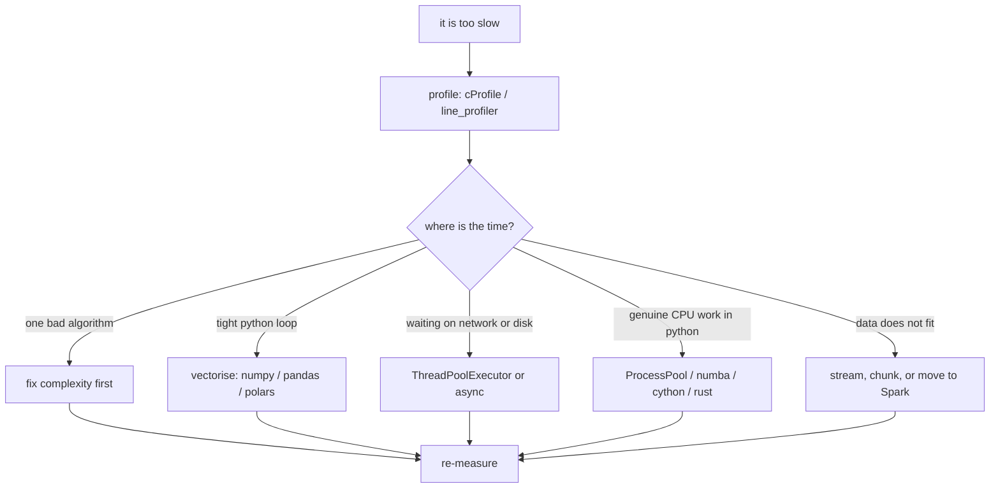

# Python Performance and Memory

## TL;DR
Python is slow per operation and generous with memory, so performance work is about **doing fewer
Python-level operations** and **not holding more than you need**. The order is always: measure
(profile, don't guess) → fix the algorithm → vectorise or push to C/Spark → only then parallelise.
Threads help I/O-bound work, processes help CPU-bound work, and the GIL is why.

## Intuition
Every Python-level operation carries interpreter overhead: bytecode dispatch, reference counting,
boxed objects. A tight numeric loop in Python pays this per element; the same loop inside NumPy or
Polars or Spark pays it once for the whole array. So the mental model is: **find the loop that runs
$n$ times in Python and make it run once.** Memory follows the same idea — a Python `int` is a heap
object with a header, so a list of a million ints costs vastly more than a million-element NumPy
`int64` array (8 MB).

## The maths
**Amdahl's law** sets the ceiling on parallel speedup. If a fraction $p$ of the runtime is
parallelisable across $k$ workers,

$$
S(k) = \frac{1}{(1-p) + \dfrac{p}{k}}, \qquad \lim_{k\to\infty} S(k) = \frac{1}{1-p}
$$

If 20% of your job is serial data loading, no amount of parallelism gets you past 5×. This is the
honest answer to "just add more executors".

**Memory arithmetic worth memorising.** A NumPy array costs $\text{elements} \times \text{itemsize}$.
So:

$$
\text{GB} = \frac{n \cdot d \cdot b}{2^{30}}
$$

with $b$ = 4 for float32, 8 for float64. A $10^7 \times 128$ float32 embedding table is
$10^7\cdot128\cdot4 = 5.12\times10^9$ bytes ≈ 4.8 GiB. Model weights follow the same rule: a 7B
parameter model at fp16 is $7\times10^9 \times 2$ bytes = 14 GB for weights alone, before optimiser
state or activations.

**Peak memory, not average, is what kills a job.** An out-of-place operation on an array of size $M$
transiently needs $2M$; a `copy()` inside a chain of three transforms can need $4M$.

## Diagram



## Code

```python
import cProfile, pstats, io, time, tracemalloc

def profile(fn, *args, **kwargs):
    pr = cProfile.Profile()
    pr.enable()
    out = fn(*args, **kwargs)
    pr.disable()
    s = io.StringIO()
    pstats.Stats(pr, stream=s).sort_stats("cumulative").print_stats(10)
    print(s.getvalue())
    return out

def peak_memory(fn, *args, **kwargs):
    tracemalloc.start()
    out = fn(*args, **kwargs)
    cur, peak = tracemalloc.get_traced_memory()
    tracemalloc.stop()
    print(f"current={cur/1e6:.1f} MB peak={peak/1e6:.1f} MB")
    return out
```

Caching a pure, expensive function:

```python
from functools import lru_cache

@lru_cache(maxsize=10_000)
def token_count(text: str) -> int:
    return len(text.split())          # stand-in for an expensive tokeniser call
```

I/O-bound fan-out — threads are correct here because the GIL is released while waiting:

```python
from concurrent.futures import ThreadPoolExecutor, as_completed

def embed_batch(texts, call_api, max_workers=8):
    out = [None] * len(texts)
    with ThreadPoolExecutor(max_workers=max_workers) as ex:
        futs = {ex.submit(call_api, t): i for i, t in enumerate(texts)}
        for f in as_completed(futs):
            out[futs[f]] = f.result()   # exceptions re-raise here, not silently
    return out
```

CPU-bound fan-out — processes, because each gets its own interpreter and GIL:

```python
from concurrent.futures import ProcessPoolExecutor

def score_shard(shard):               # must be top-level: it is pickled to the child
    return sum(x * x for x in shard)

def score_all(data, n_proc=4):
    shards = [data[i::n_proc] for i in range(n_proc)]
    with ProcessPoolExecutor(n_proc) as ex:
        return sum(ex.map(score_shard, shards))
```

Streaming instead of loading — the single highest-leverage memory fix:

```python
import pandas as pd

total, rows = 0.0, 0
for chunk in pd.read_csv("events.csv", usecols=["amount"], chunksize=500_000):
    total += chunk["amount"].sum()
    rows  += len(chunk)
print(total / rows)
```

## In practice
- **Use it when:** a pipeline step is on the critical path of a schedule, a job OOMs, or an inference
  service misses its latency budget. Do not optimise code that runs once a week in two minutes.
- **Defaults that work:** profile with `cProfile` for "which function", `line_profiler` for "which
  line", `memray` or `tracemalloc` for "what is holding memory". Prefer generators over lists for
  pipelines, `__slots__` or dataclasses for high-count small objects, `float32` for embeddings,
  Parquet over CSV, and chunked reads over full loads.
- **Breaks when:** you parallelise before fixing an $O(n^2)$ algorithm; you use threads for CPU work
  and see no speedup; you use processes and the pickling cost of the payload exceeds the compute;
  you `lru_cache` a method on an object and leak every instance forever (the cache holds `self`).
- **Cost / latency:** on Databricks the biggest single win is usually not Python at all — it is
  avoiding a shuffle, or replacing a row-at-a-time Python UDF with a `pandas_udf` (Arrow-batched) or
  a native Spark expression. State that ordering in an interview: native expression > pandas UDF >
  Python UDF.

## Interview angle

**Q. A pipeline step takes 40 minutes. Walk me through how you'd speed it up.**
First I measure rather than guess — `cProfile` at function level, then `line_profiler` on the hot
function, and I check whether time is CPU, I/O wait, or shuffle. Then in order: (1) is there an
algorithmic problem, e.g. a nested loop or a lookup that should be a dict or a join that is a
cross-product; (2) can the inner loop be vectorised or pushed into the engine; (3) is the data format
wrong — CSV instead of Parquet, no partition pruning; (4) only then parallelism, and I bound my
expectations with Amdahl's law given the serial fraction I measured. I re-measure after each change
so I can attribute the win.

**Follow-up.** *What if profiling says 80% of time is in `pandas.merge`?* → Then the question is
cardinality and memory. Check for key duplication causing fan-out, consider aggregating the right
side before joining, sort-merge on a pre-sorted key, or move the join to Spark where it can be a
broadcast join if one side is small.

**Q. Explain the GIL and its practical consequences.**
CPython serialises bytecode execution with a global lock, so multiple threads never run Python
bytecode simultaneously. Consequence: threads give no speedup for pure-Python CPU work but do help
I/O-bound work, because the lock is released around blocking calls, and they also help when the work
is inside a C extension that releases the GIL (NumPy, BLAS, most of scikit-learn's core, PyTorch
ops). For CPU-bound Python, use processes. Note that recent CPython has an experimental free-threaded
build; the safe interview answer is to describe the mechanism and say the ecosystem still assumes
the GIL.

**Q. Threads or processes for calling an LLM API over 10,000 prompts?**
Threads — it is pure network wait. The real constraints are provider rate limits and cost, so I'd use
a bounded thread pool sized to the rate limit, with exponential backoff and jitter on 429s, batching
where the API supports it, and idempotency so retries do not double-charge. Processes would waste
memory duplicating the interpreter for work that is 99% waiting.

**Q. How do you find a memory leak in a long-running service?**
Leaks in Python are usually unintentional retention, not true leaks: a module-level cache that never
evicts, an `lru_cache` on a bound method, a logger holding references, or a list that accumulates
per-request objects. `tracemalloc` snapshots taken at two points and diffed will name the allocation
site. Fix by bounding caches (`maxsize`), using `weakref` where a cache should not own lifetime, and
making per-request state local.

**Q. How much memory does a 7B-parameter model need to serve?**
Weights alone: 2 bytes per parameter at fp16 = 14 GB. Add KV cache, which scales with batch size ×
sequence length × layers × heads, and framework overhead. At int8 the weights drop to ~7 GB and at
4-bit to ~3.5 GB, with quality cost. The point of the answer is the per-parameter arithmetic, not a
vendor number.

## Traps
- **"I'll just add more workers."** Amdahl's law caps you at $1/(1-p)$; and more Spark executors on a
  skewed join makes nothing faster because one task holds the whole tail.
- **Optimising before profiling.** The hot spot is almost never where people guess — it is usually
  serialisation, a repeated regex compile, or an accidental copy.
- **"`del x` frees memory."** It drops one reference. Memory returns when the refcount hits zero and
  even then CPython may keep the arena. For large arrays, also drop views that keep the parent alive.
- **Using `multiprocessing` with huge arguments.** Everything is pickled to the child; sending a
  2 GB DataFrame to four processes costs 8 GB and a lot of time. Send paths, not data.
- **`lru_cache` on methods.** The cache key includes `self`, so every instance is retained for the
  process lifetime.
- **Assuming `float32` everywhere is free.** It halves memory but can break convergence in
  statistics-heavy code; cast at the boundary, not throughout.

## Flashcards
State Amdahl's law and its limit.::$S(k) = 1/((1-p) + p/k)$; maximum speedup is $1/(1-p)$ where $p$ is the parallelisable fraction.
When do threads help in CPython?::I/O-bound work, and CPU work inside C extensions that release the GIL (NumPy, BLAS, PyTorch).
Memory for a 7B model at fp16?::$7\times10^9 \times 2$ bytes = 14 GB for weights, before KV cache and activations.
Which tool answers "which line is slow" vs "which function"?::`line_profiler` for lines; `cProfile` for functions.
Why is a Python UDF in Spark slow, and what replaces it?::Row-at-a-time serialisation between JVM and Python; replace with a native Spark expression, or a `pandas_udf` using Arrow batches.
Common cause of "memory leak" in a Python service?::Unbounded retention — module-level caches, `lru_cache` on bound methods, accumulating request state.
Peak memory of an out-of-place transform on an array of size M?::At least $2M$ — source and destination coexist; chained transforms multiply this.
Order of operations when optimising?::Measure → fix algorithm → vectorise/push to engine → parallelise.

## Related
- [[numpy-essentials]]
- [[pandas-essentials]]
- [[big-o-and-complexity]]
- [[python-data-model-and-idioms]]
- [[spark-performance-tuning]]
- [[cost-optimization-for-ml]]
- [[moc-programming]]
