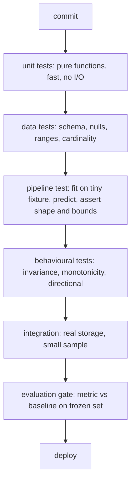

# Testing Python Code

## TL;DR
Tests are how you make a pipeline safe to change. In ML the unit-test/integration-test split is not
enough — you also need **data tests** (schema, ranges, nulls), **behavioural tests** (invariants the
model must satisfy), and **pipeline tests** (the fitted artefact reproduces training-time
predictions). Pytest with fixtures and parametrisation covers the mechanics; the interview value is
knowing what to test in a system whose output is probabilistic.

## Intuition
A normal unit test asserts an exact output. A model's output is not exact, so you assert **properties**
instead: monotonicity (raising income should not lower a credit score), invariance (changing a
customer's name must not change the prediction), directional expectations, and bounds (probabilities
in $[0,1]$, latency under budget). Think of it as testing the contract of the function rather than
its table of values.

## The maths
One real number to know: how big a test set must be before "accuracy went down" is meaningful. For a
metric that is a proportion $p$ measured on $n$ held-out examples, the standard error is

$$
\mathrm{SE} = \sqrt{\frac{p(1-p)}{n}}
$$

so a 95% interval is about $\pm 1.96\,\mathrm{SE}$. At $p=0.9$ and $n=1000$,
$\mathrm{SE}\approx 0.0095$, giving roughly $\pm 1.9$ percentage points. A regression test that fails
when accuracy drops by 1 point on a 1000-row set is a flaky test, not a guardrail. Either enlarge the
set, use a paired test on the same examples (which removes the sampling variance shared between the
two models), or set the threshold outside the noise band.

For a paired comparison on the same $n$ examples, McNemar's test on the discordant pairs
$b$ (old right, new wrong) and $c$ (old wrong, new right) uses

$$
\chi^2 = \frac{(|b - c| - 1)^2}{b + c}
$$

which is far more sensitive than comparing two independent accuracies.

## Diagram



## Code

```python
# conftest.py — fixtures are shared setup, scoped to control cost
import numpy as np
import pandas as pd
import pytest

@pytest.fixture(scope="session")
def rng():
    return np.random.default_rng(0)

@pytest.fixture
def sample_frame(rng) -> pd.DataFrame:
    n = 200
    return pd.DataFrame({
        "amount":  rng.gamma(2.0, 50.0, n),
        "tenure":  rng.integers(0, 60, n),
        "channel": rng.choice(["web", "app", "partner"], n),
        "label":   rng.integers(0, 2, n),
    })
```

```python
# test_features.py
import numpy as np
import pandas as pd
import pytest
from mypkg.features import add_ratio_features, build_preprocessor

def test_add_ratio_features_is_pure(sample_frame):
    before = sample_frame.copy(deep=True)
    _ = add_ratio_features(sample_frame)
    pd.testing.assert_frame_equal(sample_frame, before)   # no hidden mutation

@pytest.mark.parametrize("amount,tenure,expected", [
    (100.0, 10, 10.0),
    (0.0,   10, 0.0),
    (100.0,  0, np.inf),          # documents the divide-by-zero contract
])
def test_ratio_edge_cases(amount, tenure, expected):
    out = add_ratio_features(pd.DataFrame({"amount": [amount], "tenure": [tenure]}))
    assert out["amount_per_month"].iloc[0] == pytest.approx(expected, nan_ok=True)

def test_preprocessor_handles_unseen_category(sample_frame):
    pre = build_preprocessor().fit(sample_frame.drop(columns="label"))
    unseen = sample_frame.head(1).drop(columns="label").assign(channel="kiosk")
    out = pre.transform(unseen)                # must not raise
    assert out.shape[0] == 1
    assert np.isfinite(out).all()
```

Behavioural and data tests — the part that distinguishes an ML engineer:

```python
def test_prediction_is_invariant_to_irrelevant_column(fitted_pipeline, sample_frame):
    X = sample_frame.drop(columns="label")
    base = fitted_pipeline.predict_proba(X)[:, 1]
    perturbed = X.assign(customer_name="ZZZ")           # not a model input
    assert np.allclose(base, fitted_pipeline.predict_proba(perturbed)[:, 1])

def test_risk_is_monotone_in_amount(fitted_pipeline, sample_frame):
    X = sample_frame.drop(columns="label").head(50)
    low  = fitted_pipeline.predict_proba(X.assign(amount=X["amount"] * 0.5))[:, 1]
    high = fitted_pipeline.predict_proba(X.assign(amount=X["amount"] * 2.0))[:, 1]
    # assert the direction holds for the large majority, not every row
    assert (high >= low).mean() > 0.8

def test_training_data_contract(sample_frame):
    assert set(["amount", "tenure", "channel", "label"]).issubset(sample_frame.columns)
    assert sample_frame["amount"].ge(0).all()
    assert sample_frame["label"].isin([0, 1]).all()
    assert sample_frame["channel"].isna().mean() < 0.01
```

Mocking an external call — patch where it is *used*, not where it is defined:

```python
from unittest.mock import patch

def test_embedding_retry(monkeypatch):
    calls = {"n": 0}
    def flaky(_text):
        calls["n"] += 1
        if calls["n"] < 3:
            raise TimeoutError
        return [0.1, 0.2]
    with patch("mypkg.retrieval.embed_one", side_effect=flaky):
        from mypkg.retrieval import embed_with_retry
        assert embed_with_retry("hello") == [0.1, 0.2]
    assert calls["n"] == 3
```

## In practice
- **Use it when:** anything runs on a schedule or serves traffic. For an exploratory notebook,
  assertions inline are enough. The trigger to add a real test suite is "someone else will change
  this" or "this runs unattended".
- **Defaults that work:** pytest; fixtures in `conftest.py`; `pytest.mark.parametrize` instead of
  loops inside a test; small synthetic fixtures over sampled production data (fast, no PII);
  `pytest.approx` for floats; markers (`@pytest.mark.slow`) so CI can run fast tests on every push
  and the full suite nightly; `great_expectations` or a handful of hand-written assertions for data
  contracts; seed everything.
- **Breaks when:** tests depend on network or on today's date; tests share mutable state through
  session-scoped fixtures; you assert exact model outputs, which change with library versions and
  hardware; you mock so much that the test only proves the mocks were called.
- **Cost / latency:** keep the pre-merge suite under a few minutes or people stop running it. Train
  on a 200-row fixture with 5 trees, not the real dataset — you are testing the plumbing, and a
  separate scheduled evaluation job tests the model.

> [!warning]
> Never copy production rows containing customer identifiers into test fixtures. Generate synthetic
> data with the same schema, or use a masked sample governed in Unity Catalog. A PII leak through a
> committed fixture is a real incident, not a hypothetical.

## Interview angle

**Q. How do you test an ML pipeline? It is not deterministic.**
I separate what is deterministic from what is not. Deterministic and unit-testable: feature
functions, joins, encoders, schema handling, serialisation. Non-deterministic but property-testable:
the model, via invariance, monotonicity and bounds checks. Then a pipeline test that fits on a tiny
fixture and asserts shape, no NaNs, probabilities in $[0,1]$, and that a round-trip through the saved
artefact reproduces the in-memory predictions. Finally an evaluation gate in CI/CD that compares
metrics on a frozen holdout against the current champion, with a threshold set outside the sampling
noise.

**Follow-up.** *How do you choose that threshold?* → From the standard error of the metric on that
holdout. With $n=1000$ and accuracy 0.9, one standard error is ~1 percentage point, so a 1-point
"regression" is noise. I'd either use a bigger frozen set or a paired test such as McNemar's on the
same examples, which removes the shared variance.

**Q. `unittest.mock.patch` — what is the most common mistake?**
Patching the wrong path. You must patch the name in the module where it is *looked up*, not where it
is defined: if `mypkg.service` does `from mypkg.client import call`, you patch
`mypkg.service.call`. Second most common: mocking so deep that the test asserts implementation
detail, so any refactor breaks it. I prefer injecting a small fake object over patching, because it
survives refactors.

**Q. What is a fixture and what does scope control?**
A fixture is reusable setup injected by parameter name. Scope controls how often it is created:
`function` (default, safest), `class`, `module`, `session`. Widening scope trades isolation for
speed — a session-scoped fixture that tests mutate produces order-dependent flakes. Use wide scope
only for genuinely immutable things like a loaded model or a Spark session.

**Q. How do you test PySpark code?**
A session-scoped local `SparkSession` with a small number of shuffle partitions, fixtures built from
`spark.createDataFrame` over literal rows, and assertions on collected results sorted
deterministically. I test transformation functions that take and return DataFrames, not scripts. For
Delta/medallion work I also assert idempotency: running the bronze→silver step twice produces the
same silver table, which catches missing merge keys and duplicate appends.

**Q. What do you test about a RAG or agent system?**
Deterministic parts get unit tests: chunking boundaries, metadata propagation, the function-calling
schema parser, retry and truncation logic. The generative part gets an offline evaluation set with
graded answers and metrics like retrieval recall@k and faithfulness, run as a job rather than a unit
test, plus adversarial cases (prompt injection in a document, empty retrieval, tool error) asserted
as behaviour: the system must refuse or degrade gracefully rather than hallucinate.

## Traps
- **Testing the mock.** If every collaborator is mocked, a green suite proves nothing about the real
  path. Keep at least one integration test on a small real sample.
- **Asserting exact floats.** `assert score == 0.8734` fails across BLAS versions and CPU/GPU.
  Use `pytest.approx` with a tolerance you can justify.
- **Hidden order dependence.** Tests that pass alone and fail in a suite usually share a
  module-scoped fixture or global state. Run with `-p no:randomly` off (i.e. randomise order) to find them.
- **"100% coverage means tested."** Coverage measures lines executed, not assertions made. A test
  that calls everything and asserts nothing hits 100%.
- **Using production data in fixtures.** Slow, unstable, and a PII exposure route.
- **No test for the failure path.** Retry, timeout, malformed JSON from the LLM, empty retrieval —
  these are the paths that actually break in production and the ones nobody tests.

## Flashcards
Three test categories specific to ML beyond unit/integration?::Data tests (schema, ranges, nulls), behavioural tests (invariance, monotonicity, directional), and pipeline/artefact tests (round-trip reproducibility).
Standard error of an accuracy estimate?::$\sqrt{p(1-p)/n}$ — at $p=0.9$, $n=1000$ it is ≈0.0095, so ±~2 points at 95%.
Where do you patch a name with `mock.patch`?::In the module where it is looked up, not where it is defined.
What does fixture scope trade off?::Isolation versus speed — wider scope reuses setup but risks order-dependent flakes if tests mutate it.
Which test catches a missing merge key in a bronze→silver step?::An idempotency test: running the step twice must produce the same output table.
Why is comparing two independent accuracies a weak regression gate?::It ignores that both are measured on the same examples; a paired test like McNemar's removes the shared sampling variance and is far more sensitive.
What is a behavioural invariance test?::Asserting that perturbing a feature that should not matter leaves predictions unchanged.
Why is 100% coverage not proof of correctness?::Coverage counts executed lines, not meaningful assertions.

## Related
- [[ml-testing-strategy]]
- [[oop-and-design-patterns-for-ml]]
- [[ci-cd-for-ml]]
- [[data-quality-and-validation]]
- [[reproducibility]]
- [[python-data-model-and-idioms]]
- [[moc-programming]]
