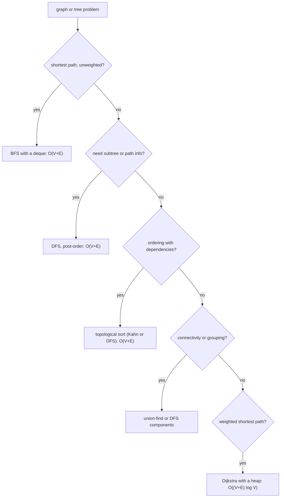

# Trees and Graphs Basics

## TL;DR
Trees and graphs reduce to two traversals — **DFS** (recursion or a stack) and **BFS** (a queue) —
plus a `visited` set. BFS gives shortest path in an unweighted graph; DFS gives cycle detection,
connected components and topological order. Both are $O(V+E)$ time and $O(V)$ space. For DS/MLE
roles the bar is: write the traversal cleanly, know BST properties, and recognise when a problem is
secretly a graph (dependency order, grid flood-fill, lineage).

## Intuition
BFS explores in rings of increasing distance, so the first time it reaches a node is via the fewest
edges — that is the whole shortest-path argument. DFS commits to one path until it dead-ends, which
makes it the right tool when you need to know something about the *subtree* or *whole path* below a
node: height, sum along a root-to-leaf path, whether a cycle closes back on the current path.

A tree is just a connected graph with no cycles and $V-1$ edges, so every tree algorithm is a graph
algorithm where you can skip the `visited` set (except on undirected trees, where you still track
the parent to avoid walking backwards).

## The maths
**Complexity.** A traversal visits each vertex once and each edge at most twice (once per endpoint),
so time is $\Theta(V+E)$ with an adjacency list. With an adjacency *matrix* it is $\Theta(V^2)$,
because finding a vertex's neighbours costs $\Theta(V)$. Space is $\Theta(V)$ for `visited` plus the
frontier — BFS's queue can hold the widest level, DFS's stack the deepest path.

**Tree height and node counts.** A binary tree of height $h$ (edges on the longest root-to-leaf path)
has at most $2^{h+1}-1$ nodes, so a balanced tree over $n$ nodes has height

$$
h = \Theta(\log_2 n)
$$

BST operations are $\Theta(h)$: $\Theta(\log n)$ balanced, $\Theta(n)$ degenerate (insert sorted data
into an unbalanced BST and you get a linked list). This is exactly the argument for self-balancing
trees, and the same argument that bounds decision-tree depth.

**Handshake lemma.** $\sum_v \deg(v) = 2E$ in an undirected graph — useful for sanity-checking that
your adjacency list is built correctly.

**Topological order exists iff the graph is a DAG.** Kahn's algorithm proves it constructively: if
the queue empties before all $V$ nodes are emitted, the remaining nodes have a cycle.

## Diagram



## Code

```python
from collections import deque, defaultdict

# ---------- binary tree ----------
class Node:
    __slots__ = ("val", "left", "right")
    def __init__(self, val, left=None, right=None):
        self.val, self.left, self.right = val, left, right

def inorder(root):                       # O(n) time, O(h) stack
    """Left, node, right — on a BST this yields values in sorted order."""
    out, stack, cur = [], [], root
    while cur or stack:
        while cur:
            stack.append(cur); cur = cur.left
        cur = stack.pop()
        out.append(cur.val)
        cur = cur.right
    return out

def max_depth(root):                     # O(n) time, O(h) space
    if root is None:
        return 0
    return 1 + max(max_depth(root.left), max_depth(root.right))

def level_order(root):                   # BFS: O(n) time, O(width) space
    if root is None:
        return []
    out, q = [], deque([root])
    while q:
        level = []
        for _ in range(len(q)):          # freeze the level boundary
            n = q.popleft()
            level.append(n.val)
            if n.left:  q.append(n.left)
            if n.right: q.append(n.right)
        out.append(level)
    return out

def is_valid_bst(root, lo=float("-inf"), hi=float("inf")):
    """Every node must satisfy a range, not just beat its parent. O(n), O(h)."""
    if root is None:
        return True
    if not (lo < root.val < hi):
        return False
    return (is_valid_bst(root.left, lo, root.val) and
            is_valid_bst(root.right, root.val, hi))

def lowest_common_ancestor(root, p, q):  # O(n) time, O(h) space
    if root is None or root is p or root is q:
        return root
    l = lowest_common_ancestor(root.left, p, q)
    r = lowest_common_ancestor(root.right, p, q)
    return root if (l and r) else (l or r)
```

```python
# ---------- graphs ----------
def bfs_shortest_path(adj, src, dst):
    """Unweighted shortest path. O(V+E) time, O(V) space."""
    if src == dst:
        return [src]
    prev, q = {src: None}, deque([src])
    while q:
        u = q.popleft()
        for v in adj[u]:
            if v not in prev:            # `prev` doubles as `visited`
                prev[v] = u
                if v == dst:
                    path = [v]
                    while prev[path[-1]] is not None:
                        path.append(prev[path[-1]])
                    return path[::-1]
                q.append(v)
    return None

def has_cycle_directed(adj, nodes):
    """DFS with three colours. A back-edge to a node on the current path = cycle."""
    WHITE, GREY, BLACK = 0, 1, 2
    colour = {n: WHITE for n in nodes}

    def dfs(u):
        colour[u] = GREY
        for v in adj[u]:
            if colour[v] == GREY:        # back edge
                return True
            if colour[v] == WHITE and dfs(v):
                return True
        colour[u] = BLACK
        return False

    return any(colour[n] == WHITE and dfs(n) for n in nodes)

def topological_sort(adj, nodes):
    """Kahn's algorithm. O(V+E). Returns None if there is a cycle."""
    indeg = {n: 0 for n in nodes}
    for u in nodes:
        for v in adj[u]:
            indeg[v] += 1
    q = deque([n for n in nodes if indeg[n] == 0])
    order = []
    while q:
        u = q.popleft()
        order.append(u)
        for v in adj[u]:
            indeg[v] -= 1
            if indeg[v] == 0:
                q.append(v)
    return order if len(order) == len(nodes) else None
```

Grid problems are graphs in disguise — this template covers islands, flood fill, rotting oranges:

```python
def count_islands(grid):
    """O(R*C) time and space. Iterative DFS avoids recursion-limit blowups."""
    if not grid:
        return 0
    R, C, seen, count = len(grid), len(grid[0]), set(), 0
    for r in range(R):
        for c in range(C):
            if grid[r][c] != "1" or (r, c) in seen:
                continue
            count += 1
            stack = [(r, c)]
            seen.add((r, c))
            while stack:
                i, j = stack.pop()
                for di, dj in ((1,0), (-1,0), (0,1), (0,-1)):
                    ni, nj = i + di, j + dj
                    if 0 <= ni < R and 0 <= nj < C and grid[ni][nj] == "1" \
                       and (ni, nj) not in seen:
                        seen.add((ni, nj))
                        stack.append((ni, nj))
    return count
```

Union-find, the cheapest tool for connectivity and grouping:

```python
class DSU:
    def __init__(self, n):
        self.p = list(range(n)); self.r = [0] * n
    def find(self, x):
        while self.p[x] != x:
            self.p[x] = self.p[self.p[x]]      # path halving
            x = self.p[x]
        return x
    def union(self, a, b):
        ra, rb = self.find(a), self.find(b)
        if ra == rb: return False
        if self.r[ra] < self.r[rb]: ra, rb = rb, ra
        self.p[rb] = ra
        self.r[ra] += self.r[ra] == self.r[rb]
        return True
# near-constant amortised: O(α(n)) per operation
```

## In practice
- **Use it when:** anything with dependencies (DAG scheduling in Airflow, Spark's job DAG, feature
  lineage in Unity Catalog), hierarchies (org charts, category trees, JSON traversal), grids, and
  graph-shaped data (co-purchase, fraud rings, knowledge graphs for GraphRAG).
- **Defaults that work:** adjacency list as `defaultdict(list)`; `deque` for BFS (never `list.pop(0)`);
  iterative DFS when depth could exceed ~1000; a `visited` set added *when enqueuing*, not when
  dequeuing, or nodes get queued multiple times; for weighted shortest paths, `heapq`-based Dijkstra.
- **Breaks when:** the graph is huge — a million-node traversal in a driver process is fine, a
  billion-edge one needs GraphFrames/Pregel-style distributed BFS; edges are weighted and you use BFS
  anyway (wrong answer, silently); the graph has negative weights (Dijkstra is invalid, use
  Bellman–Ford).
- **Cost / latency:** $O(V+E)$ is linear in the graph, so the real cost is usually loading the graph,
  not traversing it. In interviews say "adjacency list, $O(V+E)$" explicitly — the matrix alternative
  at $O(V^2)$ is the distinguishing detail.

## Interview angle

**Q. BFS or DFS — how do you choose?**
BFS when the question is about distance or levels in an unweighted graph, because the first arrival
is the shortest. DFS when the question is about the structure below or along a path — subtree sums,
heights, cycle detection, topological order, backtracking. Memory differs too: BFS holds the widest
level, DFS holds the deepest path, so on a wide shallow tree DFS is cheaper and on a deep narrow one
BFS is.

**Follow-up.** *Why is `deque` mandatory for BFS?* → `list.pop(0)` is $O(n)$ because it shifts every
element, so a "linear" BFS becomes $O(V^2)$. `deque.popleft()` is $O(1)$.

**Q. Validate a binary search tree.**
The wrong answer is comparing each node only to its parent — that accepts a node deep in the left
subtree whose value exceeds the root. The correct one carries a valid open range down: the left
child inherits `(lo, node.val)`, the right `(node.val, hi)`. $O(n)$ time, $O(h)$ space. Equivalent
alternative: an in-order traversal must be strictly increasing.

**Q. Detect a cycle in a directed graph, and say how it differs from undirected.**
Directed: DFS with three colours — a grey (on the current recursion stack) neighbour is a back edge,
hence a cycle. Marking visited alone is not enough, because re-visiting a finished node is legal in a
DAG (diamond shape). Undirected: DFS tracking the parent; any visited neighbour other than the parent
closes a cycle. Or union-find — if the two endpoints of an edge are already in the same set, that
edge creates a cycle.

**Q. You have 200 dbt models / Airflow tasks with dependencies. What order do you run them in?**
Topological sort. Kahn's algorithm: compute in-degrees, repeatedly emit a zero-in-degree node and
decrement its successors. $O(V+E)$. If fewer than $V$ nodes come out, there is a cycle and I can
report the remaining nodes as the offending set. This is genuinely how orchestration engines
schedule, and saying that connects the DSA answer to the job.

**Q. Shortest path with weights?**
Dijkstra with a binary heap, $O((V+E)\log V)$, valid only for non-negative weights because the
algorithm finalises a node the first time it is popped. With negative edges use Bellman–Ford at
$O(VE)$, which also detects negative cycles. With all weights equal, BFS is both simpler and faster.

## Traps
- **`list.pop(0)` in BFS.** Turns $O(V+E)$ into $O(V^2)$.
- **Marking visited on dequeue.** The same node gets enqueued many times before it is processed;
  memory blows up and complexity degrades. Mark when you enqueue.
- **Recursive DFS on a deep graph.** Python's recursion limit is 1000 by default; a 10,000-node path
  crashes. Convert to an explicit stack rather than raising the limit.
- **Validating a BST by parent comparison only.** Classic rejection.
- **Forgetting the parent check in undirected cycle detection.** Every edge looks like a cycle.
- **Using BFS on a weighted graph.** It returns the fewest-edges path, not the cheapest one, and it
  does so silently.
- **Mutating the grid to mark visited without saying so.** It works and is memory-efficient, but say
  out loud that you are destroying the input and offer the `visited` set alternative.
- **Assuming the graph is connected.** Loop over all nodes as potential DFS roots, or you count one
  component and miss the rest.

## Flashcards
Time and space of BFS/DFS with an adjacency list?::$\Theta(V+E)$ time, $\Theta(V)$ space; an adjacency matrix makes it $\Theta(V^2)$.
Why does BFS give the shortest path in an unweighted graph?::It explores in rings of increasing distance, so the first arrival at a node uses the fewest edges.
Correct way to validate a BST?::Pass a valid open range down — left child gets `(lo, val)`, right gets `(val, hi)` — or check that in-order traversal is strictly increasing.
Three-colour DFS: what does grey mean?::The node is on the current recursion stack; an edge to a grey node is a back edge, hence a directed cycle.
Kahn's algorithm and its cycle test?::Repeatedly emit zero-in-degree nodes; if fewer than $V$ are emitted, the remainder contains a cycle.
When is Dijkstra invalid?::With negative edge weights — use Bellman–Ford, $O(VE)$, which also detects negative cycles.
Amortised cost of union-find with path compression and union by rank?::$O(\alpha(n))$, effectively constant.
Height of a balanced binary tree over n nodes, and of a degenerate one?::$\Theta(\log n)$ versus $\Theta(n)$ — BST operations are $\Theta(h)$.

## Related
- [[big-o-and-complexity]]
- [[arrays-and-strings-patterns]]
- [[dynamic-programming-patterns]]
- [[hashing-and-dictionaries]]
- [[coding-interview-strategy]]
- [[decision-trees]]
- [[orchestration-and-workflows]]
- [[moc-programming]]
