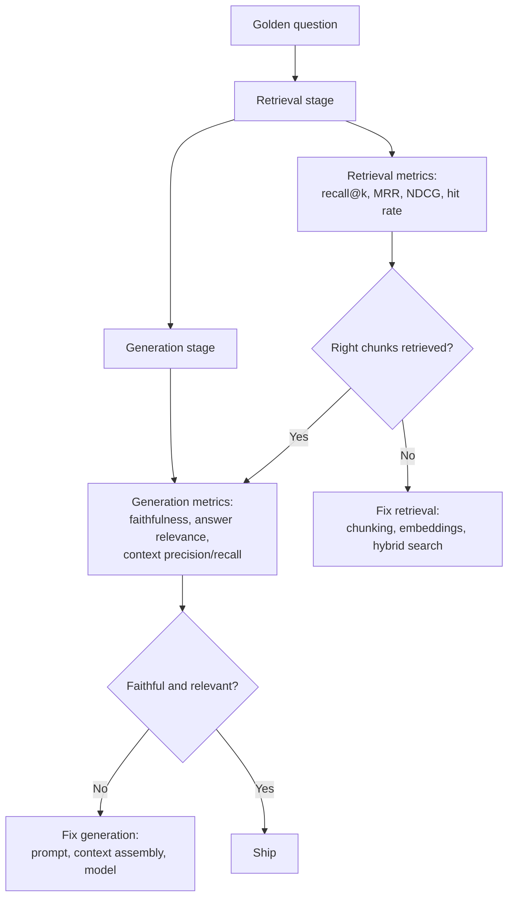

# RAG Evaluation

## TL;DR
A RAG system has two failure surfaces — retrieval and generation — and they need separate metrics,
because "the answer was wrong" doesn't tell you which one broke. Retrieval metrics (recall@k, MRR,
NDCG, hit rate) score whether the right chunks were found; generation metrics (faithfulness, answer
relevance, context precision/recall) score whether the LLM used them correctly. Without a golden set
built from real user questions and without localising failures to a stage, "evaluation" is just
vibes.

## Intuition
Imagine grading a student's exam where they're given the right textbook page (retrieval) and asked
to answer from it (generation). If they get the answer wrong, you need to know: did we hand them the
wrong page, or did they misread the right page? Blending these into one end-to-end "correct/
incorrect" score is like giving one grade for both without ever checking which happened — you'll
"fix" the wrong half of the pipeline forever.

## The maths
**Retrieval metrics**, given a query with a set of relevant documents $\text{Rel}$ and a ranked
list of retrieved documents $D_1, \dots, D_k$:

$$
\text{Recall@k} = \frac{|\{D_1,\dots,D_k\} \cap \text{Rel}|}{|\text{Rel}|}
\qquad
\text{Hit Rate@k} = \mathbb{1}\left[\{D_1,\dots,D_k\} \cap \text{Rel} \neq \emptyset\right]
$$

$$
\text{MRR} = \frac{1}{|Q|}\sum_{q \in Q} \frac{1}{\text{rank}_q}
\qquad
\text{NDCG@k} = \frac{\text{DCG@k}}{\text{IDCG@k}}, \quad
\text{DCG@k} = \sum_{i=1}^{k} \frac{2^{\text{rel}_i}-1}{\log_2(i+1)}
$$

MRR uses only the rank of the *first* relevant hit — good for "find one right answer" queries.
NDCG accounts for graded relevance (not just binary hit/miss) and rewards putting the most relevant
document highest, not merely present in top-k — the right metric when some retrieved chunks are more
useful than others.

**Generation metrics** (the RAGAS framework formalises these as LLM-judged scores rather than
closed-form statistics):

- **Faithfulness / groundedness** — the fraction of claims in the generated answer that are
  supported by the retrieved context, roughly:
  $$
  \text{Faithfulness} = \frac{|\{\text{claims supported by context}\}|}{|\{\text{claims in answer}\}|}
  $$
  computed by decomposing the answer into atomic claims (via an LLM) and checking each against
  context (via an LLM or NLI model).
- **Answer relevance** — how well the answer addresses the actual question, typically estimated by
  generating synthetic questions from the answer and measuring their embedding similarity to the
  original query; a relevant answer should let you reconstruct a question close to the one asked.
- **Context precision** — of the retrieved chunks, what fraction were actually relevant/used
  (signal-to-noise of retrieval).
- **Context recall** — of the ground-truth information needed to answer, what fraction was present
  somewhere in retrieved context (did retrieval bring back everything needed, even if some of it
  went unused).

## Diagram


## Code
```python
from ragas import evaluate
from ragas.metrics import (
    faithfulness,
    answer_relevancy,
    context_precision,
    context_recall,
)
from datasets import Dataset

# golden set built from real, logged user questions with human-labelled
# ground-truth answers and ground-truth relevant chunk ids — not synthetic
# questions invented in a vacuum
golden = Dataset.from_dict({
    "question": [...],
    "answer": [...],          # generated by your pipeline
    "contexts": [...],        # list[list[str]] — retrieved chunks per question
    "ground_truth": [...],    # reference answer, for context_recall
})

results = evaluate(
    golden,
    metrics=[faithfulness, answer_relevancy, context_precision, context_recall],
)
print(results)  # per-metric scores, aggregate and per-row

# manual retrieval metrics, computed separately against relevant-chunk-id labels
def recall_at_k(retrieved_ids: list[str], relevant_ids: set[str], k: int) -> float:
    topk = set(retrieved_ids[:k])
    return len(topk & relevant_ids) / max(len(relevant_ids), 1)

def mrr(retrieved_ids: list[str], relevant_ids: set[str]) -> float:
    for rank, doc_id in enumerate(retrieved_ids, start=1):
        if doc_id in relevant_ids:
            return 1.0 / rank
    return 0.0
```

## In practice
- **Use it when:** always, before shipping any change to chunking, embeddings, retrieval strategy,
  reranking, or the generation prompt — a golden set is the only way to know a change is actually an
  improvement rather than a vibe.
- **Defaults that work:** build the golden set from real logged queries (50–200 to start), label
  ground-truth relevant chunks per query for retrieval metrics, and use an LLM-as-judge (RAGAS or
  custom) for generation metrics with periodic human spot-checks to keep the judge honest. Track
  retrieval and generation metrics on separate dashboards so a regression in either is visible
  immediately, not averaged away.
- **Breaks when:** the golden set is synthetic (LLM-generated questions from chunks) without any
  real user query grounding — synthetic questions tend to be easier and more literal than real
  questions, so metrics look great in eval and the system still fails in production. Also breaks
  when the LLM judge is the same model/prompt family as the generator — it can share blind spots.
- **Cost / latency:** offline, batch — not a production latency concern. The real cost is the
  labelling effort for ground-truth relevant chunks, which is why it's worth automating
  golden-set growth from production feedback (thumbs down, corrections) rather than a one-time
  manual build.

## Interview angle

**Q. How do you localise a bad answer to retrieval vs generation?**
Look at the retrieved context for that query. If the correct information isn't present in any
retrieved chunk, it's a retrieval failure — check recall@k, and whether the answer chunk exists in
the corpus at all under a different query phrasing (see [[query-rewriting-and-expansion]]). If the
correct information *is* present in context but the answer ignored, contradicted, or misstated it,
it's a generation failure — check faithfulness and inspect the prompt/context assembly. This
single check (is the answer-supporting text present in the retrieved context, yes or no) is the
fastest triage in a RAG pipeline.

**Follow-up.** What if the answer is correct but not from the retrieved context — a case of the LLM
using parametric knowledge instead? → That's a faithfulness failure even though the surface answer
happens to be right — it means the system isn't actually grounding on your corpus, which is a
correctness risk the moment the corpus and the model's pretraining knowledge diverge (e.g. an
updated contract clause).

**Q. Why build a golden set from real user questions instead of generating one with an LLM from your
chunks?**
Real questions carry the actual distribution of ambiguity, colloquial phrasing, multi-hop reasoning,
and out-of-scope requests your system will face; LLM-generated questions from chunks tend to closely
mirror the chunk's own wording (because the LLM sees the answer while writing the question), which
inflates retrieval and faithfulness scores relative to reality. Synthetic questions are useful for
bootstrapping volume, but should be validated against — not substituted for — a real-query sample.

**Follow-up.** How do you keep growing the golden set over time? → Mine production logs for
low-confidence answers, user corrections/thumbs-down, and support escalations; label those and add
them — this targets exactly the distribution where the system currently fails, which is more
valuable per-example than uniformly sampled synthetic data.

**Q. What does context precision measure that context recall doesn't, and why do you need both?**
Context recall asks "did we retrieve everything needed to answer" (a retrieval-completeness
question); context precision asks "of what we retrieved, how much was actually relevant"
(a retrieval-noise question). A system can have perfect recall by retrieving 200 chunks including
the 3 that matter (great recall, terrible precision) — that's exactly when reranking and context
assembly quality start to dominate the final answer quality even though retrieval "worked."

**Q. What's a concrete risk of relying solely on an LLM-as-judge for faithfulness scoring?**
The judge can be fooled by fluent but unsupported text (it correlates fluency with correctness), can
share systematic blind spots with the generator if they're the same model family, and its scoring is
itself unstable/non-deterministic across runs — mitigate with a stronger/different judge model,
majority voting over repeated judgments, and periodic human calibration on a sample.

## Traps
- Reporting a single end-to-end "accuracy" number for a RAG system — it hides whether retrieval or
  generation is the bottleneck and gives no actionable signal for what to fix next.
- Building the golden set once and never refreshing it — the corpus and query distribution both
  drift (see [[rag-failure-modes]], stale index), and a stale golden set stops reflecting reality.
- Using context recall/precision without ground-truth relevant-chunk labels — RAGAS's context
  metrics need either ground truth or a strong LLM judge; skipping this makes the numbers
  unfalsifiable.
- Treating a high faithfulness score as proof of a good system when answer relevance is low — a
  perfectly faithful answer that doesn't address the question asked is still a failure.

## Flashcards
Why separate retrieval metrics from generation metrics in RAG evaluation?::Because they diagnose different failure surfaces — retrieval quality (was the right chunk found) is independent of generation quality (was it used correctly) — and blending them hides which stage to fix.
What does MRR measure that recall@k doesn't?::The rank position of the first relevant result — MRR rewards ranking the right answer higher, recall@k only checks whether it's present in top-k at all.
What is faithfulness/groundedness in RAG evaluation?::The fraction of claims in a generated answer that are actually supported by the retrieved context.
Why is context precision different from context recall?::Precision measures how much of the retrieved context was actually relevant (noise); recall measures whether all needed information was retrieved at all (completeness).
Why are synthetic LLM-generated golden sets risky on their own?::They tend to mirror chunk wording too closely (inflating scores) and miss the ambiguity and phrasing of real user queries.
What's the fastest way to localise a wrong answer to retrieval vs generation?::Check whether the answer-supporting information is present anywhere in the retrieved context — absent means retrieval failure, present-but-misused means generation failure.

## Related
[[rag-overview]]
[[reranking]]
[[rag-failure-modes]]
[[llm-evaluation]]
[[hybrid-search-bm25-vector]]
