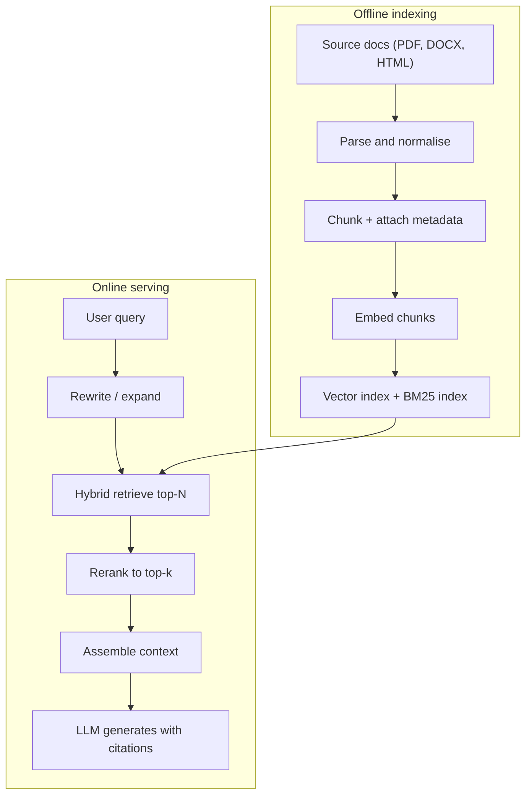

# RAG Overview

## TL;DR
RAG is two systems bolted together: an **offline indexing pipeline** that turns a document corpus
into a searchable index, and an **online path** that retrieves a handful of passages for a user
query and conditions a generator on them. It exists because it gives you grounding, freshness,
per-user access control and cheap knowledge updates — not because it gives the model "more memory".
Almost every production RAG failure is a *retrieval* failure, not a generation failure.

## Intuition
Think of an open-book exam. Fine-tuning is making the student memorise the textbook; RAG is letting
them carry the book in and teaching them to find the right page fast. The exam answer quality is
then bounded by two things: whether the right page is in the book, and whether the student turned
to it. Both are retrieval problems. The model's job — reading three paragraphs and writing a
grounded answer — is the easy part for any modern LLM.

## The maths

Vanilla generation models $p(y \mid x)$ directly. RAG marginalises over retrieved documents:

$$
p(y \mid x) = \sum_{z \in \mathcal{Z}_k(x)} p_\eta(z \mid x)\, p_\theta(y \mid x, z)
$$

where $x$ is the query, $y$ the answer, $z$ a retrieved passage, $\mathcal{Z}_k(x)$ the top-$k$
retrieved set, $p_\eta$ the retriever and $p_\theta$ the generator. In practice nobody marginalises:
you concatenate the top-$k$ passages into the prompt and take a single forward pass, which is the
crude approximation $p(y \mid x) \approx p_\theta(y \mid x, z_1 \dots z_k)$.

Retrieval itself is a maximum inner product search. With an embedding function
$E: \text{text} \to \mathbb{R}^d$ and a corpus of chunk vectors $\{v_1 \dots v_N\}$:

$$
\mathcal{Z}_k(x) = \operatorname*{arg\,top-}k_{i} \; \frac{E(x) \cdot v_i}{\lVert E(x)\rVert \, \lVert v_i \rVert}
$$

Two things follow immediately and are worth saying out loud in an interview:

1. **The ceiling is set at index time.** If the answer-bearing text never became a chunk, or became
   a chunk whose embedding does not sit near the query's, no amount of prompt engineering recovers
   it. Define $\text{recall@}k$ as the fraction of questions whose gold passage appears in
   $\mathcal{Z}_k(x)$; end-to-end accuracy is upper-bounded by it.
2. **Cosine similarity is a similarity of *topic*, not of *answerhood*.** A chunk that discusses the
   same subject in the wrong jurisdiction or the wrong year scores just as high. This is why
   [[reranking]] and metadata filters exist.

## Diagram



The two halves run on completely different clocks. Offline is a batch job measured in hours and
rupees per corpus refresh; online is a request measured in milliseconds and tokens per query. Most
teams under-invest in the left box and then try to fix the symptoms in the right box.

## Code

A minimal but honest end-to-end skeleton — dense retrieval, no framework.

```python
import numpy as np
from sentence_transformers import SentenceTransformer

encoder = SentenceTransformer("BAAI/bge-small-en-v1.5")

chunks = [
    {"text": "Invoices are raised on the last working day of each month.", "doc": "billing-sop", "year": 2025},
    {"text": "Travel reimbursement requires original receipts within 30 days.", "doc": "travel-policy", "year": 2024},
    {"text": "Statements of work are signed by the engagement partner.", "doc": "delivery-sop", "year": 2025},
]

# Offline: embed once, store alongside metadata.
mat = encoder.encode([c["text"] for c in chunks], normalize_embeddings=True)

def retrieve(query, k=2, year=None):
    idx = [i for i, c in enumerate(chunks) if year is None or c["year"] == year]
    q = encoder.encode([query], normalize_embeddings=True)[0]
    scores = mat[idx] @ q                       # cosine, since vectors are unit norm
    order = np.argsort(-scores)[:k]
    return [(chunks[idx[j]], float(scores[j])) for j in order]

def build_prompt(query, hits):
    ctx = "\n\n".join(f"[{i+1}] ({h['doc']}) {h['text']}" for i, (h, _) in enumerate(hits))
    return (
        "Answer using ONLY the context. Cite sources as [n]. "
        "If the context does not contain the answer, say you do not know.\n\n"
        f"Context:\n{ctx}\n\nQuestion: {query}\nAnswer:"
    )

hits = retrieve("when do we invoice clients?", k=2, year=2025)
print(build_prompt("when do we invoice clients?", hits))
```

Note the three things this tiny example already gets right and most demos get wrong: vectors are
normalised so the dot product *is* cosine, metadata filtering happens before scoring, and the prompt
explicitly licenses "I don't know".

## In practice

- **Use it when:** the knowledge is large, changes faster than you can retrain, must be attributable
  to a source, or is subject to per-user access control. A professional-services document corpus —
  SOWs, policies, delivery playbooks, client deliverables — hits all four.
- **Defaults that work:** parse to markdown, structure-aware chunks of roughly 400–800 tokens with
  10–15% overlap, a strong open embedding model, hybrid BM25 + dense retrieval fetching ~50
  candidates, a cross-encoder reranker down to 5–8, and a prompt that demands citations.
- **Breaks when:** the question requires aggregation across many documents ("how many SOWs mention
  indemnity?"), multi-hop reasoning, or arithmetic over tables. Retrieval returns *passages*, not
  *answers to set queries*. Route those to SQL or a [[graph-rag]] style structure instead.
- **Cost / latency:** indexing is a one-off per document plus embedding cost; serving cost is
  dominated by the prompt tokens you stuff in, so context size is a direct line item. A realistic
  budget for an interactive assistant is 200–400 ms retrieval + rerank, then generation.

> [!warning]
> "RAG vs fine-tuning" is a false binary and interviewers probe it. Fine-tuning teaches *form,
> style and task behaviour*; RAG supplies *facts*. If the complaint is "it doesn't know our
> products", that is RAG. If the complaint is "it doesn't answer the way our analysts do", that is
> fine-tuning. See [[vs-rag-vs-finetuning]].

## Interview angle

**Q. Why RAG instead of just putting everything in a long context window?**
Four reasons that survive longer context windows. Cost — you pay per token on every request, so a
200k-token prompt for a one-line answer is economically absurd at scale. Access control — retrieval
is the natural place to enforce "this user may see these documents", and you cannot filter a prompt
after the fact. Freshness — updating an index is a write; updating a model is a training run.
Attribution — retrieval gives you the passage IDs you need for citations. Accuracy is a fifth:
models demonstrably degrade at locating a fact buried in the middle of a very long context.

**Follow-up.** *So if context became free and perfectly accurate, would RAG disappear?* → No, because
access control and attribution remain. But chunking and reranking would get much less important;
you'd retrieve at document granularity and let the model read whole files.

**Q. Walk me through where a RAG system can go wrong, end to end.**
Six gates, and a failure at any one is invisible downstream. Parsing (did the PDF's table survive?),
chunking (did the answer get split across a boundary?), embedding (does the query's vocabulary match
the document's?), retrieval (is the gold chunk in the top-N?), reranking (did it survive to top-k?),
generation (did the model use it, or ignore it and hallucinate?). Diagnosis means instrumenting each
gate separately — see [[rag-failure-modes]].

**Q. How do you know your RAG system is working?**
Two disjoint metric families. Retrieval: recall@k, MRR, NDCG against a golden set of real questions
with labelled gold chunks. Generation: faithfulness (every claim traceable to context) and answer
relevance. Reporting only end-to-end accuracy is a red flag because you cannot act on it. Detail in
[[rag-evaluation]].

**Q. Your users say the assistant "makes things up". What do you check first?**
I check whether the gold chunk was retrieved at all. If it wasn't, it is a retrieval bug and I look
at chunking, embeddings and hybrid search. If it was retrieved and the model still invented
something, it is a generation bug: tighten the prompt, add citation requirements, reduce the number
of contradictory chunks in context, or swap the model. The two fixes are completely different, which
is why guessing is expensive.

**Q. How does access control work in RAG?**
Filter at retrieval, never at generation. Every chunk carries the ACL of its source document
(project, client, confidentiality tier); the retrieval query includes the user's principal set as a
pre-filter so restricted chunks are never scored. Post-filtering after top-k is a bug — it silently
degrades recall for restricted users and, worse, a summarisation step upstream can leak. Also index
per-tenant where the tenants are separate legal entities.

## Traps

- **"RAG eliminates hallucination."** Wrong. It reduces unsupported claims when retrieval succeeds
  and *increases* confident wrongness when retrieval returns plausible-but-irrelevant text. The
  correct claim is that RAG makes hallucination detectable, because you can check answers against
  the context.
- **"Just increase k."** Wrong past a point. More chunks means more distractors, more contradiction,
  more cost, and degraded attention to the relevant passage. Raising recall by raising k while
  precision collapses is a wash; that is what reranking is for.
- **"Cosine similarity means relevance."** Wrong. It means topical proximity. The 2019 version of a
  policy embeds almost identically to the 2025 version. Metadata and recency handling do that job.
- **"The embedding model doesn't matter much."** Wrong — it is the single highest-leverage choice
  after chunking, and a domain-mismatched model silently caps your recall.
- **Treating RAG as a library call.** LangChain or LlamaIndex gives you a pipeline in ten lines and
  none of the evaluation that tells you whether it works. The ten lines are not the project.

## Flashcards

What are the two phases of a RAG system?::Offline indexing (parse, chunk, embed, index) and online serving (rewrite, retrieve, rerank, assemble, generate).
Why does RAG exist, in four words?::Grounding, freshness, access control, cost.
What upper-bounds end-to-end RAG accuracy?::Retrieval recall@k — if the gold chunk is not retrieved, generation cannot recover it.
RAG or fine-tuning for "the model doesn't know our internal products"?::RAG — that is a facts problem, not a form problem.
RAG or fine-tuning for "the model's tone and output format are wrong"?::Fine-tuning — that is a form/behaviour problem.
Where must access control be enforced in RAG?::At retrieval, as a pre-filter on the vector query — never as a post-filter after top-k.
Why is cosine similarity insufficient for relevance?::It captures topical similarity, so wrong-year or wrong-jurisdiction chunks score as highly as correct ones.
What is the effect of blindly increasing k?::Higher recall but more distractors, higher cost, and degraded generation — use reranking instead.

## Related

- [[chunking-strategies]] — the decision that sets your recall ceiling
- [[embedding-models]] — choosing and evaluating the retriever's encoder
- [[hybrid-search-bm25-vector]] — why dense retrieval alone is not enough
- [[reranking]] — turning high recall into high precision
- [[rag-evaluation]] — how you actually know it works
- [[rag-failure-modes]] — symptom-to-cause diagnostics
- [[vs-rag-vs-finetuning]] — the comparison every interviewer asks
- [[case-rag-assistant]] — the full system design walkthrough
- [[hallucination-and-grounding]] — the generation-side half of the problem
