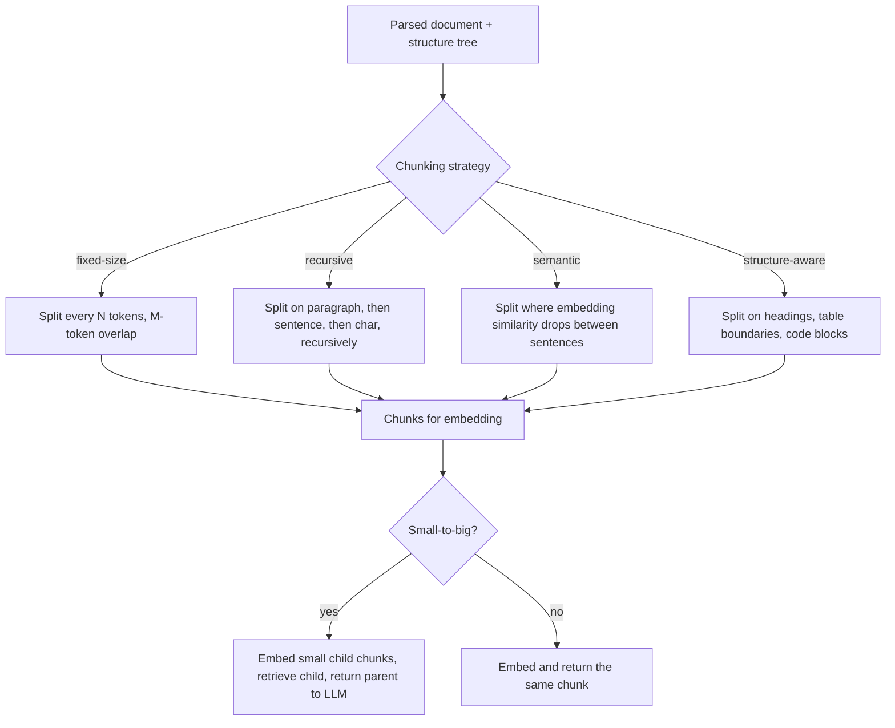

# Chunking Strategies

## TL;DR
Chunking decides the unit of retrieval, and every downstream metric — recall, precision,
citation quality — is bounded by that choice. Too small and a chunk loses the context needed to
answer; too large and irrelevant text dilutes the embedding and blows the context budget. There
is no universal chunk size; the right size is a function of document structure, embedding model
context length, and how the answer maps to a citation.

## Intuition
A chunk is a promise: "if this text is relevant to the query, its embedding should say so, and if
retrieved, it should be self-contained enough to answer from." Fixed-size chunking breaks that
promise whenever a sentence, a table row, or an argument straddles a boundary. Structure-aware
chunking tries to cut where the document itself already has seams — headings, paragraphs, table
boundaries — so a chunk maps to something a human would also call "one unit of meaning."

## The maths
For a document of $n$ tokens split into chunks of target size $s$ with overlap $o$, the number of
chunks is roughly $\lceil n / (s - o) \rceil$, and overlap fraction $o/s$ trades storage and
embedding cost for boundary robustness — a fact that appears whenever a fact sits right at a
chunk edge and overlap is what lets it appear intact in at least one chunk.

The deeper quantity that matters is **retrieval recall as a function of chunk size**,
$\text{recall@}k(s)$. It is not monotonic: too small $s$ starves each chunk of the surrounding
context an embedding model needs to represent it well (a lone sentence "the fee is $50,000" with
no subject is nearly unembeddable-toward-the-right-query); too large $s$ dilutes the embedding
with unrelated content, pulling its vector toward the corpus centroid and away from any specific
query. There is an empirical sweet spot per corpus, found by measuring recall@k directly (see
[[rag-evaluation]]), not by folklore ("512 tokens" is a starting point, not a law).

**Small-to-big (parent-document) retrieval** decouples the two roles a chunk plays. Let $s_i$ be
a small child chunk used for the similarity search, and $p(s_i)$ its parent (a larger section or
whole page). Retrieval scores against $s_i$:

$$
\hat{s} = \operatorname*{arg\,top}_{i}\, \cos\big(E(x), E(s_i)\big)
$$

but the context handed to the generator is $p(\hat{s})$, not $\hat{s}$ itself. This gets the
embedding precision of small chunks (a focused vector matches a focused query) with the
generation-time context of large ones (the model reads the whole surrounding section, not an
isolated fragment).

## Diagram



## Code
```python
def fixed_size_chunks(tokens: list[str], size: int = 400, overlap: int = 50) -> list[list[str]]:
    step = size - overlap
    return [tokens[i:i + size] for i in range(0, len(tokens), step) if tokens[i:i + size]]


def recursive_split(text: str, separators: list[str], target_size: int) -> list[str]:
    """Try coarser separators first (paragraph), fall back to finer ones (sentence, then char)."""
    if len(text) <= target_size or not separators:
        return [text]
    sep, rest = separators[0], separators[1:]
    parts = text.split(sep)
    chunks, buf = [], ""
    for part in parts:
        candidate = (buf + sep + part) if buf else part
        if len(candidate) <= target_size:
            buf = candidate
        else:
            if buf:
                chunks.append(buf)
            buf = part if len(part) <= target_size else None
            if buf is None:
                chunks.extend(recursive_split(part, rest, target_size))
                buf = ""
    if buf:
        chunks.append(buf)
    return chunks


# parent-document (small-to-big) indexing sketch
def build_small_to_big_index(sections: list[str], child_size: int = 150):
    child_to_parent = {}
    child_chunks = []
    for parent_id, section in enumerate(sections):
        for child in fixed_size_chunks(section.split(), size=child_size, overlap=20):
            child_text = " ".join(child)
            child_chunks.append(child_text)
            child_to_parent[child_text] = sections[parent_id]   # retrieve child, return parent
    return child_chunks, child_to_parent
```

## In practice
- **Use it when:** always — chunking is not optional, it's a design decision every RAG system
  makes whether deliberately or by accepting a library's default.
- **Defaults that work:** structure-aware splitting first (never cross a heading or table
  boundary inside one chunk), recursive character/token splitting within a section as the
  fallback, target size roughly 300–600 tokens depending on the embedding model's effective
  context length, 10–15% overlap, and small-to-big retrieval when documents have natural
  section/page parents and the corpus supports it.
- **Breaks when:** documents don't have clean structure (OCR output, chat transcripts) — semantic
  chunking (split where sentence-embedding similarity drops) is the fallback there. Also breaks
  for tables: a table should chunk as a unit (or per logical row group with the header repeated
  in each chunk), never split mid-table by token count.
- **Cost / latency:** smaller chunks and more overlap both increase the number of embeddings
  stored and searched, raising indexing cost and (mildly) retrieval latency; small-to-big adds a
  cheap lookup (child → parent) but no extra embedding cost since only children are embedded.

### Decision table by document type

| Document type | Recommended strategy |
|---|---|
| Prose reports, policies | Structure-aware (headings/sections) + recursive within section |
| Contracts, SOWs | Structure-aware by clause/section; never split a clause mid-sentence |
| Tables, spreadsheets exported as text | Chunk per table or per logical row group; repeat header in each chunk |
| Source code | Structure-aware by function/class, not fixed token count |
| Chat logs, transcripts | Fixed-size with overlap, or semantic split on topic shifts |
| FAQ / Q\&A pairs | One chunk per Q\&A pair — the natural unit is already right-sized |
| Long narrative sections needing full context at answer time | Small-to-big: embed small child chunks, return the parent section |

## Interview angle

**Q. How do you pick a chunk size?**
Not by picking a number up front — by treating it as a hyperparameter and measuring recall@k
against a labelled query set for a few candidate sizes and strategies, on this corpus. The right
size depends on how self-contained a "unit of meaning" is in these documents (a contract clause
vs. a support ticket) and on the embedding model's effective context length — cramming text well
past where the embedding model was trained to summarize degrades the vector's discriminative
power.

**Follow-up.** What if recall@k looks fine but generation quality is still bad? → Check chunk
size from the other direction — a chunk might be topically right but too narrow to actually
contain the answer (e.g., retrieves the clause that references a fee but not the table defining
the fee), which argues for parent-document retrieval rather than a bigger flat chunk size.

**Q. What problem does parent-document (small-to-big) retrieval solve?**
It resolves the tension between what makes a good *retrieval unit* (small, focused, embeds
precisely) and what makes a good *generation unit* (large enough to contain the full context
needed to answer). Embedding and retrieving on small child chunks keeps similarity search sharp;
returning the parent section to the LLM gives it the surrounding context the child chunk alone
would lack.

**Follow-up.** What's the cost of that approach? → More metadata bookkeeping (child→parent
mapping) and larger prompts at generation time (parents are bigger than children), but no extra
embedding cost since only children get embedded.

**Q. How should chunking interact with reranking?**
Overly large chunks make a cross-encoder reranker's job harder — a chunk with one relevant
sentence buried in five irrelevant ones still gets a middling relevance score, drowning the
signal. Smaller, more focused chunks give the reranker cleaner signal, which is another argument
(alongside embedding precision) for keeping the retrieval unit small and pulling in more context
only after the fact, e.g. via small-to-big or by re-expanding the reranked winners.

## Traps
- Picking one fixed chunk size for an entire heterogeneous corpus — tables, contracts, and chat
  logs do not share a natural unit size.
- Splitting purely by token count with no regard for structure — routinely cuts a table mid-row or
  a clause mid-sentence, which is often worse for retrieval than doing nothing.
- Assuming more overlap always helps — it increases storage and redundancy in the index, and past
  a point buys negligible recall improvement over just tuning chunk boundaries to structure.
- Ignoring the embedding model's context length — a chunk longer than what the embedding model
  was effectively trained to summarize gets compressed lossily into the same vector dimension as
  a short one, degrading discriminative power.

## Flashcards
Why is chunk size not a "pick one universal number" decision?::The right size depends on document structure and the embedding model's effective context length, and must be validated per corpus via recall@k.
What problem does small-to-big (parent-document) retrieval solve?::It lets retrieval use small, precise chunks for similarity search while generation reads the larger parent section for full context.
Why does overlap matter in fixed-size chunking?::It prevents a fact sitting at a chunk boundary from being split across two chunks and appearing in neither intact.
Why can very large chunks hurt retrieval even though they contain more context?::Their embedding gets diluted toward the corpus centroid, reducing discriminative power against a focused query.
How should tables be chunked?::As a unit per table or logical row group, with the header repeated in each chunk — never split mid-table by raw token count.
What's the right way to choose a chunking strategy in practice?::Treat it as a hyperparameter and measure recall@k on a labelled query set for this corpus, not by default library settings.

## Related
[[rag-overview]]
[[document-ingestion-and-parsing]]
[[embedding-models]]
[[reranking]]
[[rag-evaluation]]
