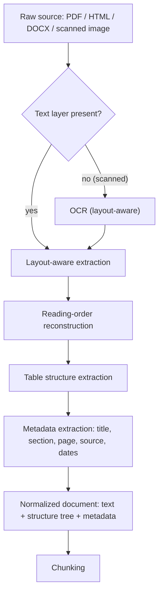

# Document Ingestion and Parsing

## TL;DR
Ingestion is where RAG quality is actually won or lost, and it's the least glamorous part of the
pipeline. A retrieval system that never sees the right text — because a PDF table got flattened
into word soup, or a scanned page never went through OCR — cannot be rescued by a better
embedding model or a smarter LLM downstream. Garbage in, garbage retrieved, garbage generated.

## Intuition
A PDF is not a document format, it's a *rendering* format — instructions for where to draw glyphs
on a page, with no guaranteed notion of paragraphs, reading order, or table structure. Extracting
"the text" from a PDF is closer to reverse-engineering a printed page than reading a file. Every
downstream RAG problem — a table cell embedded next to the wrong row, a heading merged into body
text, a scanned contract that yields zero text — traces back to this step.

## The maths
There isn't a core derivation here, but the problem is worth stating precisely: for a document
$d$ rendered as a sequence of positioned glyphs $\{(g_i, x_i, y_i)\}$, parsing is the (generally
ill-posed) inverse problem of recovering a reading-order text sequence $T$ and a structure tree
$S$ (headings, paragraphs, table cells, list items) such that $T, S$ are what a human would say
the document "contains." Naive extraction recovers $T$ by sorting glyphs by $(y_i, x_i)$, which
fails immediately on multi-column layouts, floating figures, and tables — because visual
left-to-right, top-to-bottom position does not equal logical reading order.

For tables specifically, the recoverable structure is a grid $C_{r,c}$ of cell contents; naive
text extraction instead yields a flat token stream that loses the row/column association
entirely (a "$50,000 fee for Phase 2" cell can end up textually adjacent to "Phase 3" once
extraction flattens the grid), which is exactly the kind of error that later makes a chunk read
as confidently wrong rather than obviously broken.

## Diagram



## Code
```python
# Illustrative structure, not a specific library API.
# The point: keep layout/structure signals alongside text, don't collapse to a flat string.

from dataclasses import dataclass, field


@dataclass
class ParsedBlock:
    text: str
    kind: str            # "heading" | "paragraph" | "table_cell" | "list_item" | "caption"
    page: int
    section_path: list[str] = field(default_factory=list)   # e.g. ["3. Fees", "3.2 Milestones"]
    table_ref: tuple[int, int] | None = None                 # (row, col) if kind == "table_cell"


def parse_document(raw_bytes: bytes, needs_ocr: bool) -> list[ParsedBlock]:
    if needs_ocr:
        blocks = run_layout_aware_ocr(raw_bytes)     # returns positioned text with bounding boxes
    else:
        blocks = extract_native_text_with_layout(raw_bytes)
    blocks = reconstruct_reading_order(blocks)        # resolve columns, floats, headers/footers
    blocks = attach_section_headings(blocks)          # walk heading hierarchy into section_path
    return blocks


def table_to_markdown(rows: list[list[str]]) -> str:
    """Serialize an extracted table as markdown so row/column association survives into a chunk."""
    header = "| " + " | ".join(rows[0]) + " |"
    sep = "| " + " | ".join(["---"] * len(rows[0])) + " |"
    body = "\n".join("| " + " | ".join(r) + " |" for r in rows[1:])
    return "\n".join([header, sep, body])
```

## In practice
- **Use it when:** always — there is no RAG pipeline without this step; the question is only how
  much investment it deserves. For a professional-services corpus (contracts, SOWs, policy PDFs,
  reports with embedded tables), it deserves a lot.
- **Defaults that work:** a layout-aware parser (one that returns bounding boxes and block types,
  not just a text dump), OCR routed automatically for pages with no extractable text layer,
  tables serialized to markdown (preserves row/column semantics for the embedding model and the
  LLM to read), and metadata (source file, page, section heading, document date) attached to
  every block before it ever reaches chunking.
- **Breaks when:** scanned documents with poor print quality or handwriting (OCR error rate
  climbs fast and silently corrupts downstream chunks); multi-column layouts parsed with a naive
  top-to-bottom reader (interleaves unrelated columns); nested or merged-cell tables (structure
  extraction degrades toward flat text); documents that are themselves inconsistent (scanned
  contract with a stapled amendment in a different format).
- **Cost / latency:** OCR is the expensive step — meaningfully slower and often billed per page
  for hosted OCR services — so gate it behind a cheap "does this page have a text layer" check
  rather than running it on every page unconditionally.

## Interview angle

**Q. Why is document ingestion the highest-leverage part of a RAG pipeline to get right?**
Because every later stage (chunking, embedding, retrieval, generation) can only operate on what
survived parsing. If a table's numbers get scrambled or a heading merges into a paragraph at
parse time, no downstream component — including the LLM — has any way to recover the original
structure. It's a strict information ceiling, not a quality dial.

**Follow-up.** How would you even detect that parsing quality is the bottleneck, versus
retrieval or generation? → Spot-check a sample of parsed documents against their originals
(especially pages with tables or scans), and separately, look for a pattern of wrong-but-numeric
answers, which is the fingerprint of table misalignment rather than a retrieval miss.

**Q. How do you handle scanned documents in a RAG pipeline?**
Detect (per page, not per document) whether a usable text layer exists; if not, run OCR. Prefer
layout-aware OCR that returns bounding boxes and reconstructs reading order and table grids, not
just a flat character stream — a flat OCR dump reintroduces the exact reading-order problem
native PDF text extraction has, plus OCR's own character-level error rate on top.

**Follow-up.** What do you do about OCR errors that make it through? → Track OCR confidence
scores where available and either flag low-confidence pages for human review or lower their
retrieval priority; also consider that reranking and the LLM's own judgment can partially
compensate for minor character noise but not for systematically wrong numbers.

**Q. A user reports the assistant quoted the wrong fee amount from a contract. How do you debug
it?**
First check whether the number is even correct in the parsed representation of that document —
open the parsed chunk, not the original PDF, and see if the table row/column association survived
extraction. This is a parsing bug far more often than people assume; it's tempting to jump
straight to blaming the embedding model or the LLM's reasoning, but a scrambled table cell
upstream produces exactly this symptom.

## Traps
- Treating "extract the text" as a solved, boring step — it's the step most silent failures come
  from, precisely because it fails quietly (you get *some* text, just wrong or reordered text,
  not an error).
- Flattening tables to plain text and assuming the LLM will "figure out" which number belongs to
  which row/column — it often can't, especially once the table is split across chunk boundaries.
- Running OCR on every document unconditionally — wastes cost and, on documents that already have
  a clean text layer, can introduce OCR errors where none existed before.
- Discarding metadata (page number, section, document date) at parse time to "keep it simple" —
  this metadata is exactly what enables filtering, freshness handling, and citations later, and
  it's expensive to reconstruct after the fact.

## Flashcards
Why is a PDF not really a "document format"?::It's a rendering format describing where to draw glyphs, with no guaranteed logical reading order or table structure.
What's the main risk of naive top-to-bottom, left-to-right text extraction?::It breaks on multi-column layouts and tables, interleaving unrelated text or scrambling row/column association.
When should OCR run, and at what granularity?::Only on pages lacking a usable native text layer — checked per page, not per document, to avoid unnecessary cost and OCR-introduced errors.
Why serialize extracted tables to markdown rather than flat text?::It preserves row/column association so the embedding model and LLM can correctly attribute values to their row and column.
What's the "ceiling" argument for why ingestion quality matters so much?::No downstream stage (chunking, retrieval, generation) can recover information lost or scrambled at parse time — it's an information ceiling, not a quality dial.
What metadata should survive parsing into every chunk?::At minimum source file, page number, section heading path, and document date.

## Related
[[rag-overview]]
[[chunking-strategies]]
[[rag-failure-modes]]
[[embedding-models]]
