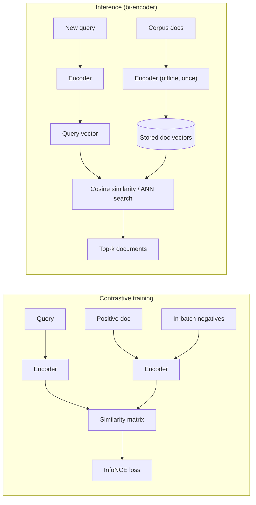

# Embedding Models

## TL;DR
An embedding model is a bi-encoder trained with contrastive learning so that texts with similar
meaning land near each other in a vector space and dissimilar texts land far apart. Retrieval
quality is capped by how well the model's training distribution matches your domain — a strong
general-purpose embedding model silently underperforms on jargon-heavy professional-services text
it never saw during training, and this failure is invisible until you measure recall directly.

## Intuition
A bi-encoder embeds the query and each document independently, then compares vectors with a cheap
similarity function (cosine). Compare that to a cross-encoder, which reads the query and a
candidate document *together* in one forward pass and outputs a relevance score directly — far
more accurate, but it must run once per candidate, so it doesn't scale to searching millions of
documents. Bi-encoders make retrieval a nearest-neighbour lookup; cross-encoders make it a
reranking step you can only afford on a shortlist. See [[reranking]].

## The maths

**Bi-encoder architecture.** A single encoder $E_\theta$ (often shared weights for query and
document, or two towers with tied or separate parameters) maps text to a fixed-size vector:

$$
v = E_\theta(\text{text}) \in \mathbb{R}^d, \qquad \hat{v} = v / \lVert v \rVert
$$

Relevance between query $x$ and document $z$ is then just $\cos(\hat v_x, \hat v_z) = \hat v_x
\cdot \hat v_z$ — a single dot product, computable in milliseconds against millions of
precomputed document vectors via an ANN index (see [[ann-algorithms-hnsw-ivf]]).

**Contrastive training with in-batch negatives.** Given a batch of $B$ (query, positive
document) pairs $(x_i, z_i^+)$, encode all queries and all documents, and treat every other
document in the batch as a negative for query $i$:

$$
\mathcal{L} = \frac{1}{B}\sum_{i=1}^{B} -\log \frac{\exp(\hat v_{x_i} \cdot \hat v_{z_i^+} / \tau)}{\sum_{j=1}^{B} \exp(\hat v_{x_i} \cdot \hat v_{z_j} / \tau)}
$$

with temperature $\tau$ controlling how sharply the softmax penalizes near-miss negatives. This
is the same InfoNCE-style contrastive objective behind CLIP (see [[multimodal-models]]), applied
within one modality. Larger batches and **hard negatives** (documents that are topically close
but not the right answer — mined via BM25 or a weaker retriever) make the objective far more
informative than random in-batch negatives alone, because random negatives are usually trivially
easy to separate.

**Dimensionality vs. quality, and Matryoshka embeddings.** A larger $d$ generally gives more
representational capacity — more room to encode fine-grained distinctions — at the cost of
storage ($d$ floats per vector, times corpus size) and slower distance computation. Matryoshka
representation learning trains a single embedding such that its *prefixes* are also valid,
independently useful embeddings:

$$
\mathcal{L}_{\text{Matryoshka}} = \sum_{m \in \mathcal{M}} w_m \, \mathcal{L}_{\text{contrastive}}(v_{1:m})
$$

for a set of nested dimensions $\mathcal{M} = \{64, 128, 256, \dots, d\}$. This lets a system
truncate a 1024-dim embedding to its first 128 dimensions at query time — trading some accuracy
for large storage/latency savings — without retraining or re-embedding the corpus, which a
normally-trained embedding does not support (truncating an ordinary embedding destroys it, since
no dimension is privileged).

## Diagram



## Code
```python
import torch
import torch.nn.functional as F


def info_nce_loss(query_embeds: torch.Tensor, doc_embeds: torch.Tensor,
                   temperature: float = 0.05) -> torch.Tensor:
    """query_embeds, doc_embeds: (B, d), L2-normalized, aligned so row i is a positive pair."""
    logits = query_embeds @ doc_embeds.T / temperature       # (B, B)
    labels = torch.arange(logits.shape[0], device=logits.device)
    return F.cross_entropy(logits, labels)


def matryoshka_loss(query_embeds: torch.Tensor, doc_embeds: torch.Tensor,
                     dims: list[int] = [64, 128, 256, 768]) -> torch.Tensor:
    total = 0.0
    for m in dims:
        q_trunc = F.normalize(query_embeds[:, :m], dim=-1)
        d_trunc = F.normalize(doc_embeds[:, :m], dim=-1)
        total = total + info_nce_loss(q_trunc, d_trunc)
    return total / len(dims)


def evaluate_recall_at_k(query_embeds, doc_embeds, gold_doc_ids, k=10):
    """Sanity check before shipping any embedding model: measure recall@k directly."""
    sims = query_embeds @ doc_embeds.T
    topk = sims.topk(k, dim=-1).indices
    hits = sum(gold in row.tolist() for gold, row in zip(gold_doc_ids, topk))
    return hits / len(gold_doc_ids)
```

## In practice
- **Use it when:** you need retrieval over a corpus larger than what a cross-encoder can
  exhaustively score (basically always, past a few thousand documents) — a bi-encoder is what
  makes ANN search possible in the first place.
- **Defaults that work:** start with a strong general-purpose open embedding model evaluated on
  retrieval benchmarks (not just any leaderboard score — check it was evaluated on retrieval,
  since some models are tuned mainly for STS/similarity tasks and underperform at retrieval);
  measure recall@k on your own labelled queries before committing; consider a Matryoshka model
  when storage/latency at scale is a real constraint, since it buys a dimension/accuracy dial for
  free.
- **Breaks when:** the domain vocabulary diverges sharply from the model's training
  distribution — this is the domain-mismatch failure mode. A professional-services corpus full of
  engagement-specific jargon, internal project codenames, and abbreviations a general embedding
  model never saw will embed those terms close to unrelated concepts, and recall silently drops
  with no error message — it just retrieves the wrong things confidently. Fine-tuning the
  embedding model (or at minimum evaluating several candidates on your own data) is the fix, not
  assuming a bigger model saves you.
- **Cost / latency:** embedding is cheap and parallelizable at index time (batch, offline); at
  query time it's one forward pass per query, small and fast. The real cost driver at scale is
  vector storage and the ANN search itself, which is why dimensionality choices matter.

## Interview angle

**Q. What's the difference between a bi-encoder and a cross-encoder, and why do RAG systems use
both?**
A bi-encoder embeds query and document independently, so document vectors can be precomputed
once and searched cheaply via ANN — this is what makes retrieval over millions of documents
tractable. A cross-encoder reads query and document jointly and is far more accurate at judging
relevance, but it must run once per candidate pair, so it doesn't scale to the full corpus. RAG
systems use a bi-encoder to cheaply narrow millions of documents to dozens, then a cross-encoder
to rerank that shortlist precisely.

**Follow-up.** Could you skip the bi-encoder and just cross-encode every query against the whole
corpus? → Only at very small corpus sizes; cross-encoder cost scales linearly with corpus size
per query, which is infeasible once you're past a few thousand documents at interactive latency.

**Q. Your embedding model performs well on public benchmarks but retrieval on your document
corpus is mediocre. What's going on?**
Domain mismatch — the model's contrastive training distribution (often web text, general QA
pairs) doesn't cover your corpus's vocabulary and phrasing. Public benchmark performance says
almost nothing about performance on jargon-heavy internal documents. The fix is to measure
recall@k on your own labelled queries against your own corpus, try a handful of candidate
models, and consider fine-tuning on in-domain (query, relevant-passage) pairs if you have or can
generate them.

**Follow-up.** How would you generate training pairs for fine-tuning if you don't have
labelled query logs yet? → Mine hard negatives from an existing retriever, or bootstrap pairs by
having an LLM generate plausible questions for known passages (synthetic query generation),
which is a common practical shortcut when real query logs don't exist yet.

**Q. What's the tradeoff in choosing embedding dimensionality?**
Higher dimensionality generally captures more nuance and separates near-duplicate meanings
better, but costs more storage (linear in $d$ per vector across the whole corpus) and slower
similarity computation. Matryoshka-trained embeddings sidestep the binary choice by making
truncated prefixes independently valid, so you can pick a cheaper dimension at serving time
without retraining or re-embedding.

## Traps
- Picking an embedding model off a general leaderboard without checking it was evaluated on
  retrieval tasks specifically — some models are strong on semantic textual similarity (STS) but
  weaker at retrieval, which is a different objective.
- Assuming embedding quality is uniform across languages, formats, or jargon density — the
  domain-mismatch failure mode is silent, not an error, so it must be actively measured.
- Truncating an ordinary (non-Matryoshka) embedding to save space — this destroys the vector,
  since no dimension is privileged in standard contrastive training.
- Treating in-batch negatives as sufficient forever — random negatives get "too easy" as a model
  improves, plateauing training; hard-negative mining is usually needed to keep improving past a
  point.

## Flashcards
What's the core architectural difference between a bi-encoder and a cross-encoder?::Bi-encoders embed query and document independently (enabling precomputation and ANN search); cross-encoders score a query-document pair jointly in one forward pass (more accurate, doesn't scale to full-corpus search).
What loss trains most embedding models, and what does in-batch mean?::InfoNCE-style contrastive loss, where every other document in the training batch serves as a free negative for each query's positive pair.
Why do hard negatives matter for embedding training?::Random in-batch negatives become trivially easy to separate as the model improves, so hard (topically close but wrong) negatives keep the training signal informative.
What do Matryoshka embeddings let you do that ordinary embeddings don't?::Truncate the vector to a smaller prefix dimension at serving time and still get a valid, independently useful embedding — trading accuracy for storage/latency without retraining.
What is the domain-mismatch failure mode?::An embedding model performs well on public benchmarks but silently underretrieves on your corpus because its training distribution doesn't cover your domain's vocabulary — detectable only by measuring recall@k on your own labelled data.
Why can't you just always use the largest available embedding dimension?::Storage and similarity-search cost scale with dimensionality across the whole corpus, and past a point extra dimensions buy little additional recall for the added cost.

## Related
[[rag-overview]]
[[vector-databases]]
[[ann-algorithms-hnsw-ivf]]
[[reranking]]
[[multimodal-models]]
