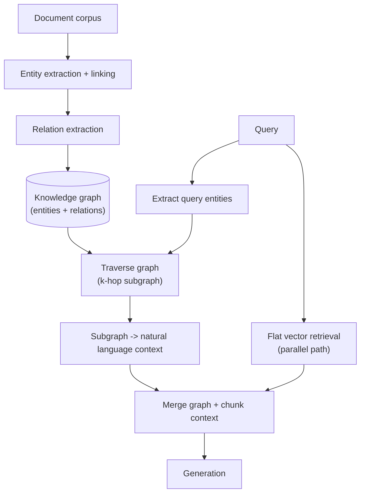

# Graph RAG

## TL;DR
Graph RAG augments retrieval with a knowledge graph of entities and relations extracted from the
corpus, so queries that need to traverse relationships ("who reports to whom across these three
amendments," "which vendors are affected by this clause change") can follow explicit edges instead
of hoping the right facts land in the same flat chunk. It buys real capability on multi-hop and
relational queries — at the real cost of building and maintaining an extraction pipeline that flat
chunk retrieval never needed.

## Intuition
Flat chunk retrieval treats the corpus as a bag of independent passages: similarity search finds
passages that *individually* look related to the query. But some questions aren't about a single
passage at all — they're about a *path* through the corpus ("Contract A references Amendment B,
which supersedes clause 4 of Contract A, which was signed by Party C, who also signed Contract D").
No single chunk contains that whole chain; a graph makes the chain an explicit, traversable
structure instead of an implicit pattern the LLM has to reconstruct from scattered text.

## The maths
A knowledge graph is a set of triples extracted from the corpus:

$$
\mathcal{G} = \{(e_i, r_k, e_j)\}
$$

where $e_i, e_j$ are entities (parties, contracts, clauses, dates, amounts) and $r_k$ is a relation
(`amends`, `supersedes`, `signed_by`, `references`). Extraction is typically a two-stage NLP task:
named entity recognition/linking (map text spans to canonical entity nodes, resolving coreference —
"the vendor" and "Acme Corp" become one node) followed by relation extraction (classify or generate
the relation between entity pairs, often via an LLM prompted per sentence or per chunk).

Multi-hop retrieval over $\mathcal{G}$ is graph traversal: given a query mentioning entity $e_0$,
retrieve the subgraph within $h$ hops:

$$
N_h(e_0) = \{ e : \text{shortest-path}(e_0, e) \le h \}
$$

then convert the relevant subgraph back into natural-language context ("Contract A was amended by
Amendment B, signed by Party C...") for the LLM, alongside or instead of raw chunks. GraphRAG-style
approaches (e.g. Microsoft's) additionally run community detection (e.g. Louvain clustering) on the
graph to build hierarchical summaries of entity clusters, supporting "global" questions about themes
across the whole corpus that no single-entity traversal would surface.

## Diagram


## Code
```python
# extraction pass — run once per document at ingestion time, not per query
EXTRACTION_PROMPT = """Extract entities and relations from this contract excerpt as JSON triples.
Entity types: Party, Contract, Clause, Date, Amount.
Relations: amends, supersedes, signed_by, references, terminates, effective_from.

Text: {chunk_text}

Output format: [{{"subject": "...", "relation": "...", "object": "..."}}, ...]
"""

def extract_triples(chunk_text: str, llm) -> list[dict]:
    response = llm.generate(EXTRACTION_PROMPT.format(chunk_text=chunk_text))
    return json.loads(response)  # in production: validate against a schema, retry on parse failure

# build the graph incrementally as documents are ingested
import networkx as nx

def build_graph(all_triples: list[dict]) -> nx.MultiDiGraph:
    g = nx.MultiDiGraph()
    for t in all_triples:
        g.add_edge(t["subject"], t["object"], relation=t["relation"])
    return g

def graph_context_for_query(query_entities: list[str], g: nx.MultiDiGraph, hops: int = 2) -> str:
    subgraph_nodes = set(query_entities)
    frontier = set(query_entities)
    for _ in range(hops):
        next_frontier = set()
        for node in frontier:
            if node in g:
                next_frontier |= set(g.successors(node)) | set(g.predecessors(node))
        subgraph_nodes |= next_frontier
        frontier = next_frontier

    lines = []
    for u, v, data in g.edges(data=True):
        if u in subgraph_nodes and v in subgraph_nodes:
            lines.append(f"{u} {data['relation']} {v}.")
    return "\n".join(lines)
```

## In practice
- **Use it when:** the failure mode is specifically multi-hop or relational — questions that need
  combining facts across documents linked by explicit relationships (contract amendment chains,
  organisational hierarchies, cross-referenced clauses, vendor/party networks). If your queries are
  mostly single-document lookups, a graph adds cost without addressing an actual failure.
- **Defaults that work:** start with entity types and relations that matter to the domain (don't try
  to extract a general-purpose graph); run extraction as a batch ingestion step, not per query;
  keep flat vector retrieval running in parallel and merge both context sources rather than replacing
  one with the other — graph traversal and flat retrieval fail on different query types, and the
  combination covers more ground than either alone.
- **Breaks when:** extraction quality is poor — LLM-based relation extraction produces false or
  missing edges, and errors compound across hops (one wrong edge two hops deep silently poisons a
  whole traversal's context). Also breaks when the graph goes stale relative to document updates
  (see [[rag-failure-modes]]) — a graph is a second index that needs its own re-ingestion pipeline in
  step with the corpus.
- **Cost / latency:** building the graph is a real, ongoing ingestion cost — LLM calls per chunk for
  extraction (roughly the same order of magnitude as chunking + embedding, but with a fragile parsing
  step), plus graph storage and traversal infrastructure. Query-time traversal itself is typically
  fast (graph databases are built for this), but the upfront and maintenance cost is the thing to
  budget for honestly before committing.

## Interview angle

**Q. When does graph RAG actually beat flat chunk retrieval, concretely?**
When the answer requires composing facts that live in *different* chunks connected by an explicit
relationship the corpus doesn't state in one place — e.g. "which of our active contracts were
amended after the vendor's ownership change in March" needs to join contract-amendment relations
with an ownership-change date, which is a graph traversal, not a single semantic match. Flat
retrieval can surface each fact individually if you ask separately, but can't compose the join on its
own; graph traversal makes the join explicit and mechanical.

**Follow-up.** Could you get the same result with query decomposition and multiple retrievals
instead of a graph? → Sometimes, for shallow 1-2 hop cases — decomposition plus multiple targeted
retrievals is cheaper to build. Graph RAG earns its cost when the relationship structure is deep,
reused across many queries, and would otherwise require rediscovering the same joins repeatedly at
query time via ad hoc decomposition.

**Q. What's the actual maintenance cost of a knowledge graph layer that people underestimate?**
Every document update, addition, or correction needs re-extraction and graph reconciliation — merged
or renamed entities (coreference drift), superseded relations that need to be marked inactive rather
than deleted (for audit trails in professional-services corpora), and periodic re-validation of
extracted edges against source text as extraction models change. This is a second ingestion pipeline
running alongside chunking/embedding, not a one-time build.

**Q. How do you evaluate graph RAG against flat RAG?**
Build a golden set specifically of multi-hop questions (not your general golden set, which is likely
dominated by single-fact lookups where a graph shows no advantage) and compare answer correctness and
faithfulness between flat-only, graph-only, and merged retrieval. Track extraction precision/recall
separately (sampled triples checked against source text) since a graph's value is capped by its
extraction quality.

**Q. Isn't a graph just a more expensive way of doing what metadata filtering does?**
No — metadata filtering narrows a flat retrieval by structured attributes (date, document type,
client) that exist as fields on a chunk; it doesn't capture relationships *between* entities across
documents. A graph specifically encodes and traverses relations extracted from unstructured text,
which metadata fields don't represent at all.

## Traps
- Building a general-purpose knowledge graph "to see what we find" instead of scoping entity/relation
  types to the specific multi-hop query patterns you've observed — an unscoped extraction pass
  produces a noisy, low-precision graph that's expensive to trust.
- Treating graph RAG as a replacement for flat vector retrieval rather than a complement — most
  production systems that use graphs still run flat retrieval in parallel for the queries a graph
  doesn't help with.
- Ignoring extraction error propagation — a false edge two hops from the query entity can silently
  inject a wrong fact into context with no obvious signal that it came from a faulty extraction.
- Underestimating re-ingestion cost — treating the graph as a one-time build rather than a pipeline
  that must track every document update, the same way the vector index must.

## Flashcards
When does graph RAG outperform flat chunk retrieval?::On multi-hop or relational queries where the answer requires composing facts connected by explicit relationships across multiple documents — not on single-document factual lookups.
What are the two extraction stages needed to build a knowledge graph from documents?::Entity recognition/linking (resolving mentions to canonical nodes) followed by relation extraction (labelling the relationship between entity pairs).
Why is graph RAG usually run alongside flat retrieval rather than replacing it?::Graph traversal and flat vector retrieval fail on different query types; combining both context sources covers more query patterns than either alone.
What is the main ongoing cost of a graph RAG system that's easy to underestimate?::Re-extraction and reconciliation every time the corpus changes — it's a second ingestion pipeline that must stay in sync with document updates, not a one-time build.
How does an extraction error propagate in graph traversal?::A single false or missing edge can silently corrupt multi-hop context, since later hops build on earlier (possibly wrong) traversal steps.
How should graph RAG be evaluated relative to flat RAG?::On a golden set specifically of multi-hop questions, comparing flat-only, graph-only, and merged retrieval, plus separately tracking extraction precision/recall.

## Related
[[rag-overview]]
[[advanced-rag-patterns]]
[[agentic-rag]]
[[document-ingestion-and-parsing]]
[[rag-failure-modes]]
