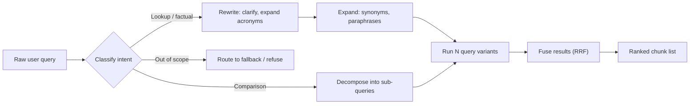

# Query Rewriting and Expansion

## TL;DR
The string a user types is optimised for expressing intent to a human, not for matching vectors or
BM25 postings against a corpus. Query rewriting reformulates it into something more retrievable;
expansion adds terms/variants to widen recall; classification routes it to the right index or
strategy before either happens. Skipping this step is the single most common reason a "working" RAG
pipeline underperforms in production versus in the demo.

## Intuition
Think of retrieval as a matching game between two vocabularies: the user's and the corpus's. A user
asks "can we terminate early without penalty?" but the contract says "early termination fee waived
under Section 9.2." Cosine similarity between the query embedding and the chunk embedding is decent
but not great, because the two sentences share almost no surface form and only partially overlap in
meaning. Rewriting closes that vocabulary gap before the retriever ever sees the query.

## The maths
There isn't a single derivation here — it's a family of transformations applied to the query $q$
before it hits the retriever $R$. Framed formally:

$$
\hat{q} = f_\theta(q, \text{context})
$$

where $f_\theta$ is an LLM call (rewriting), a set expansion $\{q_1, \dots, q_k\} = g(q)$ (expansion,
often fused via reciprocal rank fusion across the $k$ retrievals), or a routing function
$r(q) \to \{\text{index}_1, \dots, \text{index}_n\}$ (classification/routing). The only quantity that
matters at eval time is whether $\text{Recall@k}(R(\hat q))> \text{Recall@k}(R(q))$ on your golden
set — everything else is a means to that end. Reciprocal Rank Fusion, used to merge multiple
expanded-query result lists, scores each document by:

$$
\text{RRF}(d) = \sum_{i} \frac{1}{k + \text{rank}_i(d)}
$$

summed over the ranked lists $i$ that contain $d$, with $k \approx 60$ as a standard damping
constant so that rank-1 hits dominate without one list totally starving out the others.

## Diagram


## Code
```python
from openai import OpenAI

client = OpenAI()

REWRITE_PROMPT = """You rewrite user questions into search queries for a document retrieval
system over professional-services contracts, SOWs, and policy documents.
Rules:
- Expand acronyms and abbreviations you are confident about.
- Resolve pronouns using the conversation history.
- Output 3 alternative phrasings, one per line, no numbering.
- Do not answer the question. Only rewrite it.

Conversation history:
{history}

User question: {question}
"""

def rewrite_and_expand(question: str, history: str = "") -> list[str]:
    resp = client.chat.completions.create(
        model="gpt-4o-mini",
        messages=[{"role": "user", "content": REWRITE_PROMPT.format(history=history, question=question)}],
        temperature=0.3,
    )
    variants = [line.strip() for line in resp.choices[0].message.content.splitlines() if line.strip()]
    return [question] + variants  # keep the original — rewrites can drift off-intent


def reciprocal_rank_fusion(ranked_lists: list[list[str]], k: int = 60) -> list[str]:
    scores: dict[str, float] = {}
    for ranked in ranked_lists:
        for rank, doc_id in enumerate(ranked, start=1):
            scores[doc_id] = scores.get(doc_id, 0.0) + 1.0 / (k + rank)
    return sorted(scores, key=scores.get, reverse=True)
```

## In practice
- **Use it when:** queries are conversational, contain domain jargon/acronyms not in the corpus's
  surface form, or your logs show a long tail of zero-hit or low-similarity queries.
- **Defaults that work:** a cheap model (small/distilled, not your generation model) for rewriting;
  3–5 expansion variants; RRF over naive score-averaging for fusion, since raw similarity scores
  from different query variants aren't calibrated against each other.
- **Breaks when:** the rewriter hallucinates a wrong interpretation and confidently searches for the
  wrong thing — this is worse than doing nothing, because it's invisible in the UI. Also breaks on
  queries needing exact string/ID lookup (a clause number, an invoice ID) — rewriting can paraphrase
  away the one token that would have matched exactly.
- **Cost / latency:** one extra LLM call (typically 100–300ms with a small model) plus N× retrieval
  calls if you fan out expanded queries — this is the first thing to cut under a tight latency
  budget; classification/routing is nearly free by comparison and should be kept.

## Interview angle

**Q. A user asks "what's our notice period for vendor X" and the system returns nothing relevant. Where do you look first?**
Before touching the retriever, check whether the query even resembles corpus vocabulary — pull the
raw query embedding, look at top-20 nearest chunks regardless of threshold, and see if the right
chunk is at rank 15 (a rewriting/expansion problem) or nowhere in top-100 (an indexing/chunking or
embedding-model problem). Rewriting is diagnosed by "the answer exists in the corpus but under
different words"; that's the recall@k-with-original-query vs recall@k-with-rewrite comparison.

**Follow-up.** How do you avoid the rewriter introducing a wrong assumption? → Always retrieve on
the original query too and fuse; never discard it. Log rewrites in production so a bad one is
debuggable, and eval rewriting as its own component with its own golden set, not folded into
end-to-end accuracy.

**Q. Why not just always expand every query into 5 variants and retrieve on all of them?**
Latency and cost scale linearly with variants, and expansion has a recall/precision tradeoff —
too many variants pull in near-duplicate or tangential chunks that dilute the context window and
can outright hurt generation quality (more noise for the LLM to filter). Expand adaptively:
classify first, and only fan out for genuinely ambiguous or multi-faceted queries.

**Q. Difference between query rewriting and query expansion?**
Rewriting replaces the query with a better-phrased query (still one query, still targeting the same
intent). Expansion produces multiple queries/terms to broaden coverage — it's a recall lever, not a
clarity lever. HyDE and multi-query (see [[advanced-rag-patterns]]) are expansion techniques;
resolving "it" to "the MSA" from context is rewriting.

**Follow-up.** Can you combine both? → Yes — rewrite for clarity/coreference resolution first, then
expand the rewritten query into variants. Doing it in the other order propagates ambiguity into
every variant.

**Q. How do you evaluate a rewriting step in isolation?**
Build a small set of (raw query, ideal retrieval query) pairs from real logs where you know the
right chunk. Measure recall@k of the retriever fed the raw query vs fed the rewrite, holding the
retriever fixed. If rewriting doesn't move recall@k on a representative sample, it's not earning its
latency cost — cut it.

## Traps
- "We added query rewriting so retrieval got better" without ever measuring it against the
  no-rewrite baseline — you may have just added latency and cost for a wash, or a regression on
  queries with literal identifiers.
- Using your main generation LLM (large, slow) to do rewriting — this is a small, fast task; using
  a frontier model here is a latency and cost mistake.
- Treating classification/routing as optional "if we have multiple indexes" — even a single-index
  system benefits from classifying "in-scope vs out-of-scope" to avoid confidently retrieving
  irrelevant chunks for questions the corpus can't answer.
- Rewriting away exact-match tokens (contract clause numbers, SKUs, employee IDs) that a hybrid
  BM25/vector approach would have caught verbatim — always keep a literal-match path alongside
  semantic rewriting for structured identifiers.

## Flashcards
Why do raw user queries often retrieve poorly?::They're phrased for a human listener, not to match corpus vocabulary/surface form — there's a vocabulary gap between query and document phrasing.
What is reciprocal rank fusion used for?::Combining ranked result lists from multiple query variants into one ranking without needing calibrated similarity scores across lists.
Query rewriting vs query expansion — what's the distinction?::Rewriting reformulates one query for clarity/coreference; expansion generates multiple queries/terms to widen recall.
Why keep the original query alongside a rewrite?::A rewrite can misinterpret intent; retrieving on both and fusing avoids a bad rewrite silently killing recall.
What's the main cost of query expansion?::Latency and compute scale with the number of variants retrieved, and too many variants can dilute context with near-duplicate or irrelevant chunks.
Why is query classification/routing often the cheapest high-value step?::It's a lightweight decision (often a small classifier or short LLM call) that prevents wasted retrieval against the wrong index or confidently answering out-of-scope questions.

## Related
[[rag-overview]]
[[hybrid-search-bm25-vector]]
[[advanced-rag-patterns]]
[[reranking]]
[[rag-failure-modes]]
