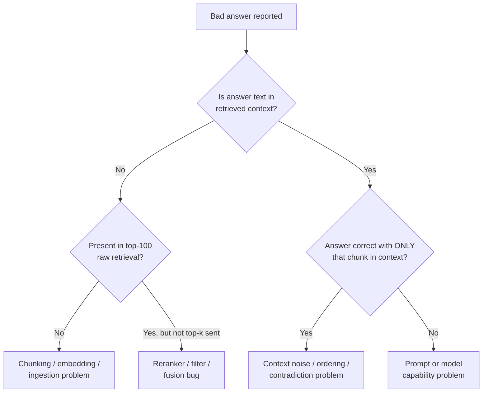

# RAG Failure Modes

## TL;DR
Most "RAG isn't working" tickets collapse into a small set of recurring root causes. The skill that
actually separates a senior candidate here isn't listing them — it's the diagnostic reflex: given a
bad answer, which of these is it, and how do you prove it in five minutes rather than guess and
re-tune randomly.

## Intuition
Every RAG failure is one of exactly two things happening at one of two stages: either the *right
information never reached the model* (a retrieval-stage problem), or *the model had the right
information and still got it wrong* (a generation-stage problem). Everything below is a specific
mechanism for one of those two things, and the fastest diagnostic is always the same first move:
open the retrieved context for the failing query and check, by eye, whether the answer is in there.

## The maths
No single formula here — the "maths" is the diagnostic procedure itself, which is worth stating
precisely because it's what distinguishes systematic debugging from guessing:

1. Reproduce the failing query and capture the exact retrieved chunk set (post-rerank, as sent to
   the LLM).
2. Check: is the ground-truth answer's supporting text present in that set? If no → retrieval-stage
   failure, go to step 3. If yes → generation-stage failure, go to step 4.
3. Isolate within retrieval: run the query against the embedding index directly (bypass rerank,
   bypass filters) at high k (e.g. 100). If the right chunk appears there but not in the final top-k
   sent to generation → a downstream retrieval-stage bug (reranker, filter, or fusion). If it never
   appears even at k=100 → an upstream bug (chunking split the answer across chunks, embedding
   mismatch, or the content genuinely isn't indexed).
4. Isolate within generation: re-run generation with *only* the answer-supporting chunk in context,
   nothing else. If it now answers correctly → the original failure was noise/contradiction/ordering
   among the other retrieved chunks, not a model capability limit. If it still fails → prompt or
   model-capability issue.

## Diagnostic table

| Symptom | Likely cause | Fix |
|---|---|---|
| Answer wrong or "not found," and answer text absent from retrieved context at any k | Missed retrieval — embedding/query mismatch, or content never indexed | Check chunking coverage first; try [[query-rewriting-and-expansion]] and hybrid search; verify ingestion actually processed the source document |
| Answer text present in context but model ignored or contradicted it | Retrieved-but-ignored — noise from other chunks, poor context ordering, weak instruction-following | Reduce chunk count, reorder (best chunks at start/end, see [[context-assembly-and-compression]]), strengthen system prompt to cite sources |
| Two retrieved chunks state conflicting facts, model picks the wrong one or blends them | Contradictory chunks — outdated vs current version both indexed, or genuinely conflicting source documents | Add recency/version metadata and filter or rank by it; if sources truly conflict, prompt the model to surface the conflict rather than silently pick one |
| Answer cuts off mid-sentence or misses a qualifier stated just after the retrieved boundary | Chunk boundary split — the relevant fact spans two chunks and only one was retrieved | Use overlap in chunking, semantic/structure-aware chunking instead of fixed-size, or retrieve neighbouring chunks for hits |
| Answer reflects an old version of a policy/contract that was since updated | Stale index — ingestion pipeline not re-run after source document changed | Add ingestion triggers on document change, track document version/hash, verify re-indexing job actually ran |
| Query embeds far from any relevant chunk despite the answer existing in the corpus | Embedding/query mismatch — domain jargon or acronyms not represented well by a general-purpose embedding model | Try a domain-adapted or larger embedding model; add query rewriting/expansion; consider hybrid BM25+vector search for exact terms |
| Numeric or tabular answer wrong even though the source table is "in" the corpus | Tables and scanned PDFs — naive text extraction mangled table structure, or OCR errors on a scanned document | Use table-aware parsing (row/column structure preserved as markdown or structured text), OCR quality checks, and chunk tables as atomic units |
| Model answers only part of a question that needs combining facts from multiple documents | Multi-hop question — single retrieval pass can't surface a fact that requires joining two sources | Query decomposition ([[advanced-rag-patterns]]) or [[graph-rag]] for relationship-heavy corpora |
| User receives an answer built from a document they shouldn't have access to | Access-control leak — retrieval doesn't respect document-level permissions | Enforce permission filtering at the retrieval layer (not just at the UI layer), test with per-role golden sets, treat this as a security incident, not a quality bug |

## Diagram


## Code
```python
def diagnose_failure(query: str, expected_answer_span: str, pipeline) -> dict:
    """Minimal harness to localise a RAG failure to a stage, per the procedure above."""
    raw_top100 = pipeline.retriever.search(query, top_k=100)
    final_context = pipeline.run_retrieval_and_rerank(query)  # what generation actually sees

    in_raw = any(expected_answer_span in c["text"] for c in raw_top100)
    in_final = any(expected_answer_span in c["text"] for c in final_context)

    if not in_raw:
        return {"stage": "ingestion/embedding", "detail": "answer not found even at k=100"}
    if in_raw and not in_final:
        return {"stage": "reranker/filter/fusion", "detail": "present in raw retrieval, dropped downstream"}

    # answer text is in final context — isolate generation
    isolated_answer = pipeline.generate(query, context=[c for c in final_context if expected_answer_span in c["text"]])
    if expected_answer_span.lower() in isolated_answer.lower():
        return {"stage": "context noise/ordering", "detail": "correct with isolated chunk, wrong with full context"}
    return {"stage": "prompt/generation", "detail": "wrong even with only the answer chunk in context"}
```

## In practice
- **Use it when:** every time a user reports a wrong or missing answer — this diagnostic pass should
  be the standard triage runbook, not an occasional deep-dive reserved for hard cases.
- **Defaults that work:** log the full retrieved-chunk set (post-rerank, pre-generation) for every
  production query, not just the final answer — without this, diagnosing after the fact means
  re-running the query and hoping retrieval is deterministic (it usually is, but index updates and
  embedding model changes can silently break reproducibility).
- **Breaks when:** the corpus itself is genuinely ambiguous or contradictory (multiple valid versions
  of a policy exist by design) — no retrieval or generation fix solves an ill-posed question; the fix
  there is metadata/versioning discipline on ingestion, not pipeline tuning.
- **Cost / latency:** the diagnostic procedure is cheap (a few extra retrieval/generation calls per
  investigated failure) and should never be skipped in favour of "just try tuning the prompt" —
  tuning the wrong stage wastes far more engineering time than five minutes of proper triage.

## Interview angle

**Q. A user says the RAG system gave a wrong answer. Walk me through your first three actions.**
First, pull the exact retrieved chunk set that was sent to generation for that query — not a
re-run, the actual logged context if available, since index or embedding changes can make retrieval
non-reproducible after the fact. Second, check by eye whether the ground-truth answer is present in
that context. Third, branch: if absent, escalate to retrieval-stage debugging (raw top-100 check);
if present, isolate generation by re-running with only that chunk in context. This takes minutes and
tells you which half of the system to actually work on.

**Follow-up.** What do you log to make this possible after the fact? → Query, rewritten/expanded
query variants if used, full retrieved chunk set with scores pre- and post-rerank, the final
assembled prompt, and the generated answer — enough to reconstruct the entire request without
re-running a potentially-changed pipeline.

**Q. How do access-control leaks happen in RAG systems specifically, and why are they easy to miss
in testing?**
They happen when retrieval operates over a shared vector index without per-document permission
filtering — the retriever finds the most semantically relevant chunk regardless of who's asking, and
permission checks (if they exist at all) are applied only at the UI/API layer after generation has
already used the leaked content, or not applied at all. They're easy to miss because most testing
uses a single admin-level account; the bug only surfaces with a genuinely restricted-access account
asking a question whose best-matching chunk sits in a document they can't see.

**Follow-up.** How do you fix this architecturally? → Enforce permission filtering as a mandatory
predicate at the retrieval layer itself (filtered ANN search or a post-filter with re-fetch to
maintain top-k), never as an afterthought at the response layer, and include per-role test cases in
the golden set specifically designed to catch leaks.

**Q. Why do chunk boundary splits cause failures that are hard to spot in normal testing?**
Because the failure only shows up when the specific fact needed straddles exactly the chunk
boundary — a golden set built from broad questions may retrieve the "right" chunk most of the time
and only occasionally hit the unlucky split, making the failure rate low and intermittent rather than
a clean reproducible bug, which makes it easy to write off as noise instead of a structural issue in
the chunking strategy.

**Q. Stale index — how do you catch this proactively rather than waiting for a user to report an
outdated answer?**
Track a content hash or last-modified timestamp per source document alongside the index, and run a
periodic reconciliation job that diffs source documents against what's indexed, alerting on drift.
Treat "time since last successful re-ingestion" as a first-class monitored metric, the same way you'd
monitor data pipeline freshness in any other data engineering context.

## Traps
- Tuning the generation prompt in response to a retrieval failure (or vice versa) — without the
  localisation step, this is a coin flip that burns engineering time and can mask the real bug.
- Treating "contradictory chunks" as a retrieval bug to fix by picking one — often the right fix is
  surfacing the conflict to the user/reviewer rather than silently resolving it, especially in
  professional/legal/compliance corpora where the "wrong" resolution has real consequences.
- Assuming table and scanned-PDF failures are embedding-model problems — they're usually upstream
  parsing/OCR failures where the text handed to the embedder was already wrong or structurally
  mangled before embedding ever happened.
- Not treating access-control leaks as a security incident with its own severity and response process
  distinct from ordinary quality bugs — a wrong answer is a quality issue, a permission leak is a
  security issue, and conflating them under one bug tracker underrates the leak.

## Flashcards
What's the single fastest triage step for any bad RAG answer?::Check whether the ground-truth answer's supporting text is present in the exact retrieved context sent to generation for that query.
How do you distinguish a retrieval-stage failure from a generation-stage failure?::If the answer text is absent from retrieved context, it's retrieval; if present but the model still gets it wrong, re-run generation with only that chunk isolated — if it now succeeds, the original failure was context noise, not a capability limit.
What causes chunk boundary split failures and why are they hard to catch?::The relevant fact spans two chunks and only one is retrieved; they're intermittent (only occur when the fact straddles the exact split point) so they look like noise rather than a structural bug.
Why are access-control leaks in RAG especially easy to miss in testing?::Testing usually happens with a broad-access account; the leak only appears when a permission-restricted account's best-matching chunk sits in a document they shouldn't see, and filtering is often applied too late (UI layer, not retrieval layer).
What is the correct fix for contradictory chunks from different document versions?::Add recency/version metadata and filter or rank by it — or explicitly surface the conflict rather than silently picking one, especially in compliance-sensitive domains.
Why are table/scanned-PDF failures usually not embedding problems?::The text handed to the embedder was often already wrong or structurally mangled by upstream parsing/OCR before embedding occurred.

## Related
[[rag-overview]]
[[rag-evaluation]]
[[chunking-strategies]]
[[document-ingestion-and-parsing]]
[[context-assembly-and-compression]]
