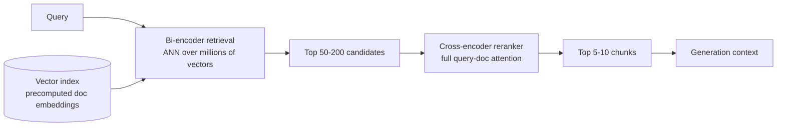

# Reranking

## TL;DR
First-stage retrieval (bi-encoder / BM25 / hybrid) is optimised for speed over millions of
candidates and gets you a decent-but-noisy top-k. A reranker is a second, more expensive model that
re-scores that small candidate set with full query-document interaction, pushing the truly relevant
chunks to the top. "Retrieve many, rerank few" is the standard shape of every serious RAG pipeline —
not an optional add-on.

## Intuition
A bi-encoder embeds the query and each document *independently* into the same vector space, so
similarity is just a dot product — cheap, and parallelisable over an ANN index of millions of
vectors. But because query and document never interact during encoding, the model can't ask
"does this specific document actually answer this specific question" — it can only ask "are these
two things generally about the same topic." A cross-encoder feeds the (query, document) pair
*together* through one model with full attention between every query token and every document
token — much more accurate, but you can't precompute anything, so you can only afford to run it on
a short list of candidates, not the whole corpus.

## The maths
Bi-encoder similarity for query $q$ and document $d$:

$$
\text{sim}(q, d) = \frac{E(q) \cdot E(d)}{\lVert E(q) \rVert \, \lVert E(d) \rVert}
$$

where $E(q)$ and $E(d)$ are computed by the *same* encoder but with no cross-attention between them
— $E(d)$ is precomputed once at index time and reused for every query, which is exactly what makes
ANN search over millions of documents feasible.

A cross-encoder instead computes:

$$
\text{score}(q, d) = W \cdot \text{Encoder}([q \, ; \, \texttt{[SEP]} \, ; \, d]) + b
$$

a single forward pass over the concatenated pair, producing one relevance logit. Every token of $q$
can attend to every token of $d$ and vice versa. This is strictly more expressive — it subsumes what
a bi-encoder can represent — but the cost is: no precomputation, $O(n)$ full forward passes for $n$
candidates, and it doesn't scale to searching an index of millions.

## Diagram


## Code
```python
from sentence_transformers import CrossEncoder

# a standard MS MARCO-trained cross-encoder — small enough to run on a
# few dozen candidates within budget, too slow to run over a whole corpus
reranker = CrossEncoder("cross-encoder/ms-marco-MiniLM-L-6-v2")

def rerank(query: str, candidates: list[dict], top_k: int = 8) -> list[dict]:
    pairs = [(query, c["text"]) for c in candidates]
    scores = reranker.predict(pairs)  # one forward pass per pair
    for c, s in zip(candidates, scores):
        c["rerank_score"] = float(s)
    return sorted(candidates, key=lambda c: c["rerank_score"], reverse=True)[:top_k]

# typical shape: bi-encoder + hybrid search returns ~100 candidates,
# cross-encoder reranks down to the 5-8 that actually go into the prompt
candidates = vector_store.search(query_embedding, top_k=100)
final_context = rerank(query, candidates, top_k=8)
```

## In practice
- **Use it when:** you have more than a handful of documents and first-stage retrieval alone
  produces a lot of near-miss noise in the top-k — which is nearly always true for professional
  document corpora where many chunks share boilerplate legal/policy language.
- **Defaults that work:** retrieve 50–150 candidates (recall-oriented, cheap), rerank down to 5–10
  (precision-oriented, expensive) before generation. Cross-encoder from `sentence-transformers`
  (MS MARCO MiniLM family) or a hosted reranking API (e.g. Cohere Rerank) are both standard starting
  points — swap in a domain-finetuned reranker once you have enough labelled query-chunk pairs.
- **Breaks when:** first-stage recall is bad — reranking can only reorder what's already in the
  candidate set; if the right chunk isn't in the top-100 retrieved, no reranker recovers it. It's a
  precision tool, not a recall tool.
- **Cost / latency:** this is the step that has a real, felt latency budget. A cross-encoder call
  over 100 candidates typically adds tens to a couple hundred milliseconds depending on model size
  and hardware — batch the pairs, and cap candidate count against your p95 latency target rather
  than reranking everything you retrieved "just in case."

## Interview angle

**Q. Why can't you just use a cross-encoder as your primary retriever and skip the bi-encoder stage?**
Because a cross-encoder needs the query at inference time to score a document — there's nothing to
precompute. Scoring every document in a corpus against a live query means $O(N)$ full transformer
forward passes per query, where $N$ is corpus size. For a few hundred documents that's tolerable;
for hundreds of thousands or millions it's not — you'd need seconds to minutes per query. Bi-encoders
solve this by encoding documents once, offline, into a vector index that supports approximate
nearest-neighbour search in milliseconds regardless of corpus size.

**Follow-up.** So what's the actual trade being made? → Precompute-ability and speed (bi-encoder)
versus query-document interaction and accuracy (cross-encoder). Two-stage retrieval — bi-encoder for
recall, cross-encoder for precision — gets both: cheap enough to run on the whole corpus, accurate
enough to trust the final ranking.

**Q. How many candidates should you retrieve before reranking, and how did you pick that number?**
It's a recall/latency tradeoff, tuned against your golden set: measure recall@k of the first-stage
retriever alone at k = 20, 50, 100, 200. Pick the smallest k past which recall stops meaningfully
improving — that's your candidate pool size for reranking. Going bigger only adds reranker latency
without recovering more relevant chunks that weren't there to begin with.

**Follow-up.** What if recall@50 is much lower than recall@200? → That's a first-stage retrieval
problem (embedding model, chunking, or hybrid search tuning), not something reranking fixes — see
[[rag-failure-modes]] for the "missed retrieval" pathway.

**Q. When would you skip reranking entirely?**
Very small corpora where first-stage retrieval is already near-perfect and precision noise doesn't
matter (few dozen documents, low ambiguity), or extremely tight latency budgets (sub-100ms) where
the accuracy gain doesn't justify the added hop — in that case, invest instead in a better embedding
model or hybrid search fusion, which cost nothing extra at query time.

**Q. Bi-encoder vs cross-encoder — could you use the same base model for both?**
Yes, architecturally they're often the same transformer backbone, just used differently: bi-encoder
mode encodes each side independently and compares vectors; cross-encoder mode concatenates and
attends jointly, adding a classification/regression head for the relevance score. This is why
sentence-transformers ships both bi-encoder (`SentenceTransformer`) and cross-encoder
(`CrossEncoder`) wrappers on similar underlying models.

## Traps
- Assuming reranking fixes bad retrieval — it can only reorder the candidate set you hand it; if the
  answer chunk never made it into the top-100, reranking is powerless.
- Reranking a huge candidate pool (e.g. 1000) "to be safe" — this blows the latency budget for no
  recall benefit past the point where first-stage recall@k has already plateaued.
- Comparing bi-encoder similarity scores directly against cross-encoder scores as if they're on the
  same scale — they aren't; use cross-encoder score purely for re-ordering the candidate set, not
  for absolute relevance thresholds unless calibrated separately.
- Forgetting reranking is itself a model that can be evaluated and finetuned — teams often ship the
  off-the-shelf MS MARCO reranker forever even when they have thousands of labelled
  query-relevant-chunk pairs from user feedback that could finetune a much better one.

## Flashcards
Why can't cross-encoders serve as first-stage retrieval over a large corpus?::They require the query at inference time to score each document jointly (no precomputation), so cost scales O(N) per query — infeasible at corpus scale.
What does a bi-encoder sacrifice for its speed?::Query-document interaction — it encodes each side independently, so it can't model fine-grained relevance the way joint attention can.
What is the standard two-stage retrieval shape?::Retrieve many candidates cheaply with a bi-encoder/hybrid search, then rerank a small candidate set precisely with a cross-encoder.
Reranking can fix low first-stage recall — true or false?::False — reranking only reorders the candidates it's given; it cannot recover documents that were never retrieved.
How do you choose the candidate pool size before reranking?::Measure recall@k of first-stage retrieval at increasing k against a golden set and pick the point where recall plateaus, balanced against reranker latency cost.
What determines reranking's latency contribution?::Number of candidates reranked × cross-encoder forward-pass cost — batch candidates and cap pool size to hit your p95 latency target.

## Related
[[rag-overview]]
[[embedding-models]]
[[hybrid-search-bm25-vector]]
[[vector-databases]]
[[rag-evaluation]]
