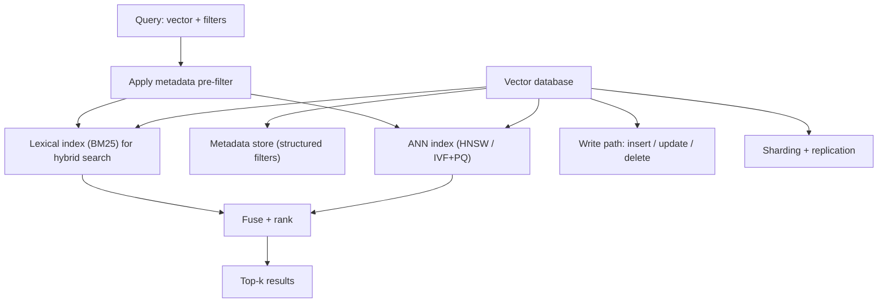

# Vector Databases

## TL;DR
A vector database is not "an ANN index" — an ANN index is one component inside it. What a vector
database actually adds is the operational machinery around that index: metadata filtering
combined with similarity search, hybrid (lexical + vector) search, safe updates and deletes
without rebuilding the whole index, sharding and replication for scale, and the durability and
access patterns any production data store needs. You can build a toy ANN index in an afternoon;
a vector database is what makes it survive contact with real traffic and real document
lifecycles.

## Intuition
Think of the difference between "sorted array with binary search" and "a real database." The
sorted array is the core algorithmic idea; a database wraps it with concurrent writes, indexes on
other columns, transactions, backups, and query planning. A vector database is the same
relationship to an ANN index — HNSW or IVF (see [[ann-algorithms-hnsw-ivf]]) is the engine, but
the engine alone doesn't answer "show me only documents from this client, updated in the last 90
days, filtered before scoring, at p99 under 50ms, while documents are being added and deleted
continuously."

## The maths
There's limited new mathematics here beyond the ANN algorithms themselves (see
[[ann-algorithms-hnsw-ivf]]) and BM25 scoring (see [[hybrid-search-bm25-vector]]); the value of a
vector database is architectural, not mathematical. The one calculation worth internalizing is
raw storage cost, because it directly drives infrastructure decisions:

$$
\text{storage} \approx N \times (4d + \text{metadata bytes} + \text{index overhead})
$$

For $N = 10$ million chunks, $d = 768$ (float32 embeddings): $10^7 \times 4 \times 768 \approx
30.7$ GB just for raw vectors, before index overhead (HNSW graph edges typically add 20–50% on
top) or metadata. This is the number that makes PQ compression (see
[[ann-algorithms-hnsw-ivf]]) or a smaller/Matryoshka-truncated embedding dimension a real
infrastructure decision rather than a micro-optimization once a corpus reaches tens of millions
of chunks.

## Diagram



## Code
```python
# Illustrative shape of what a vector DB query actually needs to express — not a specific
# library's exact API, but the pattern is near-universal across them.

query = {
    "vector": [0.013, -0.221, 0.045],   # query embedding
    "top_k": 10,
    "filter": {
        "client_id": "acme-corp",
        "doc_type": {"$in": ["contract", "sow"]},
        "updated_at": {"$gte": "2025-01-01"},
    },
    "hybrid": {
        "bm25_query": "termination clause indemnity",
        "fusion": "rrf",
    },
}

# The two operational capabilities that separate "a vector DB" from "a library that does ANN":
def upsert(store, doc_id: str, vector: list[float], metadata: dict) -> None:
    """Must work without a full index rebuild — HNSW/IVF both support incremental insert,
    but deletes are trickier: most systems soft-delete (tombstone) and compact later."""
    store.write(doc_id, vector, metadata)


def delete(store, doc_id: str) -> None:
    """Real deletes (e.g. a client revokes access to a document) must actually remove the
    vector from being retrievable immediately, even if physical compaction is deferred."""
    store.tombstone(doc_id)
```

## In practice
- **Use it when:** you're serving retrieval in production with more than a toy-sized corpus, need
  metadata filtering combined with similarity search (almost every real query does — "search
  within this client's documents," "only documents from the last quarter"), or need the corpus to
  change over time (new documents added, old ones revoked) without periodic full reindexing.
- **Defaults that work:** filter *before* scoring, not after — post-filtering a top-k result set
  can leave you with fewer than $k$ results after filtering, or worse, silently leaks unfiltered
  documents into context if filtering is bolted on downstream instead of enforced at the query
  layer (see the access-control discussion in [[rag-overview]]). Pick a system with native hybrid
  search support rather than bolting BM25 on separately, since keeping two indexes in sync is
  itself an operational burden.
- **Breaks when:** extremely high write throughput with immediate consistency requirements (HNSW
  graph updates and deletes are not free operations, and most systems batch or defer some of this
  work); or when the corpus is small enough that a vector database is pure operational overhead —
  a flat NumPy array with brute-force search is entirely adequate below roughly tens of thousands
  of vectors and adds zero infrastructure to operate.
- **Cost / latency:** the practical options landscape spans managed cloud vector databases,
  self-hosted open-source vector databases, vector search bolted onto an existing general-purpose
  database, and library-only in-process indexes (see [[faiss]]) with no database layer at all —
  each point on that spectrum trades operational simplicity against control and cost, and a
  detailed head-to-head belongs in [[vs-vector-db-options]] rather than here.

## Interview angle

**Q. What does a vector database give you that a raw ANN library like FAISS doesn't?**
FAISS (see [[faiss]]) gives you the index algorithms — HNSW, IVF, PQ — as a library you embed in
your own process. A vector database wraps that (or an equivalent index) with metadata filtering
integrated into the search itself, safe concurrent updates and deletes, persistence and backups,
sharding across machines as the corpus grows, and often hybrid lexical+vector search out of the
box. The distinction matters because a lot of production RAG bugs come from teams trying to
retrofit metadata filtering or access control on top of a bare ANN library after the fact.

**Follow-up.** When would a raw library actually be the right choice over a full vector
database? → Small, mostly-static corpora, prototypes, or embedded/on-device use cases where
running a separate database service is unwarranted operational overhead relative to the corpus
size.

**Q. Why does pre-filtering (filter then search) matter more than post-filtering (search then
filter)?**
If you take the top-$k$ nearest vectors first and then apply a metadata filter (e.g. "only this
client's documents"), you can end up with far fewer than $k$ usable results if most of the
nearest neighbours belong to other clients — or in the worst case, zero. Pre-filtering restricts
the candidate set (or the ANN search itself, in systems that support filtered ANN search
natively) before ranking, so the top-$k$ you get back are guaranteed to satisfy the filter. This
is also the mechanism that makes access control enforceable at all, rather than an
easily-bypassed afterthought.

**Follow-up.** Isn't pre-filtering slower since it narrows the search space? → It depends on
selectivity and the index's support for filtered search; a well-implemented vector database
integrates the filter into the graph/cluster traversal itself rather than doing a naive
filter-then-brute-force-scan, which is exactly the kind of engineering a mature vector database
does that a raw library typically doesn't.

**Q. How do updates and deletes actually work under the hood, and why is this harder than it
sounds?**
Both HNSW and IVF are built assuming a mostly-static point set; inserting is generally supported
incrementally, but deleting a node from an HNSW graph without breaking its connectivity
guarantees is nontrivial, so most systems soft-delete (tombstone) the vector — it's excluded from
results immediately but the graph structure isn't actually repaired until a periodic compaction
or rebuild. This matters operationally: a corpus with heavy churn (documents constantly revised
or revoked) needs a deliberate compaction strategy, not just "delete works."

## Traps
- Calling any ANN library "a vector database" — the index algorithm is necessary but not
  sufficient; the operational layer (filtering, updates, sharding, durability) is what earns the
  name.
- Filtering after retrieving top-k instead of before/during — this both degrades result quality
  (fewer results than $k$ after filtering) and is a genuine security bug when the filter is an
  access-control boundary.
- Assuming deletes are instantaneous and free at the index level — most ANN structures tombstone
  and defer real removal, which has real implications for compliance requirements ("delete this
  document within N days") if not accounted for.
- Reaching for a full vector database when the corpus is small and mostly static — brute-force
  search over an in-memory array is often simpler, faster to operate, and entirely sufficient
  below tens of thousands of vectors.

## Flashcards
What does a vector database add on top of a bare ANN index algorithm?::Metadata filtering integrated with similarity search, safe updates/deletes, sharding/replication, durability, and often native hybrid search — the operational layer around the index.
Why is pre-filtering (filter before/during search) preferred over post-filtering (filter after top-k)?::Post-filtering can return fewer than k results after filtering and, for access-control filters, can leak unauthorized documents into the candidate set before they're removed.
Why are deletes in an ANN index harder than they sound?::Removing a node from a graph like HNSW without breaking connectivity is nontrivial, so most systems tombstone (soft-delete) and defer real removal to periodic compaction.
When is a raw ANN library (e.g. FAISS) preferable to a full vector database?::Small or mostly-static corpora, prototypes, or embedded/on-device scenarios where a separate database service is unwarranted overhead.
Roughly how much storage do 10 million 768-dim float32 embeddings need, before index overhead?::About 30 GB (10^7 x 4 bytes x 768), with HNSW graph overhead typically adding another 20-50% on top.

## Related
[[ann-algorithms-hnsw-ivf]]
[[embedding-models]]
[[hybrid-search-bm25-vector]]
[[rag-overview]]
[[faiss]]
[[vs-vector-db-options]]
