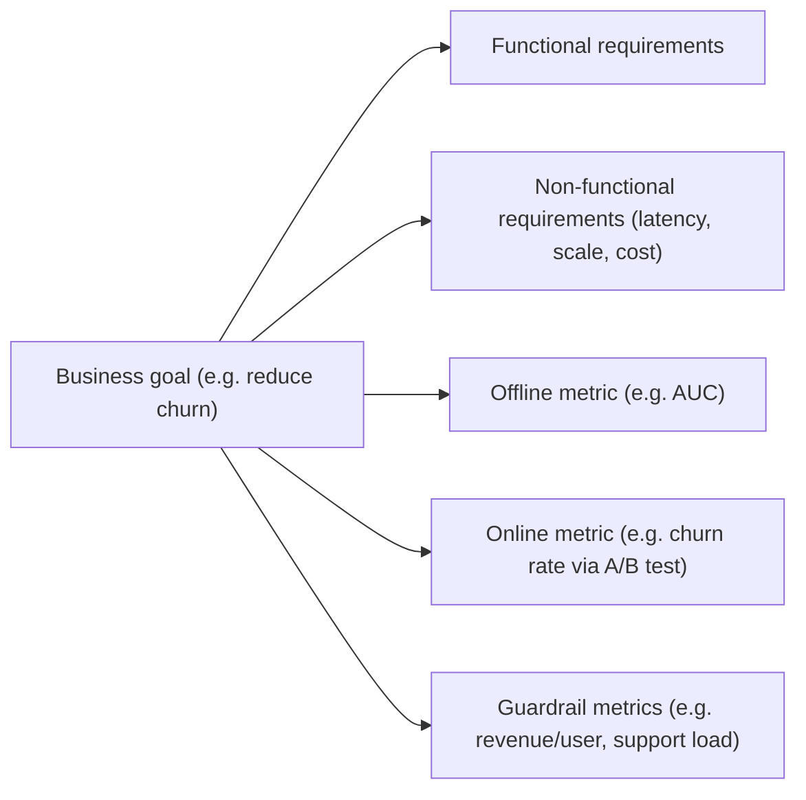

# Requirements & Metrics Definition

## TL;DR
Split requirements into **functional** (what the system must do) and **non-functional** (how well
— latency, availability, scale, cost). Then translate the business goal into exactly one **offline
metric** (evaluable on historical data) and one **online metric** (the real business KPI, measured
live) plus one or more **guardrail metrics** (things that must not get worse while you optimize the
primary metric). This translation step is the part interviewers use to separate "can build a model"
from "understands what the model is for."

## Intuition
A business stakeholder says "reduce churn." That's not a metric — it's a goal. Your job is to turn
it into something a model can be trained against (an offline metric, e.g. AUC predicting 30-day
churn) and something the business will actually judge success by (an online metric, e.g. realized
churn rate reduction over a quarter, measured via A/B test) — and to name what could go wrong as a
side effect (a guardrail: did overall customer satisfaction or revenue per user drop even as churn
went down, e.g. because the model triggers aggressive retention discounts that erode margin?).

## The maths
No formula defines "the right metric" — but the structure is precise:

$$
\text{business goal} \;\longrightarrow\; \underbrace{M_{\text{offline}}}_{\text{proxy, cheap, fast}} \;\;\text{and}\;\; \underbrace{M_{\text{online}}}_{\text{real KPI, expensive, slow}} \;\;\text{and}\;\; \underbrace{\{G_1, ..., G_k\}}_{\text{guardrails}}
$$

A design is only complete once you can state the (typically empirical, imperfect) relationship
between $M_{\text{offline}}$ and $M_{\text{online}}$: "we believe improving offline PR-AUC by X
correlates with an online conversion lift, validated by periodically checking that offline gains
translate to online gains in A/B tests — and if that correlation breaks down, the offline metric
needs to be revisited, not just re-optimized."

## Diagram


## Code
```text
Functional requirements example (fraud scoring system):
  - Score every transaction before payment authorization completes.
  - Return a risk score in [0, 1] plus a binary block/allow decision.
  - Support manual review queue for borderline scores.

Non-functional requirements example:
  - p99 latency < 150ms end-to-end (see latency-and-throughput-budgets).
  - 99.95% availability (payment path — high criticality).
  - Handle 5,000 transactions/sec at peak (throughput requirement).
  - Model retrainable weekly without a full redeploy (operational requirement).

Metrics example:
  - Offline: PR-AUC on held-out fraud/non-fraud labeled data (imbalanced classes).
  - Online: $ fraud losses prevented per week, measured via holdout/A-B comparison.
  - Guardrails: false-positive rate on legitimate transactions (don't block good customers),
    manual review queue size (don't overwhelm the ops team).
```

## In practice
- **Use it when:** the very first 10-15% of any ML system design discussion — before touching data
  or models. Also the exact skill needed when a PM hands you a vague ask in a real job.
- **Defaults that work:** always produce at least one guardrail metric alongside the primary
  metric — a design that only optimizes one number invites Goodhart's-law failure modes (the
  model "wins" on the metric while breaking something the metric doesn't capture). State
  non-functional requirements as concrete numbers (a latency budget in ms, an availability target
  in nines) rather than vague adjectives ("fast", "reliable").
- **Breaks when:** the offline metric is chosen for convenience (whatever's easiest to compute)
  rather than genuine correlation with the online metric — this is a recurring root cause of
  models that look great in evaluation and underperform in production.
- **Cost / latency:** non-functional requirements (latency/throughput/availability targets) directly
  drive architecture decisions later (batch vs. real-time serving, caching, model size) — get these
  numbers explicit early so later stages aren't retrofitted.

## Interview angle
**Q. The interviewer says "build a model to increase user engagement." How do you turn that into
metrics?**
First clarify what "engagement" means concretely in this product (session length? DAU/MAU? content
completion rate?) — don't assume. Then propose an offline metric that's cheaply computable from
logs (e.g. predicted click-through or predicted watch-time), an online metric that's the actual
target (e.g. 7-day retention or session count per user, measured via A/B test), and at least one
guardrail (e.g. content diversity, or complaint rate — engagement-optimizing models are notorious
for over-indexing on sensational/addictive content at the expense of these).

**Follow-up.** What if the offline metric improves in every experiment but the online metric never
moves?
→ That's a signal the offline proxy has stopped correlating with the real KPI — possibly because
the model has started overfitting to quirks of the offline metric (a Goodhart's law failure), or
the online effect is being masked by something else in the product. The fix is to revisit whether
the offline metric is still a valid proxy, not to keep optimizing it harder.

**Q. Give an example of a guardrail metric that, if ignored, would let a system "succeed" while
actually harming the business.**
A recommendation system optimized purely for click-through rate, with no guardrail on content
diversity or long-term retention, can converge toward clickbait/sensational content — CTR goes up,
but user trust and long-term engagement erode; the guardrail (e.g. diversity score, unsubscribe
rate, week-over-week retention) is what would have caught this before it shipped broadly.

**Q. Functional vs. non-functional requirement — give one example each for a search ranking system.**
Functional: given a query and a set of candidate documents, return a ranked list of the top-k most
relevant results. Non-functional: p95 end-to-end latency under 200ms, support 10k queries/sec at
peak, ranking model retrainable without full index rebuild.

**Q. How do you decide what the "right" offline metric is when several are plausible (e.g. AUC vs.
log-loss vs. precision@k for a ranking problem)?**
Choose the metric that most closely mirrors how the system is actually used and evaluated
downstream — e.g. precision@k for a system where users only see the top k results (ranking quality
at the head matters, not overall discrimination), vs. AUC when the full ranking/threshold-agnostic
discrimination is what matters. State this reasoning explicitly rather than defaulting to
whichever metric is most commonly cited in papers.

## Traps
- Treating "accuracy" as a default metric without checking class balance or business cost
  asymmetry — see [[classification-metrics]] and [[imbalanced-classification]].
- Optimizing a single metric with no guardrails — invites the metric-gaming failure mode described
  above.
- Confusing functional and non-functional requirements — e.g. listing "low latency" as a functional
  requirement; it's a non-functional constraint on how the functional requirement is delivered.
- Skipping the "how do offline and online metrics relate" question entirely — a design that never
  states this relationship hasn't actually connected modeling work to business impact.

## Flashcards
Functional vs non-functional requirement::Functional: what the system must do. Non-functional: how well (latency, scale, availability, cost).
What is a guardrail metric?::A metric that must not regress while optimizing the primary metric — catches unintended side effects (Goodhart's law failures).
Why do you need both an offline and an online metric?::Offline is a cheap, fast proxy for iteration; online is the real business KPI, validated via live measurement (e.g. A/B test) because it's expensive/slow to observe directly.
What should you do if offline metric gains stop translating to online gains?::Revisit whether the offline metric is still a valid proxy for the online KPI, rather than continuing to optimize it.
Example of a guardrail for an engagement-optimizing recommender::Content diversity score or unsubscribe/complaint rate, to catch clickbait-driven engagement gains that harm long-term trust.

## Related
[[ml-system-design-framework]]
[[classification-metrics]]
[[ab-testing-design]]
[[training-serving-skew]]
