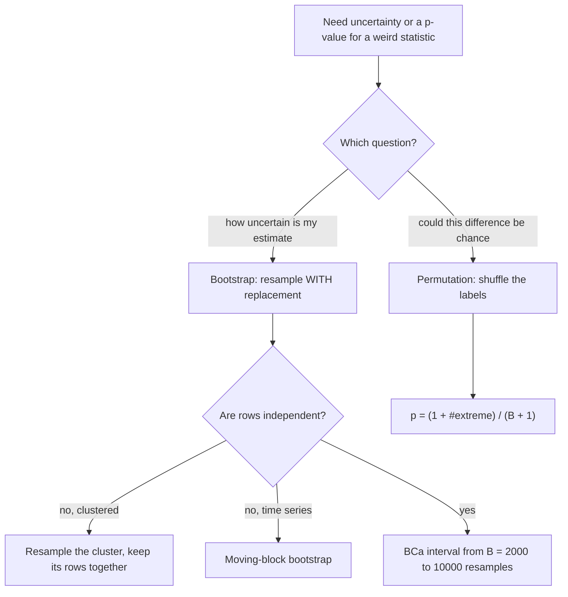

# Resampling — Bootstrap and Permutation

## TL;DR
When you cannot write down a sampling distribution, simulate one from the data. The **bootstrap**
resamples *with replacement* to estimate the variability of an estimator — use it for confidence
intervals on anything (a median, an AUC, a ratio, a 95th percentile). A **permutation test** shuffles
group *labels* to build the null distribution — use it for p-values. Bootstrap answers "how uncertain
is my estimate?"; permutation answers "could this difference be chance?"

## Intuition
You only have one sample, but that sample is your best available picture of the population. Treat it
as the population and draw from it repeatedly: the spread of your statistic across those draws
mimics the spread you would see across real repeated samples. For permutation the trick is
different — if the treatment did nothing, the labels are arbitrary, so every reshuffling is an
equally likely dataset, and the observed difference should sit unremarkably among them.

## The maths

**Bootstrap.** With data $X=(x_1,\dots,x_n)$ and statistic $\hat\theta=s(X)$, draw $B$ samples
$X^{*b}$ of size $n$ **with replacement** and compute $\hat\theta^{*b}=s(X^{*b})$. Then

$$
\widehat{\operatorname{se}}_{\text{boot}}
= \sqrt{\frac{1}{B-1}\sum_{b=1}^{B}\big(\hat\theta^{*b}-\bar{\theta^*}\big)^2}
$$

The justification is the *plug-in principle*: replace the unknown $F$ with the empirical
distribution $\hat F_n$, and appeal to $\hat F_n \to F$ (Glivenko–Cantelli).

**Interval flavours** (know that they differ, and why):
- **Percentile:** take the $2.5$th and $97.5$th percentiles of $\hat\theta^*$. Simple, transformation
  respecting, but biased when the estimator is biased or skewed.
- **Basic / reverse percentile:** $\big(2\hat\theta - \theta^*_{(0.975)},\ 2\hat\theta - \theta^*_{(0.025)}\big)$
  — reflects the bootstrap distribution around the estimate.
- **BCa** (bias-corrected and accelerated): adjusts the percentiles for bias and skewness, second-order
  accurate, and the default you should reach for. `scipy.stats.bootstrap(..., method="BCa")`.
- **Studentised:** most accurate, needs a variance estimate per resample (or a nested bootstrap) —
  expensive.

$\approx 1-e^{-1} \approx 63.2\%$ of the original observations appear in any given bootstrap
sample; the remaining ~36.8% are the **out-of-bag** rows, which is the mechanism behind OOB error in
[[random-forest]].

**Permutation test.** Under the null of exchangeability (the label carries no information), pool the
data, shuffle labels $B$ times, recompute the statistic $T^{*b}$, and

$$
p = \frac{1+\#\{|T^{*b}| \ge |T_{\text{obs}}|\}}{B+1}
$$

The $+1$ in both places is not cosmetic: it includes the observed arrangement in the null set and
prevents the impossible $p=0$. The minimum achievable p-value is $1/(B+1)$, so $B=999$ gives you
nothing below $0.001$ — size $B$ against the resolution you need.

Permutation tests are **exact** (finite-sample, no asymptotics) when exchangeability holds, work for
*any* statistic, and need no distributional assumption. The null they test is strict: identical
distributions, not merely equal means. With unequal variances a permutation test on the difference
in means has inflated type I error; permuting a studentised statistic (Welch's t) fixes it.

**Bootstrap vs permutation.**

| | Bootstrap | Permutation |
| --- | --- | --- |
| Resamples | With replacement, within group | Shuffle labels across groups |
| Answers | Uncertainty of an estimate (CI, SE) | Is the observed difference consistent with no effect (p-value) |
| Null assumed | None | Exchangeability under $H_0$ |
| Guarantee | Asymptotic | Exact when exchangeability holds |

**Clustered / hierarchical data.** Resample the **independent unit**, not the row. For sessions
nested in users, resample users and take all their sessions (the *cluster* or *block* bootstrap).
Resampling rows destroys the within-user correlation and produces intervals that are far too narrow —
the same unit-of-analysis error as in [[ab-testing-pitfalls]].

**Time series.** Ordinary bootstrap breaks autocorrelation. Use a **moving-block bootstrap**
(resample contiguous blocks of length $\ell$, with $\ell$ large enough to span the dependence) or
resample model residuals. Never i.i.d.-bootstrap a time series.

**Where it fails.** The bootstrap is inconsistent for statistics that depend on the extreme tail —
the sample maximum or minimum, and parameters on a boundary — because the empirical distribution has
no mass beyond the observed range. It is also unreliable at very small $n$ (with $n=8$ there are
only so many distinct resamples) and for heavy-tailed distributions with infinite variance.

## Diagram



## Code

```python
import numpy as np
from scipy import stats

rng = np.random.default_rng(0)

# ---------------------------------------------------------------------------
# 1. BOOTSTRAP a CI for the MEDIAN -- no closed form exists
# ---------------------------------------------------------------------------
x = rng.lognormal(3.0, 1.0, 500)          # skewed, e.g. session revenue

def boot(data, stat, B=10_000, rng=rng):
    n = len(data)
    idx = rng.integers(0, n, size=(B, n))
    return stat(data[idx], axis=1)

reps = boot(x, np.median)
print(f"median {np.median(x):.2f}  boot SE {reps.std(ddof=1):.2f}  "
      f"percentile CI {np.round(np.percentile(reps, [2.5, 97.5]), 2)}")

# scipy's version, with the BCa correction (the better default)
res = stats.bootstrap((x,), np.median, n_resamples=10_000,
                      confidence_level=0.95, method="BCa", random_state=0)
print("BCa CI", np.round([res.confidence_interval.low, res.confidence_interval.high], 2))

# ---------------------------------------------------------------------------
# 2. COVERAGE CHECK -- does the interval actually cover 95% of the time?
# ---------------------------------------------------------------------------
truth = np.exp(3.0)                        # median of lognormal(3, 1)
cover = 0
for _ in range(400):
    s = rng.lognormal(3.0, 1.0, 500)
    lo, hi = np.percentile(boot(s, np.median, B=1_000), [2.5, 97.5])
    cover += lo <= truth <= hi
print("percentile-bootstrap coverage:", cover / 400)     # ~0.95

# ---------------------------------------------------------------------------
# 3. BOOTSTRAP a RATIO METRIC, clustered at the user
# ---------------------------------------------------------------------------
n_users = 3_000
sessions = rng.poisson(4, n_users) + 1
revenue = rng.gamma(2, 25, n_users) * sessions

def cluster_boot_ratio(y, x, B=5_000, rng=rng):
    n = len(y)
    idx = rng.integers(0, n, size=(B, n))          # resample USERS, not sessions
    return y[idx].sum(axis=1) / x[idx].sum(axis=1)

r = cluster_boot_ratio(revenue, sessions)
print(f"revenue/session {revenue.sum()/sessions.sum():.3f} "
      f"CI {np.round(np.percentile(r, [2.5, 97.5]), 3)}")

# the WRONG way: bootstrap sessions as if they were independent rows
flat = np.repeat(revenue / sessions, sessions)      # per-session revenue
wrong = boot(flat, np.mean, B=2_000)
print(f"naive per-session CI {np.round(np.percentile(wrong, [2.5, 97.5]), 3)}  <- too narrow")

# ---------------------------------------------------------------------------
# 4. PERMUTATION TEST from scratch, then with scipy
# ---------------------------------------------------------------------------
a = rng.gamma(2, 30, 150)
b = rng.gamma(2, 34, 150)
obs = np.median(b) - np.median(a)

pooled = np.concatenate([a, b])
B = 10_000
null = np.empty(B)
for i in range(B):
    perm = rng.permutation(pooled)
    null[i] = np.median(perm[len(a):]) - np.median(perm[:len(a)])
p = (1 + np.sum(np.abs(null) >= abs(obs))) / (B + 1)
print(f"observed median diff {obs:.3f}  permutation p = {p:.4f}")

res = stats.permutation_test(
    (b, a), lambda u, v, axis: np.median(u, axis=axis) - np.median(v, axis=axis),
    permutation_type="independent", n_resamples=10_000,
    alternative="two-sided", random_state=0)
print("scipy permutation p =", round(res.pvalue, 4))

# ---------------------------------------------------------------------------
# 5. PERMUTATION IS CALIBRATED WHERE THE t-TEST IS NOT (tiny n, heavily skewed)
# ---------------------------------------------------------------------------
def fpr(test, reps=3_000, n=8, rng=rng):
    hits = 0
    for _ in range(reps):
        u, v = rng.lognormal(0, 1.5, n), rng.lognormal(0, 1.5, n)   # H0 is TRUE
        hits += test(u, v) < 0.05
    return hits / reps

t_test = lambda u, v: stats.ttest_ind(u, v, equal_var=False).pvalue
perm_t = lambda u, v: stats.permutation_test(
    (u, v), lambda p_, q_, axis: (p_.mean(axis=axis) - q_.mean(axis=axis)),
    permutation_type="independent", n_resamples=2_000, random_state=0).pvalue
print("n=8 lognormal  Welch FPR", fpr(t_test), " permutation FPR", fpr(perm_t))
# Welch comes out around 0.017 -- badly CONSERVATIVE on tiny skewed samples, so it
# quietly throws away power; the permutation test sits at the nominal 0.05.

# ---------------------------------------------------------------------------
# 6. OUT-OF-BAG: ~36.8% of rows are left out of each bootstrap sample
# ---------------------------------------------------------------------------
n = 10_000
in_bag = np.unique(rng.integers(0, n, n)).size / n
print(f"fraction in bag {in_bag:.3f}  theory {1 - np.exp(-1):.3f}")

# ---------------------------------------------------------------------------
# 7. BOOTSTRAP FAILS for the sample maximum
# ---------------------------------------------------------------------------
s = rng.uniform(0, 1, 200)
mx = boot(s, np.max)
print("bootstrap max distribution: unique values =", len(np.unique(mx)),
      " -- it can never exceed the observed max, so the CI is degenerate")
```

## In practice
- **Use it when:** there is no clean formula — medians, percentiles, ratios, AUC differences, Gini,
  a metric defined by a pipeline; or when $n$ is small and assumptions are shaky; or when you need
  a CI on a model-comparison metric computed on one test set.
- **Defaults that work:** $B=2{,}000$ for a standard error, $B\ge10{,}000$ for a 95% interval or a
  p-value you want resolved to three decimals. Use BCa for intervals. Set a seed and report $B$.
  For permutation p-values use the $(1+k)/(B+1)$ form.
- **Breaks when:** rows are not independent (use a cluster or block bootstrap), the statistic depends
  on the extremes, $n$ is tiny, or the underlying distribution has infinite variance. A bootstrap
  cannot manufacture information the sample does not contain — with $n=15$ the interval will be
  honest but wide, which is the correct answer, not a failure.
- **Cost / latency:** $O(B \cdot \text{cost of the statistic})$, embarrassingly parallel. A
  bootstrap over a Spark DataFrame is usually done by generating $B$ Poisson(1) weights per row
  (the "Poisson bootstrap") and computing all $B$ weighted statistics in one pass — the standard
  trick when the data do not fit on a driver.

> [!tip]
> The Poisson bootstrap is the answer to "how would you bootstrap a billion rows?" Instead of
> sampling indices, give each row a weight $w_b \sim \text{Poisson}(1)$ for each replicate $b$; for
> large $n$ this is equivalent to sampling with replacement and it needs one distributed pass.

## Interview angle

**Q. What is the bootstrap and when would you use it?**
Resample your data with replacement, recompute the statistic each time, and use the spread of those
values as the sampling distribution. I use it when no analytic formula exists or the assumptions
behind one are false — a CI on a median or a 95th-percentile latency, a CI on the difference in AUC
between two models, uncertainty on a ratio metric. It is a plug-in estimate: it substitutes the
empirical distribution for the true one, so it inherits whatever the sample got wrong.

**Q. Bootstrap or permutation test?**
Different questions. The bootstrap estimates the *variability of an estimate* and gives you a
confidence interval; it assumes no null. A permutation test builds the distribution of a statistic
*under the null of exchangeability* by shuffling labels, and gives you a p-value. If someone asks
"how big is the effect and how sure are we?", bootstrap. If they ask "is this difference real?",
permutation. You can report both.

**Q. Why is the bootstrap invalid for the sample maximum?**
Because the empirical distribution has no mass beyond the largest observed value, so no bootstrap
resample can ever exceed the observed maximum. The bootstrap distribution collapses onto a few
order statistics and the estimator is inconsistent. Extremes need extreme-value theory or
subsampling (the $m$-out-of-$n$ bootstrap), not the ordinary bootstrap.

**Q. You have 5,000 users with a variable number of sessions each. How do you bootstrap revenue per session?**
Resample **users** with replacement and carry all of each sampled user's sessions. The independent
unit is the user; sessions within a user are correlated, and resampling sessions treats correlated
observations as independent, which shrinks the interval dramatically. This is the cluster bootstrap,
and it is the resampling analogue of clustering the standard errors.

**Q. How many resamples do you need?**
Enough that the Monte-Carlo error is small relative to what you are reporting. $B\approx 2{,}000$
suffices for a standard error; for a 95% interval you are estimating tail quantiles, so $10{,}000$
is a better default. For a permutation p-value, the smallest achievable value is $1/(B+1)$ — if you
need to report $p<0.001$ you need at least $B=999$, realistically $10{,}000$.

**Q. Where does the 63.2% number come from and why does it matter?**
The probability a given row is *not* picked in $n$ draws with replacement is $(1-1/n)^n \to e^{-1}$,
so ~36.8% of rows are out-of-bag and ~63.2% are in-bag. Random forests use those out-of-bag rows for
a free validation estimate without a held-out set. It also tells you a bootstrap sample is not a
fresh dataset — it reuses a third of its rows more than once.

**Follow-up.** Can OOB error replace cross-validation? → For a rough estimate yes, and it is free.
But OOB assumes rows are i.i.d., so it is wrong under grouped or temporal structure, and it does not
exist for boosted models. For model selection in production I would still use a proper CV scheme —
see [[cross-validation]].

**Q. Does a permutation test have assumptions?**
One: exchangeability of the labels under the null. That is a strong null — identical distributions,
not just equal means. With unequal variances, permuting the raw mean difference has inflated type I
error, because the shuffled groups no longer have the right variances. The fix is to permute a
studentised statistic (Welch's t) rather than the raw difference.

## Traps
- **Bootstrapping rows when the independent unit is a user, store or session.** Intervals come out
  far too narrow.
- **i.i.d. bootstrapping a time series.** Destroys autocorrelation; use a block bootstrap or resample
  residuals.
- **Reporting a permutation $p = 0$.** Use $(1+k)/(B+1)$; $p=0$ is impossible.
- **Bootstrapping the training data and then evaluating on it.** Leakage — the whole point is the
  out-of-sample behaviour. Resample within a proper evaluation split.
- **Assuming the bootstrap fixes bias.** It estimates variability; a biased estimator stays biased,
  though the bootstrap can *estimate* the bias so you can subtract it (with a variance cost).
- **Using percentile intervals for a skewed or biased statistic** and not mentioning BCa exists.
- **Bootstrapping the maximum, minimum, or a parameter at a boundary.**
- **Confusing bootstrap resampling with cross-validation.** Bootstrap resamples to quantify
  uncertainty; CV partitions to estimate generalisation.

## Flashcards
Bootstrap in one line::Resample the data with replacement B times, recompute the statistic, and use the spread of those values as the sampling distribution.
Plug-in principle::Replace the unknown distribution F with the empirical distribution F̂ₙ and compute as if it were the truth.
Bootstrap interval flavours::Percentile, basic/reverse-percentile, BCa (bias-corrected and accelerated — the sensible default), and studentised.
Permutation test procedure::Shuffle the group labels B times, rebuild the statistic's null distribution, and compute p = (1 + #at-least-as-extreme)/(B + 1).
Why the +1 in a permutation p-value::It includes the observed arrangement in the null set and prevents an impossible p = 0; the floor is 1/(B+1).
Bootstrap vs permutation::Bootstrap quantifies the uncertainty of an estimate (CI); permutation tests a null hypothesis (p-value) under exchangeability.
Fraction of rows out-of-bag::(1 − 1/n)ⁿ → e⁻¹ ≈ 36.8% out, 63.2% in — the basis of random-forest OOB error.
Bootstrapping clustered data::Resample the independent unit (the user) and keep all its rows; resampling rows makes the interval far too narrow.
Bootstrapping a time series::Use a moving-block bootstrap or resample model residuals — the i.i.d. bootstrap destroys autocorrelation.
Where the bootstrap is inconsistent::Statistics driven by the extremes (sample max/min) and boundary parameters — the empirical distribution has no mass past the observed range.
Permutation test assumption::Exchangeability under H₀ — a strong null of identical distributions; permute a studentised statistic when variances differ.
Poisson bootstrap::Give each row a Poisson(1) weight per replicate instead of sampling indices — one distributed pass over billions of rows.

## Related
- [[confidence-intervals]]
- [[common-statistical-tests]]
- [[hypothesis-testing]]
- [[cross-validation]]
- [[random-forest]]
- [[sampling-and-sampling-distributions]]
- [[ab-testing-design]]
- [[moc-stats]]
