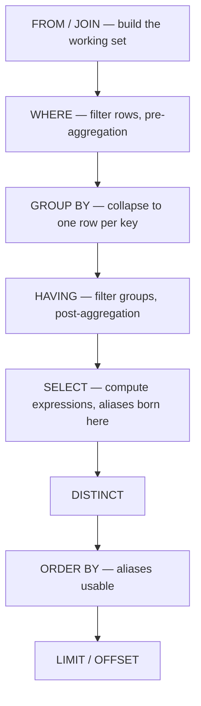

# SQL Fundamentals — Logical Order and NULL Semantics

## TL;DR
SQL is declarative: you describe the result, the engine picks the plan. But every query has a fixed
*logical* evaluation order — `FROM → WHERE → GROUP BY → HAVING → SELECT → ORDER BY → LIMIT` — and
almost every "why doesn't this work" moment is a violation of it. The second source of confusion is
`NULL`: it is not a value, it is *unknown*, and comparisons against it return `UNKNOWN`, not `FALSE`.

## Intuition
Think of a query as an assembly line with seven stations, each consuming the output of the previous
one. `SELECT` sits at station five. That single fact explains why you cannot use a column alias in
`WHERE` (the alias does not exist yet) but you *can* use it in `ORDER BY` (it does by then).

NULL is the empty seat at a table, not a person named "Empty". You cannot ask whether the empty seat
is taller than 1.7 m; the answer is neither yes nor no.

## The maths

**Three-valued logic.** SQL predicates evaluate to `TRUE`, `FALSE`, or `UNKNOWN`. Let $T$, $F$, $U$
denote these. The truth tables:

| `AND` | T | F | U |
|---|---|---|---|
| **T** | T | F | U |
| **F** | F | F | F |
| **U** | U | F | U |

| `OR` | T | F | U |
|---|---|---|---|
| **T** | T | T | T |
| **F** | T | F | U |
| **U** | T | U | U |

`NOT U = U`. And `WHERE` keeps a row only when the predicate is exactly `TRUE` — `UNKNOWN` rows are
discarded just like `FALSE` ones. That asymmetry is the whole trap: `WHERE x = 1` and
`WHERE NOT (x = 1)` together do **not** cover all rows, because rows with `x IS NULL` fall out of both.

**Relational algebra mapping.** A basic query is a composition:

$$
\pi_{\text{SELECT}}\Big(\sigma_{\text{HAVING}}\big(\gamma_{\text{GROUP BY}}(\sigma_{\text{WHERE}}(R \bowtie S))\big)\Big)
$$

where $\sigma$ is selection (filtering), $\pi$ is projection (choosing columns), $\gamma$ is
grouping/aggregation, and $\bowtie$ is a join. The nesting order *is* the logical order — read it
inside-out.

**Cardinality.** If $|R| = n$ and $|S| = m$, a cross join gives $nm$ rows; `WHERE` can only reduce
cardinality; `GROUP BY` on $k$ distinct key combinations produces exactly $k$ rows; `SELECT` never
changes row count (window functions included — they add columns, not rows).

## Diagram



## Code

```sql
-- Logical order in action. Databricks / Spark SQL and Postgres both run this.
SELECT
    c.country,
    COUNT(*)                       AS order_count,
    SUM(o.amount)                  AS gross,
    AVG(o.amount)                  AS avg_order
FROM orders o
JOIN customers c
  ON c.customer_id = o.customer_id       -- 1. FROM/JOIN
WHERE o.order_date >= DATE '2026-01-01'  -- 2. WHERE: row filter, uses raw columns only
GROUP BY c.country                       -- 3. GROUP BY
HAVING SUM(o.amount) > 100000            -- 4. HAVING: group filter, uses aggregates
ORDER BY gross DESC                      -- 6. ORDER BY: alias 'gross' is legal here
LIMIT 10;                                -- 7. LIMIT
```

```sql
-- NULL semantics, three ways that matter.
SELECT
    NULL = NULL              AS eq_null,        -- NULL (unknown), NOT true
    NULL IS NULL             AS is_null,        -- true
    COALESCE(NULL, NULL, 7)  AS first_non_null, -- 7
    NULLIF(5, 5)             AS nullif_same;    -- NULL

-- Aggregates ignore NULL, except COUNT(*)
SELECT
    COUNT(*)        AS all_rows,      -- counts every row
    COUNT(amount)   AS non_null_amt,  -- skips NULLs
    AVG(amount)     AS avg_amt        -- SUM(non-null)/COUNT(non-null), NOT /COUNT(*)
FROM orders;
```

```python
# Same semantics through PySpark — useful when the interview is a Databricks screen.
from pyspark.sql import functions as F

(orders
 .filter(F.col("order_date") >= "2026-01-01")
 .join(customers, "customer_id")
 .groupBy("country")
 .agg(F.count("*").alias("order_count"),
      F.sum("amount").alias("gross"))
 .filter(F.col("gross") > 100000)      # this is HAVING
 .orderBy(F.desc("gross"))
 .limit(10))
```

## In practice
- **Use it when:** always — this is the mental model you debug every query with. When a query returns
  the wrong count, walk the seven stations in order and ask which one changed cardinality.
- **Defaults that work:** filter as early as possible (`WHERE`, not `HAVING`); `COALESCE` at the point
  of use rather than mass-imputing a table; write `IS NOT DISTINCT FROM` (Postgres) or `<=>` (Spark)
  when you genuinely want NULL-safe equality.
- **Breaks when:** you assume `WHERE` and `HAVING` are interchangeable (they are not — `HAVING` can
  see aggregates, `WHERE` cannot), or you rely on a column alias in `WHERE` / `GROUP BY`. Postgres and
  Spark both reject an alias in `WHERE`; MySQL permissively allows it in `GROUP BY`/`HAVING`, which is
  exactly the habit that fails in an interview on a different engine.
- **Dialect differences that bite:**
  - String concatenation: `||` in Postgres and Spark SQL; `CONCAT()` works in both — prefer `CONCAT`.
  - Integer division: `5/2 = 2` in Postgres (integer types), `2.5` in Spark SQL. Cast explicitly.
  - `ORDER BY` NULL placement: Postgres puts NULLs last ascending; Spark puts them first ascending.
    Always write `NULLS LAST` / `NULLS FIRST` when it matters.
  - `GROUP BY 1, 2` (ordinal references) works in both but is banned in many style guides. Fine for a
    whiteboard, name the columns in production code.

## Interview angle

**Q. Why can't I use a `SELECT` alias in the `WHERE` clause?**
Because `WHERE` is evaluated logically before `SELECT`. At the time the row filter runs, the
projection list has not been computed, so the alias does not exist. Repeat the expression in `WHERE`,
or wrap the query in a CTE and filter outside it.

**Follow-up.** *Then why does it work in `ORDER BY`?* → `ORDER BY` runs after `SELECT`, so the alias is
in scope. Same reason `ORDER BY` can sort by a computed column that `WHERE` cannot filter on.

**Q. What is the difference between `WHERE` and `HAVING`?**
`WHERE` filters individual rows before grouping and cannot reference aggregate functions. `HAVING`
filters groups after aggregation and is the only place aggregates can appear in a predicate. If a
condition can be expressed in `WHERE`, put it there — filtering fewer rows into the aggregation is
strictly cheaper.

**Q. `COUNT(*)` vs `COUNT(col)` vs `COUNT(DISTINCT col)`?**
`COUNT(*)` counts rows including those where every column is NULL. `COUNT(col)` counts rows where
`col IS NOT NULL`. `COUNT(DISTINCT col)` counts distinct non-NULL values. A common bug: reporting
"number of customers" as `COUNT(*)` after a join that duplicated customers.

**Q. Why does `SELECT * FROM t WHERE status <> 'active'` miss rows?**
Rows where `status IS NULL` evaluate the predicate to `UNKNOWN`, and `WHERE` keeps only `TRUE`. Write
`WHERE status IS DISTINCT FROM 'active'` in Postgres, or `WHERE status <> 'active' OR status IS NULL`
portably.

**Follow-up.** *How would you find that bug in a big table?* → Compare
`COUNT(*)` against `COUNT(status)`; the gap is the NULL count you are silently dropping.

**Q. Does a window function change the number of rows?**
No. Window functions are computed at the `SELECT` stage and return one value per input row. That is
precisely why you cannot filter on a window function in `WHERE` — you must wrap it in a subquery or
CTE first. See [[window-functions]].

## Traps
- **"`NULL = NULL` is true."** Wrong — it is `UNKNOWN`. Use `IS NULL`, or `IS NOT DISTINCT FROM`
  (Postgres) / `<=>` (Spark) for NULL-safe equality.
- **"`AVG` divides by the row count."** Wrong — it divides by the count of non-NULL values. If you want
  NULLs treated as zero, write `SUM(COALESCE(x, 0)) / COUNT(*)` explicitly.
- **"`WHERE` runs first so it's always fastest."** The *logical* order is fixed; the *physical* plan is
  the optimiser's choice and may reorder freely. Logical order explains semantics, not performance.
  See [[sql-query-optimization]].
- **"`SELECT DISTINCT` is a free way to fix duplicates."** It hides a join that multiplied rows instead
  of fixing it, and it forces a sort or hash over the whole result. Find the fan-out first —
  see [[joins-deep-dive]].
- **"`GROUP BY` guarantees sorted output."** It does not, on any modern engine. Spark certainly will
  not. Add an explicit `ORDER BY`.
- **"Every non-aggregated column in `SELECT` must be in `GROUP BY` — that's just pedantry."** It is the
  standard, and Postgres and Spark both enforce it (Postgres relaxes it only when you group by a
  primary key). MySQL's old permissive mode returns an arbitrary row and is a data-correctness bug.

## Flashcards
What is SQL's logical order of evaluation?::FROM/JOIN → WHERE → GROUP BY → HAVING → SELECT → DISTINCT → ORDER BY → LIMIT
Why can ORDER BY use a SELECT alias but WHERE cannot?::ORDER BY is evaluated after SELECT, so the alias exists; WHERE runs before SELECT.
What does `NULL = NULL` evaluate to?::UNKNOWN — not TRUE and not FALSE. WHERE keeps only TRUE, so the row is dropped.
Difference between COUNT(*) and COUNT(col)?::COUNT(*) counts all rows; COUNT(col) counts only rows where col IS NOT NULL.
What does AVG(x) divide by?::The count of non-NULL x values, not the total row count.
WHERE vs HAVING?::WHERE filters rows before grouping and cannot see aggregates; HAVING filters groups after aggregation and can.
NULL-safe equality operator in Postgres and in Spark SQL?::`IS NOT DISTINCT FROM` in Postgres; `<=>` in Spark SQL.
Do window functions change row count?::No — they add a column per input row, which is why they cannot be filtered in WHERE.

## Related
- [[joins-deep-dive]]
- [[aggregations-and-grouping]]
- [[window-functions]]
- [[subqueries-and-ctes]]
- [[sql-query-optimization]]
- [[moc-sql]]
- [[qbank-sql]]
- [[drill-sql-problems]]
