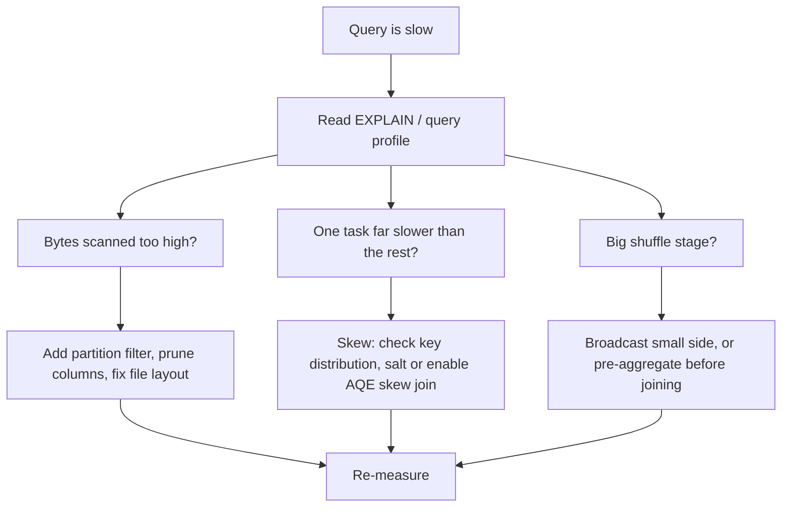

# SQL Query Optimization

## TL;DR
Optimisation is almost always about reading less data and shuffling less data. Read less: predicate
pushdown, partition pruning, column pruning, file layout. Shuffle less: broadcast the small side,
pre-aggregate before joining, and fix skew with salting. Everything else — index choice in a warehouse,
`EXPLAIN` reading, statistics — is in service of those two.

## Intuition
A query has two budgets: bytes scanned and bytes moved across the network. A warehouse optimiser
minimises the first with indexes and the second with join strategy. A lakehouse engine like Spark has
no indexes worth the name, so it minimises the first with *file layout* — partitioning, file size,
data skipping statistics — and the second with broadcast joins. Same two budgets, different levers.

## The maths

**Join cost.** For relations of sizes $n$ and $m$:

| Strategy | Cost | When chosen |
|---|---|---|
| Broadcast hash join | $O(n + m)$, ship $m$ to every executor | $m$ fits in executor memory |
| Shuffle hash join | $O(n + m)$ + shuffle of both sides | both large, one side hashable |
| Sort-merge join | $O(n \log n + m \log m)$ + shuffle | both large, sortable keys |
| Nested loop | $O(nm)$ | non-equi join conditions |

With $E$ executors, broadcasting costs $E \cdot m$ bytes of network but **zero** shuffle of the large
side. A shuffle moves roughly $n + m$ bytes plus a sort. So the break-even is when $E \cdot m \ll n$ —
which is why broadcasting a 50 MB dimension against a 2 TB fact is an easy win, and broadcasting a
5 GB table across 200 executors is not.

**Skew.** If key $v$ holds fraction $p$ of all rows, the task handling $v$ does $p \cdot n$ work while
the average task does $n / T$ for $T$ tasks. The job's wall time is set by the slowest task, so the
slowdown factor versus a perfectly balanced job is

$$
\text{slowdown} \approx \frac{p \cdot n}{n / T} = p \, T
$$

With $T = 200$ tasks and one key holding $p = 0.3$ of the data, that straggler is ~60× the balanced
task. **Salting** splits the hot key into $s$ synthetic sub-keys, reducing the factor to
$\approx p T / s$ at the cost of replicating the other side of the join $s$ times.

**Selectivity and pruning.** If a predicate has selectivity $\sigma \in (0, 1]$ and the table is
partitioned on that column into $P$ partitions, partition pruning reads $\lceil \sigma P \rceil$
partitions instead of $P$ — a reduction in *bytes scanned*, which is the metric you are billed on in
both a warehouse and on Databricks. Predicate pushdown without partitioning still reads all files but
skips row groups whose min/max statistics exclude the predicate — effective only if the data is
*clustered* on that column, which is why `OPTIMIZE ... ZORDER BY` (or liquid clustering) matters.

## Diagram



## Code

```sql
-- Reading the plan. Postgres: actual timings and row estimates vs reality.
EXPLAIN (ANALYZE, BUFFERS)
SELECT c.country, SUM(o.amount)
FROM orders o JOIN customers c ON c.customer_id = o.customer_id
WHERE o.order_date >= DATE '2026-01-01'
GROUP BY c.country;
-- What to look for, in order:
--   1. Seq Scan on a large table where you expected an Index Scan.
--   2. "rows=1000" estimated vs "actual rows=4000000" — stale statistics; run ANALYZE.
--   3. Nested Loop over a large outer side — usually a bad estimate upstream.
--   4. "Sort Method: external merge  Disk: 480MB" — spilling; raise work_mem or reduce rows.

-- Spark / Databricks:
EXPLAIN FORMATTED
SELECT ...;
-- Look for: PartitionFilters (pruning is happening), PushedFilters (pushdown reached
-- the file reader), BroadcastHashJoin vs SortMergeExchange, and Exchange nodes
-- (each Exchange is a shuffle).
```

```sql
-- Predicate pushdown and partition pruning. Table partitioned by event_date.
-- GOOD: the literal comparison on the partition column prunes partitions.
SELECT * FROM events WHERE event_date >= DATE '2026-09-01';

-- BAD: wrapping the partition column in a function defeats pruning on many engines,
-- because the optimiser cannot invert the expression.
SELECT * FROM events WHERE YEAR(event_date) = 2026;     -- may scan everything
-- Rewrite as a range on the raw column:
SELECT * FROM events
WHERE event_date >= DATE '2026-01-01' AND event_date < DATE '2027-01-01';

-- Same principle in Postgres: a function on an indexed column kills the index
-- unless you built a matching expression index.
CREATE INDEX idx_orders_date ON orders (order_date);
-- SELECT ... WHERE DATE_TRUNC('month', order_date) = '2026-09-01'  -- no index use
CREATE INDEX idx_orders_month ON orders ((DATE_TRUNC('month', order_date)));  -- now it can
```

```sql
-- Join strategy hints in Spark SQL. Prefer letting AQE decide; hint when you know better.
SELECT /*+ BROADCAST(d) */ f.*, d.dept_name
FROM fact_events f
JOIN dim_department d ON d.dept_id = f.dept_id;
-- Also available: MERGE (sort-merge), SHUFFLE_HASH, SHUFFLE_REPLICATE_NL.
-- Postgres has no join hints in core; you influence it via statistics,
-- enable_* GUCs for testing, and query shape.
```

```sql
-- Salting a skewed join by hand. Use when AQE's automatic skew handling is not enough,
-- or when the skew is on the build side of a broadcast you cannot use.
WITH salted_fact AS (
    SELECT f.*,
           CONCAT(CAST(f.user_id AS STRING), '_',
                  CAST(FLOOR(RAND() * 10) AS INT)) AS salted_key
    FROM fact_events f
),
exploded_dim AS (
    SELECT d.*, CONCAT(CAST(d.user_id AS STRING), '_', CAST(s.n AS INT)) AS salted_key
    FROM dim_user d
    CROSS JOIN (SELECT EXPLODE(SEQUENCE(0, 9)) AS n) s   -- replicate dim 10x
)
SELECT f.*, e.segment
FROM salted_fact f
JOIN exploded_dim e ON e.salted_key = f.salted_key;
-- Cost: the dimension is 10x larger. Only worth it when one key dominates.
```

```sql
-- Pre-aggregate before joining: reduces both shuffle volume and fan-out risk.
-- Slow: join 2B fact rows to 50M customers, then aggregate.
-- Fast: aggregate the fact to one row per customer first, then join.
WITH per_customer AS (
    SELECT customer_id, SUM(amount) AS revenue, COUNT(*) AS n
    FROM orders
    WHERE order_date >= DATE '2026-01-01'
    GROUP BY customer_id
)
SELECT c.segment, SUM(p.revenue) AS revenue
FROM per_customer p
JOIN customers c ON c.customer_id = p.customer_id
GROUP BY c.segment;
```

```sql
-- Delta Lake / Databricks file layout — the lakehouse replacement for indexes.
OPTIMIZE events WHERE event_date >= '2026-09-01';   -- compact small files
ANALYZE TABLE events COMPUTE STATISTICS FOR ALL COLUMNS;  -- feed the cost-based optimiser
-- Clustering on high-cardinality filter columns improves data skipping
-- (ZORDER on older runtimes, liquid clustering on newer ones).
```

```python
# Spark knobs worth naming in an interview. Values here are the defaults to reason about,
# not magic numbers to memorise.
spark.conf.set("spark.sql.adaptive.enabled", "true")           # AQE: coalesce partitions,
spark.conf.set("spark.sql.adaptive.skewJoin.enabled", "true")  # split skewed partitions,
                                                               # switch to broadcast at runtime
spark.conf.get("spark.sql.autoBroadcastJoinThreshold")         # size below which Spark broadcasts
```

## In practice
- **Use it when:** a query is slow, expensive, or spilling. Measure first — `EXPLAIN ANALYZE` in
  Postgres, the Spark UI / query profile on Databricks. Optimising without a plan is guessing.
- **Defaults that work:**
  - Filter on the partition column with a literal range, never inside a function.
  - Select only the columns you need — with Parquet/Delta, column pruning is nearly free savings.
  - Let AQE handle partition coalescing and most skew; hint `BROADCAST` when you know a dimension is
    small and Spark's size estimate is wrong (common after a chain of transformations).
  - Keep statistics fresh: `ANALYZE` in Postgres, `ANALYZE TABLE ... COMPUTE STATISTICS` in Spark. A
    bad row estimate is the root cause of most bad plans.
- **Breaks when:** you partition on a high-cardinality column. Partitioning `events` by `user_id`
  creates millions of tiny files and makes everything slower — the small-file problem. Partition on a
  low-cardinality column you filter on (usually date), and cluster on the high-cardinality one.
- **Cost / latency:** in a cloud warehouse and on Databricks you are billed roughly by bytes scanned
  and compute-seconds, so pruning is a direct cost reduction, not just a latency one. See
  [[cost-optimization-for-ml]].

**Warehouse vs lakehouse — the comparison interviewers want:**

| Lever | Classic warehouse (Postgres, RDBMS) | Lakehouse (Spark / Delta) |
|---|---|---|
| Skip rows | B-tree / bitmap indexes | Partition pruning + file-level min/max stats |
| Physical order | Clustered index | Clustering / ZORDER, compaction via `OPTIMIZE` |
| Small reads | Index seek, microseconds | No point lookups — full file scans, seconds |
| Join choice | Cost-based, no hints in core Postgres | Broadcast vs sort-merge, hints + AQE available |
| Update cost | In-place row update | Copy-on-write file rewrite (or deletion vectors) |
| Stats | `ANALYZE`, autovacuum | `ANALYZE TABLE`, Delta log statistics |

The one-line version: a warehouse optimises access paths, a lakehouse optimises file layout.

## Interview angle

**Q. A join between a 2 TB fact table and a 40 MB dimension is taking 40 minutes. What do you do?**
Check whether it is doing a sort-merge join. A 40 MB table should be broadcast, which eliminates the
shuffle of the 2 TB side entirely. Spark broadcasts automatically below a size threshold, but the
estimate is often wrong when the dimension is the output of upstream transformations rather than a
plain table read — then I add a `BROADCAST` hint or `ANALYZE` the table so the estimate is accurate.

**Follow-up.** *When would you not broadcast?* → When the small side is not actually small at runtime
(it will OOM the driver collecting it, or the executors holding it), or when the join is repeated
against many partitions such that the broadcast cost times the number of stages exceeds a single
shuffle. Broadcasting a multi-GB table across hundreds of executors is a classic self-inflicted OOM.

**Q. What is predicate pushdown, and how do you break it?**
The optimiser moves filters as close to the data source as possible, so the file reader skips row
groups using min/max statistics rather than materialising rows and filtering later. You break it by
wrapping the column in a function (`YEAR(dt) = 2026`), by casting a column instead of the literal, or by
filtering on a derived column that only exists after a join or aggregation. Fix: express the predicate
as a range on the raw column.

**Q. One task in your Spark stage runs for 45 minutes while the other 199 finish in 30 seconds. Diagnose.**
Data skew: one join or group key holds a disproportionate share of rows. Confirm with
`SELECT key, COUNT(*) FROM t GROUP BY key ORDER BY 2 DESC LIMIT 20`. In Indian consumer data this is
often a sentinel — a default `user_id` or an `'UNKNOWN'` city that absorbs all the nulls. Fixes in
order: filter or handle the sentinel separately; enable AQE skew join, which splits the oversized
partition; broadcast the other side if it is small; salt the key if none of that applies.

**Follow-up.** *What does salting cost?* → You replicate the non-skewed side by the salt factor, so a
10× salt makes the dimension 10× larger and the join proportionally more expensive on that side. It
pays only when the straggler dominates wall time.

**Q. What do you look at first in `EXPLAIN ANALYZE`?**
The gap between estimated and actual rows. If the planner thought 1,000 rows and got 4 million, every
downstream choice — nested loop instead of hash join, no materialisation — was made on bad information,
and the fix is statistics, not the query. After that: sequential scans on large tables where an index
should apply, and any sort spilling to disk.

**Q. Do indexes exist in a lakehouse?**
Not in the B-tree sense. Delta keeps per-file min/max statistics, so a filter can skip whole files, but
only if the data is physically clustered on that column — otherwise every file's range covers every
value and nothing is skipped. So the lakehouse equivalent of index tuning is `OPTIMIZE` plus clustering
on the columns you filter by, and choosing partition columns with low cardinality. See [[delta-lake]]
and [[partitioning-and-shuffling]].

**Q. `SELECT COUNT(*)` on a 5 TB table returns in a second. Why?**
Because it never reads the data. Parquet footers and the Delta transaction log carry row counts per
file, so the engine sums metadata. Change it to `COUNT(DISTINCT user_id)` and it becomes a full scan
plus a shuffle — a good illustration that "table size" is not the cost driver, "bytes actually read" is.

## Traps
- **"Add an index" as the universal answer.** Wrong in a lakehouse (no such thing) and often wrong in a
  warehouse — an index on a low-selectivity column is ignored, and every index slows writes. Ask what
  the plan says first.
- **"More partitions is better."** Over-partitioning produces the small-file problem: thousands of tiny
  files, each costing a file-open, and metadata operations that dominate the job. Aim for
  reasonably-sized files (hundreds of MB), not maximum partition count.
- **"`SELECT *` is fine, the engine prunes it."** It cannot prune what you asked for. With columnar
  storage, selecting 5 of 200 columns can be an order of magnitude less I/O.
- **"`DISTINCT` is cheap."** It is a shuffle plus a sort or hash over the full result. `DISTINCT` used to
  paper over a join fan-out is paying twice for a bug. See [[joins-deep-dive]].
- **"Rewriting a subquery as a join always speeds it up."** The optimiser usually decorrelates already.
  Rewrite for readability and predictability, then measure.
- **"AQE handles skew, so I don't need to think about it."** AQE splits oversized *shuffle* partitions,
  which helps a lot, but it cannot fix skew caused by a sentinel key in a broadcast-free plan, and it
  does not help skew inside a window partition.
- **"Caching makes it faster."** Caching an input you read once wastes memory and can evict something
  useful. Cache when a dataset is genuinely reused across several actions — remember Spark inlines
  CTEs, so a multi-referenced CTE is recomputed, and *that* is a legitimate cache candidate. See
  [[subqueries-and-ctes]].
- **"`ORDER BY` in a subquery is preserved."** It is not guaranteed, and in Spark an `ORDER BY` without
  a `LIMIT` inside a subquery forces a full sort you then throw away.

## Flashcards
Two budgets every query optimisation targets?::Bytes scanned (read less) and bytes shuffled (move less).
When is a broadcast join the right choice?::When one side fits comfortably in executor memory — it removes the shuffle of the large side entirely, costing E copies of the small side.
What breaks predicate pushdown / partition pruning?::Wrapping the partition or indexed column in a function, or casting the column instead of the literal.
How does salting fix skew and what does it cost?::It splits the hot key into s synthetic sub-keys, cutting the straggler factor by ~s, at the cost of replicating the other side s times.
First thing to check in EXPLAIN ANALYZE?::The gap between estimated and actual row counts — stale statistics cause most bad plans.
Lakehouse equivalent of an index?::Partition pruning plus per-file min/max statistics, which only skip files if the data is clustered on that column — hence OPTIMIZE and ZORDER/liquid clustering.
Why is COUNT(*) on a huge Delta table instant?::It is answered from Parquet footer / transaction-log metadata without reading the data.
What is the small-file problem?::Over-partitioning creates many tiny files, so per-file overhead and metadata dominate; fix with OPTIMIZE / compaction and lower-cardinality partition columns.
Marker for a shuffle in a Spark physical plan?::An Exchange node — count them, each one is a network round of the data.

## Related
- [[joins-deep-dive]]
- [[aggregations-and-grouping]]
- [[subqueries-and-ctes]]
- [[window-functions]]
- [[spark-performance-tuning]]
- [[partitioning-and-shuffling]]
- [[delta-lake]]
- [[warehouse-vs-lake-vs-lakehouse]]
- [[file-formats-parquet-avro]]
- [[cost-optimization-for-ml]]
- [[moc-sql]]
