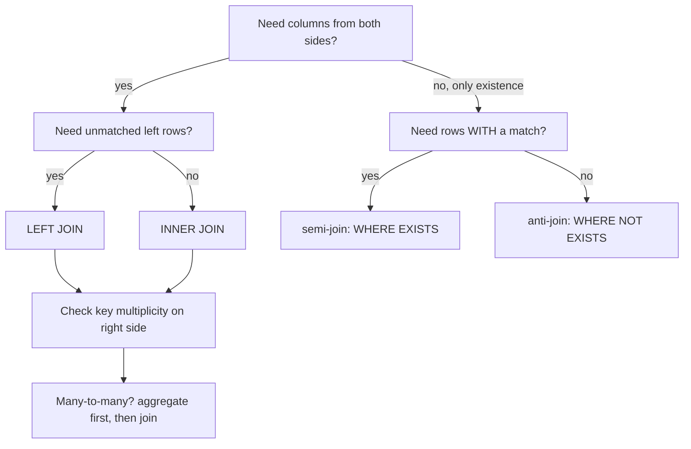

# Joins Deep Dive

## TL;DR
A join is a filtered cross product. Its row count is governed by key multiplicity, not by join type:
a many-to-many join multiplies rows and silently inflates every downstream `SUM`. Know the four
outer/inner variants cold, and know the two ways to express "rows in A not in B" — `NOT EXISTS`
(safe) and `NOT IN` (breaks on NULL).

## Intuition
Picture two decks of cards laid on a table. An inner join pairs cards that match on a key and throws
away loners. A left join keeps every card from the left deck, pairing it with NULLs when nothing
matches. The dangerous part is not the loners — it is that if the right deck holds *three* cards with
the same key, each left card comes back three times.

## The maths

Let $R$ and $S$ be relations with join key $k$. For key value $v$, let $r_v$ be the number of rows in
$R$ with $k = v$ and $s_v$ the count in $S$. The inner join produces

$$
\lvert R \bowtie S \rvert = \sum_{v \in K_R \cap K_S} r_v \cdot s_v
$$

where $K_R$, $K_S$ are the key sets. Three regimes follow:

- **one-to-one** ($r_v = s_v = 1$): row count preserved.
- **one-to-many** ($r_v = 1$): row count becomes $\sum s_v$ — the left side is *fanned out*.
- **many-to-many** ($r_v, s_v > 1$): quadratic blow-up per key. This is the row-multiplication bug.

Left join adds the unmatched left rows:

$$
\lvert R \mathbin{⟕} S \rvert = \sum_{v \in K_R \cap K_S} r_v s_v \;+\; \sum_{v \in K_R \setminus K_S} r_v
$$

A **semi-join** $R \ltimes S$ keeps rows of $R$ having at least one match, with no fan-out:
$\lvert R \ltimes S \rvert = \sum_{v \in K_R \cap K_S} r_v$. An **anti-join** $R \triangleright S$ is its
complement: $\sum_{v \in K_R \setminus K_S} r_v$. Both preserve $R$'s cardinality bound — that is
exactly why you reach for them instead of a join plus `DISTINCT`.

## Worked table

`employees`

| emp_id | name | dept_id |
|---|---|---|
| 1 | Asha | 10 |
| 2 | Bala | 20 |
| 3 | Chetan | NULL |

`departments`

| dept_id | dept_name |
|---|---|
| 10 | Data |
| 30 | Finance |

| Join | Result rows |
|---|---|
| `INNER` | Asha–Data |
| `LEFT` | Asha–Data, Bala–NULL, Chetan–NULL |
| `RIGHT` | Asha–Data, NULL–Finance |
| `FULL OUTER` | Asha–Data, Bala–NULL, Chetan–NULL, NULL–Finance |
| `CROSS` | 3 × 2 = 6 rows |

Note Chetan: a NULL key never matches anything, not even another NULL, so he behaves exactly like an
unmatched key.

## Diagram



## Code

```sql
-- The four core joins, ANSI, runs on Postgres and Spark SQL alike.
SELECT e.name, d.dept_name
FROM employees e
INNER JOIN departments d ON d.dept_id = e.dept_id;

SELECT e.name, d.dept_name
FROM employees e
LEFT JOIN departments d ON d.dept_id = e.dept_id;

SELECT e.name, d.dept_name
FROM employees e
FULL OUTER JOIN departments d ON d.dept_id = e.dept_id;

SELECT e.name, d.dept_name
FROM employees e
CROSS JOIN departments d;                 -- deliberate cartesian product
```

```sql
-- Anti-join, three ways. Only two of them are correct.

-- 1. NOT EXISTS — correct and NULL-safe. Prefer this.
SELECT e.*
FROM employees e
WHERE NOT EXISTS (
    SELECT 1 FROM departments d WHERE d.dept_id = e.dept_id
);

-- 2. LEFT JOIN ... IS NULL — correct, and often what the planner rewrites (1) into anyway.
SELECT e.*
FROM employees e
LEFT JOIN departments d ON d.dept_id = e.dept_id
WHERE d.dept_id IS NULL;

-- 3. NOT IN — THE NULL TRAP. If the subquery returns even one NULL,
--    the whole result is empty, because `x NOT IN (10, NULL)` is
--    NOT (x = 10 OR x = NULL) = NOT (FALSE OR UNKNOWN) = UNKNOWN.
SELECT e.*
FROM employees e
WHERE e.dept_id NOT IN (SELECT d.dept_id FROM departments d);  -- unsafe
-- Only safe if you guarantee non-NULL:
--   ... NOT IN (SELECT dept_id FROM departments WHERE dept_id IS NOT NULL)
```

```sql
-- Semi-join: "customers who ordered in 2026", WITHOUT duplicating customers.
SELECT c.*
FROM customers c
WHERE EXISTS (
    SELECT 1
    FROM orders o
    WHERE o.customer_id = c.customer_id
      AND o.order_date >= DATE '2026-01-01'
);
-- The naive version below fans out one row per matching order
-- and then needs DISTINCT to repair itself — slower and easy to get wrong.
```

```sql
-- Self-join: each employee with their manager.
SELECT e.name AS employee, m.name AS manager
FROM employees e
LEFT JOIN employees m ON m.emp_id = e.manager_id;

-- Self-join for pairs, with the < guard that prevents (A,B) and (B,A) and (A,A).
SELECT a.product_id AS p1, b.product_id AS p2, COUNT(*) AS co_purchases
FROM order_items a
JOIN order_items b
  ON b.order_id = a.order_id
 AND b.product_id > a.product_id
GROUP BY a.product_id, b.product_id;
```

```sql
-- Fixing row multiplication: aggregate the many-side BEFORE joining.
WITH order_totals AS (
    SELECT customer_id, SUM(amount) AS lifetime_value, COUNT(*) AS n_orders
    FROM orders
    GROUP BY customer_id
)
SELECT c.customer_id, c.name, t.lifetime_value, t.n_orders
FROM customers c
LEFT JOIN order_totals t ON t.customer_id = c.customer_id;
-- Now the join is strictly one-to-one, so no SUM can be inflated.
```

## In practice
- **Use it when:** every analytical query. The skill being tested is not writing `JOIN`, it is
  predicting the output cardinality before you run it.
- **Defaults that work:** always state your expected row count out loud before running a join. Reach
  for `EXISTS` / `NOT EXISTS` for existence questions, and pre-aggregate the many-side when you need a
  measure from it.
- **Breaks when:** the join key is non-unique on a side you assumed was unique — the classic case is a
  dimension table with a slowly-changing-dimension history, where one `customer_id` has several rows.
  See [[slowly-changing-dimensions]].
- **Dialect notes:**
  - Spark SQL supports `LEFT SEMI JOIN` and `LEFT ANTI JOIN` as explicit syntax; Postgres does not,
    so use `EXISTS` / `NOT EXISTS` when you want one query to run on both.
  - `USING (dept_id)` is supported in both and dedupes the key column, but `ON` is more explicit and
    survives column renames.
  - Postgres implements `FULL OUTER JOIN` only for equi-joins (it needs hash or merge); Spark is
    similarly restricted. A full outer join on an inequality is usually a design smell anyway.
  - Non-equi joins (`ON a.ts BETWEEN b.start_ts AND b.end_ts`) are legal everywhere but force a nested
    loop or broadcast nested loop in Spark — check the plan before shipping.
- **Cost:** an equi-join on a large pair costs a shuffle in Spark unless one side is broadcast;
  see [[sql-query-optimization]] and [[partitioning-and-shuffling]].

## Interview angle

**Q. Write a query for "customers who have never placed an order."**
`SELECT c.* FROM customers c WHERE NOT EXISTS (SELECT 1 FROM orders o WHERE o.customer_id = c.customer_id);`
I use `NOT EXISTS` rather than `NOT IN` because if `orders.customer_id` contains any NULL, `NOT IN`
returns an empty set silently.

**Follow-up.** *Show me the `LEFT JOIN` version and say which you would ship.* →
`LEFT JOIN orders o ON o.customer_id = c.customer_id WHERE o.customer_id IS NULL`. On Postgres both
plan to an anti-join, so I would pick whichever the team reads more easily; on Spark I would write
`LEFT ANTI JOIN` explicitly because it states the intent to the planner.

**Q. Your revenue report doubled after adding a table. What happened?**
The new table has more than one row per join key, so every original row got fanned out and `SUM`
counted each amount multiple times. Diagnose by comparing `COUNT(*)` before and after the join, then
by `SELECT key, COUNT(*) FROM new_table GROUP BY key HAVING COUNT(*) > 1`. Fix by aggregating the
many-side into a CTE first, not by adding `DISTINCT`.

**Q. `LEFT JOIN` with a filter on the right table in `WHERE` vs in `ON` — what is the difference?**
A predicate in `ON` is applied while matching, so unmatched left rows survive with NULLs. The same
predicate in `WHERE` is applied after the join, and since NULL fails any comparison, it silently
converts the left join into an inner join. This is one of the most common real bugs in analytics code.

**Q. What is a semi-join and why does it matter?**
It returns rows from the left side that have at least one match, without duplicating them and without
bringing right-side columns. It matters because the alternative — join then `DISTINCT` — changes the
row count first and then repairs it, which is both slower and a correctness risk if you also aggregate.

**Follow-up.** *Can the planner turn `IN (subquery)` into a semi-join?* → Yes, both Postgres and Spark
do that routinely. `EXISTS`, `IN` and an explicit semi-join usually produce the same plan; the
difference is NULL semantics, not speed.

**Q. How do you join on a range, e.g. attach the exchange rate valid on each transaction date?**
A non-equi join: `ON t.txn_date >= r.valid_from AND t.txn_date < r.valid_to`. Guard against overlapping
validity windows or you fan out. In Spark this becomes a broadcast nested loop join if the rate table
is small — which is fine — or a catastrophic full nested loop if it is not.

## Traps
- **"`NOT IN` and `NOT EXISTS` are interchangeable."** Wrong. `NOT IN` over a subquery containing NULL
  returns zero rows because of three-valued logic. `NOT EXISTS` is unaffected. See [[sql-fundamentals]].
- **"Putting the filter in `WHERE` or `ON` is the same."** True for inner joins, false for outer joins.
  On a `LEFT JOIN`, a right-table predicate in `WHERE` demotes it to an inner join.
- **"`DISTINCT` fixed my duplicates."** It masked a fan-out. If you also aggregated, `DISTINCT` may not
  even restore the right answer — distinct rows that genuinely repeat legitimately get collapsed too.
- **"`RIGHT JOIN` is a different tool."** It is a `LEFT JOIN` with the tables swapped. Most style guides
  ban it because readers track the driving table left-to-right. Use `LEFT` consistently.
- **"NULL keys join to each other."** They do not — `NULL = NULL` is UNKNOWN, so NULL-keyed rows behave
  as unmatched on both sides.
- **"A cross join is always a mistake."** No — it is the correct tool for building a complete date ×
  entity scaffold before a left join, which is how you produce zero-filled time series.
- **"The join order I write is the join order that runs."** In Postgres and Spark the optimiser
  reorders inner joins freely based on statistics. Outer joins constrain reordering more.

## Flashcards
Row count of an inner join on key v with r_v left rows and s_v right rows?::r_v × s_v, summed over matching keys — hence many-to-many multiplication.
Why can NOT IN return zero rows unexpectedly?::If the subquery yields any NULL, the predicate evaluates to UNKNOWN for every row, and WHERE keeps only TRUE.
Filter on the right table: ON vs WHERE in a LEFT JOIN?::In ON it preserves unmatched left rows; in WHERE it drops them, silently making it an inner join.
What is a semi-join?::Rows from the left side having at least one match, with no fan-out and no right-side columns — written as WHERE EXISTS.
Safe fix for a SUM inflated by a join?::Pre-aggregate the many-side in a CTE so the join becomes one-to-one; do not use DISTINCT.
How do you avoid mirrored duplicates in a self-join for pairs?::Join with `b.id > a.id` instead of `b.id <> a.id`.
Spark-only join syntax for existence tests?::LEFT SEMI JOIN and LEFT ANTI JOIN — not available in Postgres, use EXISTS / NOT EXISTS for portability.

## Related
- [[sql-fundamentals]]
- [[subqueries-and-ctes]]
- [[aggregations-and-grouping]]
- [[sql-query-optimization]]
- [[window-functions]]
- [[sql-analytics-patterns]]
- [[data-modeling-star-schema]]
- [[moc-sql]]
