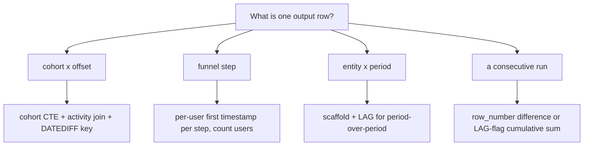

# SQL Analytics Patterns

## TL;DR
Six or seven patterns cover almost every "business SQL" round: retention/cohort tables, funnels,
month-over-month growth, gaps-and-islands, pivoting, pairs via self-join, and median without a median
function. Learn the shape of each rather than memorising queries — every one of them is a
`GROUP BY` or a window applied to a cleverly constructed key.

## Intuition
Business SQL questions are rarely about exotic syntax. They are about deciding **what the grain of the
output row is** — one row per cohort-month, per funnel step, per island — and then building a key that
produces that grain. Once the key exists, the aggregation is trivial. Say the grain out loud before
writing anything; it is the single best interview habit in this topic.

## The maths

**Retention.** For a cohort $c$ (users whose first activity was in period $c$) and offset $k$:

$$
R_{c,k} = \frac{\lvert U_c \cap A_{c+k} \rvert}{\lvert U_c \rvert}
$$

where $U_c$ is the cohort's user set and $A_t$ the set active in period $t$. The denominator is fixed
per cohort — that is what makes the triangle's rows comparable.

**Funnel conversion.** With step counts $n_1 \ge n_2 \ge \dots \ge n_s$, step conversion is
$n_{i+1}/n_i$ and overall conversion $n_s/n_1 = \prod_i n_{i+1}/n_i$. Counting **users**, not events, is
what makes the counts monotone.

**Gaps-and-islands.** For a sorted sequence, the difference between the position index and a
"value index" is constant within a consecutive run. For integers $v_i$ ordered ascending,

$$
g_i = v_i - \text{ROW\_NUMBER}()_i
$$

is constant exactly on a run of consecutive values, so `GROUP BY g` gives the islands. For
event-time data, use the flag-then-cumulative-sum variant from [[window-functions]].

**Median.** The median of $n$ sorted values is

$$
\text{median} =
\begin{cases}
v_{(n+1)/2}, & n \text{ odd} \\[4pt]
\tfrac{1}{2}\left(v_{n/2} + v_{n/2+1}\right), & n \text{ even}
\end{cases}
$$

The portable SQL trick: `ROW_NUMBER()` ascending gives $i$, and $n - i + 1$ gives the descending
position. The middle element(s) are exactly those where
$\lvert 2i - n - 1 \rvert \le 1$ — one row for odd $n$, two for even $n$ — so averaging the survivors
is the median in both cases.

## Diagram



## Code

```sql
-- 1. COHORT RETENTION TABLE. Grain: one row per (cohort_month, months_since).
WITH first_seen AS (
    SELECT user_id,
           DATE_TRUNC('month', MIN(event_ts)) AS cohort_month
    FROM events
    GROUP BY user_id
),
activity AS (
    SELECT DISTINCT
           user_id,
           DATE_TRUNC('month', event_ts) AS active_month
    FROM events
),
joined AS (
    SELECT
        f.cohort_month,
        a.active_month,
        -- whole months between the two; on Postgres use age()/extract,
        -- on Spark SQL use months_between(...) cast to int.
        CAST(MONTHS_BETWEEN(a.active_month, f.cohort_month) AS INT) AS months_since,
        a.user_id
    FROM first_seen f
    JOIN activity a ON a.user_id = f.user_id
),
sizes AS (
    SELECT cohort_month, COUNT(*) AS cohort_size
    FROM first_seen GROUP BY cohort_month
)
SELECT
    j.cohort_month,
    j.months_since,
    s.cohort_size,
    COUNT(DISTINCT j.user_id) AS retained,
    ROUND(COUNT(DISTINCT j.user_id) * 100.0 / s.cohort_size, 1) AS retention_pct
FROM joined j
JOIN sizes s ON s.cohort_month = j.cohort_month
GROUP BY j.cohort_month, j.months_since, s.cohort_size
ORDER BY j.cohort_month, j.months_since;
-- The denominator must be the cohort size, never the previous month's retained count.
```

```sql
-- 2. FUNNEL. Grain: one row per step. Count distinct USERS, and enforce ordering in time.
WITH step_times AS (
    SELECT
        user_id,
        MIN(CASE WHEN event_name = 'view'     THEN event_ts END) AS t_view,
        MIN(CASE WHEN event_name = 'add_cart' THEN event_ts END) AS t_cart,
        MIN(CASE WHEN event_name = 'checkout' THEN event_ts END) AS t_checkout,
        MIN(CASE WHEN event_name = 'purchase' THEN event_ts END) AS t_purchase
    FROM events
    WHERE event_ts >= DATE '2026-09-01'
    GROUP BY user_id
),
ordered AS (
    SELECT
        user_id,
        t_view IS NOT NULL                                  AS s1,
        t_cart     > t_view                                 AS s2,
        t_checkout > t_cart     AND t_cart > t_view         AS s3,
        t_purchase > t_checkout AND t_checkout > t_cart
                                AND t_cart > t_view         AS s4
    FROM step_times
)
SELECT 1 AS step, 'view'     AS name, COUNT(*) FILTER (WHERE s1) AS users FROM ordered
UNION ALL SELECT 2, 'add_cart', COUNT(*) FILTER (WHERE s2) FROM ordered
UNION ALL SELECT 3, 'checkout', COUNT(*) FILTER (WHERE s3) FROM ordered
UNION ALL SELECT 4, 'purchase', COUNT(*) FILTER (WHERE s4) FROM ordered
ORDER BY step;
-- Without the time-ordering conditions you get "conversions" from users who
-- purchased before they viewed, and step counts that are not monotone.
-- Replace COUNT(*) FILTER (...) with SUM(CASE WHEN ... THEN 1 ELSE 0 END) for portability.
```

```sql
-- 3. MONTH-OVER-MONTH GROWTH. Scaffold first so missing months become 0, not gaps.
WITH monthly AS (
    SELECT DATE_TRUNC('month', order_date) AS m, SUM(amount) AS revenue
    FROM orders
    GROUP BY DATE_TRUNC('month', order_date)
),
with_prev AS (
    SELECT
        m,
        revenue,
        LAG(revenue) OVER (ORDER BY m) AS prev_revenue
    FROM monthly
)
SELECT
    m,
    revenue,
    prev_revenue,
    revenue - prev_revenue                                       AS mom_abs,
    ROUND((revenue - prev_revenue) * 100.0
          / NULLIF(prev_revenue, 0), 2)                          AS mom_pct
FROM with_prev
ORDER BY m;
-- LAG over `monthly` uses the previous PRESENT row. If a month had zero revenue and
-- therefore no row, LAG silently compares against two months ago. Scaffold the month
-- series with a calendar table and LEFT JOIN before applying LAG.
```

```sql
-- 4. GAPS AND ISLANDS (a): consecutive integers / dates.
-- "Longest streak of consecutive active days per user."
WITH daily AS (
    SELECT DISTINCT user_id, CAST(event_ts AS DATE) AS d FROM events
),
grouped AS (
    SELECT
        user_id, d,
        -- date minus its row number is constant within a consecutive run
        DATE_ADD(d, -CAST(ROW_NUMBER() OVER (PARTITION BY user_id ORDER BY d) AS INT))
            AS grp
    FROM daily
)
SELECT user_id, MIN(d) AS streak_start, MAX(d) AS streak_end, COUNT(*) AS streak_len
FROM grouped
GROUP BY user_id, grp
ORDER BY user_id, streak_start;
-- Postgres spelling of the offset: d - (ROW_NUMBER() OVER (...))::int
-- Spark SQL: date_add(d, -CAST(row_number() OVER (...) AS INT))

-- GAPS AND ISLANDS (b): status runs — collapse consecutive identical statuses.
WITH flagged AS (
    SELECT
        device_id, reading_ts, status,
        CASE WHEN status IS DISTINCT FROM
                  LAG(status) OVER (PARTITION BY device_id ORDER BY reading_ts)
             THEN 1 ELSE 0 END AS is_change
    FROM readings
),
runs AS (
    SELECT *,
           SUM(is_change) OVER (PARTITION BY device_id ORDER BY reading_ts
                                ROWS BETWEEN UNBOUNDED PRECEDING AND CURRENT ROW) AS run_id
    FROM flagged
)
SELECT device_id, run_id, status,
       MIN(reading_ts) AS started, MAX(reading_ts) AS ended, COUNT(*) AS n
FROM runs
GROUP BY device_id, run_id, status
ORDER BY device_id, started;
-- Spark SQL: use `NOT (status <=> LAG(status) OVER (...))` instead of IS DISTINCT FROM.
```

```sql
-- 5. PIVOT (long to wide) with conditional aggregation — portable, no PIVOT keyword.
SELECT
    country,
    SUM(CASE WHEN channel = 'web'    THEN amount ELSE 0 END) AS web,
    SUM(CASE WHEN channel = 'app'    THEN amount ELSE 0 END) AS app,
    SUM(CASE WHEN channel = 'retail' THEN amount ELSE 0 END) AS retail,
    SUM(amount)                                             AS total
FROM orders
GROUP BY country;
-- Databricks/Spark SQL also has a native PIVOT:
--   SELECT * FROM orders PIVOT (SUM(amount) FOR channel IN ('web','app','retail'))
-- Postgres needs the crosstab() function from the tablefunc extension.
-- SQL cannot pivot a dynamic set of columns — the column list must be known at parse
-- time. If the categories are unbounded, do it in the application layer or in PySpark.

-- UNPIVOT (wide to long), portable:
SELECT country, 'web' AS channel, web AS amount FROM wide_table
UNION ALL SELECT country, 'app', app FROM wide_table
UNION ALL SELECT country, 'retail', retail FROM wide_table;
```

```sql
-- 6. PAIRS VIA SELF-JOIN: products bought together.
SELECT
    a.product_id AS product_a,
    b.product_id AS product_b,
    COUNT(DISTINCT a.order_id) AS orders_together
FROM order_items a
JOIN order_items b
  ON b.order_id = a.order_id
 AND b.product_id > a.product_id        -- '>' not '<>': avoids (A,B)+(B,A) and self-pairs
GROUP BY a.product_id, b.product_id
HAVING COUNT(DISTINCT a.order_id) >= 10
ORDER BY orders_together DESC
LIMIT 20;
-- Cost warning: an order with k items produces k(k-1)/2 pairs. One order with 500 items
-- produces ~125,000 rows. Cap basket size or filter to top products before pairing.
```

```sql
-- 7. MEDIAN WITHOUT A MEDIAN FUNCTION. Works on any engine with window functions.
WITH ranked AS (
    SELECT
        country,
        amount,
        ROW_NUMBER() OVER (PARTITION BY country ORDER BY amount) AS rn,
        COUNT(*)     OVER (PARTITION BY country)                 AS n
    FROM orders
    WHERE amount IS NOT NULL
)
SELECT country, AVG(amount) AS median_amount
FROM ranked
WHERE ABS(2 * rn - n - 1) <= 1      -- keeps 1 middle row if n odd, 2 if n even
GROUP BY country;

-- Engine-native alternatives, if allowed:
--   Postgres: PERCENTILE_CONT(0.5) WITHIN GROUP (ORDER BY amount)
--   Spark SQL: percentile(amount, 0.5) exact, percentile_approx(amount, 0.5) cheap
```

## In practice
- **Use it when:** the question is phrased in business language ("what's our 3-month retention?",
  "where do users drop off?"). Translate to a grain, build the key, aggregate.
- **Defaults that work:** count distinct **users** in funnels and retention, never events; anchor
  retention denominators to cohort size; scaffold time series before applying `LAG`.
- **Breaks when:** the event stream has duplicates (a common reality with at-least-once delivery from
  Kafka) — dedupe with `ROW_NUMBER` first or every count is inflated. See
  [[kafka-and-event-streaming]] and [[data-quality-and-validation]].
- **Cost / latency:** the self-join pair pattern is the dangerous one — quadratic in basket size. The
  cohort pattern shuffles twice (once per grouping) and `COUNT(DISTINCT)` in the retention query is the
  expensive step; for a dashboard, an approximate distinct count is usually acceptable.
- **Dialect differences that bite:**
  - Date truncation: `DATE_TRUNC('month', ts)` works in both Postgres and Spark SQL. Month arithmetic
    does not: Postgres uses interval arithmetic and `AGE`, Spark uses `months_between`, `add_months`,
    `date_add`.
  - `FILTER (WHERE …)` is Postgres and Spark SQL; `SUM(CASE WHEN … THEN 1 ELSE 0 END)` is universal.
  - `IS DISTINCT FROM` is Postgres; `<=>` is the Spark null-safe equality.
  - `PIVOT` is Databricks/Spark SQL; Postgres needs `crosstab()`. Conditional aggregation is portable —
    use it when you are unsure of the engine.

## Interview angle

**Q. Build a monthly cohort retention table.**
Three CTEs. First, each user's cohort month via `MIN(event_ts)` truncated to month. Second, the
distinct months each user was active. Third, join them and compute `months_since` as the whole-month
difference. Then group by (cohort_month, months_since), counting distinct users, and divide by the
cohort size — which must come from the cohort CTE, not from the previous month's retained count.

**Follow-up.** *Why distinct users and not events?* → A user with 50 sessions in a month would count 50
times, so retention could exceed 100%. Also state the retention definition you are using: month-0 is
usually 100% by construction, and some teams define retention as "active in month k", others as "active
in every month up to k" — ask.

**Q. Users drop off in our funnel. Write the query.**
Pivot per user to the first timestamp of each step with `MIN(CASE WHEN event = ... THEN ts END)`, then
require strictly increasing timestamps across steps, then count users satisfying each prefix. The
ordering condition is the part people forget — without it your counts are not monotone and you get
"conversions" from users who purchased before viewing.

**Q. Month-over-month growth — what goes wrong?**
Three things. Months with zero activity produce no row, so `LAG` compares against the wrong month —
scaffold a calendar. Division by a zero or NULL previous month — wrap in `NULLIF`. And an incomplete
current month compared against a full previous month, which always looks like a collapse — either
exclude the current period or compare like-for-like partial periods.

**Q. Find the longest streak of consecutive active days per user.**
Dedupe to one row per user-day, then compute `date - ROW_NUMBER() OVER (PARTITION BY user ORDER BY
date)`. That expression is constant exactly within a consecutive run, so grouping by it gives each
island; `COUNT(*)` per island is the streak length and `MAX` over those is the answer.

**Follow-up.** *What if the definition is "gap of at most 2 days"?* → The row-number trick only handles
strict consecutiveness. Switch to the general form: `LAG` the date, flag when the gap exceeds the
threshold, cumulative-sum the flag to build the island id. That version generalises to any gap rule and
to event timestamps. Same idiom as sessionisation in [[window-functions]].

**Q. Compute the median order value per country without `PERCENTILE_CONT`.**
`ROW_NUMBER()` ascending and `COUNT(*)` both over `PARTITION BY country`, then keep rows where
`ABS(2*rn - n - 1) <= 1` and average them. That selects the single middle row for odd counts and the two
middle rows for even counts, so one expression handles both cases.

**Q. How would you find product pairs frequently bought together?**
Self-join `order_items` on `order_id` with `b.product_id > a.product_id`, group by the pair, count
distinct orders. The `>` rather than `<>` gives each unordered pair once. I would warn about the
quadratic blow-up on large baskets and cap it — either restrict to the top-N products first or filter
out orders above a basket-size threshold. See [[recommender-systems-basics]] for where this leads.

## Traps
- **"Retention denominator = previous month's active users."** That is *month-over-month churn*, not
  cohort retention. Cohort retention always divides by the original cohort size, which is what makes
  the triangle's rows comparable.
- **"Funnel steps can be counted independently."** Counting each event type separately gives
  non-monotone "funnels" where step 3 exceeds step 2. Enforce per-user step ordering in time.
- **"`LAG` gives me last month."** It gives the previous *row* in the ordering. With missing periods
  that is not last month. Scaffold, or use a `RANGE` frame with an interval offset.
- **"Self-join with `<>` for pairs."** Produces (A,B) and (B,A) and inflates counts by 2×. Use `>`.
- **"`AVG` is close enough to the median."** Not on the heavy-tailed distributions that dominate revenue
  and latency data — precisely the cases where the interviewer asked for a median.
- **"`PIVOT` can take a dynamic column list."** It cannot in standard SQL; the columns must be known at
  parse time. Generating the SQL string dynamically is the real answer, and saying so is a better
  answer than pretending otherwise.
- **"Event data is clean."** Duplicate events from at-least-once delivery, bot traffic, and test users
  will all inflate these metrics. Naming the dedup step unprompted is a strong senior signal.
- **"Timezones don't matter."** They do for anything truncated to a day or month. Indian consumer data
  bucketed in UTC shifts an evening session into the next day. State the timezone you are truncating in.

## Flashcards
Correct denominator for cohort retention?::The original cohort size (users whose first activity was in that period), not the previous period's active users.
Why must funnel steps enforce time ordering?::Otherwise step counts are not monotone and you count users who completed a later step before an earlier one.
Gaps-and-islands trick for consecutive dates?::date minus ROW_NUMBER() over the ordered sequence is constant within a run — GROUP BY that expression.
General gaps-and-islands idiom for arbitrary gap rules?::LAG to compute the gap, flag when it exceeds the threshold, cumulative SUM of the flag gives the island id.
Portable median without PERCENTILE_CONT?::ROW_NUMBER() rn and COUNT(*) n over the partition, keep rows with ABS(2*rn - n - 1) <= 1, then AVG them.
Self-join condition for unordered pairs?::b.id > a.id — using <> yields both (A,B) and (B,A).
Why scaffold a calendar before LAG for MoM growth?::LAG returns the previous present row; a month with no rows makes it silently compare against an earlier month.
Portable pivot technique?::Conditional aggregation — SUM(CASE WHEN cat = 'x' THEN v ELSE 0 END) per category; the column list must be static.
Cost risk in the product-pairs self-join?::An order with k items generates k(k-1)/2 pairs — quadratic in basket size.

## Related
- [[window-functions]]
- [[aggregations-and-grouping]]
- [[joins-deep-dive]]
- [[subqueries-and-ctes]]
- [[sql-query-optimization]]
- [[sql-fundamentals]]
- [[ab-testing-design]]
- [[time-series-features-and-validation]]
- [[case-churn-prediction]]
- [[drill-sql-problems]]
- [[moc-sql]]
