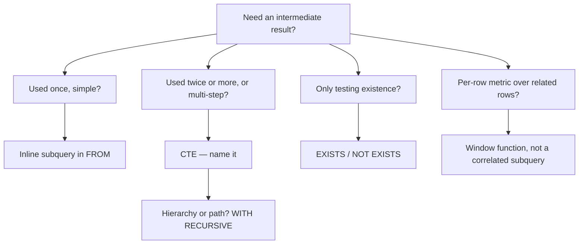

# Subqueries and CTEs

## TL;DR
A subquery is a query used as a value, a row source, or a predicate. A CTE (`WITH … AS`) is a named
subquery placed before the main query — same power, far better readability, and the only sane way to
build a multi-step transformation. The interview points are: correlated vs uncorrelated, when a
correlated subquery should be rewritten as a join or a window, and whether a CTE is materialised.

## Intuition
A subquery in `WHERE` is a question you ask about each row ("is this customer in the set of customers
who ordered?"). A CTE is a scratch variable: you name an intermediate table and then read it like any
other table. Stacking CTEs turns SQL from one dense expression into a readable pipeline, which is also
how you debug — comment out the final `SELECT`, run a CTE on its own.

## The maths

**Uncorrelated subquery**: the inner query does not reference the outer row, so it is evaluated once.
Cost $= C_{\text{inner}} + C_{\text{outer}}$.

**Correlated subquery**: the inner query references a column from the outer row, so semantically it is
evaluated once per outer row. Naively that is

$$
C = C_{\text{outer}} + n_{\text{outer}} \cdot C_{\text{inner}}
$$

which is $O(nm)$ — a nested loop. Modern optimisers **decorrelate** most of these into a join or a
semi-join, collapsing the cost to $O(n + m)$ with a hash join. The interview answer is: the
optimiser usually rescues you, but do not depend on it, especially in Spark where correlated
subqueries are supported only in restricted forms.

**Recursive CTE** computes a least fixed point. Given base relation $B$ and step function $S$, it
evaluates

$$
T_0 = B, \qquad T_{k+1} = T_k \cup S(T_k)
$$

until $T_{k+1} = T_k$. For a graph traversal the iteration count is the maximum path depth; without a
cycle guard it does not terminate.

## Diagram



## Code

```sql
-- 1. The three positions a subquery can occupy.

-- (a) Scalar subquery in SELECT — must return exactly one row, one column.
SELECT
    o.order_id,
    o.amount,
    o.amount - (SELECT AVG(amount) FROM orders) AS diff_from_global_avg
FROM orders o;

-- (b) Derived table in FROM — must be aliased in Postgres.
SELECT d.country, d.gross
FROM (
    SELECT country, SUM(amount) AS gross
    FROM orders GROUP BY country
) AS d
WHERE d.gross > 100000;

-- (c) Predicate subquery in WHERE.
SELECT * FROM customers c
WHERE EXISTS (SELECT 1 FROM orders o WHERE o.customer_id = c.customer_id);
```

```sql
-- 2. Correlated subquery, and the two better rewrites.

-- Correlated: "orders above their own country's average". Semantically one inner
-- query per outer row.
SELECT o.*
FROM orders o
WHERE o.amount > (
    SELECT AVG(o2.amount)
    FROM orders o2
    WHERE o2.country = o.country          -- the correlation
);

-- Rewrite A: pre-aggregate + join. Explicit, portable, one pass each.
WITH country_avg AS (
    SELECT country, AVG(amount) AS avg_amount
    FROM orders GROUP BY country
)
SELECT o.*
FROM orders o
JOIN country_avg a ON a.country = o.country
WHERE o.amount > a.avg_amount;

-- Rewrite B: window function. Usually the best answer in an interview.
WITH scored AS (
    SELECT o.*, AVG(amount) OVER (PARTITION BY country) AS avg_amount
    FROM orders o
)
SELECT * FROM scored WHERE amount > avg_amount;
```

```sql
-- 3. A multi-step CTE pipeline — how real analytics SQL is written.
WITH base AS (
    SELECT customer_id, order_id, amount, order_date
    FROM orders
    WHERE order_date >= DATE '2026-01-01'
      AND status = 'completed'
),
per_customer AS (
    SELECT
        customer_id,
        COUNT(*)        AS n_orders,
        SUM(amount)     AS revenue,
        MIN(order_date) AS first_order,
        MAX(order_date) AS last_order
    FROM base
    GROUP BY customer_id
),
segmented AS (
    SELECT
        *,
        NTILE(4) OVER (ORDER BY revenue DESC) AS revenue_quartile,
        CASE WHEN n_orders = 1 THEN 'one-time' ELSE 'repeat' END AS cohort
    FROM per_customer
)
SELECT cohort, revenue_quartile, COUNT(*) AS customers, SUM(revenue) AS revenue
FROM segmented
GROUP BY cohort, revenue_quartile
ORDER BY cohort, revenue_quartile;
```

```sql
-- 4. Recursive CTE: org hierarchy with depth and a cycle guard.
WITH RECURSIVE org AS (
    SELECT emp_id, manager_id, name, 1 AS depth, CAST(name AS VARCHAR(4000)) AS path
    FROM employees
    WHERE manager_id IS NULL                        -- anchor

    UNION ALL

    SELECT e.emp_id, e.manager_id, e.name, o.depth + 1,
           CONCAT(o.path, ' > ', e.name)
    FROM employees e
    JOIN org o ON o.emp_id = e.manager_id           -- recursive step
    WHERE o.depth < 20                              -- guard: stop runaway recursion
)
SELECT emp_id, name, depth, path FROM org ORDER BY path;
-- Postgres: WITH RECURSIVE is standard.
-- Spark SQL: recursive CTEs are a recent and limited feature; on Databricks the usual
-- production answer is an iterative loop in PySpark, or a precomputed closure table.
```

```sql
-- 5. Lateral / correlated derived table: top 2 orders per customer without a window.
-- Postgres:
SELECT c.customer_id, o.order_id, o.amount
FROM customers c
CROSS JOIN LATERAL (
    SELECT order_id, amount
    FROM orders o2
    WHERE o2.customer_id = c.customer_id
    ORDER BY amount DESC
    LIMIT 2
) o;
-- Spark SQL has LATERAL VIEW for exploding arrays, not this form.
-- Portable answer: ROW_NUMBER() in a CTE, filtered to rn <= 2.
```

## In practice
- **Use it when:** a CTE for anything with more than one logical step, `EXISTS` for existence checks, a
  scalar subquery only for a genuine single global constant.
- **Defaults that work:** name CTEs after what they contain (`completed_orders`, not `cte1`); keep each
  CTE to one job; if a CTE is referenced more than twice and is expensive, consider a temp table or a
  Delta table instead. On Databricks, a `CACHE TABLE` or writing a bronze/silver intermediate is often
  better than a six-level CTE that recomputes.
- **Breaks when:** you correlate a subquery in Spark in a form it does not support — Spark allows
  correlated scalar and `EXISTS`/`IN` subqueries only in `WHERE`/`HAVING` and with equality
  correlations; anything fancier throws an analysis error. A window function or explicit join always
  works.
- **Cost / latency:** the big dialect difference is **materialisation**.
  - Postgres before v12 always materialised a CTE (an optimisation fence). From v12, a CTE referenced
    once is inlined by default; `MATERIALIZED` / `NOT MATERIALIZED` lets you force it either way.
  - Spark SQL inlines CTEs — a CTE referenced three times is **computed three times** unless you
    `CACHE` it or persist the DataFrame. This surprises people migrating from Postgres.
- **Dialect differences that bite:**
  - Postgres requires an alias on every derived table in `FROM`; Spark SQL does not.
  - `WITH RECURSIVE` is core Postgres, marginal in Spark SQL — assume it is unavailable on Databricks
    unless you have confirmed the runtime.
  - `LATERAL` is Postgres; Spark's `LATERAL VIEW explode(...)` is a different construct for arrays.

## Interview angle

**Q. Difference between a correlated and an uncorrelated subquery?**
An uncorrelated subquery references nothing from the outer query, so it is evaluated once and its
result reused. A correlated one references an outer column and is, semantically, evaluated per outer
row — a nested loop. Optimisers decorrelate most of them into joins or semi-joins, but I would still
write the join or window version because it makes the cardinality obvious to the reader.

**Follow-up.** *Show me a correlated subquery that cannot be decorrelated.* → One with a `LIMIT` inside
that depends on the outer row, e.g. "the 3 most recent orders per customer". That needs `LATERAL` in
Postgres or `ROW_NUMBER` in a CTE — a plain join cannot express it.

**Q. CTE vs subquery — is there a performance difference?**
Engine-dependent, and that is the real answer. In Postgres v12+ a single-use CTE is inlined, so it is
equivalent to a derived table; a multi-use one may be materialised, which can help (compute once) or
hurt (no predicate pushdown into it). In Spark SQL, CTEs are always inlined, so a CTE referenced three
times is recomputed three times. Semantically identical either way; read the plan if it matters.

**Q. Why is `WHERE x IN (SELECT …)` risky and `WHERE EXISTS (SELECT 1 …)` not?**
Only `NOT IN` is the dangerous one: if the subquery yields a NULL, `NOT IN` evaluates to UNKNOWN for
every row and you get an empty result. Plain `IN` is fine and usually planned as a semi-join, the same
as `EXISTS`. See [[joins-deep-dive]].

**Q. Write a recursive CTE to find all reports under a manager.**
Anchor on the manager row, then `UNION ALL` a join of `employees` to the recursive term on
`manager_id`. Carry a `depth` counter and cap it to prevent runaway recursion if the data has a cycle.
`UNION` instead of `UNION ALL` deduplicates each iteration, which also terminates cycles but costs a
distinct per step.

**Follow-up.** *How would you do this on Databricks?* → I would not rely on recursive SQL. For a bounded
hierarchy (say ≤ 10 levels) I would do N self-joins or an iterative PySpark loop that unions each
level; for repeated access I would materialise a closure table (employee, ancestor, depth) in the
silver layer and query it with a plain join. See [[medallion-architecture]].

**Q. When do you replace a subquery with a window function?**
When the subquery computes an aggregate over rows related to the current row — per-group average, rank,
previous value, running total. The window version does it in one pass instead of a nested loop, and it
keeps the raw column alongside the computed one. See [[window-functions]].

## Traps
- **"A CTE is always materialised, so it's faster."** Only in old Postgres. In Spark it is inlined and
  recomputed per reference; in modern Postgres it depends on reference count. Never state this as a
  universal.
- **"A scalar subquery can return multiple rows."** It cannot — Postgres raises an error, and it is a
  runtime error, so it can pass your test data and fail in production on a duplicate key.
- **"`NOT IN` and `NOT EXISTS` are equivalent."** They are not, because of NULLs. See
  [[sql-fundamentals]].
- **"More CTEs means slower."** Adding names does not add work when the engine inlines them. What is slow
  is recomputing an expensive CTE many times, or a materialisation fence that blocks predicate pushdown.
- **"Recursive CTEs always terminate."** Only with a cycle guard — `UNION` (dedup) or an explicit depth
  cap. Cyclic manager data will spin until the engine kills the query.
- **"CTEs are just cosmetic."** They change what the optimiser may do in Postgres (`MATERIALIZED`
  becomes a fence), and they are the difference between a reviewable query and an unreviewable one. In
  an interview, a clean CTE pipeline reads as senior; a five-deep nested subquery does not.

## Flashcards
Correlated vs uncorrelated subquery?::Correlated references an outer column so it is semantically evaluated per outer row; uncorrelated is evaluated once.
Is a CTE materialised in Postgres?::Since v12, a single-reference CTE is inlined by default; MATERIALIZED / NOT MATERIALIZED forces the choice. Before v12 it was always a fence.
Are CTEs materialised in Spark SQL?::No — they are inlined, so a CTE referenced three times is computed three times unless you CACHE or persist it.
What does a recursive CTE need to terminate?::A cycle guard — a depth cap, or UNION instead of UNION ALL to deduplicate each iteration.
Which subquery cannot be decorrelated into a plain join?::One with a per-outer-row LIMIT, e.g. top-3 per customer — needs LATERAL or ROW_NUMBER.
When should a correlated subquery become a window function?::Whenever it computes an aggregate or position over rows related to the current row — one pass instead of a nested loop.
Postgres requirement for derived tables in FROM?::They must be given an alias; Spark SQL does not require one.

## Related
- [[sql-fundamentals]]
- [[joins-deep-dive]]
- [[window-functions]]
- [[aggregations-and-grouping]]
- [[sql-query-optimization]]
- [[sql-analytics-patterns]]
- [[trees-and-graphs-basics]]
- [[moc-sql]]
