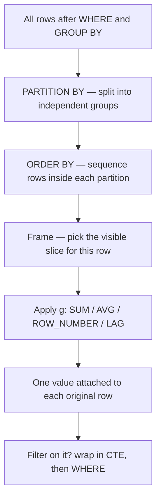

# Window Functions

## TL;DR
A window function computes a value **per row** using a set of related rows, without collapsing the
result the way `GROUP BY` does. `OVER (PARTITION BY … ORDER BY … frame)` is the whole API: partition
says *which* rows are related, `ORDER BY` says in what sequence, the frame says *how many* of them to
look at. Roughly half of live SQL interview rounds in India are solvable with `ROW_NUMBER`, `LAG` and
a running `SUM`.

## Intuition
`GROUP BY` is a blender: five rows go in, one comes out. A window function is a moving magnifying
glass: it slides across the rows and, at each stop, reports something about the neighbourhood it can
currently see — while the row itself survives intact. That is why you can have the raw transaction
amount *and* its running total side by side in the same row.

## The maths

For row $i$ in an ordered partition $P = (x_1, \dots, x_n)$, a window function is a map

$$
f_i = g\big(\{ x_j : j \in F(i) \}\big)
$$

where $F(i) \subseteq \{1, \dots, n\}$ is the **frame** of row $i$ and $g$ is an aggregate
(`SUM`, `AVG`, `MAX`, …) or a position function (`ROW_NUMBER`, `LAG`, …).

**Frames.** `ROWS BETWEEN a PRECEDING AND b FOLLOWING` defines
$F(i) = \{ i-a, \dots, i+b \} \cap [1, n]$ — physical row offsets. `RANGE` instead defines the frame
by *value* of the `ORDER BY` expression: all rows $j$ with $x_j^{\text{ord}}$ within the given value
distance of $x_i^{\text{ord}}$. With ties, `RANGE` swallows every tied row; `ROWS` does not.

**The default frame trap.** If you write `ORDER BY` inside `OVER` and *omit* the frame, the SQL
standard default is

```text
RANGE BETWEEN UNBOUNDED PRECEDING AND CURRENT ROW
```

which is a running total — but a *value-based* one. So on ties it includes **all** peer rows, not just
the ones before this one. If you omit `ORDER BY` entirely, the default frame is the whole partition
(`RANGE BETWEEN UNBOUNDED PRECEDING AND UNBOUNDED FOLLOWING`), which is why `SUM(x) OVER (PARTITION BY k)`
gives the partition total. Both Postgres and Spark SQL follow this.

**Ranking family.** With ordering values $v_1 \le v_2 \le \dots \le v_n$:

| Function | Definition | Ties | Gaps |
|---|---|---|---|
| `ROW_NUMBER()` | $i$ | broken arbitrarily | n/a — always 1..n |
| `RANK()` | $1 + \lvert\{ j : v_j < v_i \}\rvert$ | same rank | yes (1,1,3) |
| `DENSE_RANK()` | $1 + \lvert\{ \text{distinct } v_j < v_i \}\rvert$ | same rank | no (1,1,2) |
| `NTILE(q)` | bucket index in $q$ near-equal buckets | split across buckets | n/a |
| `PERCENT_RANK()` | $\dfrac{\text{RANK}-1}{n-1}$ | same value | n/a |

## Diagram



## Code

```sql
-- 1. The anatomy. Every window clause is these three parts.
SELECT
    user_id,
    event_ts,
    amount,
    SUM(amount) OVER (
        PARTITION BY user_id            -- which rows are related
        ORDER BY event_ts               -- in what order
        ROWS BETWEEN UNBOUNDED PRECEDING AND CURRENT ROW   -- how many to see
    ) AS running_total
FROM transactions;
```

```sql
-- 2. ROW_NUMBER vs RANK vs DENSE_RANK on the same ordering.
SELECT
    dept_id, emp_id, salary,
    ROW_NUMBER() OVER (PARTITION BY dept_id ORDER BY salary DESC) AS rn,   -- 1,2,3,4
    RANK()       OVER (PARTITION BY dept_id ORDER BY salary DESC) AS rnk,  -- 1,2,2,4
    DENSE_RANK() OVER (PARTITION BY dept_id ORDER BY salary DESC) AS drnk  -- 1,2,2,3
FROM employees;
```

```sql
-- 3. Top-N per group. The canonical interview question.
WITH ranked AS (
    SELECT
        dept_id, emp_id, salary,
        DENSE_RANK() OVER (PARTITION BY dept_id ORDER BY salary DESC) AS r
    FROM employees
)
SELECT dept_id, emp_id, salary
FROM ranked
WHERE r <= 3;                      -- cannot go in WHERE of the inner query
-- DENSE_RANK when "top 3 salaries" means distinct salary levels (ties all included);
-- ROW_NUMBER when you need exactly 3 rows per department.
```

```sql
-- 4. Deduplication: keep the latest row per key.
WITH ordered AS (
    SELECT
        *,
        ROW_NUMBER() OVER (
            PARTITION BY customer_id
            ORDER BY updated_at DESC, ingest_id DESC   -- tiebreaker makes it deterministic
        ) AS rn
    FROM customer_updates
)
SELECT * FROM ordered WHERE rn = 1;
```

```sql
-- 5. LAG / LEAD: period-over-period change and time between events.
SELECT
    user_id,
    month,
    revenue,
    LAG(revenue, 1)  OVER (PARTITION BY user_id ORDER BY month) AS prev_revenue,
    revenue - LAG(revenue, 1) OVER (PARTITION BY user_id ORDER BY month) AS mom_delta,
    LEAD(month, 1)   OVER (PARTITION BY user_id ORDER BY month) AS next_month
FROM monthly_revenue;

-- LAG(col, offset, default) — the third argument avoids a COALESCE later.
```

```sql
-- 6. Moving average over 7 rows, and the RANGE version over 7 days.
SELECT
    metric_date,
    value,
    AVG(value) OVER (
        ORDER BY metric_date
        ROWS BETWEEN 6 PRECEDING AND CURRENT ROW
    ) AS ma7_rows,                                  -- last 7 ROWS, wrong if days are missing
    AVG(value) OVER (
        ORDER BY metric_date
        RANGE BETWEEN INTERVAL '6' DAY PRECEDING AND CURRENT ROW
    ) AS ma7_days                                   -- last 7 CALENDAR DAYS, gap-safe
FROM daily_metrics;
-- Postgres supports RANGE with INTERVAL offsets; Spark SQL supports RANGE offsets on
-- numeric/date ordering too. If unsure of the engine, build a complete date scaffold
-- with a cross join and use ROWS — that always works.
```

```sql
-- 7. Sessionisation: 30-minute inactivity gap starts a new session.
WITH gaps AS (
    SELECT
        user_id, event_ts,
        LAG(event_ts) OVER (PARTITION BY user_id ORDER BY event_ts) AS prev_ts
    FROM events
),
flagged AS (
    SELECT
        user_id, event_ts,
        CASE
            WHEN prev_ts IS NULL THEN 1
            WHEN event_ts > prev_ts + INTERVAL '30' MINUTE THEN 1
            ELSE 0
        END AS is_new_session
    FROM gaps
)
SELECT
    user_id, event_ts,
    SUM(is_new_session) OVER (
        PARTITION BY user_id ORDER BY event_ts
        ROWS BETWEEN UNBOUNDED PRECEDING AND CURRENT ROW
    ) AS session_id
FROM flagged;
-- The pattern: flag boundaries with LAG, then a running SUM of the flag IS the group id.
-- Same trick powers gaps-and-islands — see sql-analytics-patterns.
```

```sql
-- 8. FIRST_VALUE / LAST_VALUE, and the LAST_VALUE frame trap.
SELECT
    user_id, event_ts, page,
    FIRST_VALUE(page) OVER (PARTITION BY user_id ORDER BY event_ts) AS landing_page,
    LAST_VALUE(page)  OVER (
        PARTITION BY user_id ORDER BY event_ts
        ROWS BETWEEN UNBOUNDED PRECEDING AND UNBOUNDED FOLLOWING   -- REQUIRED
    ) AS exit_page
FROM events;
-- Without the explicit frame, LAST_VALUE returns the current row, because the default
-- frame ends at CURRENT ROW. FIRST_VALUE looks correct by accident for the same reason.
```

```sql
-- 9. Named window: write the spec once, reuse it. Supported in Postgres and Spark SQL.
SELECT
    user_id, event_ts,
    ROW_NUMBER() OVER w AS rn,
    LAG(amount)  OVER w AS prev_amount,
    SUM(amount)  OVER w AS running_total
FROM transactions
WINDOW w AS (PARTITION BY user_id ORDER BY event_ts);
```

```python
# PySpark equivalent — the Databricks interview version of the same ideas.
from pyspark.sql import Window, functions as F

w = Window.partitionBy("user_id").orderBy("event_ts")
w_running = w.rowsBetween(Window.unboundedPreceding, Window.currentRow)

df = (transactions
      .withColumn("rn", F.row_number().over(w))
      .withColumn("prev_amount", F.lag("amount", 1).over(w))
      .withColumn("running_total", F.sum("amount").over(w_running)))

latest = df.filter(F.col("rn") == 1)   # dedup to newest row per user
```

## In practice
- **Use it when:** you need a per-row metric that depends on other rows — ranking, running totals,
  period-over-period deltas, deduplication, "first/last per group", sessionisation, filling gaps.
  Whenever you catch yourself writing a correlated subquery over the same table, a window is the
  better answer.
- **Defaults that work:** always give `ORDER BY` inside `OVER` a deterministic tiebreaker when you use
  `ROW_NUMBER` — otherwise reruns give different rows and your pipeline is non-reproducible.
  Always write the frame explicitly for `SUM`, `AVG`, `LAST_VALUE`; never rely on the default.
- **Breaks when:** the partition is heavily skewed. A window with `PARTITION BY country` on Indian
  e-commerce data puts most rows in one partition, and in Spark that is a single task doing all the
  work. A window with **no** `PARTITION BY` at all forces every row through one partition — fine for
  a thousand rows, fatal for a billion. See [[spark-performance-tuning]].
- **Cost / latency:** a window requires a sort within each partition, so roughly $O(n \log n)$ per
  partition, plus a shuffle in Spark to co-locate each partition. Two windows with *identical*
  `PARTITION BY … ORDER BY` specs share one sort; differing specs each add a sort. Consolidating
  window specs is a real and easy optimisation.
- **Dialect differences that bite:**
  - Spark SQL requires an `ORDER BY` inside `OVER` for `ROW_NUMBER`, `LAG`, `LEAD`, `RANK`; Postgres
    also requires it for the ranking family. Aggregates work without it in both.
  - `IGNORE NULLS` on `LAG`/`LEAD`/`LAST_VALUE` (very useful for forward-filling) is supported in
    Spark SQL but **not** in Postgres. Portable workaround: `LAST_VALUE(x) OVER (...)` combined with a
    `MAX(CASE WHEN x IS NOT NULL THEN ...)` running window, or a two-step CTE.
  - `QUALIFY` (filter on a window function without a CTE) exists in Databricks SQL, Snowflake and
    BigQuery, but **not** in Postgres. It is clean; just know the fallback.
  - `NULLS FIRST` / `NULLS LAST` defaults differ (Postgres: NULLs last ascending; Spark: NULLs first
    ascending). State it explicitly whenever the ordering column is nullable.

```sql
-- QUALIFY: Databricks-only shorthand for pattern 4 above.
SELECT *, ROW_NUMBER() OVER (PARTITION BY customer_id ORDER BY updated_at DESC) AS rn
FROM customer_updates
QUALIFY rn = 1;
```

## Interview angle

**Q. Explain `ROW_NUMBER` vs `RANK` vs `DENSE_RANK`.**
All three number rows within a partition in a given order. `ROW_NUMBER` always yields 1..n and breaks
ties arbitrarily. `RANK` gives tied rows the same number and then *skips* — 1, 1, 3. `DENSE_RANK` gives
tied rows the same number with no gap — 1, 1, 2. Which you pick depends on what "top 3" means: three
rows (`ROW_NUMBER`), three distinct salary levels including ties (`DENSE_RANK`), or "everyone whose
rank number is ≤ 3" (`RANK`, which returns fewer distinct levels when ties occur).

**Follow-up.** *Which one makes a pipeline non-deterministic?* → `ROW_NUMBER` with a non-unique
`ORDER BY`. Adding a unique tiebreaker column fixes it. This matters for a dedup step in a medallion
silver layer, where a rerun must produce the identical table.

**Q. Second-highest salary per department — write it.**
Use `DENSE_RANK() OVER (PARTITION BY dept_id ORDER BY salary DESC)` in a CTE and filter `= 2`. I use
`DENSE_RANK` because if two people tie for the highest salary, the "second highest salary" is the next
distinct amount, which `RANK` would label 3 and skip entirely.

**Q. Why can't I write `WHERE ROW_NUMBER() OVER (...) = 1`?**
Window functions are evaluated at the `SELECT` stage, after `WHERE` has already run. So the value does
not exist when `WHERE` is evaluated. Wrap it in a CTE or subquery and filter outside — or use `QUALIFY`
on an engine that has it. This is a direct consequence of the logical evaluation order in
[[sql-fundamentals]].

**Q. `ROWS` vs `RANGE` — when does it actually matter?**
`ROWS` counts physical rows; `RANGE` counts by the value of the `ORDER BY` expression. They differ in
exactly two situations: ties in the ordering column (`RANGE` includes every peer, `ROWS` does not), and
value-based offsets like a 7-day window over a series with missing days (`RANGE` gives calendar days,
`ROWS` gives the last 7 *present* rows). For a daily running total with one row per day and no ties
they are identical — which is why the difference stays hidden until it bites in production.

**Follow-up.** *What is the default frame?* → With `ORDER BY` present and no frame clause:
`RANGE BETWEEN UNBOUNDED PRECEDING AND CURRENT ROW`. Without `ORDER BY`: the entire partition. The first
default is why a running total over a column with duplicate timestamps jumps in steps instead of
incrementing row by row.

**Q. How would you sessionise clickstream with a 30-minute inactivity timeout?**
Two windows. First `LAG(event_ts)` to get the previous event per user, flag a 1 when the gap exceeds
30 minutes or there is no previous event. Then a running `SUM` of that flag over the same partition and
order — the cumulative sum is the session id, because it increments exactly at each boundary. Same
"flag then cumulative sum" idiom solves gaps-and-islands.

**Q. Deduplicate a CDC feed to the latest state per key.**
`ROW_NUMBER() OVER (PARTITION BY pk ORDER BY updated_at DESC, sequence_id DESC)` then keep `rn = 1`.
On Delta Lake I would usually prefer `MERGE INTO` against the target so the operation is idempotent,
but the window is how I compute the winning row to merge. See [[delta-lake]].

**Q. A window query is slow on 2 billion rows in Spark. What do you check?**
First, whether there is a `PARTITION BY` at all — without one everything lands in a single partition.
Second, skew: `SELECT partition_key, COUNT(*) … ORDER BY 2 DESC LIMIT 20` to find hot keys. Third,
whether multiple windows use slightly different specs and are each paying for a sort — unify them.
Fourth, whether the filter can be pushed before the window rather than after.

## Traps
- **"`LAST_VALUE` gives me the last row in the partition."** Not with the default frame — the frame ends
  at the current row, so it returns the current row's value. You must write
  `ROWS BETWEEN UNBOUNDED PRECEDING AND UNBOUNDED FOLLOWING`, or use `FIRST_VALUE` with the order
  reversed.
- **"`ROWS` and `RANGE` are the same thing."** They coincide only when the ordering column has no ties
  and no value gaps matter. `RANGE` with ties silently produces a "staircase" running total.
- **"`ROW_NUMBER` is deterministic."** Only if the `ORDER BY` is a total order. Ties are broken
  arbitrarily and may differ between runs, between engines, and after a repartition.
- **"You can filter on a window function in `WHERE` / `HAVING`."** You cannot — both run before
  `SELECT`. CTE, subquery, or `QUALIFY`.
- **"A window function replaces `GROUP BY`."** It does not collapse rows. If you want one row per
  group, you still need `GROUP BY` (or a window plus a filter to one row per group).
- **"`PARTITION BY` in a window is the same as Spark's physical partitioning."** Different concepts. The
  window partition is a logical grouping; Spark must shuffle data to co-locate it. They interact —
  which is why window skew is a real performance problem — but they are not the same thing.
- **"`COUNT(DISTINCT x) OVER (...)` works."** Distinct aggregates are not supported as window functions
  in Postgres or Spark SQL. Work around it with `DENSE_RANK` over the value plus a `MAX`, or aggregate
  in a separate CTE and join back.
- **"Adding `DISTINCT` to a query with a window deduplicates correctly."** `DISTINCT` is applied after
  `SELECT`, so it deduplicates rows *including* the computed window values — which usually differ per
  row, so it does nothing. Filter on `rn = 1` instead.

## Flashcards
Three parts of an OVER clause?::PARTITION BY (which rows are related), ORDER BY (sequence), and the frame (how many of them are visible).
Default frame when ORDER BY is present but no frame clause is written?::RANGE BETWEEN UNBOUNDED PRECEDING AND CURRENT ROW — value-based, so it swallows all tied peer rows.
Default frame when OVER has no ORDER BY?::The entire partition — UNBOUNDED PRECEDING to UNBOUNDED FOLLOWING.
ROW_NUMBER vs RANK vs DENSE_RANK on values 100,100,90?::ROW_NUMBER 1,2,3; RANK 1,1,3; DENSE_RANK 1,1,2.
Why does LAST_VALUE usually return the current row?::The default frame ends at CURRENT ROW; you must specify ROWS BETWEEN UNBOUNDED PRECEDING AND UNBOUNDED FOLLOWING.
Why can't you filter on a window function in WHERE?::Windows are computed at the SELECT stage, after WHERE — wrap in a CTE, or use QUALIFY where available.
Idiom for sessionisation and gaps-and-islands?::Flag boundaries with LAG, then take a running SUM of the flag — the cumulative sum is the group id.
Difference between ROWS and RANGE frames?::ROWS counts physical rows; RANGE counts by ORDER BY value, so it includes all ties and supports interval offsets.
How do you make ROW_NUMBER deterministic?::Add a unique tiebreaker column to the ORDER BY so the ordering is a total order.
Which engines support QUALIFY and IGNORE NULLS?::Databricks/Snowflake/BigQuery support QUALIFY; Spark SQL supports IGNORE NULLS — Postgres supports neither.

## Related
- [[sql-fundamentals]]
- [[aggregations-and-grouping]]
- [[subqueries-and-ctes]]
- [[sql-analytics-patterns]]
- [[sql-query-optimization]]
- [[joins-deep-dive]]
- [[pyspark-essentials]]
- [[delta-lake]]
- [[drill-sql-problems]]
- [[moc-sql]]
