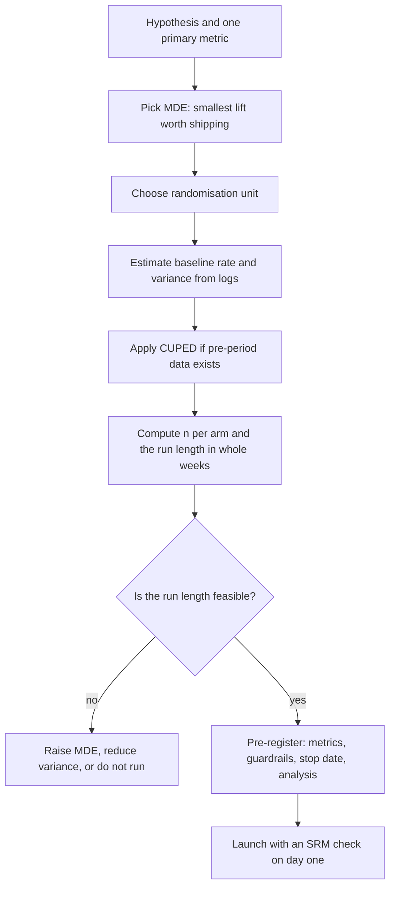

# A/B Testing — Design

## TL;DR
Design happens before launch or not at all: pick one primary metric, decide the smallest lift worth
shipping (the MDE), compute the sample size that detects it at 80% power, randomise at the unit
where the effect and the correlation live, and pre-register guardrails. Ratio metrics need the delta
method for their standard error; CUPED buys you 30–50% of the sample back for free when you have
pre-period data.

## Intuition
An experiment is a purchase: you are spending traffic and calendar weeks to buy a certain resolving
power. The sample-size formula is the price list. If the price is more traffic than you have, you do
not run a weaker test and hope — you change what you are buying: a more sensitive metric, variance
reduction, or a bigger intended change.

## The maths

**Sample size for a two-proportion test.** Per arm, for a two-sided test at level $\alpha$ with
power $1-\beta$:

$$
n \;=\; \frac{\big(z_{1-\alpha/2}+z_{1-\beta}\big)^2 \cdot \big(p_1(1-p_1)+p_2(1-p_2)\big)}{(p_2-p_1)^2}
$$

A serviceable approximation around a common baseline $p$ is
$n \approx \frac{2\,(z_{1-\alpha/2}+z_{1-\beta})^2\,p(1-p)}{\delta^2}$. For $\alpha=0.05$,
power $0.80$: $z_{0.975}=1.96$, $z_{0.80}=0.8416$, so $(1.96+0.8416)^2 \approx 7.849$.

### Worked calculation — checkout conversion

Baseline conversion $p_1 = 0.12$. The product team will only ship for a **relative** lift of 5%, so
$p_2 = 0.126$ and the absolute MDE is $\delta = 0.006$.

$$
\begin{aligned}
p_1(1-p_1) &= 0.12 \times 0.88 = 0.1056 \\
p_2(1-p_2) &= 0.126 \times 0.874 = 0.110124 \\
\text{sum} &= 0.215724 \\
n &= \frac{7.849 \times 0.215724}{0.006^2}
   = \frac{1.69324}{0.000036} \approx 47{,}000 \text{ per arm}
\end{aligned}
$$

So **≈ 94,000 users total**. At 15,000 eligible users/day that is 6.3 days — round *up* to 7 so the
test spans whole weeks and absorbs day-of-week seasonality. Sanity checks that matter in the
interview: $n \propto 1/\delta^2$, so halving the MDE **quadruples** the cost; chasing a 1%
relative lift instead of 5% costs 25× the traffic — about 1.16 million users *per arm*, 2.3 million
total, five months at the same traffic.

**Continuous metric.** Per arm,

$$
n = \frac{2\,(z_{1-\alpha/2}+z_{1-\beta})^2 \sigma^2}{\delta^2}
= \frac{2\times 7.849}{(\delta/\sigma)^2}\;\approx\;\frac{15.7}{d^2}
$$

with $d=\delta/\sigma$ the standardised effect (Cohen's $d$). Memorise $16/d^2$ — it answers "how
many do I need?" on a whiteboard in five seconds.

**MDE given a fixed $n$** — the more useful direction when traffic is capped:

$$
\mathrm{MDE} = (z_{1-\alpha/2}+z_{1-\beta})\,\sqrt{\frac{2\sigma^2}{n}} \approx 2.8\,\sigma\sqrt{2/n}
$$

If the MDE exceeds what the change could plausibly deliver, the experiment cannot answer the
question and should not be run.

### Ratio metrics and the delta method

Metrics like revenue-per-session, CTR when randomising on users, or items-per-order are ratios of
two random sums, $\hat R=\bar Y/\bar X$, where **both** numerator and denominator vary and rows
within a user are correlated. Computing variance across sessions is wrong — it ignores clustering
and denominator randomness, and both errors shrink the SE.

Aggregate to the randomisation unit ($Y_i$, $X_i$ per user, $n$ users) and apply the delta method to
$g(\bar Y,\bar X)=\bar Y/\bar X$:

$$
\operatorname{Var}(\hat R) \approx \frac{1}{n}\cdot\frac{1}{\mu_X^2}
\left( \sigma_Y^2 - 2R\,\sigma_{XY} + R^2\sigma_X^2 \right),
\qquad R=\frac{\mu_Y}{\mu_X}
$$

Equivalently, and far easier to implement: build the linearised variable
$L_i = \frac{Y_i - R\,X_i}{\mu_X}$ and take the ordinary variance of $L_i$. Then you can run a plain
two-sample t-test on $L$.

### CUPED — variance reduction with pre-period data

If $X$ is a covariate measured **before** the experiment (usually the same metric in the prior 2–4
weeks), it cannot be affected by the treatment, so subtracting it is unbiased:

$$
Y^{\text{cuped}}_i = Y_i - \theta\,(X_i - \bar X),
\qquad
\theta^\star = \frac{\operatorname{Cov}(Y,X)}{\operatorname{Var}(X)}
$$

$$
\operatorname{Var}(Y^{\text{cuped}}) = \operatorname{Var}(Y)\,(1-\rho^2)
$$

with $\rho = \operatorname{corr}(Y,X)$. A pre-period correlation of $\rho=0.6$ removes 36% of the
variance, which is a 36% cut in required sample size — days off the calendar for the cost of one
join. $\theta$ is estimated pooled across both arms (using the pooled data does not bias the
treatment effect because $X$ is pre-treatment). CUPED is exactly the regression adjustment
$Y \sim \text{treatment} + X$; the ANCOVA framing and the CUPED framing give the same estimate.

Users with no pre-period (new users) have no covariate — either impute $\bar X$ and accept $\rho=0$
for that stratum, or analyse new and returning users as separate strata.

### Randomisation unit

| Unit | Use when | Cost |
| --- | --- | --- |
| User / device ID | Default. UI, ranking, pricing changes | Needs stable ID; logged-out users leak |
| Session | Effect is fully within-session and users cannot notice inconsistency | Violated by carry-over; inconsistent UX |
| Cluster (city, store, merchant) | Network effects, marketplace supply/demand | Huge variance — $n$ is the cluster count |
| Time-sliced (switchback) | Marketplace pricing, dispatch, anything with interference | Needs careful period length; carry-over |

Rule: **randomise at the coarsest unit where interference can occur, and analyse at that same
unit.** Analysing finer than you randomised is the classic SE bug — see [[ab-testing-pitfalls]].

**Guardrail metrics.** Metrics you do not expect to improve but refuse to damage: p95 latency, crash
rate, error rate, unsubscribe rate, support-ticket volume, revenue when the primary metric is
engagement. Test these for *non-inferiority* against a pre-agreed degradation margin (a one-sided
test, or check the CI upper bound against the margin), not for significance. A latency guardrail
catches the common failure where a model with better offline AUC is slower and nets out negative.

**Metric hierarchy.** One **primary** (decides ship/no-ship, fully powered), a handful of
**secondary** (explain the mechanism, correction applied — see [[multiple-testing-correction]]),
and **guardrails**. Writing all three down before launch is what stops the post-hoc story-telling.

## Diagram



## Code

```python
import numpy as np
from scipy import stats

Z_A = stats.norm.ppf(0.975)     # 1.9600
Z_B = stats.norm.ppf(0.80)      # 0.8416
K = (Z_A + Z_B) ** 2            # 7.849

def n_per_arm_proportion(p1, rel_lift, alpha=0.05, power=0.80):
    za, zb = stats.norm.ppf(1 - alpha / 2), stats.norm.ppf(power)
    p2 = p1 * (1 + rel_lift)
    var = p1 * (1 - p1) + p2 * (1 - p2)
    return int(np.ceil((za + zb) ** 2 * var / (p2 - p1) ** 2))

for lift in (0.05, 0.02, 0.01):
    n = n_per_arm_proportion(0.12, lift)
    print(f"rel lift {lift:.0%}: n/arm = {n:>9,}  total = {2*n:>10,}  days @15k/day = {2*n/15_000:6.1f}")

def mde_given_n(n, sigma, alpha=0.05, power=0.80):
    za, zb = stats.norm.ppf(1 - alpha / 2), stats.norm.ppf(power)
    return (za + zb) * np.sqrt(2 * sigma**2 / n)

print("MDE with 50k/arm, sigma=40:", round(mde_given_n(50_000, 40), 4))

# --- empirical power check: simulate the design we just sized ---------------
rng = np.random.default_rng(0)
n = n_per_arm_proportion(0.12, 0.05)
hits = 0
for _ in range(4_000):
    a = rng.binomial(n, 0.12); b = rng.binomial(n, 0.126)
    pa, pb = a / n, b / n
    pp = (a + b) / (2 * n)
    z = (pb - pa) / np.sqrt(pp * (1 - pp) * 2 / n)
    hits += abs(z) > 1.96
print("empirical power:", hits / 4_000)          # ~0.80

# --- ratio metric: delta method via the linearised variable -----------------
n_users = 20_000
sessions = rng.poisson(4, n_users) + 1
rpu = rng.gamma(2, 30, n_users)                  # per-user revenue rate
revenue = rpu * sessions

def ratio_ci(y, x, alpha=0.05):
    """CI for R = sum(y)/sum(x) using the linearised (delta-method) variable."""
    R = y.sum() / x.sum()
    lin = (y - R * x) / x.mean()                 # L_i
    se = lin.std(ddof=1) / np.sqrt(len(y))
    z = stats.norm.ppf(1 - alpha / 2)
    return R, (R - z * se, R + z * se), se

R, ci, se_delta = ratio_ci(revenue, sessions)
se_naive = (revenue / sessions).std(ddof=1) / np.sqrt(n_users)   # wrong-ish alternative
print(f"revenue/session {R:.3f}  delta-method SE {se_delta:.4f}  naive per-row SE {se_naive:.4f}")

# --- CUPED --------------------------------------------------------------
pre = rng.normal(100, 20, 40_000)                 # pre-period metric
assign = rng.integers(0, 2, 40_000)               # 0 control, 1 treatment
post = 0.7 * pre + rng.normal(30, 15, 40_000) + 2.0 * assign   # true effect = +2.0

theta = np.cov(post, pre, ddof=1)[0, 1] / pre.var(ddof=1)       # pooled across arms
post_cuped = post - theta * (pre - pre.mean())

for name, vals in (("raw", post), ("cuped", post_cuped)):
    t = stats.ttest_ind(vals[assign == 1], vals[assign == 0], equal_var=False)
    lo, hi = t.confidence_interval(0.95)
    print(f"{name:6s} var={vals.var():8.2f}  effect={vals[assign==1].mean()-vals[assign==0].mean():.3f}"
          f"  CI=({lo:.3f}, {hi:.3f})  p={t.pvalue:.4f}")

rho = np.corrcoef(post, pre)[0, 1]
print(f"rho={rho:.3f} -> predicted variance reduction {1-rho**2:.3f}, "
      f"observed {post_cuped.var()/post.var():.3f}")
```

The CUPED block is the one to be able to write from memory: it is six lines, it halves your
experiment duration on a metric with decent pre-period correlation, and interviewers at product
companies with mature experimentation platforms ask about it by name.

> [!tip]
> Equivalent and often easier on Databricks: fit `post ~ assign + pre` with OLS and read the
> coefficient on `assign`. Same point estimate as CUPED, and you get the SE from the regression.
> Doing it as a Spark SQL aggregate over a Delta table keeps the whole analysis one query.

## In practice
- **Use it when:** the change is reversible, you have enough traffic, and the metric moves within
  weeks. Otherwise use quasi-experimental methods — see [[causal-inference-basics]].
- **Defaults that work:** two-sided $\alpha=0.05$, power 0.80, user-level randomisation, run in
  whole weeks, one primary metric, hash-based bucketing (`hash(user_id + experiment_salt) % 1000`)
  so assignment is deterministic, stateless and independent across experiments.
- **Breaks when:** units interfere (marketplaces, social graphs, shared inventory); the metric is
  long-horizon (retention, LTV) so the test would need months; the effect is tiny and the traffic is
  a startup's. In India-market interviews, the realistic constraint is usually traffic — being able
  to say "we could not power this, so we used a holdout plus a switchback" is a strong answer.
- **Cost / latency:** the real currency is calendar time × traffic. CUPED, stratification and
  choosing a lower-variance primary metric (binary conversion rather than revenue) all buy time back
  without weakening the claim.

## Interview angle

**Q. Walk me through designing an experiment for a new checkout flow.**
Primary metric: checkout conversion per user, chosen because it is close to the change and has low
variance. MDE from the business: 5% relative on a 12% baseline, i.e. 0.6pp — below that, the
engineering cost is not recovered. Two-sided at 5%, power 80% gives ~47k users per arm, ~94k total;
at 15k eligible users a day that is 7 days, rounded to whole weeks. Randomise on user ID via a
hashed bucket. Guardrails: p95 checkout latency, payment-failure rate, refund rate. Secondaries with
a BH correction. SRM check at 24 hours, then no peeking until the pre-registered end date.

**Follow-up.** Product says they can only wait 3 days. → Then state the MDE you can actually detect
in 3 days (about 0.9pp, 7.5% relative) and let them choose: accept a weaker test that can only
detect a big effect, apply CUPED to recover variance, or wait. Do not run the same test for fewer
days and read it as if it were powered.

**Q. How do you choose the randomisation unit?**
Coarsest unit at which interference can occur, and consistent with the user experience. User-level
by default because a user seeing two different checkout flows is both confusing and a contaminated
measurement. Session-level only when the effect is genuinely contained in a session. Cluster or
switchback for marketplaces where treating one rider changes another's outcome. Then analyse at the
same unit — a session-level t-test on a user-level randomisation understates the SE.

**Q. Your primary metric is revenue per session. How do you compute the standard error?**
It is a ratio of two random sums with a random denominator, and sessions within a user are
correlated, so the per-session variance is wrong on two counts. Aggregate to user level, form the
linearised variable $L_i=(Y_i - R X_i)/\bar X$, and take a standard t-test on $L$. Or bootstrap by
resampling users. The delta method is preferred in production because it is a closed form and
composes into a SQL aggregation.

**Q. What is CUPED and why does it work?**
Adjust the outcome with a pre-experiment covariate: $Y' = Y - \theta(X-\bar X)$ with
$\theta=\operatorname{Cov}(Y,X)/\operatorname{Var}(X)$. Because $X$ is measured before assignment it
is independent of treatment, so the adjustment cannot bias the estimate — it only removes the part of
the outcome variance the covariate explains. Variance drops by $1-\rho^2$; a pre-period correlation
of 0.6 gives a 36% cut in sample size. It is regression adjustment under another name.

**Follow-up.** What if half your users are brand new? → They have no pre-period, so $\rho=0$ for
them and CUPED gives nothing. Stratify: apply CUPED to returning users, analyse new users
separately, and combine with a stratified estimator. Never impute a pre-period value from
post-treatment data.

**Q. What are guardrail metrics and how do you test them?**
Metrics you are protecting rather than improving — latency, errors, crashes, revenue when optimising
engagement. Test for non-inferiority against a pre-agreed margin: the change ships if the CI on the
degradation stays inside the margin. A significance test is the wrong frame, because a
non-significant guardrail may simply be under-powered, and guardrails are usually higher-variance
than the primary metric.

**Q. Baseline conversion 12%, you want to detect a 1% relative lift. Feasible?**
$n\propto 1/\delta^2$, so a 1% relative lift instead of 5% costs 25× the users — roughly 1.16 million
per arm, 2.3 million total, about five months at 15k/day. Not feasible. Options: accept a larger MDE, reduce variance
(CUPED, stratification, trimming outliers), pick a more sensitive proxy metric, or make a bolder
change. "We ran it for two weeks and it was directionally positive" is not one of the options.

## Traps
- **No MDE decided in advance.** Without it there is no sample size, no stop date, and every result
  becomes negotiable after the fact.
- **Confusing absolute and relative lift.** "5% lift" on a 12% baseline is 0.6pp, not 5pp; getting
  this wrong misses the sample size by two orders of magnitude.
- **Analysing at a finer grain than you randomised.** Deflates the SE and inflates false positives.
- **Running for a non-integer number of weeks.** Weekday and weekend users are different
  populations; a 10-day test is weighted toward whichever days it happened to include.
- **Treating a guardrail's non-significance as "no harm".** Compute the guardrail's own MDE; often
  it could not have detected a harmful change at all.
- **Applying CUPED with a covariate measured during the experiment.** That covariate is affected by
  treatment, so the adjustment absorbs part of the effect and biases the estimate toward zero.
- **Powering on the primary metric and then reading five secondaries as if each were primary.**
  See [[multiple-testing-correction]].
- **Forgetting the novelty window.** The first days of a UI change measure novelty, not steady
  state; see [[ab-testing-pitfalls]].

## Flashcards
Sample size scaling with MDE::n ∝ 1/δ² — halving the detectable effect quadruples the required sample.
Rule-of-thumb n per arm for a continuous metric::≈ 16/d² where d = δ/σ, at α = 0.05 and 80% power.
(z_{0.975} + z_{0.80})²::≈ 7.85 — the constant in every two-sided 80%-power sample-size formula.
Absolute vs relative MDE::A 5% relative lift on a 12% baseline is an absolute MDE of 0.6 percentage points.
Why randomise on user rather than session::Sessions within a user are correlated and a user seeing two variants is both contaminated and confusing; analyse at the unit you randomised.
Delta method for a ratio metric::Aggregate to the randomisation unit, form Lᵢ = (Yᵢ − R·Xᵢ)/X̄, and run a standard t-test on L.
CUPED formula::Y′ = Y − θ(X − X̄) with θ = Cov(Y,X)/Var(X), X strictly pre-treatment.
CUPED variance reduction::Var drops by a factor (1 − ρ²); ρ = 0.6 removes 36% of the variance and 36% of the sample size.
Why CUPED cannot bias the estimate::The covariate is measured before randomisation, so it is independent of treatment assignment.
Guardrail metric::A metric you must not damage — tested for non-inferiority against a pre-agreed margin, not for significance.
Why run experiments in whole weeks::Day-of-week composition differs; a partial week over-weights whichever days it included.

## Related
- [[ab-testing-pitfalls]]
- [[statistical-power-and-sample-size]]
- [[hypothesis-testing]]
- [[multiple-testing-correction]]
- [[causal-inference-basics]]
- [[expectation-variance-covariance]]
- [[requirements-and-metrics-definition]]
- [[moc-stats]]
