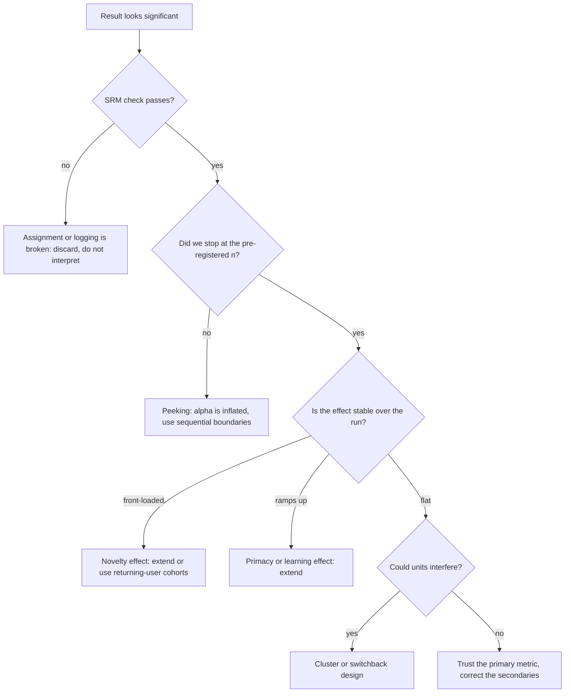

# A/B Testing — Pitfalls

## TL;DR
Most bad experiments are not badly analysed, they are badly run. The recurring killers: peeking at
the dashboard until it goes significant, reading a novelty spike as a permanent lift, ignoring a
sample-ratio mismatch that says the assignment itself is broken, treating interfering units as
independent, and slicing until something is significant. Each has a specific detection method — know
the check, not just the name.

## Intuition
A fixed-sample test is a promise: "I will look once, at this sample size." Every pitfall is a
different way of quietly breaking that promise — looking more than once, changing the population
mid-flight, changing the metric, changing the slice. The false-positive rate is only 5% for the
procedure you actually committed to.

## The maths

**Why peeking inflates $\alpha$.** Under $H_0$ the cumulative z-statistic follows a random walk.
Testing at $k$ interim points, you reject if the walk *ever* crosses $\pm1.96$:

$$
P\!\left(\bigcup_{j=1}^{k}\{|Z_j| > 1.96\}\right) \;\gg\; P(|Z_k| > 1.96) = 0.05
$$

Continuous monitoring at a fixed threshold makes the crossing probability approach 1 by the law of
the iterated logarithm — with unlimited traffic, *any* A/A test eventually reaches $p<0.05$. The
simulation below shows roughly 5% for one look, rising steeply with the number of looks.

**Fixes.**
- *Group sequential* (O'Brien–Fleming, Pocock): pre-specify $k$ looks with adjusted boundaries so the
  total type I error is 5%. O'Brien–Fleming keeps early boundaries very strict and the final one
  nearly 1.96, which is why it is the usual default.
- *Always-valid inference*: mixture sequential probability ratio tests or confidence sequences give
  a p-value valid at every sample size. Cost is power — typically 20–40% more traffic for the same
  MDE. This is what "you can peek" platforms actually run.
- *Bayesian* posteriors are also not immune when your stopping rule is "stop when
  $P(\text{lift}>0)>0.95$": that is still a data-dependent stopping rule, and the frequentist error
  rate of the resulting decision procedure is not 5%.

**Sample ratio mismatch (SRM).** With intended split $r$ and observed $n_A$, $n_B$:

$$
\chi^2 = \frac{(n_A - rN)^2}{rN} + \frac{(n_B - (1-r)N)^2}{(1-r)N}, \qquad N = n_A+n_B
$$

with 1 degree of freedom. A p-value below ~0.001 means the assignment or logging is broken. This is
**not** a metric result to be explained — it invalidates the experiment. Typical causes: bot traffic
hitting one arm, redirect latency losing users on the treatment path, the treatment crashing on
older Android builds, differential caching, a filter applied after assignment.

Note how sensitive it is: at $N=1{,}000{,}000$ with an intended 50/50, a 50.3/49.7 split gives
$\chi^2 \approx 36$, $p\approx 2\times10^{-9}$. A 0.3% imbalance you would never notice by eye is a
fatal signal.

**SUTVA and interference.** Causal inference assumes the *stable unit treatment value assumption*:
one unit's outcome depends only on its own assignment. It fails when:
- **Marketplace/supply:** treatment users book more rides, so control users face longer waits. The
  measured lift is partly cannibalised from control, so the estimate is biased **upward**.
- **Social graph:** a feature spreads through friends, contaminating control. Bias toward the null.
- **Shared model/state:** treatment traffic retrains or warms a cache both arms use.

Remedies: cluster randomisation (city, region, social community), switchback/time-sliced designs,
budget-split designs for ad auctions, or accept a two-sided bound by running a holdout at the market
level.

**Simpson's paradox.** An aggregate difference can reverse within every subgroup when subgroup sizes
differ across arms:

$$
\frac{a_1+a_2}{b_1+b_2} \;\text{can exceed}\; \frac{c_1+c_2}{d_1+d_2}
\quad\text{while}\quad \frac{a_i}{b_i} < \frac{c_i}{d_i}\ \forall i
$$

In a randomised test with correct assignment this should not happen at the *pre-treatment* level —
if it does, you have SRM or a post-treatment filter. It genuinely does happen when composition
shifts mid-experiment (a marketing push changes the traffic mix) or when you compare a
period-over-period, non-randomised baseline.

## Diagram



## Code

```python
import numpy as np
from scipy import stats

rng = np.random.default_rng(7)

# ---------------------------------------------------------------------------
# 1. PEEKING: false-positive rate under H0 as a function of how often you look
# ---------------------------------------------------------------------------
def peeking_fpr(n_looks, n_final=20_000, reps=4_000, rng=rng):
    """A/A test: both arms have p = 0.10. Reject if |z| > 1.96 at ANY look."""
    checkpoints = np.linspace(n_final // n_looks, n_final, n_looks).astype(int)
    false_pos = 0
    for _ in range(reps):
        a = rng.binomial(1, 0.10, n_final)      # control
        b = rng.binomial(1, 0.10, n_final)      # variant -- identical, H0 is TRUE
        ca, cb = np.cumsum(a), np.cumsum(b)
        for n in checkpoints:
            pa, pb = ca[n - 1] / n, cb[n - 1] / n
            pp = (ca[n - 1] + cb[n - 1]) / (2 * n)
            if pp in (0.0, 1.0):
                continue
            z = (pb - pa) / np.sqrt(pp * (1 - pp) * 2 / n)
            if abs(z) > 1.96:
                false_pos += 1
                break                            # "ship it!" -- and stop
    return false_pos / reps

for k in (1, 2, 5, 10, 20):
    print(f"{k:>3} look(s): false-positive rate = {peeking_fpr(k):.3f}")
# 1 look ~ 0.05 (correct);  10 looks ~ 0.20;  20 looks ~ 0.24  -- alpha is not 5% any more
```

```text
  1 look(s): false-positive rate = 0.050
  2 look(s): false-positive rate = 0.083
  5 look(s): false-positive rate = 0.144
 10 look(s): false-positive rate = 0.196
 20 look(s): false-positive rate = 0.244
```

Numbers vary with the seed and the checkpoint grid, but the shape is invariant: one look is
calibrated, and the rate rises without bound as looks get denser. This is the single most convincing
thing you can show a PM who wants a live significance dashboard.

```python
# ---------------------------------------------------------------------------
# 2. SRM check -- run this before looking at any metric
# ---------------------------------------------------------------------------
def srm_check(n_control, n_treat, expected_ratio=0.5):
    obs = np.array([n_control, n_treat])
    exp = obs.sum() * np.array([expected_ratio, 1 - expected_ratio])
    chi2 = float(((obs - exp) ** 2 / exp).sum())
    return chi2, float(stats.chi2.sf(chi2, df=1))

print(srm_check(500_123, 499_877))   # harmless
print(srm_check(503_000, 497_000))   # 50.3/49.7 -> p ~ 2e-9, experiment is invalid

# ---------------------------------------------------------------------------
# 3. NOVELTY: effect decays over the run
# ---------------------------------------------------------------------------
days = np.arange(1, 15)
true_effect, novelty = 0.002, 0.012 * np.exp(-days / 2.5)
daily_lift = true_effect + novelty
print("day-1 lift", round(daily_lift[0], 4),
      "| day-14 lift", round(daily_lift[-1], 4),
      "| naive pooled", round(daily_lift.mean(), 4))
# pooled ~0.37pp vs the steady-state 0.20pp: you ship believing the effect is nearly 2x its truth

# ---------------------------------------------------------------------------
# 4. SIMPSON'S PARADOX from unequal segment mixes
# ---------------------------------------------------------------------------
import pandas as pd
rows = [  # segment, arm, users, conversions
    ("mobile",  "A", 10_000,    500), ("mobile",  "B", 90_000,  4_950),
    ("desktop", "A", 90_000, 18_000), ("desktop", "B", 10_000,  2_200),
]
df = pd.DataFrame(rows, columns=["segment", "arm", "users", "conv"])
df["rate"] = df.conv / df.users
print(df.pivot(index="segment", columns="arm", values="rate"))     # B wins in BOTH
agg = df.groupby("arm")[["users", "conv"]].sum()
print((agg.conv / agg.users).round(4))                             # A wins overall
```

Segment-level: B beats A on mobile (5.5% vs 5.0%) and on desktop (22.0% vs 20.0%), yet A wins
overall — 18.5% vs 7.15% — because A's users are overwhelmingly desktop, the high-converting
segment, while B's are mobile. The lopsided segment mix is itself the bug — in a correctly randomised experiment the mix is balanced by
construction, so a Simpson reversal on a **pre-treatment** segment is an SRM signal, not a finding.

```python
# ---------------------------------------------------------------------------
# 5. INTERFERENCE: analysing at the wrong unit inflates significance
# ---------------------------------------------------------------------------
n_users, per_user = 2_000, 20
user_effect = rng.normal(0, 1.0, n_users)                 # strong within-user correlation
arm = rng.integers(0, 2, n_users)
events = user_effect[:, None] + rng.normal(0, 1.0, (n_users, per_user))   # NO treatment effect

flat = events.ravel()
flat_arm = np.repeat(arm, per_user)
p_event = stats.ttest_ind(flat[flat_arm == 1], flat[flat_arm == 0], equal_var=False).pvalue
user_means = events.mean(axis=1)
p_user = stats.ttest_ind(user_means[arm == 1], user_means[arm == 0], equal_var=False).pvalue
print(f"event-level p = {p_event:.4f}   user-level p = {p_user:.4f}   (true effect is zero)")
```

On a typical seed the event-level test returns something like $p=0.0002$ while the user-level test
returns $p=0.25$ — on data with **no treatment effect at all**. Run it in a loop and the event-level
test rejects far more than 5% of the time while the user-level test stays calibrated. Same data,
same truth, different unit of analysis.

## In practice
- **Use these checks when:** every single readout. SRM first, then the pre-registered primary, then
  everything else.
- **Defaults that work:** automated SRM alert at 1% traffic and at every readout; fixed stop date
  with no interim significance display (show sample-size progress instead); 7- or 14-day minimum to
  span weekly cycles; report the daily effect trend, not only the pooled number; freeze the segment
  list before launch.
- **Breaks when:** you genuinely need early stopping for harm. That is legitimate — but it must be a
  *guardrail* stopping rule (stop if the guardrail degrades beyond a margin), not a win-detection
  rule, and it should use a sequential boundary.
- **Cost / latency:** sequential methods cost power, cluster randomisation costs a lot of power
  (effective $n$ is the cluster count), and longer runs cost calendar time. Every fix here is paid
  for in traffic; the alternative is paying in wrong decisions.

> [!warning]
> "We stopped early because the result was clearly positive" and "we extended because it was nearly
> significant" are the same error in opposite directions. Both convert a 5% error rate into
> something between 15% and 30%.

## Interview angle

**Q. A PM watches the dashboard and says "we hit significance on day 3, let's ship." What do you say?**
That the 5% error rate belongs to the procedure "look once at the planned sample size". Checking
daily for two weeks is ~14 correlated tests and pushes the real false-positive rate to roughly
15–20% — I would show them the A/A simulation. Options: run to the pre-registered date, or switch
the platform to sequential boundaries / always-valid confidence sequences, which permit continuous
monitoring at the cost of about 20–40% more traffic for the same MDE.

**Follow-up.** Does a Bayesian analysis fix peeking? → Not by itself. The posterior is coherent given
the data, but "stop as soon as $P(\text{lift}>0)>0.95$" is a data-dependent stopping rule, and the
*decision procedure* still has an inflated error rate. Bayesian methods help when you genuinely have
a prior and are optimising expected loss, not as a loophole around optional stopping.

**Q. Your split was meant to be 50/50 and you see 50.3/49.7 on 1 million users. Ship?**
No — and do not interpret the metrics at all. That is $\chi^2\approx36$, $p\approx10^{-9}$: the
assignment or logging is broken, so the arms are no longer exchangeable and any lift may be a
population difference. Investigate bot filtering, redirect drop-off on the treatment path,
client-version crashes, and any filter applied after assignment. Fix and rerun.

**Q. Conversion is up 8% in week 1 and 1% in week 2. What is going on?**
Likely a novelty effect: existing users react to the change itself, not to its value, and the
reaction decays. Diagnose by splitting new versus returning users — novelty lives in returning
users; new users have no "old" to contrast with, so their curve is flat. The mirror image is a
primacy/learning effect, where a change that disrupts habit looks bad initially and improves.
Either way, decide on the steady-state segment of the run, and extend rather than pool.

**Q. You are testing a new driver-matching algorithm on a ride-hailing app. What breaks?**
SUTVA. Drivers are a shared, finite resource: giving treatment riders better matching takes supply
away from control riders, so the control arm is degraded and the measured lift overstates the true
effect. User-level randomisation cannot measure this. Use city-level cluster randomisation (few
clusters, so much lower power, and you need pre-period matching or diff-in-diff) or a switchback
design alternating the whole market between algorithms in short time slices.

**Q. You tested 12 metrics and 2 came out significant. Interpretation?**
At $\alpha=0.05$ you expect about 0.6 false positives among 12 nulls, so 2 hits is entirely
consistent with nothing happening. Only the pre-registered primary metric decides ship/no-ship;
secondaries get a Benjamini–Hochberg correction and are treated as hypotheses to test next, not as
results. See [[multiple-testing-correction]].

**Q. Overall the control wins but the variant wins in every segment. Explain.**
Simpson's paradox — the aggregate is a size-weighted average and the segment mixes differ between
arms. In a properly randomised experiment the pre-treatment mix should be balanced, so a reversal on
a pre-treatment segment points at SRM or at a filter applied after assignment. If the imbalance is
on a *post-treatment* variable (say, "users who completed onboarding"), conditioning on it is
collider conditioning and is invalid regardless.

## Traps
- **Peeking, then quoting the fixed-sample p-value.** Report the sequential-adjusted one or run to
  the end.
- **Extending a nearly-significant test "for a few more days".** Optional continuation is optional
  stopping with a different sign.
- **Treating SRM as a metric anomaly.** It is a validity failure; nothing downstream of it is
  interpretable.
- **Filtering after assignment** — excluding users who did not see the feature, or removing
  "outliers" per arm. Both break randomisation. Analyse intention-to-treat; if you need the
  treated-only effect, use CACE/instrumental variables.
- **Pooling a novelty-heavy first week with steady state.** You ship a 0.2pp change believing it is
  0.5pp.
- **Assuming user-level randomisation solves interference.** It solves *inconsistent experience*, not
  shared-resource contention.
- **Slicing until something is significant** and then telling the story as if the slice were
  pre-registered. If you must slice, correct, and treat it as hypothesis generation.
- **Ignoring that a two-week A/A test would also "find" something** on some metric. Run A/A tests
  periodically; they are the cheapest audit of an experimentation platform.

## Flashcards
Why peeking inflates the false-positive rate::You reject if the random walk crosses the boundary at ANY look, not at one fixed point; with continuous monitoring the crossing probability tends to 1.
Fixes for continuous monitoring::Group-sequential boundaries (O'Brien–Fleming, Pocock) or always-valid confidence sequences — both cost power.
Does a Bayesian posterior fix optional stopping::No. Stopping when P(lift>0) > 0.95 is still a data-dependent rule and the decision procedure's error rate is inflated.
Sample ratio mismatch::Chi-square test of observed vs intended split; p < 0.001 means assignment or logging is broken and the experiment is invalid, not that a metric moved.
Novelty vs primacy effect::Novelty is a front-loaded spike that decays; primacy is an initial dip that recovers as users learn. Diagnose by splitting new vs returning users.
SUTVA::One unit's outcome depends only on its own assignment — violated by marketplaces, social graphs and shared caches or models.
Direction of marketplace interference bias::Treatment cannibalises shared supply from control, so the measured lift is biased upward.
Remedy for interference::Cluster randomisation (city, region, community) or switchback time-slicing; both cost a lot of power.
Simpson's paradox in an experiment::A reversal between segment-level and aggregate results caused by unequal segment mixes — in a randomised test it signals SRM or post-assignment filtering.
Why post-assignment filtering is invalid::It conditions on a post-treatment variable, breaking randomisation; analyse intention-to-treat instead.
Expected false positives from 12 metrics at alpha 0.05::About 0.6 — two "wins" among twelve metrics is unremarkable without correction.

## Related
- [[ab-testing-design]]
- [[multiple-testing-correction]]
- [[hypothesis-testing]]
- [[p-values-and-significance]]
- [[statistical-power-and-sample-size]]
- [[causal-inference-basics]]
- [[moc-stats]]
