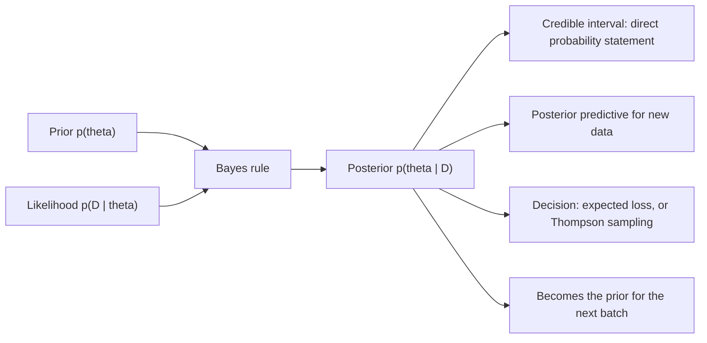

# Bayesian Inference Basics

## TL;DR
Bayesian inference treats the parameter as a random variable with a distribution, and updates that
distribution with data: posterior $\propto$ likelihood $\times$ prior. You get a full posterior
rather than a point estimate, so "there is a 95% probability the lift is between 1.2% and 3.4%" is a
legal sentence — which it is not for a frequentist confidence interval. The costs are choosing a
prior and paying for the computation.

## Intuition
A frequentist asks "if I repeated this experiment forever, how often would I be wrong?" A Bayesian
asks "given what I already believed and what I just saw, what should I believe now?" With a lot of
data the two agree, because the likelihood swamps the prior. With little data, the prior is doing
real work — which is a feature if it encodes genuine knowledge (last quarter's conversion rate is
around 12%, not 60%) and a bug if it encodes wishful thinking.

## The maths

$$
p(\theta \mid D) = \frac{p(D\mid\theta)\,p(\theta)}{p(D)},
\qquad
p(D)=\int p(D\mid\theta)p(\theta)\,d\theta
$$

$p(\theta)$ prior, $p(D\mid\theta)$ likelihood, $p(D)$ marginal likelihood (evidence),
$p(\theta\mid D)$ posterior. The evidence is the hard integral, which is why practical Bayes is
mostly about avoiding it: conjugacy (closed form), MCMC (sample), or variational inference
(approximate with a simpler family by minimising reverse KL — see
[[information-theory-entropy-kl]]).

**Conjugate Beta–Binomial** — the one to be able to derive on the spot. Prior
$\theta\sim\mathrm{Beta}(\alpha,\beta)$, likelihood $k$ successes in $n$ trials:

$$
p(\theta\mid k,n) \propto \underbrace{\theta^{k}(1-\theta)^{n-k}}_{\text{likelihood}}
\cdot \underbrace{\theta^{\alpha-1}(1-\theta)^{\beta-1}}_{\text{prior}}
= \theta^{\alpha+k-1}(1-\theta)^{\beta+n-k-1}
$$

$$
\theta \mid D \;\sim\; \mathrm{Beta}(\alpha+k,\ \beta+n-k)
$$

The prior acts like $\alpha$ prior successes and $\beta$ prior failures — the *pseudo-count*
interpretation, and the cleanest way to explain what a prior "is worth". Posterior mean:

$$
\mathbb{E}[\theta\mid D]=\frac{\alpha+k}{\alpha+\beta+n}
= \underbrace{\frac{n}{\alpha+\beta+n}}_{w}\cdot\frac{k}{n}
+ \Big(1-w\Big)\cdot\frac{\alpha}{\alpha+\beta}
$$

A weighted average of the MLE and the prior mean, with the weight on data growing as $n$ grows.
That is shrinkage, and it is the same mechanism as ridge regression — see
[[maximum-likelihood-estimation]].

**Conjugate Normal–Normal.** Known variance $\sigma^2$, prior $\mu\sim\mathcal{N}(\mu_0,\tau_0^2)$,
$n$ observations with mean $\bar x$. Working in precisions $\lambda=1/\text{variance}$:

$$
\lambda_{\text{post}}=\lambda_0+n\lambda,
\qquad
\mu_{\text{post}}=\frac{\lambda_0\mu_0 + n\lambda\bar{x}}{\lambda_0+n\lambda}
$$

Precisions add; the posterior mean is a precision-weighted average. This is also the Kalman filter
update in disguise.

Other standard conjugate pairs: Poisson–Gamma (rates), Multinomial–Dirichlet (topic models, LDA),
Normal–Inverse-Gamma (unknown variance), Exponential–Gamma.

**Credible interval vs confidence interval.** A 95% credible interval is an interval containing 95%
of the posterior mass: $P(\theta\in[a,b]\mid D)=0.95$ — a statement about $\theta$. A 95% confidence
interval is a procedure that, over repeated sampling, covers the true $\theta$ 95% of the time — a
statement about the *procedure*. Numerically they usually coincide with a flat prior and plenty of
data; conceptually they answer different questions, and this is one of the most-asked stats
questions in DS interviews. See [[confidence-intervals]].

**MAP is not Bayesian inference.** $\arg\max p(\theta\mid D)$ is the posterior *mode* — a point,
discarding the uncertainty that was the point of going Bayesian. It is also not invariant to
reparameterisation, unlike the posterior mean. MAP is a regularised MLE, useful and cheap, but do
not call it a posterior.

**Posterior predictive** — what you actually forecast with:

$$
p(\tilde{y}\mid D)=\int p(\tilde y\mid\theta)\,p(\theta\mid D)\,d\theta
$$

Wider than a plug-in prediction because it integrates over parameter uncertainty. This is why
Bayesian intervals on predictions are better calibrated on small data than plug-in ones.

**Thompson sampling** — the bandit algorithm that falls straight out of the posterior. Keep a
posterior per arm, sample one draw of $\theta$ from each, play the argmax. Exploration comes free
from posterior width: uncertain arms sometimes draw high. Compared to an A/B test it converts
traffic to the winner as it learns, so it minimises regret rather than maximising inferential
cleanliness — the tradeoff is that the arms are no longer balanced, so a clean unbiased effect
estimate afterwards is hard.

## Diagram



## Code

```python
import numpy as np
from scipy import stats

# --- Beta-Binomial: conjugate update in one line ----------------------------
alpha0, beta0 = 12, 88            # weakly informative: ~12% prior rate, worth 100 trials
k, n = 137, 1_000                 # observed

post = stats.beta(alpha0 + k, beta0 + n - k)
print(f"posterior mean {post.mean():.4f}   MLE {k/n:.4f}   prior mean {alpha0/(alpha0+beta0):.4f}")
print("95% credible interval", np.round(post.interval(0.95), 4))
print("P(theta > 0.12 | D) =", round(post.sf(0.12), 4))

# prior strength = pseudo-counts: a strong prior pulls the estimate hard
for a0, b0 in ((1, 1), (12, 88), (120, 880), (1_200, 8_800)):
    m = (a0 + k) / (a0 + b0 + n)
    print(f"prior worth {a0+b0:>5} trials -> posterior mean {m:.4f}")

# --- Bayesian A/B test: P(B beats A) and the expected loss of shipping B ----
ka, na = 1_240, 25_000
kb, nb = 1_355, 25_000
rng = np.random.default_rng(0)
S = 200_000
a_draws = rng.beta(1 + ka, 1 + na - ka, S)
b_draws = rng.beta(1 + kb, 1 + nb - kb, S)

print("P(B > A)          =", round((b_draws > a_draws).mean(), 4))
lift = (b_draws - a_draws) / a_draws
print("95% CrI on rel lift", np.round(np.percentile(lift, [2.5, 97.5]), 4))
print("expected loss if we ship B =", round(np.maximum(a_draws - b_draws, 0).mean(), 6))
# decision rule used in practice: ship when expected loss < a small tolerance

# --- credible vs confidence interval agree with a flat prior and large n ----
p_hat = kb / nb
se = np.sqrt(p_hat * (1 - p_hat) / nb)
print("frequentist CI", np.round(p_hat + np.array([-1.96, 1.96]) * se, 5))
print("credible  CI  ", np.round(stats.beta(1 + kb, 1 + nb - kb).interval(0.95), 5))

# --- Normal-Normal: precisions add ------------------------------------------
mu0, tau0, sigma = 100.0, 20.0, 15.0
x = rng.normal(107.0, sigma, 25)
lam0, lam = 1 / tau0**2, 1 / sigma**2
lam_post = lam0 + len(x) * lam
mu_post = (lam0 * mu0 + len(x) * lam * x.mean()) / lam_post
print(f"prior {mu0} -> posterior mean {mu_post:.3f} +- {1/np.sqrt(lam_post):.3f}"
      f"   (sample mean {x.mean():.3f})")

# --- Thompson sampling vs an even split -------------------------------------
def thompson(true_rates, T=20_000, rng=rng):
    k_arm = np.zeros(len(true_rates)); n_arm = np.zeros(len(true_rates))
    reward = 0
    for _ in range(T):
        draw = rng.beta(1 + k_arm, 1 + n_arm - k_arm)
        arm = int(np.argmax(draw))
        r = rng.random() < true_rates[arm]
        k_arm[arm] += r; n_arm[arm] += 1; reward += r
    return reward, n_arm

rates = [0.10, 0.12, 0.105]
reward, allocation = thompson(rates)
print("Thompson reward", reward, " allocation", allocation.astype(int))
print("even-split expected reward", int(20_000 * np.mean(rates)),
      " oracle", int(20_000 * max(rates)))
```

## In practice
- **Use it when:** data are scarce and you have real prior information (a new market's conversion
  rate, a rarely-firing model); you must make sequential decisions (bandits, ranking cold-start);
  stakeholders want "probability the variant is better" rather than a p-value; you need to pool
  across many small groups (hierarchical models shrink per-city estimates toward the national mean,
  which is the right answer when a city has 30 observations).
- **Defaults that work:** conjugate priors where they exist — a Beta(1,1) or Jeffreys' Beta(0.5,0.5)
  is honest when you know nothing, and an empirically-fitted Beta from last quarter is better when
  you do. Report the posterior mean, a credible interval, and $P(\text{effect} > \text{threshold})$
  — not just the probability of beating zero, which is almost always high.
- **Breaks when:** the prior is doing the work and nobody audits it; the model is
  misspecified (Bayes gives you a confident posterior over the wrong model's parameters); you need a
  decision procedure with a guaranteed frequentist error rate for a compliance claim; MCMC does not
  converge and you ship the chain anyway without checking $\hat R$ and effective sample size.
- **Cost / latency:** conjugate updates are arithmetic and run in a SQL aggregate. MCMC is minutes
  to hours and does not fit an online loop. Variational inference is fast and biased (reverse KL
  underestimates posterior variance — it is mode-seeking). For bandits at scale, conjugate Beta or
  Gaussian posteriors are essentially the only practical choice.

> [!tip]
> The strongest interview framing: "P(B > A) = 0.97 sounds decisive, but it answers the wrong
> question. Ask instead for the expected loss of shipping B — the posterior mass where A actually
> wins, weighted by how much it wins by. That is the number that maps to a business decision."

## Interview angle

**Q. Difference between a credible interval and a confidence interval.**
A credible interval is a statement about the parameter given this data and this prior: 95% of the
posterior mass lies inside. A confidence interval is a statement about the procedure: over repeated
sampling, 95% of such intervals cover the truth. You cannot say "there is a 95% chance $\theta$ is
in this CI" — $\theta$ is fixed, and the interval either covers it or does not. With a flat prior and
a decent sample size the two intervals are usually numerically close.

**Q. Derive the Beta–Binomial posterior.**
Likelihood $\theta^k(1-\theta)^{n-k}$, prior $\theta^{\alpha-1}(1-\theta)^{\beta-1}$; multiply,
collect exponents, and you have the kernel of $\mathrm{Beta}(\alpha+k,\beta+n-k)$. Conjugacy means
the posterior stays in the prior's family, so the update is just adding counts, and the prior reads
as $\alpha$ pseudo-successes and $\beta$ pseudo-failures.

**Follow-up.** How do you pick $\alpha,\beta$? → From history, not from taste. Fit a Beta to the
distribution of conversion rates across past experiments or past segments (empirical Bayes), which
also gives you the right shrinkage automatically. Then state the prior's strength in pseudo-counts
so a reviewer can judge whether it is doing too much work.

**Q. A Bayesian A/B test says P(B > A) = 0.97. Ship?**
Not on that number alone. $P(B>A)$ ignores magnitude — with enough traffic it approaches 1 for an
irrelevantly small lift. Look at the credible interval on the *lift* and at expected loss:
$\mathbb{E}[\max(\theta_A-\theta_B,0)]$, the average harm if you ship B and are wrong. Ship when
expected loss is below a tolerance you agreed in advance, and check the guardrails.

**Q. Does Bayesian analysis let you peek at results continuously?**
The posterior is always a valid summary of the data so far, so there is no "peeking" problem in the
inferential sense. But "stop as soon as $P(B>A)>0.95$" is a data-dependent stopping rule, and the
resulting *decision procedure* has a false-positive rate well above 5% under the null. If you care
about frequentist error control — and a ship/no-ship gate usually does — you need either a genuine
prior and a loss function, or sequential boundaries. See [[ab-testing-pitfalls]].

**Q. Where does the prior come from, and how do you defend it?**
Best case: empirical Bayes — fit the prior to historical data from comparable units, so it is an
estimate, not an opinion. Otherwise use a weakly informative prior that rules out absurdities
(conversion rates above 50%) without favouring any plausible value, and run a sensitivity analysis:
show the posterior under a flat prior, your prior, and a deliberately adversarial one. If the
conclusion flips, say so — that is the honest finding.

**Q. When would you prefer Bayesian to frequentist in a real project?**
Three cases I would name: hierarchical pooling when you have many small groups (per-city demand
models with 30 rows each — partial pooling beats both a global model and 200 separate ones);
sequential decision-making, where Thompson sampling turns the posterior directly into an allocation
policy; and cold-start ranking, where a Beta prior on click-through gives a sane estimate for an item
with 3 impressions instead of a 33% CTR.

## Traps
- **"The 95% CI has a 95% chance of containing the parameter."** That is the credible-interval
  statement; a CI is a property of the procedure.
- **Calling MAP "the Bayesian estimate".** It is a mode, carries no uncertainty, and is not
  invariant under reparameterisation.
- **A flat prior is not "no assumption".** It is uniform on *that* parameterisation; flat on
  $\theta$ is not flat on $\log\text{odds}(\theta)$. Jeffreys' prior is the reparameterisation-invariant
  answer.
- **Reporting $P(B>A)$ alone.** It is unbounded in usefulness as $n$ grows and says nothing about
  magnitude.
- **Using an informative prior in a high-stakes test without disclosing its pseudo-count strength.**
- **Plug-in prediction intervals.** Using the posterior mean parameter and ignoring parameter
  uncertainty gives intervals that are too narrow; use the posterior predictive.
- **Assuming a converged-looking MCMC chain is converged.** Check $\hat R$, effective sample size and
  divergences before trusting anything.
- **Thinking Bayes is immune to model misspecification.** It will hand you a tight posterior around
  the wrong answer.

## Flashcards
Bayes rule for inference::posterior ∝ likelihood × prior; the denominator p(D) is the marginal likelihood.
Beta–Binomial conjugate update::Beta(α, β) + k successes in n trials → Beta(α + k, β + n − k).
Pseudo-count reading of a Beta prior::α prior successes and β prior failures; α + β is the prior's strength in trials.
Posterior mean of a Beta–Binomial::(α + k)/(α + β + n) — a weighted average of the MLE and the prior mean, i.e. shrinkage.
Normal–Normal update::Precisions add: λ_post = λ₀ + nλ, and the posterior mean is the precision-weighted average.
Credible vs confidence interval::Credible is a probability statement about θ given the data; confidence is a coverage property of the procedure across repeated samples.
Is MAP Bayesian inference::No — it is the posterior mode, a point estimate with no uncertainty, and not invariant to reparameterisation.
Posterior predictive distribution::∫ p(ỹ|θ) p(θ|D) dθ — integrates over parameter uncertainty, so it is wider than a plug-in prediction.
Thompson sampling::Sample one parameter draw per arm from its posterior and play the argmax; exploration comes free from posterior width.
Better decision metric than P(B > A)::Expected loss, E[max(θ_A − θ_B, 0)] — it weights the probability of being wrong by how wrong.
Does Bayes solve optional stopping::The posterior stays valid, but a stopping rule based on it still gives the decision procedure an inflated frequentist error rate.
Empirical Bayes::Estimate the prior from historical data across comparable units instead of asserting it.

## Related
- [[bayes-theorem-and-conditional-probability]]
- [[maximum-likelihood-estimation]]
- [[confidence-intervals]]
- [[ab-testing-design]]
- [[ab-testing-pitfalls]]
- [[probability-fundamentals]]
- [[moc-stats]]
