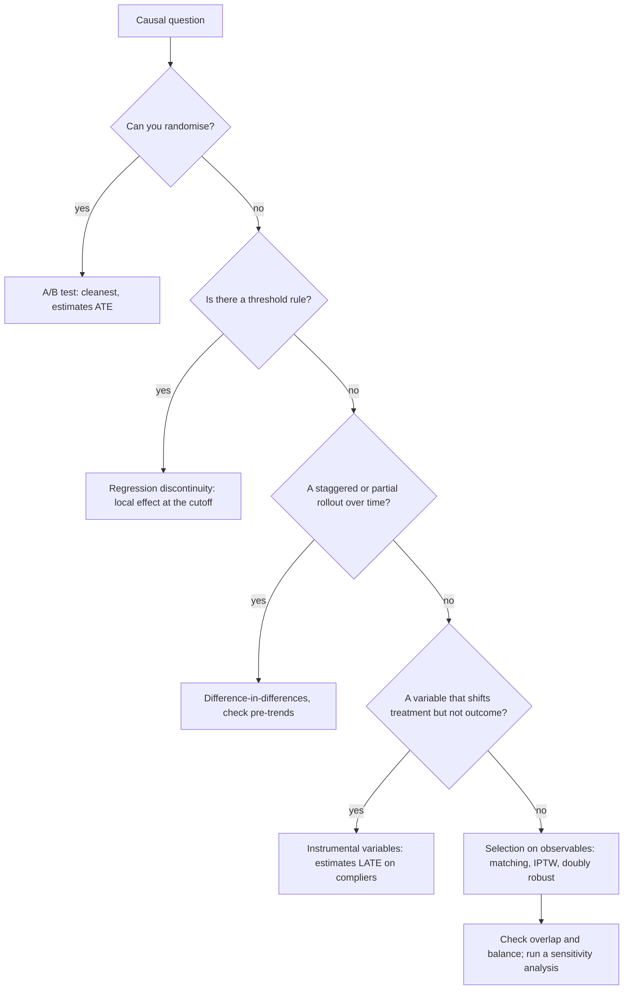

# Causal Inference Basics

## TL;DR
A causal question asks what would happen *if you intervened*, which observational correlation cannot
answer because of confounding. An RCT solves it by design. When you cannot randomise, you need an
identification strategy — a defensible argument that some quasi-random variation exists: a
before/after comparison against a control group (diff-in-diff), matching on measured confounders
(propensity scores), an instrument, or a cutoff (RDD). The assumption behind the method matters more
than the estimator.

## Intuition
Every unit has two potential outcomes — what happens if treated, what happens if not — and you only
ever observe one. That missing half is the *fundamental problem of causal inference*, and every
method here is a different way of manufacturing a credible stand-in for it. Randomisation makes the
treated and untreated groups exchangeable on average, so the other group's outcome is a fair
substitute. Without randomisation you have to argue for exchangeability, and the argument is the
work.

## The maths

**Potential outcomes (Rubin).** For unit $i$, $Y_i(1)$ and $Y_i(0)$. Observed:
$Y_i = T_i Y_i(1) + (1-T_i)Y_i(0)$. Estimands:

$$
\mathrm{ATE}=\mathbb{E}[Y(1)-Y(0)],
\qquad
\mathrm{ATT}=\mathbb{E}[Y(1)-Y(0)\mid T=1]
$$

ATE is the effect if you treated everyone; ATT is the effect on those actually treated. They differ
whenever treatment effects are heterogeneous and selection is not random — matching and DiD estimate
ATT; an RCT estimates ATE on its eligible population.

**Why a naive comparison fails.**

$$
\underbrace{\mathbb{E}[Y\mid T{=}1]-\mathbb{E}[Y\mid T{=}0]}_{\text{observed difference}}
= \underbrace{\mathrm{ATT}}_{\text{causal}}
+ \underbrace{\mathbb{E}[Y(0)\mid T{=}1]-\mathbb{E}[Y(0)\mid T{=}0]}_{\text{selection bias}}
$$

Randomisation sets the second term to zero. Nothing else does automatically.

**Identification assumptions** (the "selection on observables" package):
1. **Unconfoundedness / ignorability:** $(Y(1),Y(0)) \perp T \mid X$ — conditional on measured $X$,
   assignment is as good as random. Untestable.
2. **Positivity / overlap:** $0 < P(T=1\mid X) < 1$ for all $X$ with support. Testable — plot the
   propensity distributions by arm.
3. **SUTVA:** no interference between units, one version of treatment. See [[ab-testing-pitfalls]].
4. **Consistency:** $Y = Y(T)$, the observed outcome is the potential outcome for the received
   treatment.

### DAGs and the backdoor criterion

A DAG encodes which variables cause which. Three structures matter:

- **Chain / mediator** $T \to M \to Y$: $M$ is on the causal path. Conditioning on it **removes**
  part of the effect you want. Never control for a post-treatment variable.
- **Fork / confounder** $T \leftarrow X \to Y$: $X$ causes both. Not conditioning on it leaves a
  **backdoor path** open and biases the estimate. Control for it.
- **Collider** $T \to C \leftarrow Y$: $C$ is caused by both. Conditioning on it **creates**
  spurious association where none existed. Do not control for it.

**Backdoor criterion.** A set $Z$ identifies the effect of $T$ on $Y$ if $Z$ blocks every path from
$T$ to $Y$ that starts with an arrow *into* $T$ (backdoor paths) and $Z$ contains no descendant of
$T$. Then

$$
P(Y \mid do(T{=}t)) = \sum_z P(Y\mid T{=}t, Z{=}z)\,P(z)
$$

This is the adjustment formula. The practical upshot for interviews: **"control for everything you
have" is wrong**. Adding a collider or a mediator makes the estimate worse, and more features is not
more rigour.

### Difference-in-differences

Two groups, two periods, treatment applied to one group in the second period:

$$
\widehat{\mathrm{ATT}}=
\big(\bar Y_{\text{treat,post}}-\bar Y_{\text{treat,pre}}\big)
-\big(\bar Y_{\text{ctrl,post}}-\bar Y_{\text{ctrl,pre}}\big)
$$

Equivalently the interaction coefficient in

$$
Y_{it}=\beta_0+\beta_1\,\text{Treat}_i+\beta_2\,\text{Post}_t+\underbrace{\delta}_{\text{ATT}}(\text{Treat}_i\times\text{Post}_t)+\varepsilon_{it}
$$

**Key assumption: parallel trends** — absent treatment, both groups' outcomes would have moved
together. Untestable for the post period, but you support it by showing parallel *pre*-trends over
several periods (an event-study plot with leads and lags). Standard errors must be clustered at the
treated unit level, otherwise they are badly understated. Use it when a feature rolls out to one
city/segment/tenant and not another.

### Propensity scores

$e(X)=P(T=1\mid X)$. Rosenbaum–Rubin: if unconfoundedness holds given $X$, it also holds given
$e(X)$ alone — a $d$-dimensional matching problem collapses to one dimension.

Uses: 1:1 or k:1 **matching** on $e(X)$ within a caliper; **stratification** into propensity
quintiles; **IPTW** weighting with $w_i = \frac{T_i}{e_i}+\frac{1-T_i}{1-e_i}$, which reweights the
sample to look randomised.

Always check **covariate balance after** adjustment (standardised mean differences below ~0.1) and
**overlap before** it — if treated units have propensities near 1 with no comparable controls, no
estimator can rescue you, and IPTW weights explode. Propensity scores do **nothing** about
unmeasured confounding; they are a data-reduction convenience, not an identification strategy.
Prefer **doubly robust** estimators (AIPW) which stay consistent if *either* the propensity model
or the outcome model is right.

### Instrumental variables

An instrument $Z$ must satisfy:
1. **Relevance:** $Z$ affects $T$ (testable — first-stage F statistic, rule of thumb F > 10).
2. **Exclusion:** $Z$ affects $Y$ *only* through $T$ (untestable, argued).
3. **Independence:** $Z$ is as good as randomly assigned with respect to unobserved confounders.

Two-stage least squares: regress $T$ on $Z$ to get $\hat T$, then $Y$ on $\hat T$. For a binary
instrument the Wald estimator is

$$
\hat\beta_{\mathrm{IV}}=\frac{\operatorname{Cov}(Y,Z)}{\operatorname{Cov}(T,Z)}
= \frac{\mathbb{E}[Y\mid Z{=}1]-\mathbb{E}[Y\mid Z{=}0]}{\mathbb{E}[T\mid Z{=}1]-\mathbb{E}[T\mid Z{=}0]}
$$

— intention-to-treat effect divided by the compliance rate. The estimand is the **LATE**, the effect
on compliers only, not the ATE. The canonical product example: **encouragement designs** — randomise
who gets a push notification promoting a feature, instrument actual feature adoption with the
notification, and recover the effect of adoption among those the nudge moved. Weak instruments
(small first stage) are worse than no IV: the bias is amplified, not reduced.

### Regression discontinuity

When treatment is assigned by a threshold on a running variable $X$ (credit score ≥ 700 → approved;
spend ≥ ₹5,000 → loyalty tier), units just either side of the cutoff $c$ are comparable:

$$
\tau = \lim_{x\downarrow c}\mathbb{E}[Y\mid X{=}x] - \lim_{x\uparrow c}\mathbb{E}[Y\mid X{=}x]
$$

Estimate with local linear regression on each side within a bandwidth. Assumption: no precise
manipulation of $X$ around the cutoff — test with a **McCrary density test** (a spike in the density
just above the cutoff means gaming). Estimand is local to the cutoff, so it may not generalise to
units far from it. Fuzzy RDD (the cutoff shifts probability rather than determining treatment) is
IV with the threshold as the instrument.

## Diagram



## Code

```python
import numpy as np
import pandas as pd
from scipy import stats

rng = np.random.default_rng(0)

# ---------------------------------------------------------------------------
# CONFOUNDING: a confounded naive estimate, then adjustment
# ---------------------------------------------------------------------------
n = 20_000
X = rng.normal(0, 1, n)                        # confounder: e.g. prior engagement
e = 1 / (1 + np.exp(-(0.9 * X - 0.2)))         # treatment depends on X
T = (rng.random(n) < e).astype(int)
TRUE_EFFECT = 1.5
Y = 2.0 * X + TRUE_EFFECT * T + rng.normal(0, 1, n)

naive = Y[T == 1].mean() - Y[T == 0].mean()
print(f"true effect {TRUE_EFFECT}   naive difference {naive:.3f}  <- biased by the confounder")

# regression adjustment
D = np.c_[np.ones(n), T, X]
beta = np.linalg.lstsq(D, Y, rcond=None)[0]
print(f"OLS adjusted for X: {beta[1]:.3f}")

# IPTW using an estimated propensity score
from sklearn.linear_model import LogisticRegression
ps = LogisticRegression().fit(X.reshape(-1, 1), T).predict_proba(X.reshape(-1, 1))[:, 1]
w = T / ps + (1 - T) / (1 - ps)
iptw = (np.sum(w * T * Y) / np.sum(w * T)) - (np.sum(w * (1 - T) * Y) / np.sum(w * (1 - T)))
print(f"IPTW: {iptw:.3f}   overlap: ps in [{ps.min():.3f}, {ps.max():.3f}]")

# balance check: standardised mean difference before and after weighting
def smd(x, t, weights=None):
    if weights is None:
        weights = np.ones_like(x, float)
    m1 = np.average(x[t == 1], weights=weights[t == 1])
    m0 = np.average(x[t == 0], weights=weights[t == 0])
    return (m1 - m0) / np.sqrt((x[t == 1].var() + x[t == 0].var()) / 2)
print(f"SMD unweighted {smd(X, T):.3f} -> weighted {smd(X, T, w):.3f}  (target |SMD| < 0.1)")

# ---------------------------------------------------------------------------
# CONTROLLING FOR A COLLIDER MAKES THINGS WORSE
# ---------------------------------------------------------------------------
T2 = rng.normal(size=n)
Y2 = 0.0 * T2 + rng.normal(size=n)             # TRUE EFFECT IS ZERO
C = T2 + Y2 + rng.normal(size=n)               # collider: caused by both
print("no control     ", round(np.linalg.lstsq(np.c_[np.ones(n), T2], Y2, rcond=None)[0][1], 3))
print("control for C  ", round(np.linalg.lstsq(np.c_[np.ones(n), T2, C], Y2, rcond=None)[0][1], 3))
# the second is strongly negative: a fabricated effect, purely from conditioning

# ---------------------------------------------------------------------------
# DIFFERENCE-IN-DIFFERENCES
# ---------------------------------------------------------------------------
m = 4_000
treat = rng.integers(0, 2, m)
unit_fx = rng.normal(0, 2, m) + 1.5 * treat    # treated units differ at baseline
pre = unit_fx + rng.normal(0, 1, m)
post = unit_fx + 3.0 + 0.8 * treat + rng.normal(0, 1, m)   # common shock 3.0, ATT 0.8

did = (post[treat == 1].mean() - pre[treat == 1].mean()) \
    - (post[treat == 0].mean() - pre[treat == 0].mean())
print(f"DiD estimate {did:.3f} (true ATT 0.8);  naive post-only "
      f"{post[treat==1].mean() - post[treat==0].mean():.3f}")

# same thing as the interaction coefficient in a pooled regression
long = pd.DataFrame({
    "y": np.r_[pre, post],
    "treat": np.r_[treat, treat],
    "post": np.r_[np.zeros(m), np.ones(m)],
})
Dm = np.c_[np.ones(2 * m), long.treat, long.post, long.treat * long.post]
print("interaction coefficient", round(np.linalg.lstsq(Dm, long.y, rcond=None)[0][3], 3))

# ---------------------------------------------------------------------------
# INSTRUMENTAL VARIABLES (encouragement design) -- 2SLS by hand
# ---------------------------------------------------------------------------
k = 20_000
U = rng.normal(size=k)                          # UNOBSERVED confounder
Z = rng.integers(0, 2, k)                       # randomised nudge = instrument
adopt = ((0.3 + 0.45 * Z + 0.5 * U + rng.normal(0, 0.4, k)) > 0.8).astype(int)
Yv = 1.2 * adopt + 1.0 * U + rng.normal(0, 1, k)   # true effect 1.2

print("naive OLS (confounded)",
      round(np.linalg.lstsq(np.c_[np.ones(k), adopt], Yv, rcond=None)[0][1], 3))
first = np.linalg.lstsq(np.c_[np.ones(k), Z], adopt, rcond=None)[0]
t_hat = first[0] + first[1] * Z
print("first-stage shift in adoption:", round(first[1], 3))   # relevance
wald = (Yv[Z == 1].mean() - Yv[Z == 0].mean()) / (adopt[Z == 1].mean() - adopt[Z == 0].mean())
print("Wald / 2SLS LATE", round(wald, 3), " (true 1.2)")

# ---------------------------------------------------------------------------
# REGRESSION DISCONTINUITY
# ---------------------------------------------------------------------------
r = 20_000
run = rng.uniform(-1, 1, r)                     # running variable, cutoff at 0
Trd = (run >= 0).astype(int)
Yrd = 1.0 + 2.0 * run + 0.7 * Trd + rng.normal(0, 0.5, r)   # jump of 0.7 at the cutoff

for bw in (0.5, 0.2, 0.05):
    m_ = np.abs(run) < bw
    # local LINEAR on each side, allowing different slopes
    Dr = np.c_[np.ones(m_.sum()), Trd[m_], run[m_], Trd[m_] * run[m_]]
    print(f"bandwidth {bw}: RD estimate {np.linalg.lstsq(Dr, Yrd[m_], rcond=None)[0][1]:.3f}")
```

## In practice
- **Use it when:** you cannot randomise — the feature is already live everywhere, the intervention is
  a pricing or policy change, the unit is a city, the outcome is long-horizon, or randomising is
  unethical or contractually impossible.
- **Defaults that work:** state the estimand (ATE/ATT/LATE) first; draw the DAG before touching the
  data; check overlap before adjusting and balance after; cluster standard errors at the treatment
  assignment level; always run a placebo/negative-control test (apply the method to a pre-period or
  an outcome the treatment cannot affect and confirm you estimate zero).
- **Breaks when:** unmeasured confounding (the default state of observational data); no overlap;
  interference; the parallel-trends assumption fails because the treated group was selected *because*
  it was trending differently; weak instruments. Report a sensitivity analysis — how strong would an
  unmeasured confounder need to be to overturn this? (Rosenbaum bounds, E-value.)
- **Cost / latency:** cheap to compute, expensive in judgement and review. On a lakehouse the whole
  thing is usually one Delta table of unit × period and a regression; the months go into arguing the
  identification.

> [!warning]
> The most common failure is not a wrong estimator, it is controlling for the wrong variables.
> Throwing every available column into the regression will happily include mediators and colliders,
> and a model-selection procedure like lasso has no idea which is which. Causal variable selection
> is a modelling decision, not a fitting decision.

## Interview angle

**Q. Correlation is not causation — so how do you actually measure the effect of a feature you already shipped to everyone?**
Find quasi-random variation. If it rolled out city by city, difference-in-differences with pre-trend
checks. If eligibility had a threshold, regression discontinuity. If there was a randomised
promotion or nudge, instrument adoption with the nudge and estimate the LATE. If none of those
exist, fall back to selection on observables with matching or a doubly robust estimator, and be
explicit that it rests on an untestable unconfoundedness assumption — then add a sensitivity
analysis. The last resort is to run a holdback going forward.

**Q. Should you control for every variable you have?**
No. Control for confounders (common causes of treatment and outcome). Do **not** control for
mediators — they are on the causal path, and conditioning on them removes the very effect you are
measuring. Do **not** control for colliders — conditioning on a common effect manufactures an
association. My example: measuring a recommender's effect on revenue, controlling for
"clicks" (a mediator) makes the effect vanish, and controlling for "became a power user" (a
collider) can flip its sign.

**Q. Explain difference-in-differences and its key assumption.**
Take the change over time in the treated group and subtract the change over the same period in an
untreated control group; the difference removes both time-invariant group differences and common
time shocks. The assumption is parallel trends: absent treatment, the two groups' outcomes would
have moved in parallel. You cannot test it for the post period, so you show several pre-periods
moving together in an event-study plot, and you run placebo DiDs on fake treatment dates. Cluster
standard errors at the unit level.

**Follow-up.** What if the treated city was picked *because* it was growing fastest? → Then parallel
trends is violated by construction and DiD is biased upward. Options: synthetic control, which builds
a weighted combination of untreated cities matching the treated city's pre-period trajectory; or
DiD on a matched subset of comparable cities.

**Q. What does a propensity score buy you, and what does it not?**
It reduces conditioning on a high-dimensional $X$ to conditioning on one scalar, which makes
matching and weighting practical and makes overlap easy to visualise. It buys you nothing at all
against unmeasured confounding — if the real driver is not in $X$, the propensity model cannot know
it. It is a dimension-reduction tool, not an identification strategy. Prefer doubly robust
estimators, and always show balance after adjustment.

**Q. Give me an instrument you would actually use in a product setting.**
An encouragement design: randomise a push notification promoting a new feature. The notification is
randomly assigned (independence), it plainly moves adoption (relevance — check the first-stage F),
and you argue it does not otherwise change the outcome (exclusion — arguable if the notification
itself drives engagement, which is exactly the weak point). The estimate is the effect of adoption
on *compliers* — people who adopted because of the nudge — not on everyone.

**Q. When is regression discontinuity the right tool?**
Whenever a business rule creates a sharp threshold: credit approval at a score cutoff, a free-shipping
threshold, a loyalty tier at a spend level, an ad auction reserve price. Units just above and just
below the cutoff are effectively randomised. Caveats: the estimate is local to the cutoff and may not
extrapolate; and you must check for manipulation of the running variable with a density test — if
customers add ₹50 to their cart to clear a ₹5,000 threshold, they are selecting themselves and the
design is broken.

**Q. An RCT is impossible for measuring retention effects because the horizon is six months. What do you do?**
Randomise anyway but on a long-lived holdout: keep 1–2% of users permanently out of the feature and
measure the gap over months. That is the standard product answer. It costs almost no traffic, it is
a genuine RCT, and it also answers the harder question of cumulative effect that short experiments
cannot.

## Traps
- **"I controlled for everything, so it is causal."** Controlling for a mediator or collider is worse
  than controlling for nothing.
- **Conditioning on a post-treatment variable.** Includes the common A/B mistake of filtering to
  "users who engaged with the feature".
- **Treating a propensity score model's high AUC as a good sign.** A propensity model that separates
  the groups perfectly means *no overlap*, which means the effect is not identified.
- **Assuming parallel trends because two pre-periods looked similar.** Show many, and run placebo
  tests.
- **Using a weak instrument.** With a small first stage, the IV estimate has a large bias in the
  direction of OLS plus enormous variance.
- **Reporting an IV estimate as the ATE.** It is the LATE on compliers, and the complier population
  is defined by the instrument.
- **Ignoring clustering in DiD standard errors.** Serial correlation within units makes naive SEs far
  too small; this is a well-known result and interviewers at analytics-heavy firms do probe it.
- **Reading SHAP values as causal effects.** They explain the model's function, not the world; a
  model can lean heavily on a proxy for a confounder. See
  [[model-interpretability-shap-lime]].

## Flashcards
Fundamental problem of causal inference::For each unit you observe only one potential outcome — Y(1) or Y(0), never both.
ATE vs ATT vs LATE::Effect on everyone; effect on the treated; effect on compliers (what IV estimates).
Why a naive treated-vs-untreated difference is biased::It equals ATT plus selection bias, E[Y(0)|T=1] − E[Y(0)|T=0]; randomisation zeroes the second term.
Confounder, mediator, collider::Common cause — control for it; on the causal path — never control; common effect — controlling creates spurious association.
Backdoor criterion::Z identifies the effect if it blocks all paths into T and contains no descendant of T.
Difference-in-differences key assumption::Parallel trends — absent treatment both groups would have moved together; supported by pre-trend event-study plots, never proven.
Propensity score theorem::If unconfoundedness holds given X, it holds given e(X) = P(T=1|X) alone — a scalar replaces a vector.
What propensity scores do NOT fix::Unmeasured confounding. They are dimension reduction, not identification.
IPTW weights::T/e + (1−T)/(1−e), reweighting the sample to resemble a randomised one; unstable when propensities approach 0 or 1.
Three IV assumptions::Relevance (testable, first-stage F > 10), exclusion (untestable), and independence of the instrument.
Wald IV estimator::(ITT on Y) / (ITT on treatment) — the intention-to-treat effect divided by the compliance rate.
Regression discontinuity idea::Units just either side of an assignment threshold are comparable; estimate the jump in the outcome at the cutoff.
RDD validity check::McCrary density test for manipulation of the running variable around the cutoff.
Doubly robust estimator::Consistent if either the propensity model or the outcome model is correctly specified (AIPW).
Product answer for long-horizon causal effects::A permanent 1–2% holdout — a real RCT that costs almost no traffic.

## Related
- [[ab-testing-design]]
- [[ab-testing-pitfalls]]
- [[bayes-theorem-and-conditional-probability]]
- [[linear-regression]]
- [[model-interpretability-shap-lime]]
- [[hypothesis-testing]]
- [[moc-stats]]
