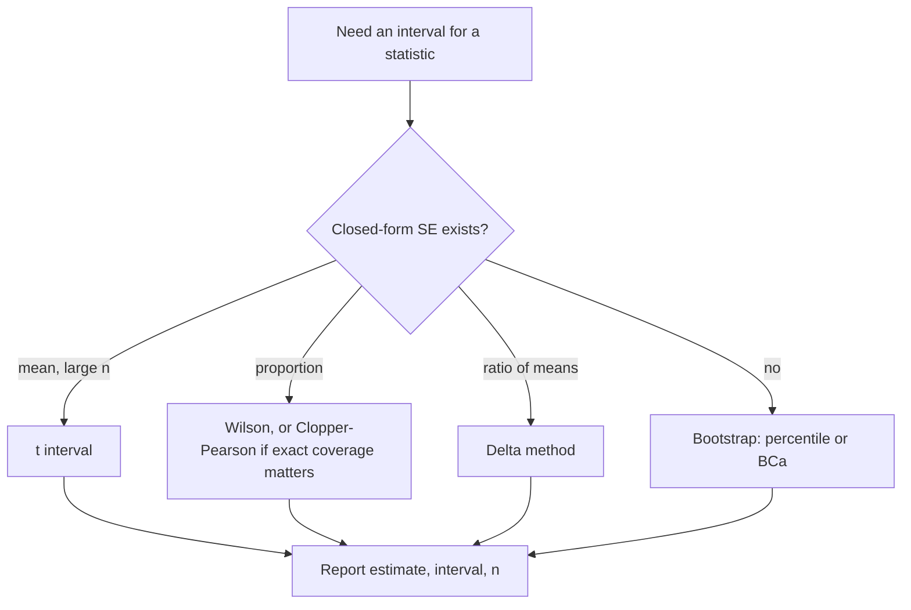

# Confidence Intervals

## TL;DR
A 95% CI is an interval produced by a procedure that, under repeated sampling, would contain the
true parameter 95% of the time. It is a statement about the *procedure*, not a 95% probability that
the parameter lies in this particular interval — that is the Bayesian credible interval. In
interviews, report CIs instead of p-values wherever you can: they carry the effect size and the
precision in one object.

## Intuition
Imagine running your experiment 100 times and drawing an interval each time. About 95 of those
intervals cover the truth; you cannot know whether yours is one of them. Width tells you how much
you learned: a CI of $[-0.1\%, +12\%]$ on uplift is not "no effect", it is "we ran an
underpowered test and learned almost nothing".

## The maths

**Generic form.** For an estimator $\hat\theta$ that is approximately normal,

$$
\hat{\theta} \pm z_{1-\alpha/2}\,\mathrm{SE}(\hat\theta),
\qquad z_{0.975} = 1.96
$$

**Mean, $\sigma$ unknown.** Use the t-distribution because $s$ is itself random:

$$
\bar{x} \pm t_{1-\alpha/2,\,n-1}\,\frac{s}{\sqrt{n}}
$$

**Proportion.** The Wald interval $\hat p \pm z\sqrt{\hat p(1-\hat p)/n}$ is the one everybody
writes and it is bad: at $\hat p = 0$ it has zero width, and its actual coverage can drop well below
95% for small $n$ or extreme $p$. The **Wilson score interval** inverts the test rather than
plugging in $\hat p$, and behaves:

$$
\frac{\hat{p} + \frac{z^2}{2n} \;\pm\; z\sqrt{\dfrac{\hat p(1-\hat p)}{n} + \dfrac{z^2}{4n^2}}}{1 + \frac{z^2}{n}}
$$

**Difference of two means** (Welch, unequal variances — the default you should use):

$$
(\bar{x}_1 - \bar{x}_2) \pm t_{\nu}\sqrt{\frac{s_1^2}{n_1} + \frac{s_2^2}{n_2}},
\qquad
\nu = \frac{\left(\frac{s_1^2}{n_1}+\frac{s_2^2}{n_2}\right)^2}
           {\frac{(s_1^2/n_1)^2}{n_1-1}+\frac{(s_2^2/n_2)^2}{n_2-1}}
$$

**Duality with tests.** A $(1-\alpha)$ CI is exactly the set of null values that would *not* be
rejected at level $\alpha$. So "0 is outside the 95% CI" and "$p<0.05$ two-sided" are the same
statement — see [[hypothesis-testing]].

**Bootstrap intervals**, when no closed form exists (medians, ratios, AUC, a whole pipeline):
percentile is the simplest ($[q_{2.5}, q_{97.5}]$ of the bootstrap replicates) but is biased when
the statistic's distribution is skewed; BCa corrects for bias and skewness and is the default
worth knowing by name. See [[resampling-bootstrap-and-permutation]].

## Diagram



## Code

```python
import numpy as np
from scipy import stats

rng = np.random.default_rng(0)

# --- 1. t interval for a mean -------------------------------------------------
x = rng.normal(50, 12, 200)
m, se = x.mean(), stats.sem(x)                  # sem uses ddof=1
lo, hi = stats.t.interval(0.95, df=len(x) - 1, loc=m, scale=se)
print(f"mean {m:.2f}  95% CI [{lo:.2f}, {hi:.2f}]")

# --- 2. proportion: Wald vs Wilson vs exact ----------------------------------
def wald(k, n, conf=0.95):
    p = k / n
    z = stats.norm.ppf(1 - (1 - conf) / 2)
    h = z * np.sqrt(p * (1 - p) / n)
    return p - h, p + h

def wilson(k, n, conf=0.95):
    p = k / n
    z = stats.norm.ppf(1 - (1 - conf) / 2)
    d = 1 + z**2 / n
    centre = (p + z**2 / (2 * n)) / d
    half = z * np.sqrt(p * (1 - p) / n + z**2 / (4 * n**2)) / d
    return centre - half, centre + half

k, n = 2, 100
print("wald  ", np.round(wald(k, n), 4))        # can go negative / too narrow
print("wilson", np.round(wilson(k, n), 4))
# Clopper-Pearson (exact, conservative) straight from scipy:
print("exact ", stats.binomtest(k, n).proportion_ci(method="exact"))

# --- 3. coverage check: does the procedure do what it claims? ----------------
def coverage(interval_fn, p_true=0.02, n=200, reps=20_000):
    ks = rng.binomial(n, p_true, reps)
    los, his = zip(*(interval_fn(k, n) for k in ks))
    return np.mean((np.array(los) <= p_true) & (p_true <= np.array(his)))

print("wald coverage  :", coverage(wald))       # well below 0.95
print("wilson coverage:", coverage(wilson))     # close to 0.95

# --- 4. bootstrap CI for a statistic with no formula: the median -------------
y = rng.lognormal(7, 1.1, 500)
res = stats.bootstrap((y,), np.median, confidence_level=0.95,
                      n_resamples=10_000, method="BCa", random_state=0)
print("median", np.median(y).round(1), "CI", np.round(res.confidence_interval, 1))
```

## In practice
- **Use it when:** reporting any estimate to a decision maker. "Uplift 2.1% (95% CI 0.3% to 3.9%)"
  starts a useful conversation; "p = 0.03" starts an argument.
- **Defaults that work:** Wilson for proportions; Welch t for differences of means; bootstrap BCa
  by the randomisation unit for ratios, medians and model metrics like AUC and F1. In an A/B
  readout, always show the CI on the *difference*, not two separate CIs per arm.
- **Breaks when:** observations are dependent (CI far too narrow — bootstrap whole clusters), the
  interval was chosen after looking at the data, or you are peeking repeatedly over time
  (nominal 95% coverage is not maintained — see [[ab-testing-pitfalls]]).
- **Cost / latency:** closed forms are free; a BCa bootstrap at 10k resamples on a few hundred
  thousand rows is seconds in NumPy, minutes if you naively loop in pandas. Vectorise or
  precompute per-unit aggregates first.

> [!warning]
> Two CIs that overlap do **not** imply a non-significant difference. The CI of the difference can
> exclude zero while the individual arm CIs overlap, because
> $\mathrm{SE}_{\text{diff}}=\sqrt{\mathrm{SE}_1^2+\mathrm{SE}_2^2}$ is smaller than
> $\mathrm{SE}_1+\mathrm{SE}_2$. Always compute the interval on the difference.

## Interview angle

**Q. Interpret a 95% confidence interval.**
It comes from a procedure whose intervals cover the true parameter 95% of the time under repeated
sampling. For this specific interval the parameter is either in it or not — there is no probability
left, because in the frequentist framework the parameter is fixed and the interval is random. If you
want "95% probability the parameter is in this range", that is a credible interval and it requires
a prior. See [[bayesian-inference-basics]].

**Follow-up.** So is the distinction ever practically material? → With a flat prior and a
well-behaved likelihood, the numbers usually coincide. It matters when the prior is genuinely
informative (rare events, small samples, hierarchical borrowing across markets) and when a
stakeholder wants to act on "probability the variant is better", which only the Bayesian
quantity answers directly.

**Q. Your A/B test gives uplift 1.5%, 95% CI [−0.4%, 3.4%]. What do you tell the PM?**
That the test is inconclusive, not that there is no effect. The interval is consistent with anything
from a small loss to a solid win, so the honest statement is "we could not distinguish this from
zero at the sample size we had". Then compare the interval to the minimum detectable effect that
was pre-registered: if the MDE was 3%, the test was never able to detect a 1.5% effect and the
right action is to run longer or reduce variance, not to ship or kill.

**Q. 2 conversions out of 100. Give me a 95% CI.**
Not the Wald interval — at $\hat p = 0.02$ it gives roughly $[-0.007, 0.047]$, which includes
negative probabilities. Use Wilson, which gives roughly $[0.006, 0.070]$, or Clopper–Pearson if you
need guaranteed coverage at the cost of width. The general lesson: normal approximations fail when
$np < 10$.

**Q. How do you put a confidence interval on your model's AUC?**
Bootstrap the test set, recomputing AUC on each resample, and take the BCa interval — resampling by
the unit that is independent (usually user, not row). A closed-form alternative is the
Hanley–McNeil / DeLong variance, and DeLong's test is the standard way to compare two AUCs on the
same test set because it accounts for the correlation between them. See [[roc-auc-and-pr-curves]].

**Q. Does a wider CI mean a worse model?**
No — it means a less precise estimate, usually because $n$ is small or variance is high. Precision
and quality are separate axes. A tightly estimated bad number is worse than a loosely estimated
good one.

## Traps
- **"95% probability the true value is in this interval."** The single most common rejection on
  this topic. Correct it to the repeated-sampling statement, then mention credible intervals.
- **Overlapping CIs → no difference.** False. Test the difference directly.
- **Wald intervals for rare events.** Negative lower bounds, bad coverage. Use Wilson or exact.
- **Reporting CIs computed on dependent rows.** Multiple sessions per user makes the interval far
  too narrow. Bootstrap by user.
- **Building the CI after choosing the metric or the cut that looked best.** That is selective
  inference; the stated coverage is fiction. Pre-register, or correct — see
  [[multiple-testing-correction]].
- **Symmetric CIs for ratios and odds.** Build the interval on the log scale and exponentiate; the
  result is asymmetric and correctly bounded away from zero.
- **Reading a CI that excludes zero as "practically important".** Statistical significance is not
  business significance; compare the lower bound to the effect that pays for the launch cost.

## Flashcards
Correct interpretation of a 95% CI::A procedure whose intervals cover the true parameter 95% of the time in repeated sampling, not a 95% probability for this one interval.
CI–test duality::A (1−α) CI is the set of null values not rejected at level α, so "0 outside the 95% CI" = "p < 0.05 two-sided".
Why Wilson beats Wald::Wilson inverts the score test instead of plugging in p̂, so it stays inside [0,1] and keeps near-nominal coverage for small n or extreme p.
Do overlapping arm CIs imply no significant difference::No — SE of the difference is √(SE₁²+SE₂²), smaller than the sum, so the difference can still exclude zero.
Welch degrees of freedom::The Satterthwaite approximation, so no equal-variance assumption is needed; it is the safe default.
CI for a median or AUC::Bootstrap (BCa) resampling the independent unit; for comparing two AUCs on one test set, DeLong.
Credible interval vs confidence interval::The credible interval is a probability statement about the parameter given a prior; the confidence interval is a coverage property of the procedure.
What a wide CI tells a PM::The experiment was imprecise — inconclusive, not null; compare its width to the pre-registered MDE.

## Related
- [[hypothesis-testing]]
- [[p-values-and-significance]]
- [[resampling-bootstrap-and-permutation]]
- [[bayesian-inference-basics]]
- [[central-limit-theorem]]
- [[ab-testing-design]]
- [[moc-stats]]
