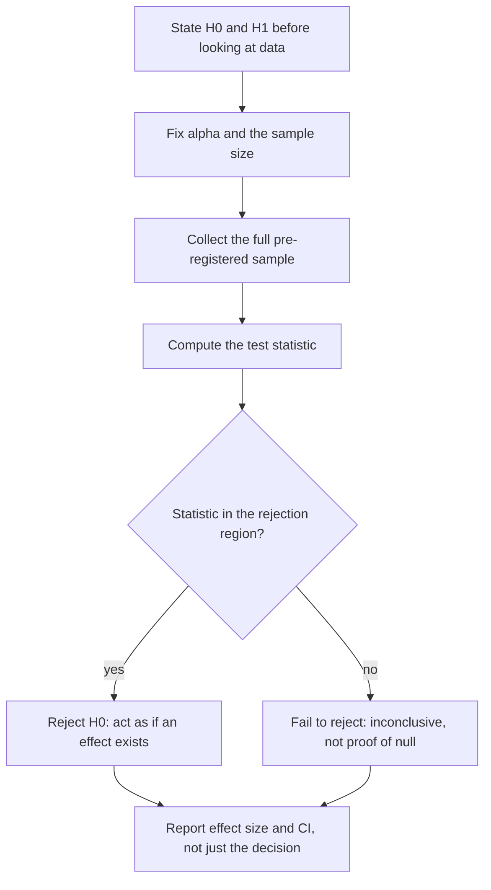

# Hypothesis Testing

## TL;DR
A hypothesis test is a decision rule: assume the null, compute how extreme your data look under it,
and reject if that is extreme beyond a pre-chosen threshold $\alpha$. The framework controls the
long-run rate of false alarms, nothing more. It never tells you the probability that the null is
true, and failing to reject is not evidence of no effect.

## Intuition
It is a proof by contradiction with a tolerance. "If nothing were happening, would data this
lopsided show up more than 5% of the time?" If no, we act as if something is happening. The
tolerance is a business choice about which mistake hurts more — shipping a dud, or missing a win.

## The maths

**Setup.** $H_0$: a precise statement about a parameter ($\theta = \theta_0$), $H_1$: the
alternative. A test statistic $T(X)$ has a known (or approximable) distribution *under $H_0$*, the
null distribution. Reject when $T$ falls in the rejection region $R$ with

$$
P(T \in R \mid H_0) = \alpha
$$

$\alpha$ is chosen *before* seeing the data. The p-value is the smallest $\alpha$ at which you
would reject — see [[p-values-and-significance]].

**Two-sample z for proportions** (the A/B test workhorse):

$$
Z = \frac{\hat{p}_1 - \hat{p}_2}
         {\sqrt{\hat{p}(1-\hat{p})\left(\frac{1}{n_1}+\frac{1}{n_2}\right)}},
\qquad
\hat{p} = \frac{x_1+x_2}{n_1+n_2}
$$

The pooled $\hat p$ is used because under $H_0$ both arms share one rate. For the *confidence
interval* you use unpooled variance — a favourite "gotcha" question.

**Welch's t** for two means without assuming equal variance:

$$
t = \frac{\bar{x}_1-\bar{x}_2}{\sqrt{\frac{s_1^2}{n_1}+\frac{s_2^2}{n_2}}}
$$

**Neyman–Pearson lemma.** Among all tests of size $\alpha$ for a *simple* $H_0$ vs a simple $H_1$,
the likelihood-ratio test is most powerful:

$$
\Lambda(x) = \frac{L(\theta_1 \mid x)}{L(\theta_0 \mid x)} > k
$$

This is why the standard tests look the way they do — t, z, $\chi^2$ and F all drop out of
likelihood ratios for their respective models.

**Wilks' theorem** generalises it to composite hypotheses: under $H_0$ and regularity conditions,

$$
-2\log\Lambda \;\xrightarrow{d}\; \chi^2_{d}
$$

with $d$ the difference in free parameters. This is the engine behind the likelihood-ratio test in
logistic regression, the deviance test for GLMs, and nested-model comparison generally —
see [[generalized-linear-models]].

**One- vs two-sided.** A one-sided test at $\alpha$ puts all the mass in one tail, gaining power at
the cost of being unable to detect harm. In product experimentation, use two-sided by default: you
need to know if the variant is *worse*.

## Diagram



## Code

```python
import numpy as np
from scipy import stats

rng = np.random.default_rng(0)

# --- two-proportion z test, done by hand and cross-checked --------------------
x1, n1 = 1_240, 25_000        # control conversions / users
x2, n2 = 1_355, 25_000        # variant

p1, p2 = x1 / n1, x2 / n2
p_pool = (x1 + x2) / (n1 + n2)
se_pool = np.sqrt(p_pool * (1 - p_pool) * (1 / n1 + 1 / n2))
z = (p2 - p1) / se_pool
p_value = 2 * stats.norm.sf(abs(z))
print(f"lift {100*(p2/p1 - 1):.2f}%  z={z:.3f}  p={p_value:.4f}")

# CI uses UNPOOLED variance (the common gotcha)
se_unpooled = np.sqrt(p1 * (1 - p1) / n1 + p2 * (1 - p2) / n2)
ci = (p2 - p1) + np.array([-1, 1]) * 1.96 * se_unpooled
print("abs diff CI:", np.round(ci * 100, 3), "pp")

# scipy cross-check via the chi-square test of independence (equivalent to a
# two-sided two-proportion z test: chi2 = z^2 without continuity correction)
table = np.array([[x1, n1 - x1], [x2, n2 - x2]])
chi2, p_chi, _, _ = stats.chi2_contingency(table, correction=False)
print("chi2", round(chi2, 3), "== z^2", round(z**2, 3), " p", round(p_chi, 4))

# --- Welch t test on a continuous metric -------------------------------------
a = rng.gamma(2, 30, 4_000)
b = rng.gamma(2, 31, 4_000)
t = stats.ttest_ind(b, a, equal_var=False)
print(f"Welch t={t.statistic:.3f} p={t.pvalue:.4f} df={t.df:.0f}")
print("CI on the difference:", np.round(t.confidence_interval(0.95), 3))

# --- calibration: under H0 the p-value is Uniform(0,1) -----------------------
null_ps = [stats.ttest_ind(rng.normal(size=500), rng.normal(size=500)).pvalue
           for _ in range(20_000)]
print("P(p < 0.05) under H0 =", np.mean(np.array(null_ps) < 0.05))   # ~0.05
```

That last block is the definition of a correctly calibrated test and a great thing to have run
yourself before the interview: the type I error rate *is* the fraction of nulls you reject.

## In practice
- **Use it when:** a binary ship/no-ship decision must be defensible, and you fixed the sample size
  in advance.
- **Defaults that work:** two-sided, $\alpha=0.05$, power 0.80, sample size computed before
  launch; Welch t rather than Student t; two-proportion z for conversion; permutation test when
  the metric is weird and $n$ is small.
- **Breaks when:** you test repeatedly as data arrive (inflates $\alpha$ — see
  [[ab-testing-pitfalls]]), test many metrics (see [[multiple-testing-correction]]), or the
  observations are dependent.
- **Cost / latency:** the statistics are trivial; the cost is *traffic and calendar time*. That is
  what the sample-size calculation prices.

> [!tip]
> "Not significant" is a statement about your sample size as much as about the world. Always pair
> the decision with the CI and the pre-registered MDE so the reader can tell an absent effect from
> an under-powered test.

## Interview angle

**Q. Walk me through the logic of a hypothesis test.**
Specify $H_0$ and $H_1$ and the metric before the data exist. Pick $\alpha$ based on the cost of a
false positive and the sample size from the effect you care to detect. Collect that sample, compute
a statistic whose distribution under $H_0$ you know, and compare. Reject or fail to reject, then
report the effect size with a CI — the decision alone is not a finding.

**Q. Why can you never "accept the null"?**
Because the test only controls the false-positive rate; it says nothing about the false-negative
rate unless you computed power. Failure to reject is consistent with "no effect" and with "real
effect, not enough data". If you genuinely need to claim no effect, you need an equivalence test
(TOST): show the CI lies entirely within a pre-agreed indifference band.

**Follow-up.** Design a TOST for "the new model is no worse than the old on latency" → Set an
equivalence margin, say +10 ms p95. Run two one-sided tests at $\alpha=0.05$; conclude
non-inferiority if the upper bound of the 90% CI on the difference is below +10 ms.

**Q. Pooled or unpooled variance in a two-proportion test?**
Pooled for the test statistic, because under $H_0$ the two arms share a single rate and pooling is
the more efficient estimate of it. Unpooled for the confidence interval, because there you are not
assuming $H_0$ — you are estimating an actual difference. Using pooled variance for the CI produces
an interval that can disagree with its own p-value.

**Q. One-tailed or two-tailed for a product experiment?**
Two-tailed. A one-tailed test at the same $\alpha$ is more powerful, but it makes "the variant is
significantly worse" literally unrepresentable, and shipping a harmful change is the expensive
mistake. If someone switches to one-tailed *after* seeing the direction, that is $\alpha$-hacking
and doubles the real false-positive rate.

**Q. Which test and why: paired or unpaired?**
Paired when the same unit is measured twice (before/after on the same user, two models scored on the
same test items). Pairing removes between-unit variance from the denominator, so it is far more
powerful. Using an unpaired test on paired data is a power giveaway; using a paired test on
independent data is simply wrong.

**Q. How do you compare two models on the same test set?**
Not with two independent t-tests on their accuracies — the predictions are correlated because they
see the same examples. Use a paired test on per-example outcomes: McNemar's test for a binary
correct/incorrect comparison, a paired bootstrap for any metric, or DeLong for a pair of AUCs.

## Traps
- **"p = 0.06, so there is no effect."** It means you failed to reject at 0.05, nothing more. Report
  the estimate and the CI.
- **"p = 0.01, so there is a 99% chance the effect is real."** That is $P(H_0\mid\text{data})$, which
  a p-value does not give. See [[p-values-and-significance]].
- **Choosing the tail direction after seeing the data.** Doubles the effective $\alpha$.
- **Running Student's t with clearly unequal variances or unequal group sizes.** Welch is the
  default; there is essentially no cost to using it when variances happen to be equal.
- **Testing on events when randomisation was on users.** Dependence shrinks the SE and manufactures
  significance. See [[sampling-and-sampling-distributions]].
- **Confusing statistical and practical significance.** At $n=10^7$ a 0.01% lift is significant and
  worth nothing. Pre-register the minimum effect that pays for the change.
- **Deciding the metric after the readout.** Metric selection is itself a multiple comparison.

## Flashcards
What does alpha control::The long-run probability of rejecting a true null — the false-positive rate — and only that.
Why you cannot accept the null::The test controls type I error only; non-rejection conflates no effect with insufficient power. Use an equivalence test (TOST) to claim no effect.
Pooled vs unpooled variance in a two-proportion test::Pooled for the test statistic (H₀ assumes one shared rate), unpooled for the confidence interval.
Neyman–Pearson lemma::For simple H₀ vs simple H₁, the likelihood-ratio test is the most powerful test of a given size.
Wilks' theorem::Under H₀, −2 log Λ converges to χ² with df = difference in the number of free parameters.
Distribution of the p-value under H0::Uniform(0,1) for a continuous test statistic — that is what calibration means.
Paired vs unpaired test::Paired when the same unit is measured twice; it removes between-unit variance and is much more powerful.
Right test to compare two classifiers on one test set::A paired test — McNemar for binary correctness, paired bootstrap for a general metric, DeLong for two AUCs.

## Related
- [[p-values-and-significance]]
- [[type-i-and-type-ii-errors]]
- [[statistical-power-and-sample-size]]
- [[common-statistical-tests]]
- [[confidence-intervals]]
- [[ab-testing-design]]
- [[moc-stats]]
