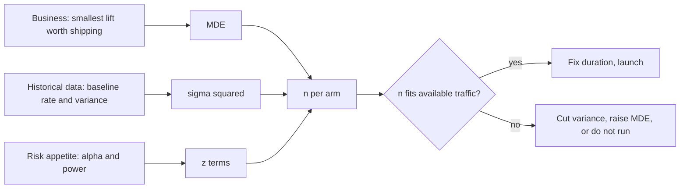

# Statistical Power and Sample Size

## TL;DR
Power is $P(\text{reject } H_0 \mid H_1 \text{ true})$ — the probability your test notices a real
effect of a given size. It is decided *before* launch by four levers: effect size, variance,
$\alpha$, and $n$. The number an interviewer wants you to produce on a whiteboard is
$n \approx 16\sigma^2/\delta^2$ per arm for 80% power at $\alpha=0.05$ — memorise the 16 and where
it comes from.

## Intuition
Power is the resolution of your microscope. A 10% lift is a boulder that any test sees; a 0.5% lift
is a speck that needs a lot of glass. The MDE question — "what is the smallest effect this test
could reliably detect?" — is the same question read backwards, and it is the one that stops teams
running experiments that were never capable of answering anything.

## The maths

**Two-sided z-test on a difference $\delta$.** Reject when
$\lvert \hat\delta \rvert > z_{1-\alpha/2}\,\sigma_{\hat\delta}$. Under $H_1: \mathbb{E}[\hat\delta]=\delta>0$,
ignoring the negligible far tail:

$$
\text{power} = 1-\beta = \Phi\!\left(\frac{\delta}{\sigma_{\hat\delta}} - z_{1-\alpha/2}\right)
$$

Setting this to $1-\beta$ and solving, $\delta/\sigma_{\hat\delta} = z_{1-\alpha/2} + z_{1-\beta}$.
With $\sigma_{\hat\delta}^2 = 2\sigma^2/n$ for two equal arms of size $n$:

$$
\boxed{\,n = \frac{2\sigma^2\left(z_{1-\alpha/2}+z_{1-\beta}\right)^2}{\delta^2}\,}
$$

At $\alpha = 0.05$ and power $0.80$: $z_{0.975}=1.96$, $z_{0.80}=0.84$,
$(1.96+0.84)^2 = 7.85 \approx 8$, so

$$
n \approx \frac{16\sigma^2}{\delta^2} \quad\text{per arm}
\qquad\Longleftrightarrow\qquad
n \approx \frac{16}{d^2},\;\; d = \delta/\sigma \text{ (Cohen's } d)
$$

$d=0.2$ needs ~400 per arm; $d=0.5$ needs ~64; $d=0.8$ needs ~25. Those three numbers are worth
knowing cold.

**Proportions.** Substituting $\sigma^2 = \bar p(1-\bar p)$ with $\bar p=(p_1+p_2)/2$:

$$
n = \frac{\left(z_{1-\alpha/2}\sqrt{2\bar p(1-\bar p)} + z_{1-\beta}\sqrt{p_1(1-p_1)+p_2(1-p_2)}\right)^2}{(p_2-p_1)^2}
$$

**Worked number to carry into the room.** Baseline conversion 5%, want to detect a **10% relative**
lift (5% → 5.5%, so $\delta = 0.005$), $\alpha=0.05$ two-sided, power 0.80:

$$
n \approx \frac{2 \times 0.0525 \times 0.9475 \times 7.85}{0.005^2}
= \frac{0.781}{0.000025} \approx 31{,}200 \text{ per arm}
$$

So **~62,400 users total**, and at 10,000 eligible users/day that is a **6–7 day** test — which
conveniently also covers a full weekly cycle. Notice the $\delta^2$: halving the MDE to a 5%
relative lift quadruples this to ~122,000 per arm and a month of traffic.

**MDE, the inverse.** Given the traffic you will actually get:

$$
\mathrm{MDE} = (z_{1-\alpha/2}+z_{1-\beta})\,\sigma\sqrt{\frac{2}{n}} \approx 2.8\,\sigma\sqrt{\frac{2}{n}}
$$

**Unequal allocation.** With a fraction $\kappa$ in treatment, $\sigma_{\hat\delta}^2 = \sigma^2/(N\kappa) + \sigma^2/(N(1-\kappa))$,
minimised at $\kappa = 0.5$. A 90/10 split needs $N$ inflated by
$\frac{1}{4\kappa(1-\kappa)} = 2.8\times$ — the price of a cautious ramp.

**Variance reduction beats traffic.** Since $n \propto \sigma^2$, cutting variance by 40% cuts the
required sample by 40%. That is what CUPED, stratification and pairing buy — see
[[ab-testing-pitfalls]].

## Diagram



## Code

```python
import numpy as np
from scipy import stats

def n_per_arm_means(delta, sigma, alpha=0.05, power=0.80):
    z = stats.norm.ppf(1 - alpha / 2) + stats.norm.ppf(power)
    return 2 * (sigma ** 2) * z ** 2 / delta ** 2

def n_per_arm_props(p1, mde_rel, alpha=0.05, power=0.80):
    """mde_rel = relative lift, e.g. 0.10 for 5% -> 5.5%."""
    p2 = p1 * (1 + mde_rel)
    pbar = (p1 + p2) / 2
    za = stats.norm.ppf(1 - alpha / 2)
    zb = stats.norm.ppf(power)
    num = (za * np.sqrt(2 * pbar * (1 - pbar))
           + zb * np.sqrt(p1 * (1 - p1) + p2 * (1 - p2))) ** 2
    return num / (p2 - p1) ** 2

n = n_per_arm_props(0.05, 0.10)
print(f"5% baseline, 10% relative MDE -> {n:,.0f} per arm, {2*n:,.0f} total")
print("days at 10k eligible users/day:", np.ceil(2 * n / 10_000))

# sensitivity: the quadratic wall
for mde in (0.20, 0.10, 0.05, 0.02):
    print(f"MDE {mde:>5.0%} relative -> {n_per_arm_props(0.05, mde):>12,.0f} per arm")

# MDE given the traffic you actually have
def mde_props(p1, n, alpha=0.05, power=0.80):
    z = stats.norm.ppf(1 - alpha / 2) + stats.norm.ppf(power)
    return z * np.sqrt(2 * p1 * (1 - p1) / n) / p1        # returned as relative lift
print("with 20k/arm the MDE is", f"{mde_props(0.05, 20_000):.2%} relative")

# verify the formula by simulation -- always do this, it catches sign and factor errors
rng = np.random.default_rng(0)
n_req = int(np.ceil(n_per_arm_props(0.05, 0.10)))
hits = 0
for _ in range(2_000):
    a = rng.binomial(1, 0.050, n_req)
    b = rng.binomial(1, 0.055, n_req)
    x1, x2 = a.sum(), b.sum()
    pp = (x1 + x2) / (2 * n_req)
    z = (x2 - x1) / n_req / np.sqrt(pp * (1 - pp) * 2 / n_req)
    hits += 2 * stats.norm.sf(abs(z)) < 0.05
print("empirical power:", hits / 2_000)     # should land near 0.80

# unequal allocation penalty
for k in (0.5, 0.3, 0.1):
    print(f"{k:.0%}/{1-k:.0%} split needs {1/(4*k*(1-k)):.2f}x the total sample")
```

## In practice
- **Use it when:** before every experiment, and before every "can we detect this?" conversation. A
  power calculation is the cheapest thing in the whole experimentation stack and the most often
  skipped.
- **Defaults that work:** $\alpha=0.05$ two-sided, power 0.80 (0.90 for expensive irreversible
  launches), 50/50 allocation, minimum one full week to absorb day-of-week seasonality, and take
  $\sigma$ from the last 4 weeks of the *same* metric on the *same* population.
- **Breaks when:** the randomisation unit is a cluster (multiply $n$ by the design effect
  $1+(k-1)\rho$), the metric is a ratio (use the delta-method variance, not the naive one), or the
  metric is heavy-tailed (the normal approximation needs more $n$ than the formula suggests —
  simulate instead).
- **Cost / latency:** sample size is $\propto 1/\delta^2$. This is the single most important
  sentence in experiment planning: every halving of the MDE costs 4× the traffic and 4× the
  calendar.

> [!warning]
> Never compute "observed power" after the fact from the observed effect. It is a monotone function
> of the p-value and tells you nothing new. If a test came out null, report the CI — it already
> says what effects have been ruled out.

## Interview angle

**Q. Our conversion rate is 5%. How many users do we need to detect a 10% relative lift?**
Roughly 31,000 per arm, 62,000 total. Derivation on the board:
$n = 2\bar p(1-\bar p)(z_{\alpha/2}+z_\beta)^2/\delta^2$ with $\bar p \approx 0.0525$,
$(1.96+0.84)^2 \approx 7.85$, $\delta = 0.005$. At 10,000 eligible users a day that is about a
week, which also gives us a full weekly seasonality cycle. I would then check whether a 10%
relative lift is actually what the PM considers worth shipping — the MDE should come from the
business, not from the traffic we happen to have.

**Follow-up.** The PM says they care about a 3% relative lift. → That is $\delta = 0.0015$, so
$(10/3)^2 \approx 11\times$ the sample: about 350,000 per arm, roughly ten weeks. At that point I
would push for variance reduction (CUPED on the pre-period conversion), a more sensitive proxy
metric, or accepting that we cannot detect it and making the decision on other grounds.

**Q. What actually determines power?**
Four things: the true effect size, the variance of the metric, $\alpha$, and $n$. Only the last two
are under your control at test time, and $\alpha$ is nearly free to move while $n$ costs calendar.
The under-appreciated fifth lever is *variance reduction*, which increases effective $n$ without
any extra traffic.

**Q. Traffic allows only 20,000 per arm. What do you do?**
Invert the calculation and report the MDE: at a 5% baseline that is about a 12–13% relative lift
detectable at 80% power. Then have the honest conversation — if the expected effect is 5%, the test
is 20%-powered, so a null result means nothing and a "win" would be inflated by the winner's curse.
Options: run longer, use a more sensitive metric (clicks instead of purchases), apply CUPED, pool
across a longer period, or use a sequential design that can stop early on large effects.

**Q. Why 80% power? Why not 99%?**
Convention, and economics. 80% is the point where extra power starts costing a lot of traffic for a
little risk reduction — going from 80% to 95% needs roughly 1.7× the sample. Raise it when the
decision is irreversible or the downside is large (a pricing change, a migration); lower it when
experiments are cheap and you can replicate.

**Q. How does clustering change the sample size?**
Multiply by the design effect $1 + (k-1)\rho$ where $k$ is observations per cluster and $\rho$ the
intra-cluster correlation. With 10 sessions per user and $\rho = 0.3$ that is 3.7× more *events* —
or, equivalently, you should have been computing in users all along.
See [[sampling-and-sampling-distributions]].

## Traps
- **Computing power after the experiment from the observed effect.** Uninformative by construction.
- **Using an MDE pulled from thin air.** The MDE must come from the smallest lift that pays for the
  change. If nobody can state it, the experiment has no defined success criterion.
- **Powering on a relative lift but computing with an absolute one** (or vice versa). A "10% lift"
  on a 5% baseline is $\delta = 0.005$, not $0.10$. This slip is off by 20× and is common under
  time pressure.
- **Forgetting that the sample size is per arm.** Quoting 31,000 when you need 62,400 users.
- **Ignoring the multiple-metric penalty.** If you will test five metrics at a corrected $\alpha$,
  power the test at that corrected $\alpha$, not at 0.05.
- **Powering on events when randomising on users.** Understates $n$ by the design effect.
- **Stopping as soon as the sample size is reached mid-week.** Run whole weeks; day-of-week
  composition otherwise biases the estimate.
- **Assuming the historical $\sigma$ still holds.** If the metric definition changed, or the
  population shifted (a festival sale, a new market), re-estimate it.

## Flashcards
Definition of statistical power::P(reject H₀ \| H₁ true) = 1 − β, the probability of detecting an effect of a specified size.
Sample-size formula for two means::n per arm = 2σ²(z_{1−α/2} + z_{1−β})²/δ².
The magic constant at alpha 0.05 and power 0.80::(1.96 + 0.84)² ≈ 7.85, so n ≈ 16σ²/δ² per arm, i.e. n ≈ 16/d² in Cohen's d.
n needed for Cohen's d of 0.2, 0.5, 0.8::About 400, 64 and 25 per arm respectively.
Sample size for 5% baseline and 10% relative MDE::About 31,000 per arm, 62,000 total, at α=0.05 and 80% power.
How sample size scales with MDE::Inversely with the square — halving the MDE needs 4× the sample.
MDE given fixed n::MDE ≈ 2.8σ√(2/n) at α=0.05 and 80% power.
Cost of a 90/10 split::Total sample inflated by 1/(4κ(1−κ)) = 2.8×.
Why observed (post-hoc) power is useless::It is a deterministic function of the observed p-value; report the confidence interval instead.

## Related
- [[ab-testing-design]]
- [[type-i-and-type-ii-errors]]
- [[hypothesis-testing]]
- [[confidence-intervals]]
- [[sampling-and-sampling-distributions]]
- [[ab-testing-pitfalls]]
- [[moc-stats]]
