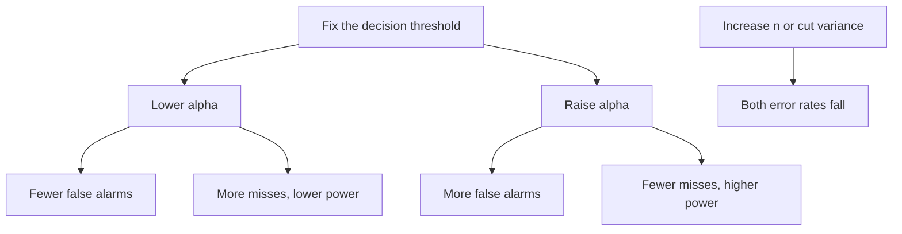

# Type I and Type II Errors

## TL;DR
Type I ($\alpha$) is rejecting a true null — a false alarm. Type II ($\beta$) is failing to reject
a false null — a miss. Power is $1-\beta$. For fixed $n$ the two trade off directly: lowering
$\alpha$ raises $\beta$. The only way to shrink both is more data, less variance, or a bigger
effect. The interviewer's real question is usually "which error costs your business more", which is
also exactly the classification-threshold question in disguise.

## Intuition
A smoke detector. Set it too sensitive and it screams at toast (type I); set it too insensitive and
it sleeps through a fire (type II). You cannot fix both with the same detector — you need a better
sensor. In statistics, "a better sensor" means more samples or less noise.

## The maths

|  | $H_0$ true | $H_0$ false |
| --- | --- | --- |
| **Reject $H_0$** | Type I error, prob. $\alpha$ | Correct, prob. $1-\beta$ (power) |
| **Fail to reject** | Correct, prob. $1-\alpha$ | Type II error, prob. $\beta$ |

$$
\alpha = P(\text{reject} \mid H_0),
\qquad
\beta = P(\text{fail to reject} \mid H_1),
\qquad
\text{power} = 1-\beta
$$

**The tradeoff, explicitly.** For a two-sided z-test of a mean difference $\delta$ with standard
error $\sigma_{\hat\delta}$, the rejection boundary sits at $z_{1-\alpha/2}\sigma_{\hat\delta}$, and

$$
\text{power} = \Phi\!\left(\frac{\delta}{\sigma_{\hat\delta}} - z_{1-\alpha/2}\right)
$$

Lowering $\alpha$ pushes $z_{1-\alpha/2}$ up and the power down, for the same data. Only shrinking
$\sigma_{\hat\delta}$ (more $n$, variance reduction) moves both favourably.

**Family-wise error.** Running $m$ independent tests at $\alpha$:

$$
\mathrm{FWER} = 1 - (1-\alpha)^m
$$

At $m = 20$, $\alpha = 0.05$: $1 - 0.95^{20} = 0.64$. Roughly a two-in-three chance of at least one
false alarm. See [[multiple-testing-correction]].

**The ML translation.** Fix a classifier threshold $\tau$ on $\hat p$. Then

$$
\text{FPR} = \frac{FP}{FP+TN} \;\leftrightarrow\; \alpha,
\qquad
\text{FNR} = \frac{FN}{TP+FN} = 1 - \text{recall} \;\leftrightarrow\; \beta
$$

An ROC curve is literally the $(\alpha, 1-\beta)$ frontier traced over all thresholds — which is why
the AUC is "the probability the model ranks a random positive above a random negative". Moving
$\tau$ is exactly moving $\alpha$. See [[roc-auc-and-pr-curves]].

**Choosing $\tau$ by cost.** With cost $C_{FP}$ per false positive and $C_{FN}$ per false negative,
the expected-cost-minimising threshold on a calibrated probability is

$$
\tau^{*} = \frac{C_{FP}}{C_{FP}+C_{FN}}
$$

A fraud case where a missed fraud costs ₹5,000 and a blocked good transaction costs ₹50 gives
$\tau^* = 50/5050 \approx 0.01$ — you alert on almost anything. This formula requires *calibrated*
probabilities; see [[probability-calibration]].

**Type S and Type M errors** (worth naming — it impresses). In a low-power study, the effects that
happen to clear significance are the ones that got lucky, so they are systematically *exaggerated*
(type M, magnitude) and occasionally have the *wrong sign* (type S). This is the "winner's curse"
of experimentation programmes: your first-reported lifts shrink on replication.

## Diagram



## Code

```python
import numpy as np
from scipy import stats

rng = np.random.default_rng(0)

# --- measure alpha and beta by simulation, not by formula --------------------
def error_rates(true_effect, n=400, alpha=0.05, reps=20_000):
    a = rng.normal(0, 1, (reps, n))
    b = rng.normal(true_effect, 1, (reps, n))
    p = stats.ttest_ind(b, a, axis=1).pvalue
    return (p < alpha).mean()

print("alpha (effect = 0)      :", error_rates(0.0))          # ~0.05 by construction
for d in (0.1, 0.2, 0.3):
    pw = error_rates(d)
    print(f"effect d={d}: power={pw:.3f}  beta={1-pw:.3f}")

# --- the tradeoff at fixed n -------------------------------------------------
for alpha in (0.10, 0.05, 0.01, 0.001):
    print(f"alpha={alpha:<6} power at d=0.2: {error_rates(0.2, alpha=alpha):.3f}")

# --- winner's curse: significant effects in a low-power study are inflated ---
d_true, n = 0.15, 200
a = rng.normal(0, 1, (20_000, n))
b = rng.normal(d_true, 1, (20_000, n))
res = stats.ttest_ind(b, a, axis=1)
obs = b.mean(axis=1) - a.mean(axis=1)
sig = res.pvalue < 0.05
print(f"power {sig.mean():.2f}; mean observed effect overall {obs.mean():.3f} "
      f"vs among significant only {obs[sig].mean():.3f} (true {d_true})")
print("wrong-sign share among significant:", (obs[sig] < 0).mean())

# --- cost-optimal threshold in the ML framing -------------------------------
C_FP, C_FN = 50, 5_000
print("cost-optimal tau:", C_FP / (C_FP + C_FN))
```

The winner's-curse block is the one to run before an interview: at ~32% power with a true effect of
0.15, the average effect *among the significant results* comes out near 0.26 — inflated by roughly
70%.

## In practice
- **Use it when:** setting $\alpha$ for an experiment, or a threshold for a deployed classifier —
  the same decision wearing two hats.
- **Defaults that work:** experiments: two-sided $\alpha = 0.05$, power 0.80, sample size fixed in
  advance. Classifiers: never 0.5 by default — derive $\tau$ from costs, or pick the threshold
  hitting a business constraint like "reviewer capacity is 500 cases a day".
- **Breaks when:** the costs are asymmetric and you left $\alpha$ at convention. A guardrail metric
  protecting revenue should use a *lenient* $\alpha$ (you want to catch harm, so power against harm
  matters more than false alarms), while a launch-gating success metric should use a strict one.
- **Cost / latency:** halving $\sigma_{\hat\delta}$ takes 4× the sample. Variance reduction (CUPED,
  stratification, pairing) is much cheaper than traffic — see [[ab-testing-pitfalls]].

> [!tip]
> A crisp interview line: "$\alpha$ is chosen, $\beta$ is bought." You pick the false-positive rate
> for free; you pay for the false-negative rate with sample size.

## Interview angle

**Q. Define type I and type II errors, and give a business example of each.**
Type I is rejecting a true null: we ship a redesign that does nothing, burning engineering time and
adding a regression risk. Type II is failing to reject a false null: we kill a genuinely good
feature because the test was too small. Type I is visible and embarrassing; type II is invisible and
usually more expensive in aggregate, because nobody logs the features you never shipped.

**Q. Can you reduce both at once?**
Not at fixed sample size and fixed variance — moving the threshold trades one for the other. To
reduce both you must shrink the standard error: more data, variance reduction (CUPED, stratified
assignment, paired designs), a cleaner metric, or a larger true effect.

**Follow-up.** Which would you do first at a company with limited traffic? → Variance reduction. It
is free relative to traffic: CUPED on a pre-period covariate routinely cuts variance 30–50% on
engagement metrics, which is equivalent to a 1.4–2× increase in sample size.

**Q. Fraud detection — which error do you optimise for?**
Neither symmetrically. Write the cost: a missed fraud costs the chargeback plus goodwill; a false
positive costs a blocked legitimate customer plus a support contact plus churn risk. If they are
₹5,000 and ₹50, the cost-optimal threshold on a calibrated score is
$C_{FP}/(C_{FP}+C_{FN}) \approx 0.01$ — but that would flag far more than the review team can
process, so in practice you pick the threshold that fills the review queue's capacity and report
the precision and recall achieved there. See [[case-fraud-detection]].

**Q. Your team ran 20 A/B tests this quarter and three were significant. Impressed?**
No. At $\alpha = 0.05$ with 20 tests you expect one false positive from pure noise, and the FWER of
at least one is 64%. Three wins is barely above chance. I would ask for the pre-registered MDEs, the
power of each test, and whether the wins replicate in a holdback — and I would apply
Benjamini–Hochberg to the family.

**Q. What is the winner's curse in experimentation?**
Under low power, only unusually large sample estimates clear the significance bar, so the effects
you report are biased upward (type M) and can even have the wrong sign (type S). The practical
symptom is that shipped lifts do not add up to the annual metric. The fix is adequate power,
shrinkage toward zero via a hierarchical or empirical-Bayes prior, and holdback validation.

## Traps
- **"Type I is worse than type II."** Only in some domains. In medicine and in launch gating, yes;
  in screening and in early-stage product exploration, misses dominate. Name the costs.
- **Setting $\alpha = 0.01$ "to be safe" without recomputing $n$.** You just dropped your power,
  possibly to the point where a real effect is undetectable — safety theatre that increases the
  false-discovery share among what you do find.
- **Believing power is a property of the test alone.** It is a function of effect size, $n$,
  variance and $\alpha$ — and it is only meaningful against a specified alternative.
- **Computing "post-hoc power" from the observed effect.** It is a deterministic function of the
  p-value and adds no information. Report the CI instead.
- **Leaving a classifier threshold at 0.5.** 0.5 is optimal only when $C_{FP}=C_{FN}$ and the
  probabilities are calibrated — almost never both.
- **Treating class imbalance as a type I/II problem to be solved by resampling.** Resampling changes
  the base rate and decalibrates your probabilities; adjust the threshold or the loss instead.
  See [[imbalanced-classification]].

## Flashcards
Type I error::Rejecting a true null — a false positive, occurring with probability α.
Type II error::Failing to reject a false null — a false negative, occurring with probability β; power = 1 − β.
Can both error rates fall at fixed n::No — the threshold trades them off. Only a smaller standard error (more n, less variance) improves both.
FWER for m independent tests at level α::1 − (1 − α)^m; at m = 20 and α = 0.05 that is about 64%.
Statistical mapping of FPR and FNR::FPR ↔ α, FNR = 1 − recall ↔ β; the ROC curve is the α vs 1−β frontier over thresholds.
Cost-optimal classification threshold::τ* = C_FP/(C_FP + C_FN), valid only for calibrated probabilities.
Type M and type S errors::Magnitude exaggeration and sign reversal among significant results in low-power studies — the winner's curse.
Why post-hoc power is useless::It is a one-to-one function of the observed p-value, so it carries no information beyond it; report the confidence interval.

## Related
- [[statistical-power-and-sample-size]]
- [[hypothesis-testing]]
- [[p-values-and-significance]]
- [[multiple-testing-correction]]
- [[threshold-selection]]
- [[roc-auc-and-pr-curves]]
- [[moc-stats]]
