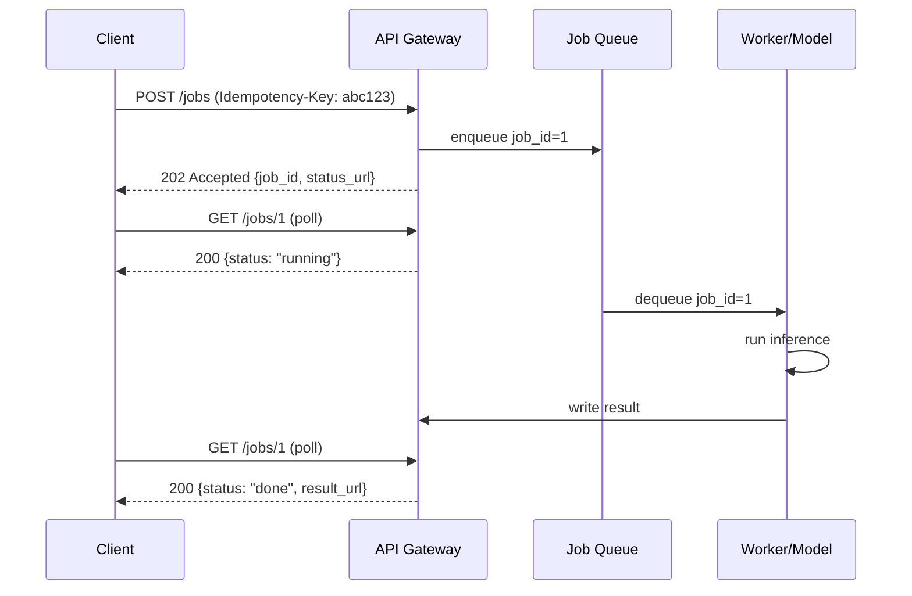

# API Design for ML Systems

## TL;DR
Model-serving APIs differ from CRUD APIs in three ways: requests can be expensive (seconds to
minutes), inputs are large (images, batches, documents), and outputs can be non-deterministic
(sampling, model versions). Pick REST for external/simple contracts, gRPC for internal
high-throughput services; pick sync for sub-second inference and async (submit + poll/webhook)
for anything slower; always make mutating calls idempotent.

## Intuition
A normal API is a vending machine — you press a button, you get a can, always. An ML inference
API is more like ordering food: sometimes it's fast-food (sync, seconds), sometimes it's a
custom cake (async — you get a ticket, you come back later, or they call you when it's ready).
Designing the API is really about designing *who waits, for how long, and what happens if the
wait fails.*

## The maths
Not much maths here, but one number matters: expected client-side timeout budget.

$$
T_{\text{budget}} = T_{\text{network}} + T_{\text{queue}} + T_{\text{inference}} + T_{\text{postprocess}}
$$

If $T_{\text{inference}}$ has high variance (e.g. LLM generation, variable-length sequences),
a fixed sync timeout either wastes capacity (set too high, threads blocked) or drops valid
requests (set too low). This is the core argument for async patterns whenever
$\text{Var}(T_{\text{inference}})$ is large relative to its mean — which is exactly the
regime of LLM and batch-document workloads.

## Diagram


## Code
```python
from fastapi import FastAPI, Header
from pydantic import BaseModel
import uuid, hashlib

app = FastAPI()
jobs: dict[str, dict] = {}
idempotency_index: dict[str, str] = {}  # key -> job_id

class PredictRequest(BaseModel):
    text: str
    model_version: str = "v2"  # explicit version in the request contract

@app.post("/v1/jobs", status_code=202)
def submit_job(req: PredictRequest, idempotency_key: str = Header(None)):
    if idempotency_key and idempotency_key in idempotency_index:
        # Same key seen before -> return the existing job, do not re-run inference.
        job_id = idempotency_index[idempotency_key]
        return {"job_id": job_id, "status": jobs[job_id]["status"]}

    job_id = str(uuid.uuid4())
    jobs[job_id] = {"status": "queued", "input": req.dict(), "result": None}
    if idempotency_key:
        idempotency_index[idempotency_key] = job_id
    # enqueue to a real broker (SQS/Kafka/Redis) in production
    return {"job_id": job_id, "status": "queued", "status_url": f"/v1/jobs/{job_id}"}

@app.get("/v1/jobs/{job_id}")
def get_job(job_id: str):
    job = jobs.get(job_id)
    if job is None:
        return {"error": "not_found"}, 404
    return {"job_id": job_id, "status": job["status"], "result": job["result"]}
```

## In practice
- **Use it when:** REST for public/partner-facing APIs and low request volume; gRPC for
  service-to-service calls inside a cluster where you control both ends and want binary
  framing, streaming, and strict schemas (protobuf).
- **Defaults that work:** version the API in the URL or a header (`/v1/predict`,
  `X-Model-Version`), never silently swap model behaviour under a stable endpoint; always
  accept an `Idempotency-Key` on any POST that has side effects or cost; return `202 Accepted`
  with a `status_url` for anything you expect to take more than ~1s.
- **Breaks when:** you use sync REST for a workload with fat request-time variance (LLM
  generation, OCR on large PDFs) — you end up with either huge timeouts that pin threads or
  false negatives on slow-but-successful requests.
- **Cost / latency:** sync APIs pay for held-open connections and worker threads during the
  whole inference; async APIs pay for storage of job state and polling load, but decouple
  client wait time from model latency, which is usually the better trade at scale.

## Interview angle
**Q. When would you use gRPC over REST for a model-serving endpoint?**
When it's an internal call between two services you control, latency matters (binary
protobuf is smaller and faster to (de)serialize than JSON), and you want native support for
streaming (token-by-token LLM output, or streaming feature vectors). REST/JSON stays better
for public APIs, browser clients, and anything where human-readability and broad tooling
support (curl, Postman) matter more than raw throughput.

**Follow-up.** How do you support streaming token output over gRPC vs REST?
→ gRPC has native server-streaming RPCs — one call, a stream of protobuf messages. Over REST
you either use HTTP chunked responses / Server-Sent Events, or the client polls a job endpoint
that returns partial output; SSE is the common middle ground when the client is a browser.

**Q. How do you version a model API without breaking existing clients?**
Put the version in the request contract explicitly, not implicitly in server state — either
a URL segment (`/v2/predict`) for breaking schema changes, or a `model_version` field in the
payload for swappable model weights behind a stable schema. Never let "deploy a new model"
silently change output distribution behind an unversioned endpoint — that's how training-serving
skew debugging turns into a multi-day incident.

**Q. Design the API for a document-summarization service that takes 30–90 seconds per call.**
Async job submission: `POST /jobs` returns `202` + `job_id` immediately, `GET /jobs/{id}`
for polling, optionally a `webhook_url` field in the submit payload so the server calls back
instead of the client polling. Idempotency key on submit so a client retry (on a dropped
response) doesn't double-charge/double-run the job.

**Follow-up.** Client says polling is wasteful at scale — what do you change?
→ Add webhook callback support, or move to a push channel (WebSocket/SSE) for clients that
keep a connection open; keep polling as the fallback for clients behind restrictive networks.

**Q. Why does idempotency matter more for ML APIs than typical CRUD APIs?**
Because inference is expensive (compute, tokens, GPU-seconds) and retries are common (client
timeouts, network blips). Without an idempotency key, a client retry after a timeout can
trigger a second, fully-billed inference run for what might already be a successful request
in flight — wasting cost and potentially returning two different non-deterministic outputs
for "the same" logical request.

## Traps
- Wrong: "Just make everything synchronous, it's simpler." — Correct: simplicity for the
  client isn't free; it pushes tail-latency risk onto the caller and forces oversized
  timeouts across every hop in the call chain.
- Wrong: "Idempotency keys are only for payments." — Correct: any API call that consumes
  billable compute or has side effects (writing to a feature store, sending a notification)
  needs the same protection.
- Wrong: "REST vs gRPC is just a religious choice." — Correct: it's driven by client type
  (browser vs internal service), need for streaming, and schema strictness requirements.
- Wrong: treating "model version" as a deployment detail invisible to the API contract —
  in ML this is a first-class part of the interface because outputs are not guaranteed
  stable across versions.

## Flashcards
When should you use async job-submission instead of sync REST for inference?::When request-time variance is high or expected latency exceeds roughly one second (LLM generation, large-document processing).
What does an Idempotency-Key protect against in an ML API?::Duplicate, costly inference runs caused by client retries after a timeout or dropped response.
Where should model version live in an API contract?::Explicitly in the URL or request/response payload, never implicit in server-side state only.
gRPC's main advantage over REST/JSON for internal ML services?::Compact binary protobuf framing, native streaming RPCs, and stricter generated schemas — better latency and throughput.
What HTTP status code signals "accepted, working on it, check back"?::202 Accepted, typically paired with a status_url for polling.
Why is a fixed sync timeout risky for LLM-serving APIs?::Generation latency has high variance; a timeout tuned for the mean either blocks resources on slow requests or wrongly kills successful long ones.

## Related
[[llm-system-design-framework]], [[batch-vs-realtime-inference]], [[model-serving-patterns]], [[latency-and-throughput-budgets]]
