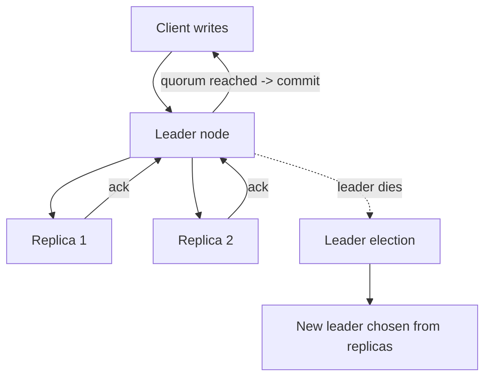

# Distributed Systems Basics for ML Interviews

## TL;DR
You need three ideas to survive an ML system design follow-up: replication (why and how data
is copied across nodes), the availability-vs-consistency tension that replication creates, and
leader election (how a distributed system agrees on "who decides" without a single point of
failure). You do not need Paxos from first principles — you need to reason about *what breaks*
when a node goes down or a network partitions.

## Intuition
Imagine three people sharing one notebook by mailing copies to each other. If the postal system
never fails, everyone's copy is always identical. The moment mail can be delayed or lost, you
face a choice: either everyone waits for confirmation that all copies match before writing
anything new (safe, slow), or everyone writes to their own copy and reconciles later (fast,
occasionally messy). Distributed systems are entirely this problem, generalized.

## The maths
No heavy derivation here; the one relationship worth internalizing is the replication factor
vs failure tolerance trade:

$$
\text{tolerable node failures} = \left\lfloor \frac{N - 1}{2} \right\rfloor \quad \text{(majority-quorum systems, } N \text{ replicas)}
$$

A 3-replica cluster tolerates 1 failure with quorum-based writes; a 5-replica cluster tolerates
2. This is why odd replica counts (3, 5) are standard — even counts add cost without adding
tolerance (a 4-node cluster still only tolerates 1 failure to keep majority).

## Diagram


## Code
```python
# Toy quorum write simulation: a write succeeds only if a majority of
# reachable replicas acknowledge it. This is the mental model behind
# quorum-based systems (Cassandra-style W/R settings, Raft commit rule).

def quorum_write(replicas_up: list[bool], required_quorum: int) -> bool:
    acks = sum(1 for up in replicas_up if up)
    return acks >= required_quorum

n = 5
quorum = n // 2 + 1  # majority: 3 of 5
print(quorum_write([True, True, True, False, False], quorum))  # True: 3 acks
print(quorum_write([True, True, False, False, False], quorum))  # False: only 2 acks
```

## In practice
- **Use it when:** any feature store, model registry, or online serving layer that must
  survive a single-node failure without losing writes or serving stale reads unacceptably.
- **Defaults that work:** odd-numbered replica counts (3 is the common baseline); a single
  elected leader handles writes, followers serve reads (read replicas) for scale; leader
  election via a consensus protocol (Raft is the one worth naming — simpler to reason about
  than Paxos, and what most modern systems, etcd/Kafka's controller, actually use).
- **Breaks when:** you assume replication means "always consistent" — replicas lag, and a
  read from a follower right after a leader write can return stale data unless you explicitly
  read from the leader or wait for replication to catch up.
- **Cost / latency:** more replicas = more write latency (waiting for quorum acks) but more
  read throughput and fault tolerance. This is the replication-factor knob every distributed
  store exposes.

## Interview angle
**Q. Why does a distributed system need leader election at all — why not let every node
accept writes?**
Because concurrent writes to the same key from multiple nodes need a single order of truth,
or you get conflicting versions that must be reconciled later (last-write-wins, vector clocks,
CRDTs — all more complex than picking one node to serialize writes). A leader gives you a
simple total order for free; the cost is a single point of write-availability that must be
replaced quickly if it dies — hence leader election.

**Follow-up.** What happens to in-flight writes when the leader crashes mid-election?
→ Depends on the consensus protocol's guarantees: in Raft, a write is only considered
committed once it's replicated to a majority, so uncommitted writes on the old leader are
safely discarded; the new leader resumes from the last committed entry. This is why "commit"
in distributed systems means "majority durable," not "written somewhere."

**Q. Your feature store shows different values for the same feature on two API calls a few
milliseconds apart. Is this a bug?**
Not necessarily — if reads are served from replicas and the system favors availability, you
can see replication lag. Whether this is acceptable depends on the SLA: point-in-time-correct
training feature retrieval usually reads from a single source of truth, while online serving
often accepts eventual consistency for lower latency.

**Q. How would you design an ML model registry so two training pipelines don't register
conflicting "latest" model versions?**
A single leader (or a strongly consistent metadata store like a relational DB with
transactions, or a coordination service like etcd/ZooKeeper) owns the "assign next version
number" operation, so version increments are serialized. Read replicas can serve "list model
versions" queries without that guarantee.

## Traps
- Wrong: "More replicas always means more consistency." — Correct: more replicas means more
  fault tolerance and read scale; consistency is a separate configurable property (how many
  replicas must ack before a write/read is considered valid).
- Wrong: "Leader election is only relevant to niche infra teams." — Correct: it's the
  mechanism behind Kafka's controller, Kubernetes' etcd, and most managed database failover —
  you will hit it the moment you design anything with an HA requirement.
- Wrong: treating "distributed" as always better — a single strongly-consistent node with
  good backups is simpler and often the right answer for a model registry with low write
  volume; don't over-engineer.

## Flashcards
Why do quorum systems typically use an odd number of replicas?::Odd counts maximize failure tolerance per added node; even counts add cost without adding tolerance for majority quorum.
What is a "committed" write in a Raft-like consensus system?::A write acknowledged by a majority of replicas — durable even if the leader immediately crashes.
Why can a follower replica return stale data right after a leader write?::Replication is not instantaneous; the follower hasn't yet applied the new write when the read arrives.
What problem does leader election solve?::Giving a distributed system a single, serialized order for writes without a permanent single point of failure.
Replication factor of 5 tolerates how many simultaneous node failures under majority quorum?::2 (floor((5-1)/2)).

## Related
[[cap-theorem-and-consistency]], [[feature-stores]], [[model-registry-and-versioning]], [[scalability-patterns]]
