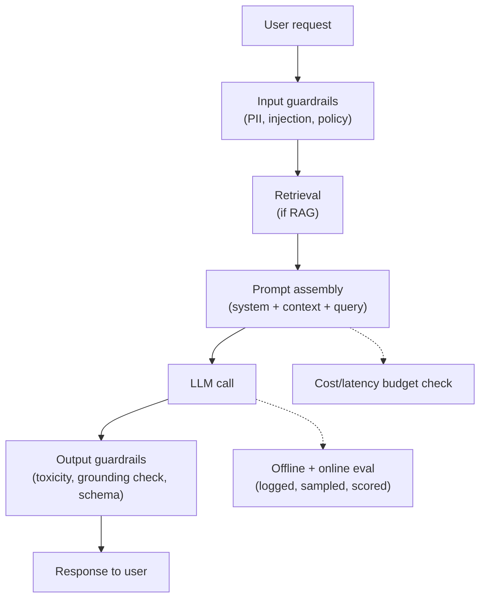

# LLM System Design Framework

## TL;DR
An LLM/agentic system design answer is the classical ML system design framework
([[ml-system-design-framework]]) plus four steps that don't exist in a classical-ML design:
**prompt/retrieval design**, **cost-per-request budgeting**, **eval strategy for
non-deterministic output**, and **guardrails** as a first-class architectural layer, not an
afterthought. Interviewers grading this round are checking whether you treat the LLM as one
component in a system, not the whole system.

## Intuition
A classical model outputs a number; you validate it against ground truth and move on. An LLM
outputs language — there's no single "ground truth" to diff against, the cost of a wrong or
unsafe answer is often reputational rather than just a metric hit, and the same request can
cost 10x more or less depending on prompt length and retrieval design. That's why this needs
its own framework layered on top of the base one, not a fresh one from scratch.

## The maths
The one calculation you should be able to do live in an interview: **cost per request**.

$$
\text{cost} = \big(n_{\text{input tokens}} \cdot p_{\text{input}}\big) + \big(n_{\text{output tokens}} \cdot p_{\text{output}}\big)
$$

where $p_{\text{input}}, p_{\text{output}}$ are per-token prices (output tokens are typically
priced several times higher than input tokens across providers — always assume this
asymmetry even without exact numbers). For a RAG system, $n_{\text{input tokens}}$ is
dominated by retrieved context, not the user's question — which is exactly why chunking and
reranking (see [[chunking-strategies]], [[reranking]]) are cost levers, not just quality
levers.

$$
\text{monthly cost} = \text{requests/day} \times 30 \times \text{cost per request}
$$

Framing it this way lets you reason about orders of magnitude live (e.g. "if retrieval pulls
8 chunks of 500 tokens each, that's 4,000 input tokens before the question is even asked —
can we get away with 4 chunks and a reranker instead?") without needing to memorize current
prices.

## Diagram


## Code
```python
# Rough cost-budgeting calculator you can sketch live in an interview.
# Numbers below are placeholders to reason about ORDER OF MAGNITUDE only —
# never state them as real current prices; state the formula and structure.

def estimate_monthly_cost(
    requests_per_day: int,
    avg_input_tokens: int,
    avg_output_tokens: int,
    price_per_1k_input: float,
    price_per_1k_output: float,
) -> float:
    cost_per_request = (
        (avg_input_tokens / 1000) * price_per_1k_input
        + (avg_output_tokens / 1000) * price_per_1k_output
    )
    return cost_per_request * requests_per_day * 30

# Example structure of the conversation, not real prices:
# monthly = estimate_monthly_cost(100_000, 4000, 300, price_in, price_out)
# then: "at this volume, cutting avg_input_tokens via better chunking/reranking
# from 4000 to 1500 tokens roughly halves the input-side cost."
```

## In practice
- **Use it when:** any interview round framed as "design a chatbot / RAG assistant / coding
  agent / customer-support automation" — this is now one of the most common senior ML/AI
  rounds in India for both product companies and GCCs.
- **Defaults that work:** state requirements first (latency SLA, cost ceiling, accuracy bar,
  safety bar) exactly as in the base framework, then walk: retrieval/prompt design → model
  choice (build vs API, size vs cost) → serving (see [[llm-serving-and-throughput]],
  [[kv-cache-and-inference-optimization]]) → guardrails → eval → monitoring/cost dashboard.
- **Breaks when:** candidates jump straight to "I'll use RAG with a vector DB" without first
  establishing what's actually being asked (a knowledge-lookup problem, a reasoning problem,
  an action-taking/agentic problem) — the eval and guardrail strategy differ completely
  across these.
- **Cost / latency:** always the first-class constraint here, unlike in many classical-ML
  designs where accuracy dominates the conversation — say this out loud, it signals
  seniority.

## In practice — the delta from [[ml-system-design-framework]]
| Step | Classical ML framing | LLM/agentic addition |
|---|---|---|
| Requirements | accuracy metric, latency, scale | + safety bar, hallucination tolerance, cost ceiling |
| Data | labeled training data | + knowledge corpus, chunking/retrieval design |
| Modeling | train/select a model | + prompt design, RAG vs fine-tune vs both, tool/function schemas |
| Serving | latency budget, batch vs realtime | + streaming tokens, KV-cache, context-window budgeting |
| Evaluation | held-out test set, offline metrics | + LLM-judge or rubric-based eval, red-teaming, online A/B on subjective quality |
| Safety | fairness/bias checks | + guardrails as an architectural layer (input + output), injection defense |
| Monitoring | drift detection | + cost-per-request tracking, hallucination/groundedness monitoring |

## Interview angle
**Q. Design a RAG-based internal documentation assistant for ~5,000 employees.**
Requirements first: latency (a few seconds acceptable for chat), cost ceiling (bound
tokens/request), accuracy bar (must not hallucinate policy answers — grounding matters more
than fluency here). Then: ingestion + chunking strategy for the doc corpus, embedding model
choice, vector DB, hybrid search (BM25 + vector) for exact-term queries like policy IDs,
reranking to cut context size before the LLM call, prompt template with citations required,
output guardrail that flags ungrounded claims, and an eval set of real employee questions
scored for groundedness plus a lightweight online feedback signal (thumbs up/down) feeding
back into retraining the reranker or tuning retrieval.

**Follow-up.** How do you evaluate "hallucination" when there's no single correct answer?
→ Groundedness eval: check whether every claim in the output is supported by the retrieved
context (can be automated with an LLM-as-judge prompt, or done via NLI-style entailment
checks), separate from "is the answer good" which needs human or rubric-based scoring. See
[[llm-evaluation]], [[hallucination-and-grounding]].

**Q. How is cost budgeting different here from a classical-ML system design?**
In classical ML, marginal inference cost is often negligible (a gradient-boosted tree scores
in microseconds); in LLM systems, every token — input and output — is metered and output
tokens are the expensive side, so architecture choices (chunk count, max output length,
model size, caching repeated prompts) are cost decisions as much as they are quality
decisions. This needs its own line item in the requirements-gathering step, not something
you compute after the design is done.

**Q. Where do guardrails belong in the architecture, and why "first-class"?**
Both before the LLM call (input guardrails: PII redaction, prompt-injection detection, policy
scoping) and after (output guardrails: toxicity/PII leak check, schema validation for
structured output, groundedness check before the response reaches the user). Calling it
"first-class" means it's drawn as its own box in the diagram and budgeted for latency/cost,
not bolted on as a regex after an incident.

## Traps
- Wrong: starting the answer with "I'd use LangChain and Pinecone." — Correct: name
  requirements and constraints first; tool names are an implementation detail that should
  fall out of the requirements, not precede them.
- Wrong: treating eval as "we'll look at a few outputs manually." — Correct: propose a
  concrete eval set, a grounded/ungrounded scoring method, and an online signal — the same
  rigor as an offline test set in classical ML, adapted for non-deterministic output.
- Wrong: ignoring cost until asked. — Correct: raise cost-per-request as a requirement in the
  first two minutes; it changes model-size and retrieval-depth decisions materially.
- Wrong: presenting guardrails as a single "content filter" API call. — Correct: distinguish
  input-side and output-side guardrails and name what each catches (injection vs toxic/PII
  leakage vs schema violation).

## Flashcards
What four steps does an LLM system design add on top of the classical ML framework?::Prompt/retrieval design, cost-per-request budgeting, eval strategy for non-deterministic output, and guardrails as a first-class layer.
Why are output tokens usually the dominant cost driver, not input tokens per-token?::Output tokens are typically priced several times higher per token than input tokens across most providers.
What is "groundedness" evaluation in a RAG system?::Checking whether every claim in the generated answer is supported by the retrieved context, distinct from general answer quality.
Where do input vs output guardrails sit in the pipeline?::Input guardrails run before the LLM call (PII, injection, policy scoping); output guardrails run after (toxicity, PII leak, schema/groundedness check).
Why does chunking/reranking design directly affect cost, not just quality?::Retrieved context tokens dominate input token count; fewer, better-selected chunks cut cost per request.

## Related
[[ml-system-design-framework]], [[rag-overview]], [[llm-evaluation]], [[agent-guardrails-and-safety]]
