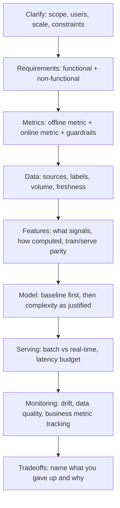

# ML System Design Framework

## TL;DR
A repeatable structure for any "design an ML system" interview question:
**clarify → requirements → metrics → data → features → model → serving → monitoring → tradeoffs.**
The framework's job isn't to give you the answer — it's to make sure you never freeze on a
30-minute open-ended prompt and never forget the two things that separate senior from junior
answers: naming the offline/online metric split and naming a concrete tradeoff at every stage.

## Intuition
Treat the interview like a structured incident: you don't start writing code before understanding
what "done" looks like. Clarify the problem statement, pin down what "success" is measured by
(twice — once for offline eval, once for the online business metric), then build outward from data
to features to model to serving to monitoring, naming a tradeoff at each hop. The framework exists
because ML system design questions are underspecified by design — the interviewer wants to see how
you narrow an ambiguous prompt, not whether you know one "correct" architecture.

## The maths
No single equation, but the two quantities you must be able to state before designing anything:

- **Offline metric** $M_{\text{offline}}$: computed on held-out historical data (AUC, NDCG, RMSE) —
  cheap, fast, but a proxy.
- **Online metric** $M_{\text{online}}$: the actual business KPI the system moves (revenue, CTR,
  churn rate, task-completion rate) — expensive to measure (needs an A/B test or live traffic), but
  the thing that actually matters.

A good design explicitly states the (usually imperfect) correlation assumption between the two:
"we optimize $M_{\text{offline}}$ offline because we believe it correlates with $M_{\text{online}}$,
and we validate that assumption online via A/B test before full rollout." See
[[requirements-and-metrics-definition]] for how to derive both from a business goal.

## Diagram


## Code
```text
Not applicable — this is a structuring framework for a live discussion, not executable code.
Use it as the outline you narrate through; each stage should take roughly:

  Clarify + Requirements  : ~15% of time budget
  Metrics                 : ~10%
  Data + Features          : ~20%
  Model                    : ~20%
  Serving + Monitoring     : ~25%
  Tradeoffs (woven throughout, revisited at the end): ~10%
```

## In practice
- **Use it when:** any "design a recommendation system / fraud detector / search ranker / churn
  model" style question — the framework is deliberately generic so it applies whether the domain is
  classical ML, deep learning, or an LLM-based system (see [[llm-system-design-framework]] for the
  LLM-specific variant).
- **Defaults that work:** always propose a **simple baseline first** (a rule-based or logistic
  regression system) before justifying added model complexity — interviewers explicitly reward
  this because it shows you understand that complexity must be earned, not defaulted to. Always
  state both an offline and online metric explicitly, even if the prompt only asked for "accuracy."
- **Breaks when:** you skip straight to model architecture without establishing requirements/scale —
  the single most common failure mode; a technically sound model choice for the wrong scale or
  latency budget reads as a design failure, not a modeling one.
- **Cost / latency:** the framework itself has no cost, but it forces you to *surface* cost/latency
  as an explicit design axis at the serving and data stages, rather than an afterthought.

## Interview angle
**Q. "Design a system to detect fraudulent transactions in real time." Walk me through your
approach.**
Clarify: what's "real time" (100ms? 1s?), what's the cost of a false negative vs. false positive
(fraud loss vs. blocked legitimate customer), what data is available at decision time. Requirements:
functional (score every transaction before authorization completes), non-functional (latency budget,
availability). Metrics: offline — precision/recall at a chosen threshold, PR-AUC (imbalanced
problem); online — $ fraud losses prevented, false-positive rate on legitimate transactions
(guardrail). Data/features: transaction + account history features, computed with strict train/serve
parity to avoid [[training-serving-skew]]. Model: start with gradient boosting on tabular features
as the baseline; justify anything fancier. Serving: real-time low-latency path — see
[[latency-and-throughput-budgets]]. Monitoring: drift on feature distributions, model score
distribution, actual fraud-confirmation feedback loop (labels arrive late — a system design detail
worth naming explicitly).

**Follow-up.** The interviewer says "assume infinite latency budget — does anything change?"
→ Yes: with no latency constraint you could enrich features with slower lookups (graph-based
signals, cross-transaction aggregation over longer windows), consider ensemble/two-stage models, and
move some scoring to async/batch re-scoring rather than pure real-time — a good answer names what
*specifically* the relaxed constraint unlocks, not just "we'd use a bigger model."

**Q. Why is starting with a simple baseline considered a strength, not a weak answer?**
Because it demonstrates the actual senior skill being tested: recognizing that model complexity is a
cost (latency, maintainability, interpretability, training data volume needed) that must be
justified by a *measured* gap between the baseline and something more complex — not proposing the
most sophisticated architecture as a reflex.

**Q. How do you keep from running out of time if the interviewer keeps drilling into one stage
(e.g. spends 20 minutes on features)?**
Explicitly timebox out loud: "I want to make sure we get to serving and monitoring too — let me
note two more feature ideas and move on, happy to come back." This is itself part of what's being
evaluated — structuring and prioritizing an open-ended discussion under time pressure.

**Q. What's the single most common mistake candidates make with this framework?**
Treating the stages as strictly sequential and never revisiting — in reality, a constraint
discovered at the serving stage (e.g. p99 latency budget of 50ms) should send you back to reconsider
the model stage (maybe gradient boosting instead of a deep ensemble). State that you're revising an
earlier decision when it happens; it reads as senior judgment, not indecision.

## Traps
- Jumping straight into model architecture before stating requirements or metrics — reads as
  "doesn't understand the business problem," regardless of modeling sophistication.
- Naming only an offline metric and never connecting it to a business/online metric — a design that
  optimizes AUC without saying why AUC matters to the business is incomplete.
- Treating the framework as a rigid checklist to recite rather than a scaffold to reason through —
  interviewers can tell when someone is pattern-matching a memorized structure versus actually
  thinking with it.
- Never naming a tradeoff — an answer where every choice is presented as strictly superior with no
  downside is a red flag, not a strength.

## Flashcards
Name the 8 stages of the ML system design framework::Clarify, requirements, metrics, data, features, model, serving, monitoring, tradeoffs.
Why propose a simple baseline first?::It demonstrates that model complexity must be justified by a measured gap over the baseline, not chosen by default.
Offline metric vs online metric — one line each::Offline: computed on held-out data, cheap, a proxy (e.g. AUC). Online: the actual business KPI, measured live (e.g. via A/B test).
What's the most common structural failure in an ML system design interview?::Jumping to model architecture before establishing requirements, scale, and metrics.
Why should you revisit earlier stages mid-interview?::A constraint discovered later (e.g. a tight latency budget) may invalidate an earlier choice (e.g. model complexity) — naming that revision shows senior judgment.

## Related
[[requirements-and-metrics-definition]]
[[training-serving-skew]]
[[latency-and-throughput-budgets]]
[[llm-system-design-framework]]
