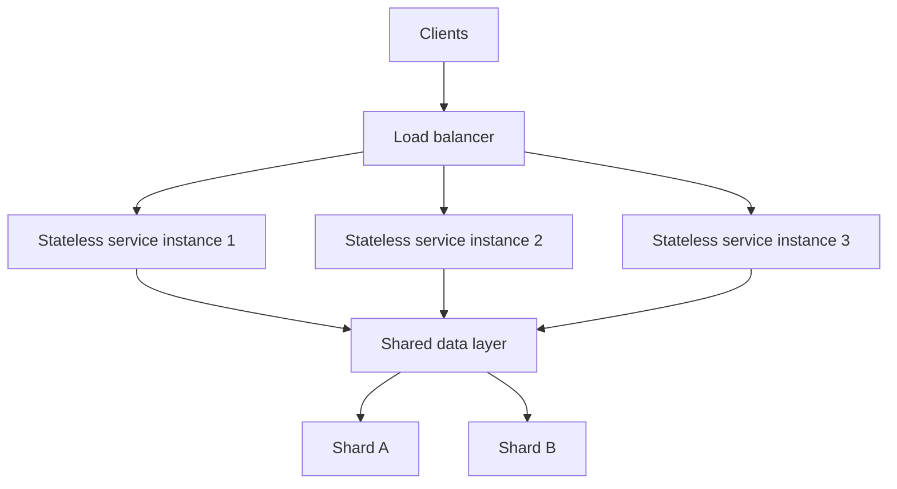

# Scalability Patterns

## TL;DR
**Vertical scaling** (bigger machine) is simple but has a ceiling and a single point of failure;
**horizontal scaling** (more machines) has no practical ceiling but requires the service to be
**stateless** so any instance can handle any request. **Load balancing** distributes traffic across
instances; **sharding** distributes *data* across nodes when a single node can't hold or serve it
all. For ML serving specifically, the model itself is usually the easy part to replicate — state
(session context, cached features, GPU memory) is what makes scaling hard.

## Intuition
Vertical scaling is "buy a bigger truck." It works until you hit the biggest truck money can buy,
and if that one truck breaks down, everything stops. Horizontal scaling is "buy more trucks" — no
single point of failure, and you scale by adding, not by hitting a ceiling, but it only works if any
truck can carry any load (statelessness) and you have a dispatcher deciding which truck gets which
job (load balancer). Sharding is what you do when the *cargo* itself is too big for one truck's
warehouse — you split the warehouse across locations by some key (e.g. customer region) and route
requests to the right one.

## The maths
**Amdahl's Law** bounds how much parallelization (horizontal scaling) actually helps when part of
the workload is inherently sequential:
$$
\text{speedup}(n) = \frac{1}{(1-p) + \frac{p}{n}}
$$
where $p$ is the parallelizable fraction of the work and $n$ is the number of parallel workers — as
$n \to \infty$, speedup asymptotes to $\frac{1}{1-p}$, not infinity. This is the precise reason
"just add more replicas" doesn't help when the bottleneck (e.g. a single shared database, a
non-parallelizable sequential dependency) isn't the part being replicated.

**Sharding key skew**: if a shard key distributes data unevenly, one shard becomes a hotspot —
for shard key $k$ mapping to shard $s = h(k) \mod N$, uniform hashing $h$ over a high-cardinality
key gives roughly balanced shards; a low-cardinality or naturally skewed key (e.g. "country" with
80% of users in one country) produces one overloaded shard regardless of $N$.

## Diagram


## Code
```python
# Statelessness in practice: a serving handler that stores no per-request state locally
# so any replica can serve any request — session/context lives in a shared store, not memory
def handle_prediction_request(request):
    features = feature_store.get_online_features(request.entity_id)  # shared, not local cache
    prediction = model.predict(features)
    return prediction

# Consistent hashing sketch: minimizes reshuffling when adding/removing shards
import hashlib

def get_shard(key: str, num_shards: int) -> int:
    return int(hashlib.md5(key.encode()).hexdigest(), 16) % num_shards
```

```text
Horizontal scaling of an ML serving layer, concretely:
  - Model weights: replicate identically across N instances (read-only, easy).
  - Feature cache: must be a SHARED store (Redis cluster), not per-instance memory,
    or requests routed to different instances see different cached state.
  - GPU inference: horizontal scaling means more GPU-backed replicas behind a load
    balancer; batching within each replica trades latency for throughput per replica.
```

## In practice
- **Use it when:** a service's load exceeds what a single instance can handle, or you need
  redundancy against instance failure — nearly always the default for production serving beyond
  a prototype.
- **Defaults that work:** design services stateless from day one (push all state to a shared
  store — database, cache, feature store) so horizontal scaling is a pure infrastructure decision,
  not a rearchitecture; use a load balancer with health checks so failed instances are
  automatically routed around; shard on a high-cardinality, evenly-distributed key, and prefer
  consistent hashing over naive `hash % N` so adding/removing shards doesn't reshuffle most of the
  data.
- **Breaks when:** a service holds in-memory state per request across calls (session affinity
  becomes required, undermining the point of horizontal scaling); a shard key is low-cardinality or
  skewed, creating a hotspot no amount of horizontal scaling of the compute layer fixes because the
  bottleneck is data distribution, not compute; the actual bottleneck is a shared downstream
  resource (a single database) that isn't itself scaled — Amdahl's Law bites here directly.
- **Cost / latency:** horizontal scaling costs scale roughly linearly with instance count (each
  identical, so straightforward capacity planning) but adds network hops (load balancer, shared
  state lookups) versus a single monolithic instance — a small latency cost for a large
  reliability/scale win, usually a good trade for anything beyond a prototype.

## Interview angle
**Q. Your fraud-scoring service needs to handle a 10x traffic spike during a sale event. Walk
through your scaling approach.**
Confirm the service is stateless (each request self-contained, no per-instance session state) so
horizontal auto-scaling behind a load balancer is viable; check whether the actual bottleneck is
compute (add replicas) or a shared downstream dependency (a database, a feature store) that won't
scale by adding service replicas alone — Amdahl's Law means the sequential/shared bottleneck caps
your speedup regardless of replica count. If the feature store itself is the bottleneck, that needs
its own scaling plan (read replicas, caching, sharding), not just more app-layer replicas.

**Follow-up.** The database behind your feature store becomes the bottleneck under load — what are
your options?
→ Add read replicas for read-heavy traffic, introduce a caching layer in front of it (see
[[caching-strategies]]) for hot keys, or shard the database itself by a well-chosen key if it's a
genuine data-volume/throughput ceiling rather than a hot-key problem — the right choice depends on
whether the bottleneck is read volume (replicas/cache) or write volume/data size (sharding).

**Q. Why does horizontal scaling require statelessness, and what happens if you scale a stateful
service horizontally anyway?**
If a service instance holds state locally (e.g. a per-user session cache in memory), the load
balancer must route all of that user's future requests to the *same* instance (sticky sessions) —
this undermines even load distribution, creates a availability risk (that instance's failure loses
the state), and complicates auto-scaling (new instances start with no state). Statelessness lets
any instance serve any request, which is what makes horizontal scaling actually simple.

**Q. When would sharding be necessary even with unlimited compute replicas?**
When a single data store node can't hold or serve all the data within acceptable latency/throughput,
regardless of how many stateless compute replicas sit in front of it — e.g. a feature store with
billions of entities where one database instance's disk/memory/IOPS ceiling is the actual
constraint, not application compute.

**Q. Explain Amdahl's Law's relevance to a real incident: "we doubled our replicas but latency only
improved 10%."**
This is the signature of a non-parallelizable bottleneck dominating the request path — e.g. every
request serially waits on one shared, un-scaled resource (a single database connection pool, a
single downstream API). Amdahl's Law says speedup is capped by the sequential fraction $(1-p)$ no
matter how much you parallelize the rest; the fix is identifying and scaling that specific
bottleneck, not adding more of what's already parallel.

## Traps
- "Just add more instances" as a universal fix — doesn't help if the bottleneck is a shared,
  un-scaled downstream resource (Amdahl's Law).
- Treating vertical scaling as always inferior — for genuinely single-threaded or
  hard-to-parallelize workloads, a bigger machine can be simpler and cheaper than a distributed
  redesign, at least up to some scale.
- Sharding by a low-cardinality or skewed key "because it's convenient" (e.g. a `region` column
  where 90% of traffic is one region) — creates an unfixable hotspot.
- Confusing load balancing (distributing *requests* across compute instances) with sharding
  (distributing *data* across storage nodes) — they solve different problems and are often needed
  together.

## Flashcards
Vertical vs horizontal scaling::Vertical: bigger single machine, simple but has a ceiling and single point of failure. Horizontal: more machines, no practical ceiling, requires statelessness.
Why must a horizontally-scaled service be stateless?::So any instance can handle any request; state must live in a shared store, not instance memory, or you need sticky sessions which undermine scaling.
What does Amdahl's Law say about adding more parallel workers?::Speedup is capped by the non-parallelizable fraction of the workload; asymptotes to 1/(1-p), never infinite.
What problem does sharding solve that horizontal compute scaling doesn't?::Data volume/throughput exceeding what a single storage node can hold or serve — a data-layer bottleneck, not a compute-layer one.
Why prefer consistent hashing over naive hash % N for sharding?::It minimizes data reshuffling when shards are added or removed; naive modulo hashing reshuffles nearly everything on a resize.

## Related
[[caching-strategies]]
[[latency-and-throughput-budgets]]
[[distributed-systems-basics]]
[[model-serving-patterns]]
