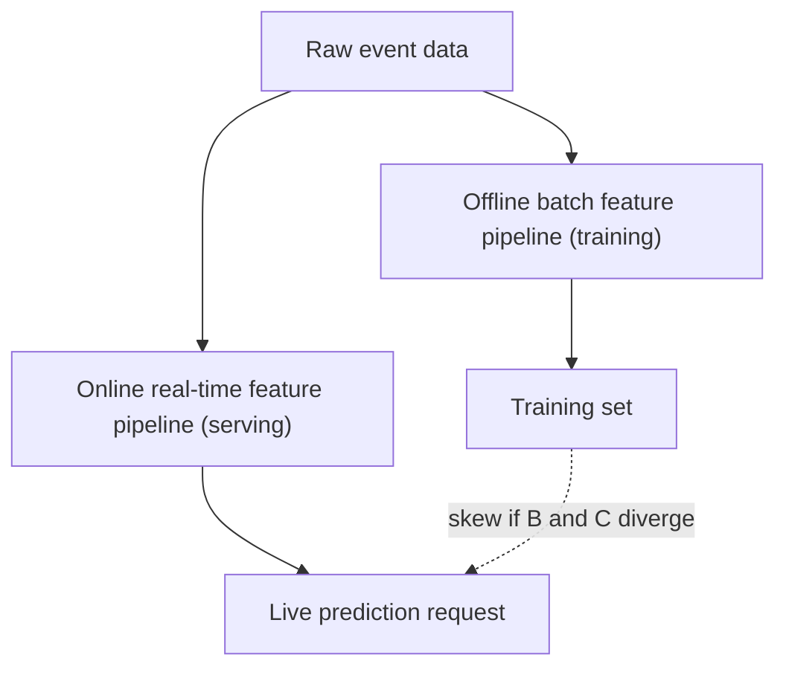

# Training-Serving Skew

## TL;DR
Training-serving skew is the gap between how a feature is computed during training (usually
batch, over historical data) and how it's computed at serving time (usually real-time, over
live/incomplete data) — a model trained on one distribution silently sees a different one in
production. It's one of the most common causes of "the model was great offline and bad in prod,"
and the fix is almost always structural: a single shared feature computation path (a feature
store) plus explicit parity tests, not better modeling.

## Intuition
Imagine training a fraud model on a feature "average transaction amount over the last 30 days,"
computed with a nightly batch job that has the full 30 days of clean, deduplicated data. At serving
time, the same feature is computed on-the-fly against a live database that might be missing the
last hour of transactions, uses slightly different deduplication logic, or was written by a
different engineer in a different language entirely. The model was trained on one definition of
"30-day average" and is asked, at inference, to interpret a subtly different one — it doesn't know
the difference, but its predictions degrade silently.

## The maths
Formally, skew is a mismatch between the training-time feature distribution $P_{\text{train}}(x)$
and the serving-time feature distribution $P_{\text{serve}}(x)$ for what's nominally the *same*
feature $x$:
$$
P_{\text{train}}(x) \neq P_{\text{serve}}(x) \quad \text{even though both claim to measure the same underlying quantity}
$$
This is distinct from natural data/concept drift (where the real-world distribution genuinely
changes over time) — skew is a **bug**, a discrepancy introduced by having two different code paths
compute what should be an identical value. You can quantify it directly: log the feature value
computed by both the offline and online path for the same entity/timestamp and compare
distributions (or exact-match rate) — a nonzero mismatch rate is the metric to track.

## Diagram


## Code
```python
# The anti-pattern: two independent feature computation implementations
# --- training-time (batch, Spark) ---
train_features = (
    spark.table("silver.transactions")
    .groupBy("customer_id")
    .agg(F.avg("amount").alias("avg_30d_amount"))  # over a 30-day window in the batch job
)

# --- serving-time (a separate microservice, different language/logic) ---
def compute_avg_30d_amount(customer_id):
    txns = redis_client.lrange(f"txns:{customer_id}", 0, -1)  # maybe not exactly 30 days
    return sum(t.amount for t in txns) / len(txns) if txns else 0.0
    # subtly different: different window boundary handling, no dedup, different null handling

# --- the fix: one shared feature definition, computed once, read from both paths ---
# a feature store materializes both an offline table (for training) and an online store
# (for low-latency serving) FROM THE SAME feature definition
feature_store.get_offline_features(
    entity_df=training_labels_df, features=["customer:avg_30d_amount"]
)
feature_store.get_online_features(
    entity_rows=[{"customer_id": "C123"}], features=["customer:avg_30d_amount"]
)
```

```python
# Feature parity test: assert the two paths agree on a sample, run continuously
def test_feature_parity(customer_id, as_of_ts):
    offline_val = offline_feature_lookup(customer_id, as_of_ts)
    online_val = online_feature_lookup(customer_id)
    assert abs(offline_val - online_val) < TOLERANCE, "training-serving skew detected"
```

## In practice
- **Use it when:** any system where a model is trained offline and served online with
  latency constraints — i.e. almost every production real-time ML system.
- **Defaults that work:** a shared feature store (a single feature *definition*, with offline
  materialization for training and online materialization for serving) is the standard structural
  fix. Where a full feature store is overkill, at minimum share the exact transformation code
  (same function/library) between the training and serving pipelines rather than reimplementing it.
  Add automated feature-parity tests to CI, and log both feature paths' outputs in production to
  catch drift between them over time.
- **Breaks when:** teams build the serving path in a different language/runtime than the training
  pipeline "for latency" and hand-reimplement the feature logic — this is the single most common
  source of skew in real deployments. Also breaks when point-in-time correctness isn't respected
  offline (features leak future information not available at serving time) — a subtler form of
  skew where training sees information serving structurally cannot.
- **Cost / latency:** a feature store adds infrastructure (an online low-latency store, usually a
  key-value store like Redis/DynamoDB, plus an offline store) — a real cost, justified once skew has
  actually caused a production incident, or preemptively for any system serious enough to need
  reliable low-latency features.

## Interview angle
**Q. Your model has a strong offline AUC but its production performance is noticeably worse — how
do you debug this?**
First rule out label leakage and distribution shift, then specifically check feature parity: for a
sample of production requests, recompute each feature offline (using the training pipeline's logic
and the same point-in-time data the serving system had) and diff against what serving actually
computed. A systematic mismatch on even one feature is enough to explain a broad performance drop,
because it silently pushes every prediction off-distribution in a way the model was never trained
to handle.

**Follow-up.** You find the mismatch is in a time-window feature ("orders in last 7 days") — the
offline job uses calendar-day boundaries, serving uses a rolling 168-hour window. Is this actually a
bug?
→ Yes — even though both are "reasonable" definitions of "last 7 days," the model learned patterns
tied to one specific definition; using a different one at serving time is exactly the skew failure
mode, regardless of which definition is "more correct" in isolation. The fix is to pick one
canonical definition and share the implementation, not to argue which was right.

**Q. Why is a feature store considered the primary fix, rather than "just write better tests"?**
Because the root cause is structural (two independent code paths), not a testing gap — tests catch
it after the fact, but a shared feature store removes the possibility of divergence by construction:
both training and serving read the same materialized feature definition. Tests are still valuable
as a safety net for cases where a fully shared path isn't feasible (e.g. a feature only computable
cheaply in one environment).

**Q. Give an example of skew that isn't about a coding bug but a genuine data availability
difference.**
A feature depends on a label or downstream event that's only available after some delay (e.g.
"was this transaction later confirmed as fraud") — at training time you have it (label is
known in hindsight), but at serving time it's structurally unavailable (hasn't happened yet). This
isn't a bug to fix in the serving code; it's a feature that should never have been included, because
it can't exist at serving time — a leakage problem masquerading as a skew problem.

**Q. How do you measure training-serving skew quantitatively, ongoing, in production?**
Log the online feature values actually used for real prediction requests, periodically recompute
the same entities' features via the offline pipeline for the same point in time, and track a
distributional distance or exact/near-match rate between the two as a monitored metric — alert if
the mismatch rate crosses a threshold, the same way you'd monitor [[data-drift-and-concept-drift]].

## Traps
- "Training-serving skew and data drift are the same thing." — Drift is the real-world distribution
  changing over time (expected, monitored, requires retraining); skew is a *bug* where two code
  paths compute a feature differently for what should be an identical input (requires a
  fix, not a retrain).
- Assuming a feature store eliminates skew automatically just by existing — it removes the
  *structural* cause (duplicate implementations) but teams can still introduce skew via
  incorrect point-in-time joins or stale online-store data if it isn't refreshed in step with the
  offline definition.
- Debugging a production performance drop by immediately assuming model staleness/drift, without
  first checking feature parity — often faster and more likely to be the actual root cause.
- Including a feature at training time that's only knowable in hindsight — not skew per se, but the
  closely related leakage failure that produces the same symptom (great offline, bad in prod).

## Flashcards
What is training-serving skew?::A mismatch between how a feature is computed at training time vs. serving time for what's supposed to be the same feature — a structural bug, not natural drift.
How does it differ from data/concept drift?::Skew is a code-path discrepancy (fixable by unifying the implementation); drift is a genuine change in real-world distribution over time (requires retraining/monitoring).
What's the standard structural fix for training-serving skew?::A shared feature store — one feature definition, materialized for both offline (training) and online (serving) use.
What test catches skew directly?::A feature parity test — recompute the same feature via both pipelines for the same entity/timestamp and assert they match within tolerance.
Give a subtle example of skew beyond a coding bug::Using different but each "reasonable" time-window boundary definitions (calendar day vs. rolling 168 hours) between training and serving pipelines.

## Related
[[feature-stores]]
[[data-drift-and-concept-drift]]
[[model-monitoring]]
[[data-leakage]]
